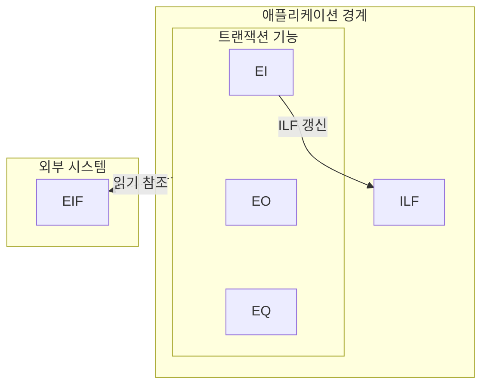

## 지식 로드맵 내 현재 위치

  소프트웨어공학
  프로젝트 관리·비용 산정
  <strong>기능점수(Function Point)</strong>

## 30초 인출

- 본질: 프로그래밍 언어나 개발 도구에 따라 들쭉날쭉한 소스코드 라인 수(LOC)의 왜곡을 방지하기 위해, 사용자 관점에서 시스템이 제공하는 논리적 데이터 저장 기능과 트랜잭션 처리 기능을 표준 규격으로 계량화하여 소프트웨어 규모와 적정 대가를 산정하는 국제표준(IFPUG, ISO/IEC 14143) 기능 규모 측정법
- 메커니즘: 측정 범위 설정 → 5대 기능 식별(데이터 2종, 트랜잭션 3종) → 복잡도 인자(RET, DET, FTR) 측정 → 미조정 기능점수(UFP) 산출 → 5대 보정계수 적용 → 최종 보정 기능점수 및 사업 대가 산출
- 산출물: 기능점수 산정 명세서 · 기능 식별 목록표(ILF/EIF/EI/EO/EQ) · 소프트웨어 사업 대가 산정서

핵심 용어

- **ILF(Internal Logical File)**: 애플리케이션 내부에서 유지·관리되며 비즈니스 로직에 의해 지속적으로 등록, 수정, 삭제되는 논리적 데이터 그룹
- **EIF(External Interface File)**: 타 시스템에서 유지·관리되지만, 현재 애플리케이션에서 오직 참조(Read-only) 목적으로 사용하는 외부 연계 데이터 그룹
- **EI / EO / EQ**: 외부입력(EI, 내부 파일 갱신), 외부출력(EO, 파생 데이터 계산/통계 출력), 외부조회(EQ, 단순 데이터 검색 및 표시)
- **DET(Data Element Type)**: 사용자가 식별할 수 있는 고유하고 반복되지 않는 필드(컬럼) 단위 데이터 항목
- **RET(Record Element Type)**: ILF나 EIF 내부에서 사용자가 인식 가능한 하위 레코드 데이터 서브그룹(예: 마스터-디테일 테이블)
- **FTR(File Type Referenced)**: 트랜잭션 기능(EI, EO, EQ)을 수행하는 과정에서 읽거나 갱신하는 ILF 또는 EIF의 개수

---

## 1교시 예상문제 (10점)

> 기능점수(Function Point)의 정의와 목적, 핵심 메커니즘을 설명하시오. (예상)

---

## 1교시 10점 답안

### 1. 정의·목적

- 정의: 기능점수(FP)는 사용자에게 제공하는 데이터 기능과 트랜잭션 기능의 규모를 측정하는 소프트웨어 기능 규모 측정법이다.
- 목적: 구현 언어와 기술에 덜 좌우되는 규모를 바탕으로 개발 노력과 사업 대가를 산정한다.

### 2. 핵심 관계

- 제언: 측정 경계와 기능 유형을 먼저 합의하고, 산정 근거를 검토자와 함께 확인한다.
---

## 2~4교시 예상문제 (25점)

> 기능점수(Function Point)의 개념과 목적을 설명하고, 핵심 메커니즘과 구성요소·절차, 적용 시 문제점과 대응 방안을 제시하시오. (25점, 예상)

---

## 2~4교시 25점 답안

### 1. 개요 및 필요성

### LOC(코드 라인 수)의 한계와 사용자 관점 기능 측정

과거의 소프트웨어 비용 산정 방식인 LOC(Lines of Code)는 프로그래밍 언어의 특성에 따라 심각한 모순을 낳았다. 동일한 기능을 구현하더라도 어셈블리어로는 수천 라인이 필요하지만 파이썬으로는 수십 라인으로 끝나므로, 비효율적인 코드를 길게 작성할수록 더 높은 대가를 받는 왜곡이 발생했다.

기능점수(Function Point)는 **구현 기술이나 언어와 완전히 독립적으로, 소프트웨어가 사용자에게 제공하는 논리적 기능의 양**을 측정한다. 발주자와 수주자가 모두 이해할 수 있는 공통 척도를 제공하여, 국내 공공 소프트웨어 사업 대가 산정의 공식 법정 표준으로 정착되었다.

### 정규법(상세 산정) vs 간이법(평균 복잡도) 비교

| 구분 | 정규법 (Detailed Function Point) | 간이법 (Average Weight Function Point) |
|---|---|---|
| **적용 시점** | 분석 및 상세설계 완료 후 (사업 구축/정산 단계) | 사업 기획, 예산 편성, 발주 준비 단계 |
| **복잡도 판정** | 기능별 RET, DET, FTR을 전수 계수하여 상/중/하 가중치 적용 | 각 기능 유형별 사전에 정의된 **평균 가중치** 일괄 곱셈 |
| **평균 가중치** | 기능마다 상이 (ILF: 7/10/15, EI: 3/4/6 등) | ILF: 7.5, EIF: 5.4, EI: 4.6, EO: 5.2, EQ: 3.9 |
| **정확도** | 매우 높음 (실제 설계서 기반 오차 최소) | 상대적으로 낮음 (초기 개략적 예산 산정용) |
| **산정 소요 공수** | 데이터 모델 및 상세 화면 분석으로 많은 시간 소요 | 화면/테이블 개수 추정만으로 신속 산정 가능 |

### 2. 아키텍처 및 핵심 메커니즘

### 기능점수 5대 기능 분류 체계

### 기능점수 산정 공식 및 보정 체계

1. **미조정 기능점수(UFP) 계산**:
   $$UFP = \sum (\text{기능 유형별 개수} \times \text{복잡도 가중치})$$
2. **보정계수 적용 (공공 SW 대가산정 가이드 기준)**:
   $$최종 보정 FP = UFP \times (규모 보정) \times (연계 복잡도) \times (성능 요구수준) \times (운영환경) \times (보안성 수준)$$
3. **최종 소프트웨어 개발비 산출**:
   $$개발비 = 최종 보정 FP \times FP당 단가 (원/FP)$$

### 3. 실무 적용 및 고려사항

### 위험 대응 매트릭스

| 위험 | 대책 | 효과 |
|---|---|---|
| 공통 코드 테이블 및 임시 백업 테이블을 개별 ILF로 과다 산정하여 감사 지적 및 대가 삭감 | 데이터 모델의 제3정규화를 검증하고 단일 비즈니스 엔터티 관점에서 마스터-디테일은 1개 ILF로 통합 | 산정 적법성 확보 및 감사 리스크 완전 제거 |
| 단순 검색 조회를 계산 로직이 있는 EO(외부출력)로 둔갑시켜 기능점수를 부풀리는 행위 | 파생 데이터 계산(집계, 세금 계산 등) 여부를 검증하여 계산이 없는 건은 EQ(외부조회)로 재분류 | 기능 유형 식별의 객관성 및 신뢰성 확보 |
| 기획 단계 간이법 예산이 확정된 후 구축 단계에서 비즈니스 요구사항 폭증으로 사업자 적자 | 설계·구축 분할 발주 또는 과업심의위원회를 통해 상세설계 시점의 정규 FP 기준으로 계약 변경 증액 | 적정 대가 보장 및 사업 유찰/품질 부실 방지 |

### 4. 점검 및 합격 기준 (Checklist & Exit Criteria)

### 기능점수 산정 적정성 검증 체크리스트

| 검증 영역 | 상세 점검 항목 | 판정 기준 |
|---|---|---|
| **경계 식별** | 배치/인터페이스/서브시스템 간 경계 중복 정의 여부 | 단일 애플리케이션 경계 원칙 준수 |
| **데이터 기능** | 임시 테이블(Temp, Log), 코드성 테이블의 ILF 포함 여부 | 비즈니스 논리 엔터티만 ILF 계수 |
| **트랜잭션 기능** | 단순 조회(EQ)와 파생 계산 출력(EO)의 명확한 구분 | 집계/통계/파생 로직 부재 시 EQ 분류 |
| **보정계수** | 5대 보정계수(규모, 연계, 성능, 운영, 보안) 증빙 충족 | 가이드라인 상한선(0.85~1.15) 준수 |

### 5. 기대 효과 및 미래 전망

- **기대 효과**:
  - **발주자-수주자 신뢰 회복**: 주관적 공수 산정을 배제하고 객관적 기능 규모 기반의 법정 대가 산정.
  - **소프트웨어 제값주기 정착**: 과도한 저가 낙찰 및 무상 과업 추가 관행 차단.
- **미래 전망**:
  - 소스코드 AST 정적 분석 도구와 연계한 Automated Function Points(AFP) 자동 산정 파이프라인 도입.
  - 마이크로서비스(MSA) 및 클라우드 네이티브 환경에 맞춘 API 단위 기능점수 산정 가이드 고도화.

### 6. 결론 및 실전 팁

### 학습자 통찰 메모 — 답안 밖

> **[핵심 통찰]**  
> 기능점수는 단순한 '돈 계산 공식'이 아니라, 소프트웨어 공학에서 "기술 종속적 코딩(LOC)으로부터 비즈니스 가치(Function)를 분리해낸 위대한 표준 척도"이다. 그러나 현실 공공 프로젝트에서는 기획 단계 간이법으로 묶인 고정 예산과 구축 단계의 요구사항 폭증이 충돌하는 분쟁의 온상이 된다. 기술사는 산정 공식 암기에 그치지 않고, **설계 완료 후 정규 FP로 계약 금액을 조정하는 '과업심의위원회 사후 정산 거버넌스'**를 해결책으로 제시해야 한다.

> **[나라면 이렇게 쓴다]**  
> 2교시형 문제로 출제된다면, 1단락에 5대 기능(ILF/EIF/EI/EO/EQ)과 경계 다이어그램을 명쾌하게 배치하고, 2단락에서 정규법과 간이법의 차이를 비교하겠다. 그리고 3단락 실무 제언에서는 **"Git 형상관리와 정적 분석기를 결합하여 엔터티 클래스와 컨트롤러 API를 파싱하는 Automated Function Points(AFP) 자동 계측 체계"**를 제안하여 전통적 수작업 산정의 주관성 한계를 돌파하는 현대적 아키텍처 통찰을 보여주겠다.

### 실전 답안용 기술사적 제언

- **판정 기준**: 기획 단계 예산 편성 시 간이법을 적용하되, 상세설계 완료 시점에 전수 정규 기능점수를 재산정하여 $\pm 10\%$ 초과 변동 시 과업 변경 심의 필수 판정.
- **대응 방안**: 데이터 모델 정규화 검토를 통해 코드 테이블 및 임시 백업 테이블의 ILF 중복 계수를 사전 필터링하고, 단순 조회의 EO 왜곡 전면 방지.
- **검증 체계**: 외부 전문 감리 및 기능점수 공인 검증 기관의 교차 실사를 수행하여 산정 오차율을 $5\%$ 이내로 통제.
- **기대 효과**: 개발 사업자의 부당한 과업 추가 및 적자 리스크를 원천 차단하고, 공공 SW 프로젝트 납기 준수율 95% 이상 달성.

### 7. 참고 및 연계 학습

- [ISMP(정보시스템 마스터플랜)](../../01-it-strategy/001_ismp.md)
- [요구사항 추적표(RTM)](./102_requirement_traceability_matrix.md)
- [상용SW 직접구매 제도](./101_commercial_sw_direct_purchase.md)
- [소프트웨어 품질 비용(COQ)](./150_software_quality_cost.md)
---
