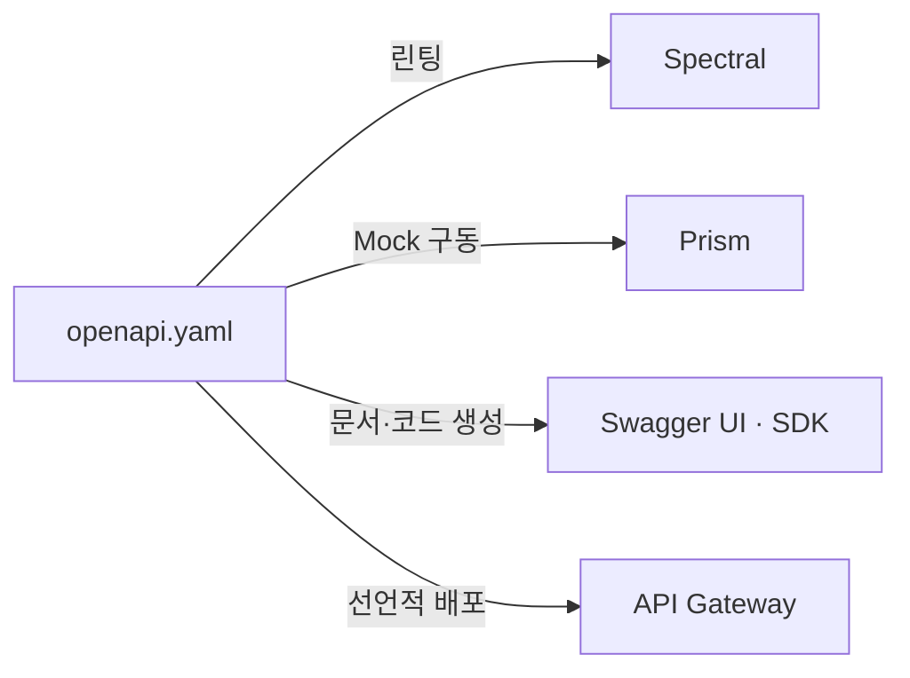

## 지식 로드맵 내 현재 위치

  소프트웨어공학
  웹 아키텍처·인터페이스 설계
  <strong>OAS(OpenAPI Specification)</strong>

## 30초 인출

- 본질: 엑셀이나 위키로 작성된 수작업 API 문서가 코드 변경 시 동기화되지 않아 발생하는 프론트엔드-백엔드 연동 장애를 근절하기 위해, RESTful API의 모든 엔드포인트, 요청/응답 스키마, 인증 방식을 기계가 판독할 수 있는 YAML/JSON 표준 형식으로 기술하는 국제 오픈소스(OAI) 인터페이스 명세 표준
- 메커니즘: OAS 명세 작성(Design-First) → 목(Mock) 서버 자동 구동(병렬 개발) → 소스코드 및 클라이언트 SDK 자동 생성(openapi-generator) → CI 단계 유효성 린팅(Spectral) → Swagger UI 배포
- 산출물: `openapi.yaml` / `openapi.json` 파일 · 대화형 테스트 문서(Swagger UI) · 다국어 클라이언트 SDK 코드 · 가상 Mock 서버 API

핵심 용어

- **OAI(OpenAPI Initiative)**: 리눅스 재단 산하의 컨소시엄으로, SmartBear사가 기증한 Swagger 2.0 스펙을 기반으로 벤더 중립적인 API 표준 규격인 OAS 3.0을 제정 및 발전시키는 단체
- **Prism**: OAS 명세로부터 가상 Mock API 서버를 즉시 구동해 프론트엔드 병렬 개발을 지원하는 도구
- **Design-First**: 코드를 한 줄도 짜기 전에 API 명세서(OAS)를 먼저 작성하고 모든 이해관계자가 인터페이스 계약을 합의한 후 구현을 시작하는 방법론
- **Code-First**: 백엔드 소스코드에 `@Operation`, `@Schema` 등의 애너테이션을 달아 구현 코드로부터 OAS 명세서를 사후 역추출하는 방법론
- **Spectral**: OAS YAML/JSON 명세서가 기업의 API 스타일 가이드(kebab-case 경로, 설명 필드 필수 등)를 준수하는지 정적 검사하는 자동화 린터

---

## 1교시 예상문제 (10점)

> OAS(OpenAPI Specification)의 정의와 목적, 핵심 메커니즘을 설명하시오. (예상)
---

## 1교시 10점 답안

### 1. 정의·목적

- 정의: 엑셀이나 위키로 작성된 수작업 API 문서가 코드 변경 시 동기화되지 않아 발생하는 프론트엔드-백엔드 연동 장애를 근절하기 위해, RESTful API의 모든 엔드포인트, 요청/응답 스키마, 인증 방식을 기계가 판독할 수 있는 YAML/JSON 표준 형식으로 기술하는 국제 오픈소스(OAI) 인터페이스 명세 표준
- 목적: HTTP API의 경로·요청·응답 계약을 기계가 읽을 수 있는 형식으로 표준화한다.

### 2. 핵심 관계

- 제언: OpenAPI 명세를 기준으로 문서·클라이언트·계약 시험을 생성하고 호환성 변경을 관리한다.
---

## 2~4교시 예상문제 (25점)

> OAS(OpenAPI Specification)의 개념과 목적을 설명하고, 핵심 메커니즘과 구성요소·절차, 적용 시 문제점과 대응 방안을 제시하시오. (25점, 예상)
---

## 2~4교시 25점 답안

### 1. 개요 및 필요성

### 수작업 API 문서화의 한계와 단일 진실 공급원(SSOT)

마이크로서비스(MSA)와 모바일/웹 클라이언트가 급증하면서 API의 수는 수백~수천 개로 폭증했다. 과거에는 엑셀 시트나 위키 페이지에 수작업으로 파라미터를 정리했으나, 백엔드 개발자가 코드를 수정하고 문서를 업데이트하지 않아 발생하는 **API 불일치(Drift)와 400/500 연동 장애**가 프로젝트 지연의 주원인이었다.

OAS는 사람이 읽을 수 있는 동시에 프로그램(기계)이 파싱할 수 있는 표준 규격을 제공함으로써, **API 스펙 파일 하나가 "단일 진실 공급원(Single Source of Truth)"**이 되어 문서화, 테스트, 코드 생성을 완전 자동화한다.

### OAS vs WSDL vs GraphQL 스키마 비교

| 구분 | OpenAPI Specification (OAS) | WSDL (Web Services Description) | GraphQL Schema (SDL) |
|---|---|---|---|
| **기반 아키텍처** | **RESTful 아키텍처, HTTP 웹 API** | SOAP 기반 웹 서비스 (RPC 스타일) | GraphQL 단일 엔드포인트 쿼리 |
| **데이터 포맷** | **YAML / JSON** | XML | GraphQL 고유 스키마 정의 언어 |
| **가벼움과 가독성** | 매우 높음 (인간 및 기계 가독성 우수) | 매우 무겁고 복잡함 (수작업 불가) | 높음 (타입 중심 문법) |
| **클라이언트 제어** | 서버가 정의한 고정 응답 수신 | 서버가 정의한 WSDL 바인딩 수신 | 클라이언트가 원하는 필드만 선택 쿼리 |
| **핵심 생태계** | Swagger UI, Prism, OpenAPI Generator | Apache CXF, Axis, Enterprise ESB | Apollo Server, GraphQL Yoga |

### 2. 아키텍처 및 핵심 메커니즘

### Design-First vs Code-First 개발 패러다임 비교

| 단계 | Design-First | Code-First |
|---|---|---|
| **시작점** | OAS 명세 작성(`openapi.yaml`) | 백엔드 비즈니스 로직 작성 |
| **개발 방식** | Mock API 구동 후 프론트·백엔드 병렬 개발 | 애너테이션 부착 후 Swagger로 사후 추출 |
| **결과** | 단일 진실 공급원(SSOT) 확립, 문서 불일치 제거 | API 불일치(Drift) 위험, 프론트 대기 발생 |

### OAS 단일 진실 공급원(SSOT) 자동화 구조

### OAS 3.x 주요 객체 4대 분류

| 객체 | 핵심 판단 |
|---|---|
| **info · servers** | API 제목·버전·약관 등 메타데이터, 환경별 기본 URL 명시 |
| **paths** | URI 경로·HTTP 메서드·파라미터·상태 코드별 응답 정의 |
| **components** | `$ref` 재사용 — schemas·responses·parameters 모듈화 |
| **security** | securitySchemes로 API Key·Bearer(JWT)·OAuth 2.0 정의, 엔드포인트별 인가 스코프 적용 |

### 3. 실무 적용 및 고려사항

### 위험 대응 매트릭스

| 위험 | 대책 | 효과 |
|---|---|---|
| 백엔드 개발이 끝날 때까지 프론트엔드가 실제 API를 호출하지 못해 연동 지연 발생 | Design-First 적용 및 OAS 스펙 작성 즉시 Prism 기반 가상 목(Mock) API 서버 구동 | 프론트-백엔드 병렬 개발로 전체 개발 일정 30% 단축 |
| 백엔드 개발자가 비즈니스 코드를 바꾼 후 Swagger 애너테이션 갱신을 누락하여 문서 왜곡 | CI 파이프라인에서 Springdoc 추출 명세와 Git 저장소의 OAS 스펙 간 diff 자동 비교 검증 | 코드와 명세 문서 간 100% 동기화 보장 |
| 개발자마다 API URL 명명 규칙(대소문자, 언더바, 복수형)을 제각각 구현하여 일관성 상실 | CI 빌드 단계에 Spectral 린터를 탑재하여 표준 API 스타일 가이드 위반 시 커밋 차단 | 전사 차원의 일관된 고품질 RESTful API 표준 준수 |

### 4. 기술사 답안 차별화 포인트

### Code-First와 Design-First의 트레이드오프 및 하이브리드 전략

실무에서 흔히 저지르는 실수는 Code-First로 시작하여 비즈니스 코드에 Swagger 애너테이션을 무분별하게 뒤섞어 코드를 지저분하게 만드는 것이다. 기술사 답안에서는 **인터페이스 정의 및 초기 협의는 Design-First(독립 Git Repo)**로 진행하여 Mock 서버를 구축하고, **구현 단계에서는 코드로부터 OAS를 자동 추출(Code-First)**하되 CI에서 최초 계약 스펙과 호환성(Breaking Change)을 비교 검증하는 **하이브리드 API 거버넌스 전략**을 제시한다.

### API Gateway 및 포털 자동화와의 연동

OAS는 단순 문서화 도구를 넘어 클라우드 API 게이트웨이(Kong, AWS API Gateway, Apigee)의 설정 자동화 엔진 역할을 수행한다. CI/CD 파이프라인에서 머지된 `openapi.yaml`을 API Gateway에 직접 임포트하여 **라우팅 규칙, Rate Limiting, JWT 인증 정책을 무중단 선언적(Declarative)으로 프로비저닝하는 GitOps 아키텍처**를 3단락 또는 결론으로 제시한다.

### 5. 결론 및 종합 제언

### 학습자 통찰 메모 — 답안 밖

[핵심 통찰]
OAS는 과거 개발자의 귀찮은 사후 산출물이었던 API 문서를 **소프트웨어 개발의 출발점이자 단일 진실 공급원(SSOT)**으로 격상시켰다. API 명세가 곧 실행 가능한 스펙이 되므로, 스펙만 공유되면 프론트엔드와 백엔드가 한 치의 오차나 대기 없이 병렬 개발을 완수할 수 있는 민첩성의 핵심 인프라다.

나라면:
실제 시험에서 OAS 관련 토픽이 출제되면, 단순히 Swagger UI로 문서를 렌더링하는 수준을 넘어 **(1) Prism Mock 서버를 통한 프론트-백엔드 병렬 개발 일정 단축, (2) Spectral 정적 분석을 통한 API 거버넌스 자동화, (3) GitOps 기반 API Gateway 선언적 프로비저닝**의 3단계 가치 사슬을 3단락에 도식화하여 만점 차별화를 도모하겠다.

### 실전 답안용 기술사적 제언

- **판정 기준**: MSA 환경에서 서비스 간 결합도 및 API 불일치 장애율(월 2건 이상) 발생 시, Design-First 전환 판정
- **대응 방안**: 독립 `api-spec` Git 저장소를 구축하고 PR 단계에서 Spectral 린터 및 Prism Mock 서버 강제 연동
- **검증 체계**: CI/CD 파이프라인에서 Backward Compatibility(OAS Diff) 검증 후 API Gateway에 무중단 자동 반영
- **기대 효과**: 인터페이스 연동 결함 80% 감소 및 클라이언트-서버 병렬 개발로 TTM(Time-to-Market) 30% 단축

### 6. 참고 및 연계 학습

- [RESTful 아키텍처 원칙](./015_rest.md)
- [API 게이트웨이(API Gateway)](./075_api_gateway.md)
- [Open API 표준 및 생태계](./022_open_api.md)
- [CI/CD 지속적 통합 및 배포](./095_ci_cd.md)
---
