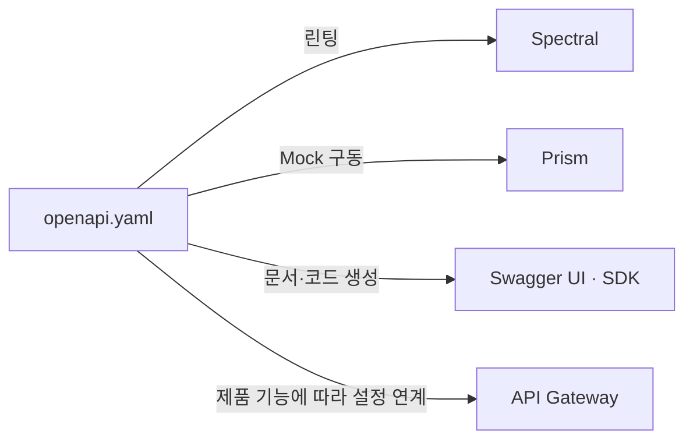
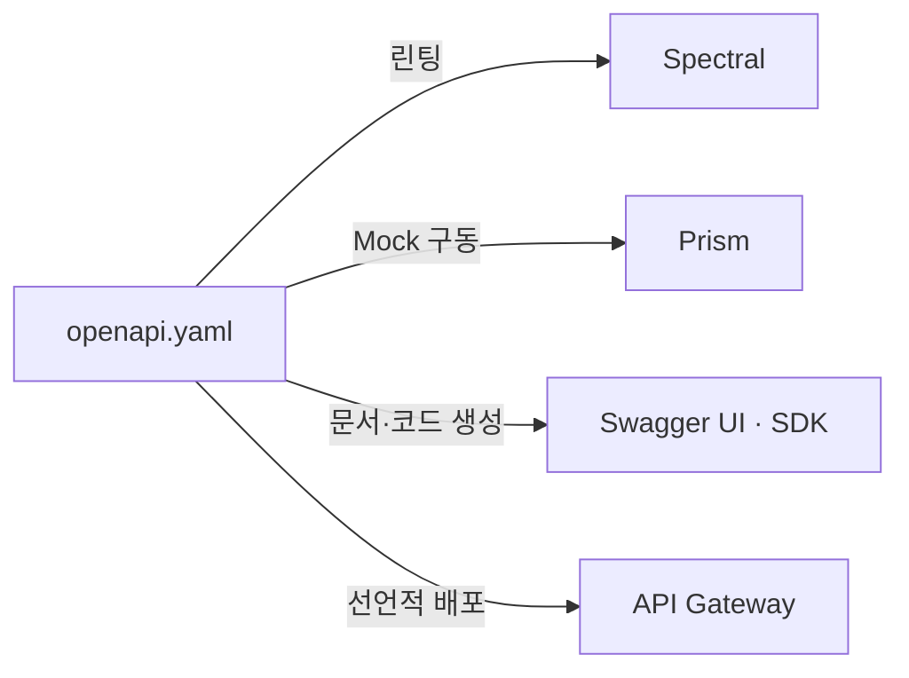

## 지식 위치

소프트웨어공학 > 웹 아키텍처·인터페이스 설계 > OpenAPI 명세

## 30초 인출

- 본질: OpenAPI Specification은 HTTP API의 기능과 인터페이스를 기술하는 언어 중립적 명세
- 메커니즘: OAS 명세 작성(Design-First) → 목(Mock) 서버 자동 구동(병렬 개발) → 소스코드 및 클라이언트 SDK 자동 생성(openapi-generator) → CI 단계 유효성 린팅(Spectral) → Swagger UI 배포
- 산출물: `openapi.yaml` / `openapi.json` 파일 · 대화형 테스트 문서(Swagger UI) · 다국어 클라이언트 SDK 코드 · 가상 Mock 서버 API

핵심 용어

- **OAI(OpenAPI Initiative)**: OpenAPI Specification을 관리·발전시키는 벤더 중립 협력체
- **Prism**: OAS 명세로부터 가상 Mock API 서버를 즉시 구동해 프론트엔드 병렬 개발을 지원하는 도구
- **Design-First**: 코드를 한 줄도 짜기 전에 API 명세서(OAS)를 먼저 작성하고 모든 이해관계자가 인터페이스 계약을 합의한 후 구현을 시작하는 방법론
- **Code-First**: 백엔드 소스코드에 `@Operation`, `@Schema` 등의 애너테이션을 달아 구현 코드로부터 OAS 명세서를 사후 역추출하는 방법론
- **Spectral**: OAS YAML/JSON 명세서가 기업의 API 스타일 가이드(kebab-case 경로, 설명 필드 필수 등)를 준수하는지 정적 검사하는 자동화 린터

---

## 1교시 예상문제 (10점)

> OAS(OpenAPI Specification)의 정의와 목적, 핵심 메커니즘을 설명하시오. (예상)

---

## 1교시 10점 답안

### Ⅰ. 개요

| 구분 | 핵심 |
|---|---|
| 정의 | OpenAPI Specification은 HTTP API의 기능과 인터페이스를 기술하는 언어 중립적 명세 |
| 목적 | API 계약을 사람이 읽고 도구가 처리할 수 있게 해 문서화·코드 생성·시험을 지원 |

### 2. 핵심 관계

- 제언: OpenAPI 명세를 기준으로 문서·클라이언트·계약 시험을 만들고 호환성 변경을 관리
---

## 2~4교시 예상문제 (25점)

> OAS(OpenAPI Specification)의 개념과 목적을 설명하고, 핵심 메커니즘과 구성요소·절차, 적용 시 문제점과 대응 방안을 제시하시오. (25점, 예상)

---

## 2~4교시 25점 답안

### Ⅰ. 개요 및 필요성

| 구분 | 핵심 |
|---|---|
| 정의 | OpenAPI Specification은 HTTP API의 기능과 인터페이스를 기술하는 언어 중립적 명세 |
| 목적 | API 계약을 사람이 읽고 도구가 처리할 수 있게 해 문서화·코드 생성·시험을 지원 |

### 수작업 API 문서화의 한계와 단일 진실 공급원(SSOT)

마이크로서비스(MSA)와 모바일/웹 클라이언트가 급증하면서 API의 수는 수백~수천 개로 폭증했다. 과거에는 엑셀 시트나 위키 페이지에 수작업으로 파라미터를 정리했으나, 백엔드 개발자가 코드를 수정하고 문서를 업데이트하지 않아 발생하는 **API 불일치(Drift)와 400/500 연동 장애**가 프로젝트 지연의 주원인이었다.

OAS는 사람이 읽을 수 있는 동시에 프로그램(기계)이 파싱할 수 있는 표준 규격을 제공함으로써, **API 스펙 파일 하나가 "단일 진실 공급원(Single Source of Truth)"**이 되어 문서화, 테스트, 코드 생성을 완전 자동화한다.

### OAS vs WSDL vs GraphQL 스키마 비교

| 구분 | OpenAPI Specification (OAS) | WSDL (Web Services Description) | GraphQL Schema (SDL) |
|---|---|---|---|
| **기반 아키텍처** | **RESTful 아키텍처, HTTP 웹 API** | SOAP 기반 웹 서비스 (RPC 스타일) | GraphQL 단일 엔드포인트 쿼리 |
| **데이터 포맷** | **YAML / JSON** | XML | GraphQL 고유 스키마 정의 언어 |
| **가벼움과 가독성** | 매우 높음 (인간 및 기계 가독성 우수) | 매우 무겁고 복잡함 (수작업 불가) | 높음 (타입 중심 문법) |
| **클라이언트 제어** | 서버가 정의한 고정 응답 수신 | 서버가 정의한 WSDL 바인딩 수신 | 클라이언트가 원하는 필드만 선택 쿼리 |
| **핵심 생태계** | Swagger UI, Prism, OpenAPI Generator | Apache CXF, Axis, Enterprise ESB | Apollo Server, GraphQL Yoga |

### Ⅱ. 명세 구조와 핵심 메커니즘

### Design-First vs Code-First 개발 패러다임 비교

| 단계 | Design-First | Code-First |
|---|---|---|
| **시작점** | OAS 명세 작성(`openapi.yaml`) | 백엔드 비즈니스 로직 작성 |
| **개발 방식** | Mock API 구동 후 프론트·백엔드 병렬 개발 | 애너테이션 부착 후 Swagger로 사후 추출 |
| **결과** | 단일 진실 공급원(SSOT) 확립, 문서 불일치 제거 | API 불일치(Drift) 위험, 프론트 대기 발생 |

### OAS 단일 진실 공급원(SSOT) 자동화 구조

### OAS 3.x 주요 객체 4대 분류

| 객체 | 핵심 판단 |
|---|---|
| **info · servers** | API 제목·버전·약관 등 메타데이터, 환경별 기본 URL 명시 |
| **paths** | URI 경로·HTTP 메서드·파라미터·상태 코드별 응답 정의 |
| **components** | `$ref` 재사용 — schemas·responses·parameters 모듈화 |
| **security** | securitySchemes로 API Key·Bearer(JWT)·OAuth 2.0 정의, 엔드포인트별 인가 스코프 적용 |

### Ⅲ. 실무 적용 및 고려사항

### 위험 대응 매트릭스

| 위험 | 대책 |
|---|---|---|
| 구현 완료까지 프론트엔드가 계약된 API 동작을 확인하지 못해 연동이 늦어질 수 있음 | Design-First를 선택한 경우 OAS 명세에서 Mock 서버를 구성해 계약 검토와 병렬 개발 지원 | 계약 검토를 구현 전에 시작 가능 |
| 구현 코드와 API 명세가 달라질 수 있음 | CI에서 생성·관리되는 명세의 유효성 및 호환성 변경을 검사 | 불일치를 배포 전에 확인 |
| API 명명 규칙과 설명 방식이 팀마다 달라 일관성이 약해질 수 있음 | Spectral 등 명세 린터에 조직의 스타일 규칙을 설정하고 변경을 검사 | 명세 규칙의 일관성 유지 |

### Ⅳ. 적용과 연계

| 적용 방식 | 적합한 조건 | 유의점 |
|---|---|---|
| Design-First | 소비자와 제공자가 구현 전에 계약을 합의해야 하는 경우 | Mock과 실제 구현의 계약 일치 여부 확인 |
| Code-First | 기존 구현에서 명세를 생성·유지하는 경우 | 명세 갱신과 호환성 검사를 CI에 포함 |
| 게이트웨이 연계 | OAS를 지원하는 게이트웨이에서 명세 기반 설정을 적용하는 경우 | 지원되는 OAS 기능과 런타임 정책을 대상 제품 기준으로 확인 |

### Ⅴ. 기술사적 제언

| 문제 | 해결 방안 |
|---|---|
| API 계약이 변경되면 기존 소비자와의 호환성 문제가 발생할 수 있음 | 명세 변경을 버전 관리하고 CI에서 스키마 유효성·호환성 검사를 수행한 뒤, 소비자 영향 확인 후 배포 |

### 참고 및 연계 학습

- [RESTful 아키텍처 원칙](./015_rest.md)
- [API 게이트웨이(API Gateway)](./075_api_gateway.md)
- [Open API 표준 및 생태계](./022_open_api.md)
- [CI/CD 지속적 통합 및 배포](./095_ci_cd.md)
- [OpenAPI Specification v3.2.1](https://spec.openapis.org/oas/v3.2.1.html)
---
