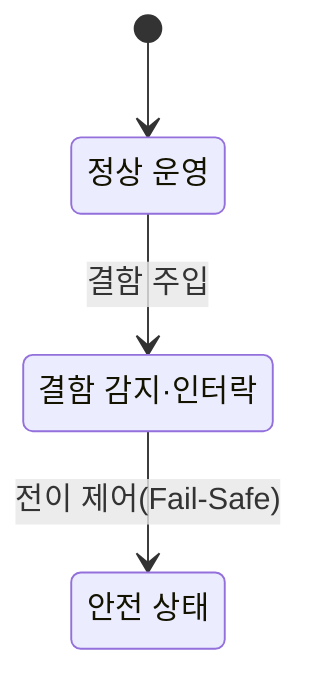

## 지식 로드맵 내 현재 위치

  소프트웨어공학
  SW 안전성·품질 보증
  <strong>SW 안전진단 가이드</strong>

## 30초 인출

- 본질: **소프트웨어 안전진단 가이드**는 소프트웨어의 위험원을 식별하고 안전 요구사항·설계·검증 활동을 점검하도록 돕는 실무 지침
- 메커니즘: 위험원·안전 제약 식별 → 설계와 구현에 반영 → 분석·시험으로 확인 → 발견 사항 시정 및 재검증
- 핵심 구분: 안전진단은 오작동이 사람·환경·재산에 미칠 위해를 다루며, 보안진단은 악의적 침해와 취약점을 다룸

핵심 용어

- **위험원(Hazard)**: 사람·환경·재산에 위해를 일으킬 수 있는 시스템 상태나 조건
- **SW(Software)**: 컴퓨터가 실행하는 프로그램과 관련 산출물
- **NIPA(National IT Industry Promotion Agency)**: 정보통신산업 진흥과 지원을 담당하는 공공기관
- **페일세이프(Fail-Safe)**: 고장 시 위험을 줄이는 사전에 정한 안전 상태로 전환하는 설계 원칙
- **FTA(Fault Tree Analysis)**: 원치 않는 최상위 사건의 원인 조합을 하향식으로 분석하는 결함수 분석
- **FMEA(Failure Mode and Effects Analysis)**: 구성요소의 고장 형태와 영향을 검토하는 고장형태 영향분석
- **STPA(System-Theoretic Process Analysis)**: 제어 구조와 상호작용에서 발생할 수 있는 위험을 분석하는 기법
- **인터락(Interlock)**: 비정상 상태 감지 시 위험한 동작을 즉시 차단하거나 비상 정지로 연결하는 안전 제어 논리
- **결함 주입 시험(Fault Injection Testing)**: 정상적인 동작뿐만 아니라 센서 고장, 패킷 유실, 전원 노이즈 등 악조건을 인위적으로 주입하여 소프트웨어의 예외 처리와 안전 복원력을 검증하는 시험
- **안전 무결성 기준(Safety Integrity Level)**: 식별된 위험원의 심각도와 발생 빈도에 따라 소프트웨어에 요구되는 안전성 보증 등급

---

## 1교시 예상문제 (10점)

> SW 안전진단 가이드의 정의와 목적, 핵심 메커니즘을 설명하시오. (예상)

---

## 1교시 10점 답안

### Ⅰ. 개요

| 구분 | 핵심 |
|---|---|
| 정의 | **소프트웨어 안전진단 가이드**는 위험원 식별과 안전 요구·설계·검증 활동을 점검하도록 돕는 실무 지침 |
| 목적 | 개발·운영 과정에서 위험 통제의 누락을 찾아 보완하고 안전 근거를 확인 |

### Ⅱ. 위험 통제 관계

- 제언: 진단 항목을 위험 분석·안전 요구사항·검증 기록에 연결해 미흡 사항을 추적하는 운영 원칙
---

## 2~4교시 예상문제 (25점)

> SW 안전진단 가이드의 개념과 목적을 설명하고, 핵심 메커니즘과 구성요소·절차, 적용 시 문제점과 대응 방안을 제시하시오. (25점, 예상)

---

## 2~4교시 25점 답안

### Ⅰ. 개요

생명·안전 관련 소프트웨어의 위험 식별과 안전 요구사항의 설계·구현·검증 반영 여부를 살피는 지침. 정보통신산업진흥원(NIPA)의 분야별 안전 가이드 자료와 개별 가이드의 적용 대상·법적 효력에 관한 관련 법령 구분.

| 구분 | 핵심 |
|---|---|
| 정의 | **소프트웨어 안전진단 가이드**는 위험원 식별과 안전 요구·설계·검증 활동을 점검하도록 돕는 실무 지침 |
| 목적 | 개발·운영 과정에서 위험 통제의 누락을 찾아 보완하고 안전 근거를 확인 |

### SW 안전진단 vs SW 보안약점 진단 vs 일반 SW 품질평가

| 구분 | SW 안전진단 (Safety) | SW 보안약점 진단 (Security) | 일반 SW 품질평가 (Quality) |
|---|---|---|---|
| **핵심 목적** | **오작동 시 인명 피해 및 재난 방지** | 외부 공격자의 불법 침투 및 해킹 방어 | 사용자 요구 기능 및 성능 만족도 검증 |
| **위협 주체** | 시스템 내부 결함, 센서 고장, 예외 환경 | 악의적인 해커, 악성코드, 내부자 유출 | 불명확한 요구사항, 사용자 미숙 |
| **방어 메커니즘** | **페일세이프(Fail-Safe), 결함 허용, 인터락** | 암호화, 시큐어 코딩, 접근 제어, 인증 | 성능 튜닝, UI/UX 개선, 기능 완전성 |
| **핵심 검증 기법** | 위험원 분석과 고장·경계 조건 시험 | 취약점 분석과 침투 시험 | 요구 기능과 품질 특성 시험 |

### Ⅱ. 안전 요구와 검증 메커니즘

### 결함 주입(Fault Injection) 및 Fail-Safe 상태 전이 메커니즘

### 안전진단 4대 상세 점검 항목

| 점검 항목 | 핵심 판단 |
|---|---|
| **위험원 식별·안전 요구사항** | 위험원과 안전 제약을 정하고 요구사항으로 명세 |
| **방어적 아키텍처 설계** | 고장 감지·격리와 안전 상태 전환 경로 설계 |
| **코딩 규칙·정적 검증** | 적용 표준에 맞춰 위험한 코드 패턴과 경계 조건 점검 |
| **결함 주입·견고성 시험** | 관련 고장·통신 지연을 시험하고 안전 상태 전환 확인 |

### Ⅲ. 적용상 유의점

### 위험 대응 매트릭스

| 고려사항 | 대응 |
|---|---|
| 안전 요구가 구체적이고 검증 가능하지 않음 | 위험원과 안전 제약을 연결하고 수용 조건을 정의 |
| 분석 결과가 설계·시험에 이어지지 않음 | 요구사항·설계·시험 증거의 연결과 변경 영향 확인 |
| 정상 조건 시험만 수행 | 적용 위험에 맞춰 고장·경계 조건을 분석·시험 |

### Ⅳ. 분석 기법과 범위

| 분석기법 | 초점 |
|---|---|
| FTA | 원치 않는 최상위 사건의 원인 조합을 하향식 분석 |
| FMEA | 구성요소별 고장 형태와 영향 분석 |
| STPA | 제어 구조와 상호작용에서 발생할 수 있는 위험 분석 |

### Ⅴ. 기술사적 제언

| 한계 | 해결 방안 |
|---|---|
| 가이드 준수 확인이 체크리스트 작성에 머물러 실제 안전 요구 충족을 입증하지 못함 | 위험원·안전 제약·설계 통제·시험 증거를 연결하고 미해결 위험의 승인 책임을 분명히 하는 검토 절차 수립 |

### 6. 참고 및 연계 학습

- [소프트웨어 안전성 가이드라인](./097_sw_safety_guidelines.md)
- [STPA(시스템 이론 프로세스 분석)](./108_stpa.md)
- [임베디드 소프트웨어 테스트](./089_embedded_sw_test.md)
- [요구사항 추적표(RTM)](./102_requirement_traceability_matrix.md)

### 참고 자료

- [정보통신산업진흥원 SW 안전 가이드](https://www.nipa.kr/home/2-7-1-1/7110)
- [소프트웨어 진흥법 제2조(정의)](https://law.go.kr/LSW/LsiJoLinkP.do?lsNm=%EC%86%8C%ED%94%84%ED%8A%B8%EC%9B%A8%EC%96%B4%EC%82%B0%EC%97%85+%EC%A7%84%ED%9D%A5%EB%B2%95)
---
