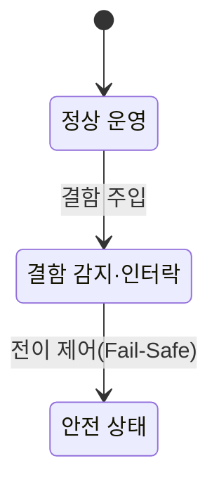

## 지식 로드맵 내 현재 위치

  소프트웨어공학
  SW 안전성·품질 보증
  <strong>SW 안전진단 가이드</strong>

## 30초 인출

- 본질: 교통, 에너지, 의료, 금융 등 국가 기반시설과 공공 소프트웨어의 사소한 오작동이 대규모 인명 피해나 사회적 재난으로 비화하는 참사를 방지하기 위해, 소프트웨어 생애주기 전반에 걸쳐 위험원(Hazard)을 선제적으로 찾아내고 결함 발생 시에도 시스템이 안전 상태(Safe State)를 유지하도록 점검하는 과학기술정보통신부·NIPA의 법정 안전성 진단 표준
- 메커니즘: 진단 준비 및 위험도 평가 → 위험원 분석(FTA, FMEA) → 아키텍처 안전 설계(Fail-Safe, 인터락) 검증 → 소스코드 정적 진단(MISRA-C, CWE) → 결함 주입(Fault Injection) 동적 테스팅 → 개선 조치 이행
- 산출물: SW 안전진단 계획서 · 위험원 분석서(FTA/FMEA) · 안전 아키텍처 검증서 · 결함 주입 시험 결과서 · 안전 개선 조치 보고서

핵심 용어

- **위험원(Hazard)**: 시스템의 오작동, 기능 상실, 비정상 환경으로 인해 인명 사망·부상이나 중대한 환경 오염 및 재산 손실을 초래할 수 있는 잠재적 근원
- **페일세이프(Fail-Safe)**: 시스템 내부 부품이나 소프트웨어에 고장이 발생하더라도, 시스템 전체가 즉시 사전에 정의된 안전한 상태(Safe State)로 전이하여 사고를 방지하는 설계 원칙
- **인터락(Interlock)**: 비정상 상태 감지 시 위험한 동작을 즉시 차단하거나 비상 정지로 연결하는 안전 제어 논리
- **결함 주입 시험(Fault Injection Testing)**: 정상적인 동작뿐만 아니라 센서 고장, 패킷 유실, 전원 노이즈 등 악조건을 인위적으로 주입하여 소프트웨어의 예외 처리와 안전 복원력을 검증하는 시험
- **안전 무결성 기준(Safety Integrity Level)**: 식별된 위험원의 심각도와 발생 빈도에 따라 소프트웨어에 요구되는 안전성 보증 등급

---

## 1교시 예상문제 (10점)

> SW 안전진단 가이드의 정의와 목적, 핵심 메커니즘을 설명하시오. (예상)
---

## 1교시 10점 답안

### 1. 정의·목적

- 정의: 교통, 에너지, 의료, 금융 등 국가 기반시설과 공공 소프트웨어의 사소한 오작동이 대규모 인명 피해나 사회적 재난으로 비화하는 참사를 방지하기 위해, 소프트웨어 생애주기 전반에 걸쳐 위험원(Hazard)을 선제적으로 찾아내고 결함 발생 시에도 시스템이 안전 상태(Safe State)를 유지하도록 점검하는 과학기술정보통신부·NIPA의 법정 안전성 진단 표준
- 목적: 안전 관련 소프트웨어의 개발·검증 절차에서 미흡한 통제와 증거를 찾아낸다.

### 2. 핵심 관계

- 제언: 진단 항목을 위험 분석·안전 요구사항·검증 기록에 연결해 미흡 사항의 시정과 재확인을 추적한다.
---

## 2~4교시 예상문제 (25점)

> SW 안전진단 가이드의 개념과 목적을 설명하고, 핵심 메커니즘과 구성요소·절차, 적용 시 문제점과 대응 방안을 제시하시오. (25점, 예상)
---

## 2~4교시 25점 답안

### 1. 개요 및 필요성

### 소프트웨어 오작동의 사회적 재난화와 제도적 안전망

자율주행, 철도 신호 제어, 원자력 발전, 의료 기기 등 현대 사회의 핵심 인프라는 소프트웨어에 전적으로 의존한다. 일반 비즈니스 소프트웨어의 버그는 단순한 화면 오류나 서비스 지연에 그치지만, **안전 필수(Safety-Critical) 소프트웨어의 단 1줄의 결함은 탈선, 추락, 인명 사망, 국가 기반시설 마비라는 돌이킬 수 없는 사회적 재난**을 초래한다.

과학기술정보통신부와 정보통신산업진흥원(NIPA)이 제정한 '소프트웨어 안전진단 가이드'는 공공 및 민간 핵심 시설 소프트웨어를 대상으로, **설계부터 코드 구현, 시험에 이르는 전 생애주기 동안 위험원을 체계적으로 식별·제거하도록 지원하는 국가 표준 진단 체계**이다.

### SW 안전진단 vs SW 보안약점 진단 vs 일반 SW 품질평가

| 구분 | SW 안전진단 (Safety) | SW 보안약점 진단 (Security) | 일반 SW 품질평가 (Quality) |
|---|---|---|---|
| **핵심 목적** | **오작동 시 인명 피해 및 재난 방지** | 외부 공격자의 불법 침투 및 해킹 방어 | 사용자 요구 기능 및 성능 만족도 검증 |
| **위협 주체** | 시스템 내부 결함, 센서 고장, 예외 환경 | 악의적인 해커, 악성코드, 내부자 유출 | 불명확한 요구사항, 사용자 미숙 |
| **방어 메커니즘** | **페일세이프(Fail-Safe), 결함 허용, 인터락** | 암호화, 시큐어 코딩, 접근 제어, 인증 | 성능 튜닝, UI/UX 개선, 기능 완전성 |
| **핵심 검증 기법** | FTA, FMEA, 결함 주입 시험, MC/DC | 정적 분석(SAST), 동적 분석(DAST), 모의해킹 | 기능 테스트, 부하 테스트, 사용성 테스트 |

### 2. 아키텍처 및 핵심 메커니즘

### 결함 주입(Fault Injection) 및 Fail-Safe 상태 전이 메커니즘

### 안전진단 4대 상세 점검 항목

| 점검 항목 | 핵심 판단 |
|---|---|
| **위험원 식별·안전 요구사항** | HAZOP·FTA·FMEA로 위험원 도출, 안전 제약조건·요구사항 명세 |
| **방어적 아키텍처 설계** | 단일 장애점(SPOF) 제거 이중화, 워치독 타이머·비상 정지 인터락 |
| **코딩 규칙·정적 검증** | 동적 메모리 할당(malloc/free) 배제, 재귀 호출 금지, 0 나누기·포인터 무결성 점검 |
| **결함 주입·견고성 시험** | 비트 플립·통신 지연 등 에러 주입, 비정상 루프 없이 안전 정지 확인 |

### 3. 실무 적용 및 고려사항

### 위험 대응 매트릭스

| 위험 | 대책 | 효과 |
|---|---|---|
| 통신 패킷 두절 시 신호등이 마지막 상태(녹색등)로 고정되어 열차 충돌 위험 노출 | 안전진단 지침에 따라 하트비트 두절 시 즉시 적색등(비상 정지)으로 전이하는 페일세이프 로직 설계 | 통신 장애 시 즉시 안전 상태 전환 및 인명 사고 예방 |
| 수백만 라인의 C/C++ 제어 코드에서 간헐적 메모리 누수와 힙 단편화로 시스템 프리징 | MISRA-C 안전 코딩 표준을 적용하여 동적 메모리 할당을 전면 금지하고 정적 배열 할당 강제 | 런타임 메모리 고갈 오류 원천 차단 및 시스템 영속 가동성 확보 |
| 프로젝트 납품 직전 형식적인 체크리스트 검수 통과에만 급급하여 실질적 안전성 누락 | 요구사항 단계부터 RTM(요구사항 추적표)을 수립하고 CI 파이프라인에 결함 주입 자동화 테스트 연계 | 개발 전주기 상시 안전성 내재화 및 감사 무결성 확보 |

### 4. 기술사 답안 차별화 포인트

### 소프트웨어진흥법 제46조(SW안전 확보)와의 법제도적 연계

단순한 가이드라인 기술 나열에 그치지 않고, **소프트웨어진흥법 개정에 따른 공공 및 주요 정보시스템의 SW 안전 확보 의무화 법령**을 언급한다. 과기정통부가 고시하는 '소프트웨어 안전 확보 등에 관한 지침'에 따라 국가핵심기반시설과 재난관리책임기관은 기획 단계부터 SW 안전관리 책임자를 지정하고 위험성 평가를 필수적으로 수행해야 함을 밝히면 제도적 혜안을 드러낼 수 있다.

### STPA(System Theoretic Process Analysis) 현대적 기법 연계

기존 가이드라인이 부품 고장 중심의 고전 기법(FTA, FMEA)에 머물러 있는 한계를 비판적으로 짚고, 현대의 복잡한 소프트웨어 집약형 시스템(자율주행, 스마트 철도)에서는 부품 고장이 없어도 상호작용 오류로 사고가 터질 수 있음을 지적한다. 따라서 MIT 낸시 레브슨 교수의 **STPA 기반 피드백 제어 루프 위험원 분석을 차세대 안전진단 가이드라인의 핵심 기법으로 도입해야 함**을 3단락 또는 결론으로 제시한다.

### 5. 결론 및 종합 제언

### 학습자 통찰 메모 — 답안 밖

[핵심 통찰]
SW 안전진단은 기능이 '동작하는가'를 보는 것이 아니라, **'고장이 났을 때 사람이 죽지 않고 안전하게 멈추는가'**를 점검하는 학문이다. 따라서 핵심은 결함 0%를 장담하는 것이 아니라, 필연적으로 발생하는 하드웨어/네트워크 결함 앞에서도 시스템이 무조건 Safe State로 착륙하도록 보장하는 Fail-Safe 인터락 설계다.

나라면:
본 시험에서 SW 안전 관련 문제가 출제되면, 가이드라인의 4단계 점검 프로세스를 표로 정리한 뒤 **(1) 부품 결함뿐 아니라 복잡한 컴포넌트 상호작용 오류를 잡는 STPA 확장, (2) 소스코드 동적 메모리(malloc) 완전 배제를 위한 MISRA-C 정적 분석, (3) 소프트웨어진흥법 제46조에 따른 발주-감리 제도적 안전성 보증 체계**를 종합 제언으로 제시하겠다.

### 실전 답안용 기술사적 제언

- **판정 기준**: 국가 기반시설 및 생명·안전 직결 소프트웨어 사업에서 위험원 분석(FTA/FMEA) 누락 및 Fail-Safe 미설계 시 부적격 판정
- **대응 방안**: 전주기 안전 생명주기를 수립하고 MISRA-C 정적 검증 및 결함 주입(Fault Injection) 하드웨어 연동 시험 의무화
- **검증 체계**: RTM(요구사항 추적표)을 기반으로 모든 위험원에 대해 1:1 안전 방어 로직과 테스트 케이스 커버리지 100% 입증
- **기대 효과**: 소프트웨어 잠재 위험 조기 제거 및 재난 수준의 운영 사고 예방, 국가 핵심 인프라 신뢰도 확보

### 6. 참고 및 연계 학습

- [소프트웨어 안전성 가이드라인](./097_sw_safety_guidelines.md)
- [STPA(시스템 이론 프로세스 분석)](./108_stpa.md)
- [임베디드 소프트웨어 테스트](./089_embedded_sw_test.md)
- [요구사항 추적표(RTM)](./102_requirement_traceability_matrix.md)
---
