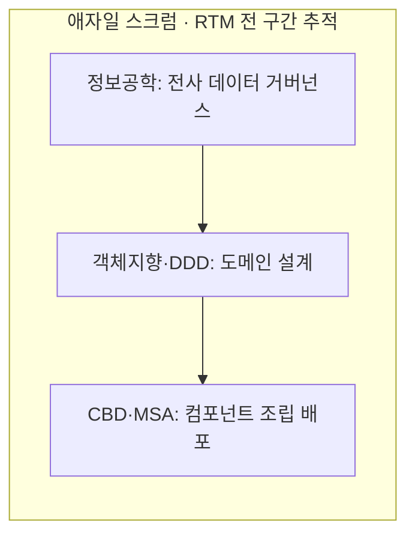

## 지식 로드맵 내 현재 위치

  소프트웨어공학
  개발 프로세스·방법론
  <strong>SW 개발방법론 비교(구조적·정보공학·객체지향·CBD)</strong>

## 30초 인출

- 본질: 소프트웨어 개발의 생산성 저하와 품질 편차를 극복하기 위해, 시스템을 분석·설계하는 핵심 추상화의 중심축을 기능(구조적), 전사 데이터(정보공학), 객체(객체지향), 독립 실행 부품(CBD)으로 발전시켜 온 공학적 절차·기법·산출물의 종합 수행 체계
- 메커니즘: 비즈니스 도메인 및 제약 분석 → 핵심 추상화 관점 선택 → 생명주기 및 산출물 테일러링(Tailoring) → 단계별 엔지니어링 수행(DFD, ERD, UML, 컴포넌트) → 요구-산출물 추적성 검증
- 산출물: DFD/DD/Mini-Spec (구조적) · 주제영역/ERD/CRUD 매트릭스 (정보공학) · 유스케이스/클래스/시퀀스 UML (객체지향) · 컴포넌트 및 인터페이스 명세서 (CBD)

핵심 용어

- **구조적 방법론(Structured)**: '나누어 해결하기(Divide & Conquer)' 원리에 기반하여 시스템을 상위 기능에서 하위 기능으로 단계적으로 분할하는 하향식 기능 중심 방법론
- **정보공학 방법론(Information Engineering)**: 기업의 경영 전략(ISP)과 데이터 모델이 비즈니스 프로세스보다 안정적이라는 철학에 기반하여, 전사 데이터를 중심으로 구축하는 방법론
- **객체지향 방법론(Object-Oriented)**: 현실 세계의 사물과 개념을 상태(데이터)와 행위(메서드)가 결합된 '객체(Object)'로 모델링하여 캡슐화와 다형성을 구현하는 방법론
- **CBD(Component Based Development)**: 독립적으로 개발·배포되는 실행 단위 컴포넌트들을 표준 인터페이스를 통해 연결·조립하여 시스템을 구축하는 재사용 중심 방법론

## 1. 개요 및 필요성

### 패러다임의 진화와 방법론 선택의 전략적 가치

소프트웨어 개발방법론은 이전 방식을 단순히 폐기하고 대체하는 것이 아니라, **"소프트웨어의 복잡성을 통제하기 위해 문제를 바라보는 추상화의 초점을 어디에 둘 것인가"**에 따라 발전해 왔다.

배치 처리나 트랜잭션 계산이 중심인 시스템에서는 '구조적' 관점이 여전히 명료하며, 대규모 기간계 업무에서는 '정보공학'의 데이터 정합성이 필수적이다. 반면 도메인 규칙이 복잡하고 변화가 잦은 비즈니스에서는 '객체지향'이, 표준화된 부품을 대량 조립해야 하는 환경에서는 'CBD'가 최적이다. 따라서 단일 방법론에 매몰되지 않고 프로젝트의 특성에 따라 적합한 방법론을 선택하고 테일러링하는 능력이 엔지니어링의 성패를 가른다.

### 4대 개발방법론 핵심 비교

| 비교축 | 구조적 방법론 | 정보공학 방법론 | 객체지향 방법론 | CBD 방법론 |
|---|---|---|---|---|
| **핵심 추상화 중심** | **기능 및 프로세스 (Function)** | **전사 데이터 (Data)** | **객체와 책임 (Object)** | **독립 실행 부품 (Component)** |
| **접근 방식** | 하향식 기능 분할 (Top-down) | 하향식 계획 + 상향식 구축 | 상향식 컴포넌트화 + 하향식 분석 | 부품 조립식 (Assembly) |
| **대표 산출물** | DFD, 자료사전(DD), 소단위명세서 | 주제영역도, ERD, CRUD 매트릭스 | 유스케이스, 클래스도, 시퀀스도 | 컴포넌트 명세서, 인터페이스 정의서 |
| **재사용 단위** | 서브루틴 및 공통 함수 (낮음) | 데이터베이스 스키마 (중간) | 클래스 및 모듈 (코드 레벨 재사용) | **바이너리 컴포넌트 (블랙박스 재사용)** |
| **주요 강점** | 데이터 흐름 및 입출력 명료 | 전사 데이터 무결성 및 정합성 보장 | 변경 격리 우수, 현실 세계 직관적 반영 | 개발 기간 단축, 조립식 대체 가능성 |
| **한계점** | 데이터와 기능 분리로 변경 취약 | 초기 ISP 부담 및 요구 변경 경직 | 모델링 복잡성 및 설계 역량 의존 | 컴포넌트 불일치(Mismatch) 및 어댑터 비용 |

## 2. 아키텍처 및 핵심 메커니즘

### 4대 방법론 추상화 중심축 및 모델링 체계

### 현대 엔터프라이즈 하이브리드 방법론 통합 구조

### 프로젝트 특성에 따른 방법론 선정 매트릭스

| 프로젝트 특성 (추천 방법론) | 핵심 판단 |
|---|---|
| **데이터 정합성 최우선** → 정보공학 | ERP·금융권 코어뱅킹 등 전사 데이터 무결성이 핵심인 사업은 ISP 주제영역 정의와 전사 데이터 아키텍처(DA) 정립이 필수 |
| **비즈니스 규칙 변경 빈번** → 객체지향 | 이커머스·핀테크 등 정책이 수시로 변하는 도메인은 DDD·디자인 패턴으로 변경 영향을 격리 |
| **기구축 자산 재사용 극대화** → CBD | 공통 행정 플랫폼·프로덕트 라인(PLE) 등 유사 패키지 대량 생산 사업은 표준 인터페이스 조립과 어댑터 패턴으로 납기 단축 |
| **명확한 순차 데이터 변환** → 구조적 | 배치(Batch) 집계·컴파일러·단순 신호 처리는 입력→출력 변환 경로를 DFD로 명료하게 시각화 |

## 3. 실무 적용 및 고려사항

### 위험 대응 매트릭스

| 위험 | 대책 | 효과 |
|---|---|---|
| 사업 규모가 작은 프로젝트에 정보공학의 방대한 산출물 작성을 강요하여 일정 파행 | 프로젝트 규모, 난이도, 위험도에 따라 산출물을 필수/선택으로 축약하는 테일러링(Tailoring) 가이드 수립 | 개발 공수 낭비 방지 및 핵심 비즈니스 로직 집중 |
| 객체지향으로 분석·설계했으나 실제 코딩은 절차적 스파게티 코드로 구현되어 모델 무력화 | 모델-코드 간 동기화를 위한 정적 분석 도구(SonarQube, ArchUnit) 도입 및 코드 리뷰 의무화 | 아키텍처 침식 방지 및 객체지향 캡슐화 품질 유지 |
| CBD 도입 시 공통 컴포넌트의 과도한 커스터마이징으로 인해 원본 부품과 호환성 단절 | 컴포넌트 내부 코드를 수정하지 않고 외부 래퍼(Wrapper) 및 전략 패턴을 통해서만 확장하도록 규칙 강제 | 컴포넌트 형상 무결성 유지 및 버전 업그레이드 용이성 확보 |

## 4. 기술사 답안 차별화 포인트

### 현대적 애자일 및 마이크로서비스(MSA)로의 융합 전략

최근 엔터프라이즈 환경에서는 특정 고전 방법론 하나만을 채택하지 않는다. 기획 및 데이터 거버넌스 단계에서는 **정보공학의 ERD와 CRUD 매트릭스**로 데이터 무결성을 확보하고, 도메인 설계 단계에서는 **객체지향(DDD)**으로 Bounded Context를 도출하며, 서비스 구현 및 배포 단계에서는 **CBD의 사상을 계승한 컨테이너 기반 마이크로서비스(MSA)**로 조립 배포하고, 전체 프로젝트 관리는 **애자일(Scrum)**로 반복 이행하는 **'현대적 하이브리드 소프트웨어 엔지니어링 프레임워크'**를 3단락 또는 결론으로 제시한다.

### 전 구간 추적성(Traceability)의 보증

어떤 방법론을 선택하거나 테일러링하더라도 결코 타협할 수 없는 절대 원칙은 **"요구사항 $\rightarrow$ 아키텍처/모델 $\rightarrow$ 소스코드 $\rightarrow$ 테스트 케이스"로 이어지는 전 구간 양방향 추적성(RTM)**이다. 방법론의 산출물이 서로 단절되지 않고 요구사항 추적표를 통해 1:1로 매핑되어 검증되어야만 성공적인 소프트웨어 인도가 가능함을 강조한다.

## 5. 결론 및 종합 제언

### 학습자 통찰 메모 — 답안 밖

[핵심 통찰]
개발방법론의 우열을 논하는 것은 무의미하다. 방법론은 문제 해결을 위한 '추상화의 도구'일 뿐이며, **"기능이 중심인가(구조적), 데이터가 중심인가(정보공학), 변경 격리가 중심인가(객체지향), 부품 조립이 중심인가(CBD)"**라는 도메인의 고유 성격에 따라 최적의 도구를 융합해 내는 테일러링 역량이 소프트웨어 엔지니어링의 본질이다.

나라면:
본 시험에서 개발방법론 비교가 출제되면, 4대 방법론의 비교표를 정확히 구성한 뒤 **(1) 정보공학의 데이터 거버넌스, (2) 객체지향 DDD의 도메인 캡슐화, (3) CBD를 클라우드로 계승한 컨테이너 기반 마이크로서비스(MSA), (4) 이를 기동하는 애자일 스크럼의 '현대적 융합 하이브리드 아키텍처'**를 3단락에 도식화하여 실무형 만점 답안을 작성하겠다.

### 실전 답안용 기술사적 제언

- **판정 기준**: 프로젝트 도메인의 데이터 의존성, 요구사항 변경 주기, 기존 자산 재사용률을 진단하여 방법론 테일러링 기준 수립
- **대응 방안**: 데이터 레이어(정보공학) + 도메인 로직(객체지향) + 서비스 배포(CBD/MSA)의 계층별 최적 방법론 조합 적용
- **검증 체계**: ALM 툴체인을 활용하여 요구사항 명세서부터 최종 테스트 케이스까지 양방향 추적성(RTM) 100% 매핑 보증
- **기대 효과**: 단일 방법론의 경직성 탈피 및 개발 생산성 30% 향상, 릴리스 주기 단축 및 아키텍처 유지보수성 극대화

## 6. 참고 및 연계 학습

- [방법론 테일러링(Methodology Tailoring)](./039_methodology_tailoring.md)
- [CBD(Component Based Development)](./128_cbd.md)
- [애자일 방법론](./119_agile_methodology.md)
- [요구사항 추적표(RTM)](./102_requirement_traceability_matrix.md)
