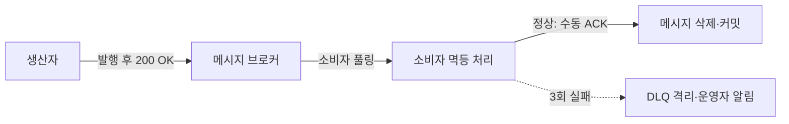
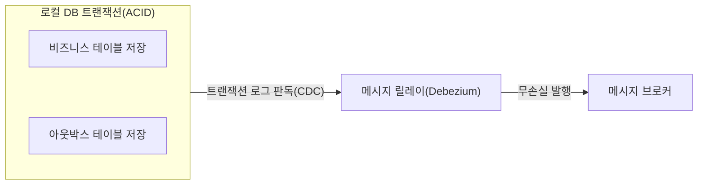

## 지식 로드맵 내 현재 위치

  소프트웨어공학
  분산 아키텍처·비동기 메시징
  <strong>메시지 큐(Message Queue)</strong>

## 30초 인출

- 본질: 서비스 간 직접적인 동기식(REST/RPC) 호출 연쇄로 인해 발생하는 시간적·공간적 강결합과 하위 서비스 장애 전파(Cascading Failure)를 차단하기 위해, 생산자(Producer)와 소비자(Consumer) 사이에 메시지 브로커를 배치하여 데이터를 비동기로 중계하고 피크 트래픽을 완충하는 분산 미들웨어
- 메커니즘: 생산자 메시지 발행 → 브로커 메모리/디스크 큐 버퍼링 → 소비자 비동기 풀링(Pull) 및 멱등 처리 → 정상 처리 후 ACK 회신(3회 실패 시 DLQ 격리)
- 산출물: 메시지 토폴로지 구성도 · 메시지 스키마 정의서 · 멱등성 처리 규격서 · 데드 레터 큐(DLQ) 운영 정책서

핵심 용어

- **결합 분리(Decoupling)**: 생산자와 소비자가 서로의 IP 주소나 서버 상태를 알 필요 없이 오직 메시지 규격만을 매개로 독립적으로 동작하는 아키텍처적 특성
- **피크 트래픽 완충(Traffic Leveling)**: 대규모 트래픽 유입 시 다운스트림 데이터베이스나 서버가 과부하로 쓰러지지 않도록 큐에 일시 보관하고 감당 가능한 속도로 꺼내 처리하는 버퍼링
- **적어도 한 번 전송(At-least-once)**: 네트워크 단절이나 컨슈머 장애 시 메시지 유실을 방지하기 위해 재전송을 보장하는 정책(중복 발생 가능성 내포)
- **데드 레터 큐(DLQ, Dead Letter Queue)**: 데이터 포맷 오류나 시스템 예외로 인해 최대 재시도 횟수를 초과한 '독성 메시지(Poison Message)'를 별도 격리하는 특수 큐

---

## 1교시 예상문제 (10점)

> 메시지 큐(Message Queue)의 정의와 목적, 핵심 메커니즘을 설명하시오. (예상)
---

## 1교시 10점 답안

### 1. 정의·목적

- 정의: 서비스 간 직접적인 동기식(REST/RPC) 호출 연쇄로 인해 발생하는 시간적·공간적 강결합과 하위 서비스 장애 전파(Cascading Failure)를 차단하기 위해, 생산자(Producer)와 소비자(Consumer) 사이에 메시지 브로커를 배치하여 데이터를 비동기로 중계하고 피크 트래픽을 완충하는 분산 미들웨어
- 목적: 해당 토픽의 주요 문제를 해결하고 필요한 기능을 제공한다.

### 2. 핵심 관계

- 제언: 핵심 작동 원리를 적용해 직접 효과를 검증한다.
---

## 2~4교시 예상문제 (25점)

> 메시지 큐(Message Queue)의 개념과 목적을 설명하고, 핵심 메커니즘과 구성요소·절차, 적용 시 문제점과 대응 방안을 제시하시오. (25점, 예상)
---

## 2~4교시 25점 답안

### 1. 개요 및 필요성

### 동기식 호출의 폭포수 장애와 비동기 완충의 필연성

마이크로서비스 환경에서 주문 서비스가 결제, 재고, 배송, 알림 서비스를 연속해서 동기식(REST/HTTP)으로 호출하면, 하위 서비스 중 단 하나만 지연되거나 다운되어도 **상위 주문 서비스 전체의 커넥션 풀과 스레드가 고갈되어 전체 시스템이 마비(장애 전파)**된다.

메시지 큐(Message Queue)는 생산자와 소비자의 시간적 실행 타이밍을 분리(Temporal Decoupling)한다. 생산자는 메시지를 큐에 던지고 즉시 자신의 작업을 끝내며, 소비자는 시스템 용량에 맞춰 자신의 속도대로 큐에서 메시지를 꺼내 처리함으로써 **시스템 전체의 복원력(Resilience)과 확장성을 극대화**한다.

### 전통적 메시지 큐(RabbitMQ) vs 이벤트 브로커(Kafka) 비교

| 구분 | RabbitMQ (메시지 큐 중심) | Apache Kafka (이벤트 스트리밍 중심) |
|---|---|---|
| **설계 철학** | 작업(Job)의 비동기 분배 및 스마트 브로커 | 이벤트(Event)의 영구 기록 및 덤 브로커 |
| **메시지 생명주기** | **컨슈머가 수신 및 처리(ACK)하면 큐에서 삭제** | **보관 주기(Retention) 동안 디스크에 영구 보관** |
| **라우팅 유연성** | 매우 높음 (Direct, Fanout, Topic, Headers Exchange) | 토픽 및 파티션 기반 단순 키 라우팅 |
| **소비자 모델** | 푸시(Push) 중심 (브로커가 컨슈머로 전달) | 풀(Pull) 중심 (컨슈머가 오프셋 기준으로 당겨옴) |
| **메시지 재생** | 기본 불가 (삭제됨) | **오프셋(Offset)을 과거로 되돌려 무한 재생 가능** |
| **주요 활용 분야** | 백엔드 비동기 작업 큐, 복잡 라우팅 주문 처리 | 대규모 로그 수집, 실시간 스트림 파이프라인, CDC |

### 2. 아키텍처 및 핵심 메커니즘

### 메시지 큐 기반 결합 분리 및 재시도·DLQ 아키텍처

### 트랜잭셔널 아웃박스 패턴(Transactional Outbox Pattern)

### 메시지 큐 신뢰성 보증 4대 핵심 기법

| 핵심 기법 | 핵심 판단 |
|---|---|
| **브로커 디스크 영속화(Durable)** | 유실 방지: 큐·메시지를 인메모리가 아닌 디스크 WAL에 기록하여 브로커 재부팅 후에도 무손실 복구 |
| **수동 확인 응답(Manual ACK)** | 처리 보증: 소비자가 비즈니스 로직(DB 저장 등)을 완전히 끝낸 뒤 명시적 ACK 전송, 처리 중 장애 시 다른 컨슈머로 자동 재전송 |
| **컨슈머 멱등성(Idempotency)** | 중복 방어: 고유 메시지 ID 기반 Redis 분산 락 또는 DB 유니크 제약으로 At-least-once 재전송의 중복 실행 차단 |
| **데드 레터 큐(DLQ)** | 파이프라인 보호: 재시도 한도(Max Retry) 초과 메시지를 격리·우회시켜 정상 메시지 처리 블로킹 방지 |

### 3. 실무 적용 및 고려사항

### 위험 대응 매트릭스

| 위험 | 대책 | 효과 |
|---|---|---|
| 네트워크 일시 단절 후 At-least-once 재전송으로 결제 메시지가 2회 실행되어 이중 결제 사고 | 컨슈머 측에 메시지 식별자(UUID)를 키로 하는 Redis 캐시 선점 및 DB 멱등성 테이블 적용 | 중복 트랜잭션 실행 사고 100% 원천 방지 |
| 비정상 포맷의 메시지(Poison Message)가 큐 맨 앞에서 무한 에러를 일으켜 전체 큐 마비 | 지수 백오프(Exponential Backoff) 재시도 3회 초과 시 즉시 DLQ로 라우팅 격리 | 전체 메시지 파이프라인의 정상 흐름 유지 |
| 주문 DB에는 커밋되었으나 메시지 브로커 전송 단계에서 장애가 발생하여 메시지 유실(이중 쓰기 문제) | 로컬 DB 트랜잭션에 아웃박스 테이블을 함께 기록하고 디비 로그를 릴레이하는 트랜잭셔널 아웃박스 패턴 도입 | 데이터베이스 상태와 메시지 발행 간 100% 최종 일관성 보장 |

### 4. 기술사 답안 차별화 포인트

### 트랜잭셔널 아웃박스 패턴(Transactional Outbox Pattern) 제시

메시지 큐를 도입할 때 가장 심각한 아키텍처적 결함은 **"비즈니스 DB 저장과 메시지 큐 발행"이 서로 다른 2개의 분산 자원이어서 원자적 롤백이 불가능(Dual-Write 문제)**하다는 점이다. DB 저장은 성공했는데 브로커가 죽어 메시지가 날아가거나, 그 반대의 상황이 발생한다. 이를 극복하기 위해 **동일한 로컬 DB 트랜잭션 내에 `OUTBOX` 테이블에 이벤트를 함께 커밋한 뒤 Debezium(CDC) 등을 통해 큐로 안전하게 퍼블리시하는 트랜잭셔널 아웃박스 아키텍처**를 3단락 또는 결론으로 제시한다.

### 배압(Backpressure) 제어와 메시지 폭풍(Storm) 방어

컨슈머의 처리 속도보다 프로듀서의 발행 속도가 압도적으로 빠를 경우 메시지 큐에 수천만 건이 쌓여 지연이 발생한다. 컨슈머가 `prefetch-count`를 제한하여 자신이 감당할 수 있는 만큼만 가져오는 배압(Backpressure) 제어와, 오토스케일링(KEDA)을 통해 큐 깊이(Queue Depth)에 따라 컨슈머 파드를 동적으로 증설하는 클라우드 네이티브 운영 전략을 명시한다.

### 5. 결론 및 종합 제언

### 학습자 통찰 메모 — 답안 밖

[핵심 통찰]
메시지 큐는 단순히 '비동기로 통신하는 라이브러리'가 아니다. 분산 환경에서 피할 수 없는 네트워크 장애와 트래픽 폭증을 흡수하는 **'충격 흡수기(Shock Absorber)'이자 서비스 간 시공간 결합을 끊어내는 복원력의 중추**다. 특히 재전송으로 인한 중복 처리를 방어하는 멱등성(Idempotency)과 이중 쓰기를 방어하는 아웃박스 패턴은 현업 엔지니어링의 정수다.

나라면:
본 시험에서 메시지 큐 관련 문제가 출제되면, 생산자-큐-소비자 기본 구조에 머물지 않고 **(1) DB와 브로커 간 일관성을 사수하는 트랜잭셔널 아웃박스 패턴, (2) 독성 메시지로 인한 병목을 차단하는 DLQ 격리 정책, (3) KEDA 기반 Queue Depth 연동 오토스케일링**을 3단락에 유기적으로 결합하여 차별화된 고득점을 획득하겠다.

### 실전 답안용 기술사적 제언

- **판정 기준**: MSA 서비스 간 직접 동기 호출 연쇄로 P99 지연시간 급증 및 결함 전파율 증가 시 비동기 큐 전환 판정
- **대응 방안**: 트랜잭셔널 아웃박스 패턴(CDC 연동)을 적용하고 컨슈머 계층에 Redis 분산락 기반 멱등 처리 로직 구현
- **검증 체계**: 재시도 3회 초과 메시지의 DLQ 자동 전이 검증 및 Prometheus/Grafana 기반 메시지 적체(Lag) 임계 알림 가동
- **기대 효과**: 트래픽 폭증 시 백엔드 DB 다운 방지(Traffic Leveling) 및 서비스 간 결합 분리를 통한 가용성 99.99% 달성

### 6. 참고 및 연계 학습

- [이벤트 주도 아키텍처(EDA)](./078_event_driven_architecture.md)
- [마이크로서비스 아키텍처(MSA)](./035_msa.md)
- [순차 다이어그램(Sequence Diagram)](./111_sequence_diagram.md)
- [서비스 메시(Service Mesh)](./088_service_mesh.md)
---
