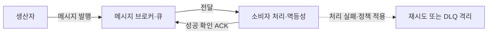
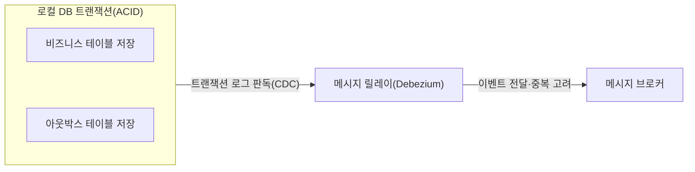

## 지식 로드맵 내 현재 위치

  소프트웨어공학
  분산 아키텍처·비동기 메시징
  <strong>메시지 큐(Message Queue)</strong>

## 30초 인출

- 본질: **메시지 큐(Message Queue)**는 생산자와 소비자 사이에서 메시지를 중계·보관해 서로의 처리 시점을 분리하는 소프트웨어 구성요소
- 메커니즘: 생산자 발행 → 브로커 보관·전달 → 소비자 처리 → 성공 확인 또는 실패 재처리·격리
- 핵심 유의점: 전달 보장 수준과 중복 처리 가능성을 고려한 소비자 멱등성·재시도 정책

핵심 용어

- **결합 분리(Decoupling)**: 생산자와 소비자가 서로의 IP 주소나 서버 상태를 알 필요 없이 오직 메시지 규격만을 매개로 독립적으로 동작하는 아키텍처적 특성
- **피크 트래픽 완충(Traffic Leveling)**: 대규모 트래픽 유입 시 다운스트림 데이터베이스나 서버가 과부하로 쓰러지지 않도록 큐에 일시 보관하고 감당 가능한 속도로 꺼내 처리하는 버퍼링
- **ACK(Acknowledgment)**: 소비자가 메시지 처리 결과를 브로커에 알리는 확인 응답
- **DLQ(Dead Letter Queue)**: 정상 처리할 수 없는 메시지를 주 처리 경로에서 분리해 보관하는 큐
- **At-least-once delivery**: 확인 응답이 없을 때 재전달될 수 있어 메시지 중복 가능성이 있는 전달 방식
- **멱등성(Idempotency)**: 같은 메시지가 여러 번 처리돼도 업무 결과가 중복 반영되지 않도록 하는 성질
- **CDC(Change Data Capture)**: 데이터베이스의 변경 사항을 읽어 외부 시스템에 전달하는 방식
- **Transactional Outbox Pattern**: 업무 데이터와 발행할 이벤트를 같은 데이터베이스 트랜잭션에 기록한 뒤 별도 전달자가 메시지 브로커로 전달하는 패턴
- **ACID(Atomicity, Consistency, Isolation, Durability)**: 데이터베이스 트랜잭션의 원자성·일관성·격리성·지속성 특성

---

## 1교시 예상문제 (10점)

> 메시지 큐(Message Queue)의 정의와 목적, 핵심 메커니즘을 설명하시오. (예상)

---

## 1교시 10점 답안

### Ⅰ. 개요

| 구분 | 핵심 |
|---|---|
| 정의 | **메시지 큐**는 생산자와 소비자 사이에서 메시지를 중계·보관해 서로의 처리 시점을 분리하는 소프트웨어 구성요소 |
| 목적 | 서비스 간 직접 연결을 줄이고 처리 부하·시간 차를 흡수 |

### Ⅱ. 발행·소비 관계

- 제언: 큐 용량·전달 보장·재시도·중복 처리를 함께 설계하고 소비자 멱등성을 시험하는 기준
---

## 2~4교시 예상문제 (25점)

> 메시지 큐(Message Queue)의 개념과 목적을 설명하고, 핵심 메커니즘과 구성요소·절차, 적용 시 문제점과 대응 방안을 제시하시오. (25점, 예상)

---

## 2~4교시 25점 답안

### Ⅰ. 개요

### 동기식 호출의 폭포수 장애와 비동기 완충의 필연성

메시지 큐는 발행자와 소비자 사이에 큐를 두어 직접 호출의 시간적 의존을 낮추는 방식. 메시지 저장·전달 방식과 확인 응답·재시도 규칙은 브로커와 설정에 따라 다름.

| 구분 | 핵심 |
|---|---|
| 정의 | **메시지 큐**는 생산자와 소비자 사이에서 메시지를 중계·보관해 서로의 처리 시점을 분리하는 소프트웨어 구성요소 |
| 목적 | 서비스 간 직접 연결을 줄이고 처리 부하·시간 차를 흡수 |

### 메시지 전달 방식의 구성 요소

| 구성요소 | 역할 |
|---|---|
| 생산자 | 메시지를 생성하고 브로커에 발행 |
| 브로커·큐 | 메시지 보관·라우팅·전달을 담당 |
| 소비자 | 메시지를 받아 업무 처리 후 확인 응답 |
| 재시도·DLQ 정책 | 실패 메시지의 재처리·격리 방식 정의 |

### Ⅱ. 전달·처리 메커니즘

### 메시지 큐 기반 결합 분리 및 재시도·DLQ 아키텍처

### 트랜잭셔널 아웃박스 패턴(Transactional Outbox Pattern)

### 메시지 처리 보장 설계 항목

| 핵심 기법 | 핵심 판단 |
|---|---|
| **보관·내구성 설정** | 브로커의 메시지 보관 방식과 장애 복구 조건 확인 |
| **확인 응답 시점** | 업무 처리가 성공한 뒤 확인할지, 실패 때 어떤 재전달 정책을 쓸지 결정 |
| **멱등성** | 중복 전달이 결과를 중복 반영하지 않도록 업무 키·저장 제약을 설계 |
| **재시도·DLQ** | 재시도 조건과 격리·재처리 책임을 운영 정책으로 정의 |

### Ⅲ. 전달 보장과 실패 처리

### 위험 대응 매트릭스

| 전달 특성 | 설계·운영 고려사항 |
|---|---|
| 확인 응답과 재전달 | 장애 시 중복 전달 가능성을 가정하고 소비자 멱등성을 설계 |
| 반복 실패 메시지 | 재시도 조건·간격을 정하고 처리 불능 메시지를 격리 |
| DB 기록과 메시지 발행의 이중 쓰기 | 트랜잭셔널 아웃박스 등 일관성 패턴을 선택하고 전달 후 중복도 고려 |

### Ⅳ. 업무 처리와 브로커 전달의 일관성

데이터베이스 트랜잭션과 메시지 발행의 이중 쓰기로 인한 불일치 가능성. 아웃박스 패턴은 업무 데이터와 발행 이벤트를 같은 로컬 트랜잭션으로 기록한 뒤 릴레이를 통해 메시지를 전달하는 구조. 릴레이 재시도에 따른 중복 전달을 고려한 소비자 중복 처리 포함.

| 구성 | 역할 |
|---|---|
| 업무 테이블 + 아웃박스 테이블 | 동일 로컬 트랜잭션에서 업무 상태와 전달할 이벤트 기록 |
| 릴레이 | 아웃박스 이벤트를 브로커에 전달하고 처리 상태 갱신 |
| 소비자 멱등성 | 재전달된 동일 이벤트의 중복 반영 방지 |

### Ⅴ. 기술사적 제언

| 문제 | 해결 방안 |
|---|---|
| 업무 처리와 메시지 전달의 결과가 어긋나거나 재전달 메시지가 중복 반영될 수 있음 | 저장·발행 일관성 패턴을 업무 특성에 맞게 고르고 전달 보장·재시도·소비자 멱등성을 하나의 처리 규약으로 검증 |

### 6. 참고 및 연계 학습

- [이벤트 주도 아키텍처(EDA)](./078_event_driven_architecture.md)
- [마이크로서비스 아키텍처(MSA)](./035_msa.md)
- [순차 다이어그램(Sequence Diagram)](./111_sequence_diagram.md)
- [서비스 메시(Service Mesh)](./088_service_mesh.md)
---
