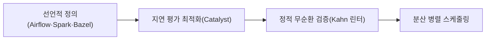

## 지식 로드맵 내 현재 위치

  소프트웨어공학
  자료구조·작업 오케스트레이션
  <strong>방향성 비순환 그래프(DAG)</strong>

## 30초 인출

- 본질: 복잡한 태스크 선후 관계나 분산 파이프라인에서 상호 참조로 인한 무한 루프와 교착상태(Deadlock)를 방지하기 위해, 간선에 시작과 끝의 단방향성이 존재하면서도 어떤 노드에서 출발해도 자기 자신으로 되돌아오는 순환(Cycle)이 전혀 존재하지 않는 유향 그래프 모델
- 메커니즘: 태스크(정점) 및 의존성(방향성 간선) 정의 → 진입 차수(In-degree) 계산 → 사이클 정적 검증(Kahn 알고리즘) → 위상 정렬(Topological Sort) 기반 병렬 스케줄링 실행
- 산출물: DAG 토폴로지 다이어그램 · 위상 정렬 실행 계획서(Execution Plan) · 의존성 검증 리포트

핵심 용어

- **DAG(Directed Acyclic Graph)**: 방향성이 있는 간선들로 구성되어 있으며, 어떤 정점에서 출발하더라도 자기 자신으로 되돌아오는 순환 경로(Cycle)가 존재하지 않는 그래프
- **위상 정렬(Topological Sort)**: DAG의 모든 정점을 방향성에 거스르지 않도록(선행 노드가 항상 후행 노드보다 앞에 오도록) 일렬로 나열하는 알고리즘 ($O(V + E)$)
- **진입 차수(In-degree)**: 특정 노드로 들어오는 방향성 간선의 개수로, 진입 차수가 0인 노드는 선행 작업이 완료되어 즉시 병렬 실행 가능한 상태를 의미
- **Kahn 알고리즘**: 진입 차수가 0인 노드를 큐에 넣고 꺼내며 인접 간선을 제거해 나가는 방식으로 위상 정렬과 사이클 존재 여부를 동시에 판별하는 알고리즘

## 1. 개요 및 필요성

### 순환 참조의 파멸과 인과관계 모델링의 필요성

소프트웨어 빌드 시스템(Gradle, Bazel), 데이터 엔지니어링 파이프라인(Airflow, Spark), 패키지 매니저(npm, Maven) 등에서 컴포넌트 간 선행 의존 관계가 꼬여 순환 참조($A \rightarrow B \rightarrow C \rightarrow A$)가 발생하면, 시스템은 영원히 다음 단계로 나아가지 못하고 **무한 루프나 교착상태(Deadlock)**에 빠져 동결된다.

DAG는 **수학적으로 순환(Cycle)이 없음을 완벽히 보증**함으로써, 인과관계(Causality)를 명확히 정의하고 데드락 없이 대규모 작업을 안전하게 병렬 처리할 수 있는 가장 강력한 컴퓨터 과학의 기반 구조이다.

### 트리(Tree) vs DAG vs 일반 유향 그래프 비교

| 구분 | 일반 트리 (Tree) | 방향성 비순환 그래프 (DAG) | 일반 유향 그래프 (Directed Graph) |
|---|---|---|---|
| **간선 방향성** | 방향성 존재 (부모 $\rightarrow$ 자식) | **방향성 존재 (단방향 의존성)** | 방향성 존재 |
| **순환(Cycle) 유무** | 순환 없음 (Acyclic) | **순환 없음 (Acyclic)** | **순환 허용 (Cycle 존재 가능)** |
| **부모 노드 개수** | **오직 1개의 부모만 허용** | **복수의 부모 노드 허용 (합류 가능)** | 복수의 부모 노드 허용 |
| **위상 정렬 가능성** | 가능 | **가능 ($O(V+E)$ 선형 시간)** | **불가능 (사이클로 인해 정렬 파탄)** |
| **주요 활용 분야** | DOM 트리, 이진 탐색 트리, 파일 시스템 | **ETL 파이프라인, 빌드 시스템, Git 커밋** | 소셜 네트워크 친구 관계, 도로망 |

## 2. 아키텍처 및 핵심 메커니즘

### DAG 구조 및 Kahn 알고리즘 기반 위상 정렬

Kahn 알고리즘은 진입 차수 0인 A부터 실행하고 간선을 제거하며 B → C → D 순으로 정렬한다. 사이클이 없어 데드락이 원천 불가능하며 $O(V + E)$ 선형 시간 내 정렬이 보장되고, 복수 부모 노드 합류를 허용하므로 트리보다 풍부한 실제 인과관계를 표현한다.

### 분산 오케스트레이션 및 빌드 파이프라인의 DAG 최적화

### DAG 기반 4대 엔지니어링 활용 분야

| 활용 분야 | 핵심 판단 |
|---|---|
| **데이터 파이프라인(Airflow)** | 배치 오케스트레이션: 수백 개 ETL 작업 의존 관계를 파이썬 코드로 선언하고 선행 테이블 적재 완료 시 후행 집계를 자동 트리거 |
| **분산 빌드 시스템(Bazel)** | 컴파일 가속: 라이브러리 간 컴파일 의존성을 DAG로 모델링해 진입 차수 0인 독립 모듈을 수십 대 빌드 머신에 병렬 분배 |
| **버전 관리 시스템(Git)** | 형상 이력: 커밋 객체가 이전 부모 커밋 해시를 가리키는 DAG로 브랜치 분기·머지(Fast-Forward, 3-way merge) 이력 무결성 보장 |
| **분산원장(IOTA Tangle)** | 블록체인 확장: 트랜잭션을 DAG로 연결해 새 트랜잭션이 이전 2개를 승인함으로써 수만 TPS 초고속 처리 |

## 3. 실무 적용 및 고려사항

### 위험 대응 매트릭스

| 위험 | 대책 | 효과 |
|---|---|---|
| 데이터 엔지니어가 작성한 복잡한 Airflow 배치 파이프라인에서 상호 참조가 발생하여 영구 대기 | CI 배포 단계에 Kahn 알고리즘 기반의 DAG 정적 유효성 검사기(DAG Linter) 연동 | 순환 참조 데드락 발생 100% 사전 차단 |
| 수천 개 모듈의 컴파일 순서를 직렬로 처리하여 전체 빌드 시간이 수 시간 소요 | 의존 관계 DAG를 분석하여 선행 제약이 없는 노드를 동시 컴파일하는 병렬 빌드(Bazel/Gradle) 적용 | 전체 빌드 소요 시간 80% 이상 획기적 단축 |
| 분산 트레이싱 환경에서 마이크로서비스 호출 관계가 너무 복잡해 장애 원인 추적 불가 | OpenTelemetry 스팬(Span) 데이터를 기반으로 런타임 서비스 의존성 DAG 맵 자동 생성 | 장애 전파 경로 시각화 및 MTTR 70% 단축 |

## 4. 기술사 답안 차별화 포인트

### Apache Spark의 지연 평가(Lazy Evaluation)와 실행 최적화 연계

빅데이터 엔진에서 DAG의 가치를 설명할 때 **Apache Spark의 Catalyst Optimizer**를 반드시 언급한다. 스파크는 `map`, `filter` 등 RDD/DataFrame 변환 연산을 즉시 수행하지 않고 논리적 실행 계획을 DAG로 먼저 축적한다(지연 평가). 런타임 액션(`count`, `collect`)이 호출될 때 비로소 전체 DAG를 조망하여, 네트워크 셔플링(Shuffle)을 최소화하도록 연산 순서를 재배치하는 **"DAG 기반 쿼리 최적화 메커니즘"**을 기술사적 통찰로 제시한다.

### 블록체인 트릴레마 해결 대안으로서의 DAG 분산원장

비트코인과 이더리움의 1차원 선형 체인은 블록 생성 간격과 크기 제한으로 인해 심각한 처리량(TPS) 한계에 직면한다. 이를 해결하기 위해 채굴자가 필요 없이 신규 트랜잭션이 과거 트랜잭션들을 승인하며 메시망을 형성하는 **DAG 기반 분산원장(IOTA Tangle, Hedera Hashgraph)**의 수평적 확장성을 3단락 또는 결론으로 제시하여 최신 기술 융합 역량을 과시한다.

## 5. 결론 및 종합 제언

### 학습자 통찰 메모 — 답안 밖

[핵심 통찰]
DAG는 단순한 전산학 그래프 이론이 아니다. 데이터 파이프라인(Airflow), 분산 빌드(Bazel), 소스 이력(Git), 빅데이터 연산(Spark Catalyst), 심지어 분산원장(IOTA)에 이르기까지 **'선후 인과관계가 명확하고 순환이 없어야 하는 모든 소프트웨어 엔지니어링 문제'의 보편적 정답**이다.

나라면:
본 시험에서 DAG가 출제되면, Kahn 알고리즘과 위상 정렬의 기본 메커니즘을 명확히 증명한 뒤 **(1) Spark의 지연 평가 및 Catalyst Optimizer를 통한 네트워크 셔플 절감, (2) CI 단계에서의 Kahn 알고리즘 기반 순환 참조 정적 린팅, (3) 선형 블록체인을 뛰어넘는 DAG 기반 초고속 분산원장 아키텍처**를 3단락에 제시하여 폭넓은 기술적 시야를 증명하겠다.

### 실전 답안용 기술사적 제언

- **판정 기준**: 파이프라인 노드 간 순환 참조 발생률 0건 유지 및 위상 정렬 복잡도 $O(V + E)$ 이내 완수
- **대응 방안**: 데이터 및 빌드 파이프라인 CI 단계에 Kahn 알고리즘 기반 순환 탐지 정적 린터 강제 탑재
- **검증 체계**: 진입 차수 0인 태스크의 분산 워커 노드 병렬 스케줄링 및 지연 평가 기반 최적 실행 계획 검증
- **기대 효과**: 상호 참조로 인한 파이프라인 데드락 100% 예방 및 대규모 배치 처리 시간 60% 단축

## 6. 참고 및 연계 학습

- [데이터옵스(DataOps)](./109_dataops.md)
- [알고리즘 복잡도 Big-O](./125_algorithm_complexity_big_o.md)
- [최단 경로 알고리즘 A*](./127_a_star_algorithm.md)
- [OpenTelemetry 분산 관측 체계](./096_opentelemetry.md)
