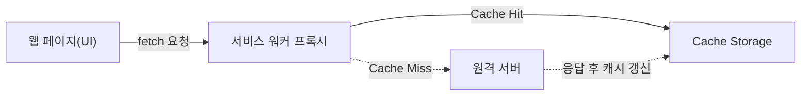

## 지식 로드맵 내 현재 위치

  소프트웨어공학
  웹 아키텍처·클라이언트 엔지니어링
  <strong>서비스 워커(Service Worker)</strong>

## 30초 인출

- 본질: 웹 브라우저의 메인 UI 스레드와 완전히 분리되어 백그라운드에서 동작하는 프로그래밍 가능한 네트워크 프록시 스크립트로, 오프라인 캐싱·백그라운드 동기화·푸시 알림을 제공하여 웹 애플리케이션의 신뢰성을 네이티브 앱 수준으로 끌어올리는 PWA(Progressive Web Apps) 핵심 기술
- 메커니즘: 서비스 워커 스크립트 브라우저 등록(Register) $\rightarrow$ 정적 리소스 사전 캐싱 및 설치(Install) $\rightarrow$ 구버전 캐시 정리 및 활성화(Activate) $\rightarrow$ 런타임 네트워크 요청 가로채기(Fetch Intercept) 및 캐시 반환
- 산출물: 서비스 워커 스크립트(`sw.js`) · 웹앱 매니페스트(`manifest.json`) · 캐시 전략 설정서(Workbox Config)

핵심 용어

- **Service Worker(서비스 워커)**: 브라우저가 백그라운드에서 실행하는 독립 스크립트로, 웹 페이지와 네트워크 사이의 중간자로서 요청을 가로채고 수정할 수 있는 이벤트 기반 워커
- **Cache Storage API**: 서비스 워커 스코프 내에서 네트워크 요청(Request)과 응답(Response) 객체 쌍을 영구적으로 저장하고 검색할 수 있는 비동기 스토리지
- **App Shell 모델**: 웹 애플리케이션의 핵심 UI 골격(HTML, CSS, 기본 자바스크립트)을 로컬에 미리 캐싱해 두고, 동적 데이터만 네트워크를 통해 주입받는 아키텍처 패턴
- **Workbox**: 구글에서 개발한 프로덕션급 서비스 워커 라이브러리로, 캐싱 전략·사전 캐싱·백그라운드 동기화를 선언적으로 구현할 수 있도록 표준화한 도구

---

## 1교시 예상문제 (10점)

> 서비스 워커(Service Worker)의 정의와 목적, 핵심 메커니즘을 설명하시오. (예상)

---

## 1교시 10점 답안

### 1. 정의·목적

- 정의: 웹 브라우저의 메인 UI 스레드와 완전히 분리되어 백그라운드에서 동작하는 프로그래밍 가능한 네트워크 프록시 스크립트로, 오프라인 캐싱·백그라운드 동기화·푸시 알림을 제공하여 웹 애플리케이션의 신뢰성을 네이티브 앱 수준으로 끌어올리는 PWA(Progressive Web Apps) 핵심 기술
- 목적: 브라우저와 서버 사이에서 오프라인 캐시와 백그라운드 기능을 제어한다.

### 2. 핵심 관계

- 제언: 캐시 버전과 갱신·폐기 절차를 명확히 하고 오프라인·업데이트 경로를 시험한다.
---

## 2~4교시 예상문제 (25점)

> 서비스 워커(Service Worker)의 개념과 목적을 설명하고, 핵심 메커니즘과 구성요소·절차, 적용 시 문제점과 대응 방안을 제시하시오. (25점, 예상)

---

## 2~4교시 25점 답안

### 1. 개요 및 필요성

### 전통적 웹 브라우저의 오프라인 취약점과 서비스 워커의 등장

전통적인 웹 애플리케이션은 네트워크 연결이 불안정하거나 끊기면 브라우저의 접속 오류 화면(공룡 화면)을 출력하며 즉각 동작을 멈춘다. 브라우저 내장 HTTP 캐시는 만료 기간(TTL) 기반으로만 수동 동작하므로 정밀한 오프라인 제어나 동적 데이터 캐싱이 불가능했다.

서비스 워커는 웹 페이지와 물리적 네트워크 사이에 위치하는 **"프로그래밍 가능한 네트워크 프록시"** 역할을 수행하여, 네트워크 단절 상황에서도 로컬 캐시를 반환해 웹 애플리케이션을 중단 없이 실행할 수 있도록 보장한다.

### 서비스 워커 vs 웹 워커 vs 웹소켓 비교

| 구분 | 서비스 워커 (Service Worker) | 웹 워커 (Web Worker) | 웹소켓 (WebSocket) |
|---|---|---|---|
| **동작 위치** | 브라우저 백그라운드 독립 스레드 | 브라우저 백그라운드 독립 스레드 | 브라우저 메인 스레드 연동 통신 계층 |
| **주요 목적** | **네트워크 프록시, 오프라인 캐시, 푸시 알림** | **고부하 CPU 연산(수학 연산, 암호화, 이미지 처리)** | **실시간 양방향 전이중(Full-Duplex) 데이터 통신** |
| **수명 주기** | 이벤트 기반 실행 후 유휴 시 자동 종료/재기동 | 메인 페이지와 수명을 함께함 (페이지 닫히면 종료) | 연결 수립(Handshake) 후 연결 유지 |
| **DOM 접근** | **불가 (postMessage 통신)** | **불가 (postMessage 통신)** | **불가 (콜백 함수를 통해 메인 스레드로 전달)** |
| **보안 요구** | **HTTPS 필수 (localhost 예외)** | 동일 출처 정책(SOP) 준수 | WSS(WebSocket Secure) 권장 |

### 2. 아키텍처 및 핵심 메커니즘

### 서비스 워커 프록시 및 생명주기 아키텍처

### 4대 런타임 캐싱 전략 (Caching Strategies)

| 캐싱 전략 | 핵심 판단 |
|---|---|
| **Cache First** | 캐시 적중 시 즉시 반환하고 부재 시에만 네트워크 호출 — 이미지·폰트·빌드된 CSS/JS 등 해시 불변 자산에 적용 |
| **Network First** | 네트워크 조회를 우선 시도하고 오류 시에만 캐시 반환 — 금융 계좌 잔액·실시간 주문 현황 등 최신성이 생명인 데이터에 적용 |
| **Stale-While-Revalidate** | 캐시된 오래된 데이터(Stale)를 0초 만에 렌더링하며 백그라운드 동기화 — 소셜 피드·뉴스 목록·사용자 프로필 화면에 적용 |
| **Network Only / Cache Only** | 결제 승인 등 캐싱이 절대 불가한 트랜잭션은 Network Only, 오프라인 전용 안내 페이지 등 고정 에셋은 Cache Only |

### 3. 실무 적용 및 고려사항

### 위험 대응 매트릭스

| 위험 | 대책 | 효과 |
|---|---|---|
| 프론트엔드 새 버전을 배포했으나 사용자가 브라우저를 재시작해도 구버전 JS/CSS가 고착 | `self.skipWaiting()`을 호출하여 대기(Waiting) 상태를 건너뛰고 활성화 단계에서 구버전 캐시 키 자동 삭제 | 신규 배포 코드의 클라이언트 즉시 반영 보장 |
| 서비스 워커가 네트워크 트래픽 전체를 가로챌 수 있어 스크립트 탈취 시 대규모 개인정보 유출 발생 | 개발 환경(`localhost`)을 제외한 전 운영 환경에 HTTPS 필수 적용 및 배포 스크립트 SRI(Subresource Integrity) 검증 | 중간자 공격(MitM) 및 악성 프록시 주입 차단 |
| 바닐라 자바스크립트로 캐시 로직을 직접 구현하다가 캐시 오염 및 메모리 누수 발생 | Google Workbox 라이브러리를 도입하여 정적 자산과 동적 라우팅 캐시 전략을 선언적으로 규격화 | 캐시 관리 코드 복잡도 70% 감소 및 안정성 확보 |

### 4. 기술사 답안 차별화 포인트

### 백그라운드 동기화(Background Sync API)를 통한 오프라인 트랜잭션 보장

사용자가 지하철 음영 지역이나 비행기 모드에서 게시글을 작성하거나 폼을 제출할 경우, 서비스 워커는 요청 데이터를 브라우저 **IndexedDB**에 안전하게 보관한다. 이후 브라우저가 다시 인터넷 연결을 감지하면 `sync` 이벤트를 트리거하여 백그라운드에서 자동으로 서버로 전송을 완료한다. 사용자가 앱을 닫더라도 브라우저 백그라운드에서 트랜잭션을 끝까지 완결시키는 메커니즘을 답안에 제시하면 높은 점수를 얻는다.

### 프로젝트 후구(Project Fugu)와 모바일 웹 생태계 혁신

구글이 주도하는 **Project Fugu(Capabilities Project)**와의 연계성을 강조한다. 서비스 워커를 기점으로 파일 시스템 접근(File System Access API), 블루투스 연동(Web Bluetooth), 로컬 알림(Push API) 등 과거 네이티브 앱의 전유물이었던 디바이스 기능들이 웹 표준으로 편입되고 있다. 서비스 워커는 단순한 캐시 계층을 넘어 **"웹이 네이티브 플랫폼을 대체하는 아키텍처 허브"**임을 결론부에서 강조한다.

### 5. 결론 및 종합 제언

### 학습자 통찰 메모 — 답안 밖

[핵심 통찰]
서비스 워커는 웹 브라우저를 '단순한 문서 뷰어'에서 **'오프라인에서도 동작하는 완전한 분산 런타임 플랫폼'**으로 변모시킨 웹 생태계 최대의 혁신이다. 네트워크 요청의 프록시 제어권이 브라우저 스크립트에 부여됨으로써, 웹은 네트워크 단절이라는 태생적 한계를 극복하고 네이티브 앱과 동등한 수준의 복원력과 속도를 획득했다.

나라면:
본 시험에서 서비스 워커가 출제되면, Register $\rightarrow$ Install $\rightarrow$ Activate의 3단계 생명주기와 4대 캐싱 전략을 표로 정리한 뒤 **(1) 지하철 음영 구간 트랜잭션을 보증하는 Background Sync API와 IndexedDB 결합, (2) 구버전 캐시 고착을 방어하는 `skipWaiting()`과 Workbox 자동화, (3) 웹의 경계를 허무는 Project Fugu 디바이스 API 융합**을 3단락에 명쾌하게 제시하겠다.

### 실전 답안용 기술사적 제언

- **판정 기준**: 모바일 웹 서비스의 로딩 지연 시간(LCP) 2.5초 초과 및 오프라인 네트워크 단절 시 서비스 중단 발생 시 도입
- **대응 방안**: Google Workbox를 기반으로 App Shell(Cache First)과 동적 피드(Stale-While-Revalidate) 복합 전략 구축
- **검증 체계**: 배포 파이프라인에 `self.skipWaiting()` 자동 주입 및 Lighthouse PWA 검사 항목 100점 달성 여부 검증
- **기대 효과**: 재방문자 로딩 시간 80% 단축(0ms 캐시 응답) 및 오프라인 환경에서도 핵심 비즈니스 연속성 완벽 보장

### 6. 참고 및 연계 학습

- [웹 성능 최적화 기법](./164_web_performance_optimization.md)
- [메시지 큐(Message Queue)](./140_message_queue.md)
- [CSS 스프라이트(Sprite) 기법](./158_sprite.md)
- [반응형 웹(Responsive Web)](./110_responsive_web.md)
---
