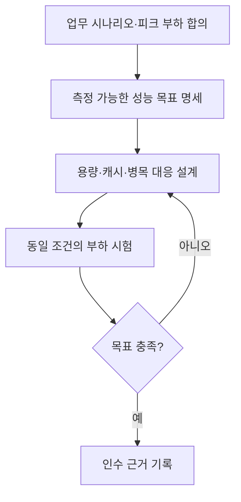

## 지식 로드맵 내 현재 위치

현재 위치: 소프트웨어 공학 → 요구공학·품질속성 → **성능 요구사항**

## 30초 인출

- 본질: **성능 요구사항** 은 정해진 이용량과 운영 조건에서 시스템이 보여야 할 속도·처리량·자원 사용 수준
- 메커니즘: 이용 상황과 부하 정의 → 측정 가능한 목표 설정 → 설계·부하 시험·인수에서 같은 조건으로 검증

핵심 용어

- **성능 요구사항(Performance Requirement)** : 특정 부하와 환경에서 시스템이 충족할 응답시간·처리량·자원 사용 목표를 정한 비기능 요구사항
- **품질 속성 시나리오(Quality Attribute Scenario)** : 자극원·자극·환경·대상·응답·응답측정으로 품질 요구를 검증 가능하게 쓰는 명세 방식
- **응답시간(Response Time)** : 요청 시작부터 시스템 응답을 받을 때까지 걸리는 시간
- **처리량(Throughput)** : 시스템이 단위 시간에 완료하는 작업 또는 요청의 수
- **p95** : 관측한 응답시간 중 95%가 이 값 이하에 드는 백분위 지표
- **부하 시험(Load Testing)** : 예상 이용량에서 응답시간·처리량·자원 사용을 측정하는 시험

---

## 1교시 예상문제 (10점)

> 성능 요구사항의 개념과 측정 가능한 명세 방법을 설명하시오. (예상·10점)

---

## 1교시 10점 답안

### Ⅰ. 개요

| 구분 | 핵심 |
|---|---|
| 정의 | **성능 요구사항** 은 특정 부하·환경에서 시스템이 충족할 응답시간·처리량·자원 사용 목표를 정한 비기능 요구사항 |
| 목적 | 설계·시험·인수에 공통으로 적용할 성능 기준과 서비스 이용 수준 확보 |

### Ⅱ. 성능 요구의 명세 요소

| 요소 | 답해야 할 질문 |
|---|---|
| 이용 조건 | 누가, 어떤 업무를, 어느 정도의 부하에서 수행하는가 |
| 측정 대상 | 어떤 API·화면·업무 흐름의 성능인가 |
| 응답·기준 | **응답시간** · **처리량** ·자원 사용의 목표와 측정 방법은 무엇인가 |

제언: 대표 업무의 피크 부하와 측정 조건을 먼저 합의한 뒤 같은 조건의 시험 결과로 인수 여부 판단

---

## 2~4교시 예상문제 (25점)

> 성능 요구사항의 개념과 명세 구조를 설명하고, 설계·검증에 연결하는 방법과 문제점·대응책을 제시하시오. (예상·25점)

---

## 2~4교시 25점 답안

## Ⅰ. 성능 요구사항 개요

| 구분 | 핵심 |
|---|---|
| 정의 | **성능 요구사항** 은 특정 부하·환경에서 시스템이 충족할 응답시간·처리량·자원 사용 목표를 정한 비기능 요구사항 |
| 목적 | 설계·시험·인수에 공통으로 적용할 성능 기준과 서비스 이용 수준 확보 |

## Ⅱ. 성능 요구의 명세 요소

| 요소 | 답해야 할 질문 |
|---|---|
| 이용 조건 | 누가, 어떤 업무를, 어느 정도의 부하에서 수행하는가 |
| 측정 대상 | 어떤 API·화면·업무 흐름의 성능인가 |
| 응답·기준 | **응답시간** · **처리량** ·자원 사용의 목표와 측정 방법은 무엇인가 |

SEI의 **품질 속성 시나리오** 는 자극원·자극·환경·대상·응답·응답측정의 여섯 요소로 조건과 판정 기준을 구체화하는 방법

## Ⅲ. 성능 목표와 부하 조건의 연결

| 측정 축 | 명세 예 | 함께 적을 조건 |
|---|---|---|
| 시간 | 핵심 조회의 **p95** 응답시간 | 정상·피크 부하, 측정 구간 |
| 용량 | 초당 완료 거래 수와 동시 이용자 수 | 업무 구성, 데이터량, 오류 허용 범위 |
| 자원 | CPU·메모리·DB 연결 사용량 | 시험 환경과 운영 환경의 차이 |

목표 수치는 사업의 업무량과 사용자 기대를 근거로 정하며, 모든 시스템에 같은 임계값을 적용하지 않는 방식

## Ⅳ. 설계·시험·인수 연계

설계 전술은 병목 원인에 맞춰 선택하는 수단이며, 특정 캐시·큐·자동 확장을 성능 요구사항 자체로 간주하지 않는 구분

## Ⅴ. 문제점·대응책

| 문제 | 대응 | 확인할 결과 |
|---|---|---|
| “빠른 응답” 같은 모호한 표현 | 업무·부하·백분위·측정 구간 명시 | 동일 조건의 재현 가능한 판정 |
| 평균만 기록해 느린 요청 누락 | 평균과 **p95** 등 분포를 함께 확인 | 지연 이용자 비율 파악 |
| 운영과 다른 소규모 시험 | 데이터량·업무 구성·동시성을 운영 조건에 맞춰 조정 | 병목과 용량 한계의 조기 발견 |

## Ⅵ. 기술사적 제언

| 문제 | 해결 방안 |
|---|---|
| 발주·개발·시험팀이 서로 다른 부하와 측정 기준으로 성능을 판정하는 경우 | 착수 시 대표 업무별 부하·측정 구간·허용 지연을 공동 승인하고, 같은 시나리오를 설계 검토와 인수 시험에 재사용 |

## 출제 이력과 검증 출처

- 공식 문제지 원문 확인 전까지 직접 기출로 단정하지 않음
- [SEI, 품질 속성 시나리오의 여섯 요소](https://sei.cmu.edu/documents/5462/2013_018_101_60977.pdf)
- [ISO/IEC 25010:2023 제품 품질 모델](https://www.iso.org/standard/78176.html)

## 연결 토픽

- 연관 토픽: [웹 성능 최적화](./164_web_performance_optimization.md), [성능 시험](./191_performance_test.md)
