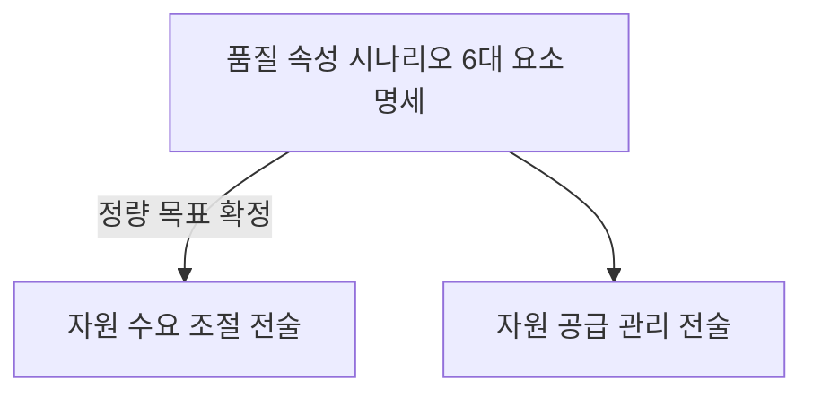

## 지식 로드맵 내 현재 위치

  소프트웨어공학
  요구공학·소프트웨어 아키텍처
  <strong>성능 요구사항(Performance Requirement)</strong>

## 30초 인출

- 본질: 제약된 컴퓨팅 자원(CPU, 메모리, 네트워크, 스토리지) 한계 내에서 시스템이 비즈니스 트랜잭션을 처리할 때 요구되는 시간 반응성(응답시간/지연시간), 처리 용량(TPS), 자원 활용률을 정량적으로 명세하여 전체 소프트웨어 아키텍처와 인프라 사이징을 결정짓는 핵심 아키텍처 드라이버(Architectural Driver)
- 메커니즘: 비즈니스 트래픽 프로파일링 $\rightarrow$ SEI 품질 속성 시나리오 6대 요소 명세 $\rightarrow$ 아키텍처 전술(자원 수요 조절·공급 관리) 설계 $\rightarrow$ 단계별 성능 부하 시험(Load/Stress Test) 및 SLA 적합성 검증
- 산출물: 성능 요구사항 명세서(SRS) · 품질 속성 시나리오 정의서 · 성능 테스트 결과서(BMT/부하 시험 성적서)

핵심 용어

- **Architectural Driver(아키텍처 드라이버)**: 시스템의 골격 구조, 통신 방식, 컴포넌트 분할 등 핵심 설계 결정을 강제하는 가장 영향력 있는 비기능적 요구사항
- **품질 속성 시나리오(Quality Attribute Scenario)**: SEI(Software Engineering Institute)에서 제안한 명세 방식으로, 자극원·자극·대상·환경·응답·응답측정 6가지 요소로 모호한 비기능 요구를 정량화하는 기법
- **ISO/IEC 25010 성능 효율성(Performance Efficiency)**: 명시된 조건에서 사용되는 자원의 양 대비 시스템의 성능 수준을 나타내는 품질 특성(시간 반응성, 자원 활용성, 용량)
- **SLA/SLO/SLI**: 서비스 수준 협약(SLA), 서비스 수준 목표(SLO), 서비스 수준 지표(SLI)로 구성되는 정량적 성능 거버넌스 체계

---

## 1교시 예상문제 (10점)

> 성능 요구사항(Performance Requirement)의 정의와 목적, 핵심 메커니즘을 설명하시오. (예상)

---

## 1교시 10점 답안

### 1. 정의·목적

- 정의: 제약된 컴퓨팅 자원(CPU, 메모리, 네트워크, 스토리지) 한계 내에서 시스템이 비즈니스 트랜잭션을 처리할 때 요구되는 시간 반응성(응답시간/지연시간), 처리 용량(TPS), 자원 활용률을 정량적으로 명세하여 전체 소프트웨어 아키텍처와 인프라 사이징을 결정짓는 핵심 아키텍처 드라이버(Architectural Driver)
- 목적: 응답시간·처리량·동시성 같은 성능 목표를 측정 가능한 요구사항으로 정한다.

### 2. 핵심 관계

- 제언: 핵심 사용자 시나리오에 목표와 측정 조건을 붙이고 부하 시험 결과로 충족 여부를 판정한다.
---

## 2~4교시 예상문제 (25점)

> 성능 요구사항(Performance Requirement)의 개념과 목적을 설명하고, 핵심 메커니즘과 구성요소·절차, 적용 시 문제점과 대응 방안을 제시하시오. (25점, 예상)

---

## 2~4교시 25점 답안

### 1. 개요 및 필요성

### 기능 중심 소프트웨어 개발의 함정과 성능의 아키텍처 지배력

과거 소프트웨어 프로젝트는 "기능이 요구사항 명세서대로 동작하는가"에만 집중하고 성능은 개발 완료 후 튜닝으로 해결하려는 경향이 강했다. 그러나 동시 접속자가 폭증하거나 대용량 데이터가 누적되면, 데이터베이스 락(Lock) 경합, 네트워크 I/O 병목, 메모리 고갈로 인해 시스템 전체가 마비되는 참사가 발생한다.

성능은 단순한 코드 튜닝이 아니라 **데이터베이스 분할(Sharding), 캐시 아키텍처, 비동기 메시징 구조, 오토스케일링 인프라 설계**를 결정짓는 핵심 아키텍처 동인이므로 요구공학 초기 단계에서 반드시 정량적으로 명세되어야 한다.

### 기능 vs 성능 vs 신뢰성 요구사항 비교

| 구분 | 기능 요구사항 (Functional) | 성능 요구사항 (Performance) | 신뢰성 요구사항 (Reliability) |
|---|---|---|---|
| **핵심 질문** | "시스템이 **무엇을** 수행하는가?" | "시스템이 **얼마나 빠르고 효율적으로** 처리하는가?" | "시스템이 **장애 없이 지속적으로** 가동되는가?" |
| **명세 대상** | 입력 데이터 처리, 비즈니스 규칙, 계산 로직 | 응답시간, 처리량(TPS), CPU/메모리 한계 | 가용성(99.99%), MTBF, MTTR, 무장애 운영 시간 |
| **측정 방식** | 참/거짓(Pass/Fail) 기능 검증 | 초(sec), TPS, % 등 정량적 수치 계측 | 가동률(%), 평균 복구 시간(분) 계측 |
| **아키텍처 영향** | 도메인 모델, 비즈니스 레이어 구조 | **분산 캐시, 비동기 파이프라인, 데이터 파티셔닝** | 이중화, 페일오버(Failover), 서킷 브레이커 |

### 2. 아키텍처 및 핵심 메커니즘

### SEI 품질 속성 시나리오와 아키텍처 전술(Tactics) 연계

시나리오 6대 요소는 모호한 비기능 요구를 정량적으로 객관화한다.

| 구성 요소 | 예시 명세 |
|---|---|
| 자극원 | 모바일 앱 사용자 |
| 자극 | 월말 피크 5,000 TPS 유입 |
| 대상 | 결제 및 주문 코어 API |
| 환경 | 클라우드 정상 운영 모드 |
| 응답 | 모든 트랜잭션 정상 완료 |
| 응답측정 | p95 0.5초 미만, CPU 70% 미만 |

- **자원 수요 조절 전술**: 인메모리 Redis 캐싱(DB 부하 차단), API Rate Limiting, 정적 CDN
- **자원 공급 관리 전술**: 비동기 메시지 큐(Kafka 버퍼), KEDA 기반 파드 오토스케일링, DB 읽기 분제(CQRS Read Replica)

### ISO/IEC 25010 성능 효율성 3대 하위 품질 특성

| 하위 특성 | 핵심 판단 |
|---|---|
| **시간 반응성(Time Behaviour)** | 응답시간(요청 전송 후 최종 결과 수신까지의 시간), 처리 시간(Turnaround Time), 지연 시간(Latency)을 최소화 |
| **자원 활용성(Resource Utilization)** | CPU 점유율·메모리·네트워크 대역폭·디스크 I/O를 피크 부하 시에도 임계치(예: 70~80%) 이내로 유지 |
| **용량(Capacity)** | 단위 시간당 처리량(Throughput, TPS), 동시 사용자 수, 최대 데이터베이스 저장 용량을 확보 |

### 3. 실무 적용 및 고려사항

### 위험 대응 매트릭스

| 위험 | 대책 | 효과 |
|---|---|---|
| 프로젝트 종료 직전 통합 부하 시험 시 DB 락 경합으로 인한 성능 미달이 발견되어 오픈 연기 | Shift-Left 성능 공학 적용: 스프린트 단위로 k6 부하 테스트 자동화 및 아키텍처 조기 검증 | 성능 병목 조기 식별 및 아키텍처 재작업 비용 90% 절감 |
| "시스템이 사용자에게 신속하게 반응해야 한다"와 같은 정성적 문구로 인한 인수·감리 분쟁 | SEI 품질 속성 시나리오 6대 요소를 적용하여 95th 백분위 응답시간 및 TPS 수치 명시 | 모호성 100% 제거 및 명확한 검수 기준선 확립 |
| 과도하게 높은 성능 목표치(예: 상시 10만 TPS) 설정으로 인프라 구독료 및 TCO 폭증 | CBAM(비용 편익 분석 기법)을 활용하여 비즈니스 가치와 인프라 비용 간 트레이드오프 분석 | 불필요한 과대 사이징 방지 및 인프라 예산 40% 절감 |

### 4. 기술사 답안 차별화 포인트

### 테일 레이턴시(Tail Latency, p99/p99.9)와 롱테일 관리

전통적인 평균 응답시간(Average Response Time)은 소수의 극단적인 지연(Tail Latency)을 완전히 은폐한다. 마이크로서비스 아키텍처에서는 한 사용자의 요청이 수십 개의 내부 서비스를 거치므로, 단 하나의 서비스에서 1%의 지연(p99)이 발생해도 전체 사용자 경험은 심각하게 붕괴된다. 기술사 답안에서는 **"평균치 대신 p95, p99, p99.9 백분위수 지표(Percentile)를 성능 요구사항의 표준 기준으로 설정해야 함"**을 강조한다.

### SRE(Site Reliability Engineering)의 에러 버짓(Error Budget) 연계

성능 요구사항은 고정된 정적 문서가 아니라 운영 단계의 SRE 거버넌스로 이어져야 한다. 성능 요구사항을 기반으로 **SLI(측정값)와 SLO(내부 목표)**를 정의하고, SLO를 위반할 경우 할당된 **에러 버짓(Error Budget)**이 소진되어 신규 기능 배포를 중단하고 성능 튜닝 스프린트를 강제하는 현대적 데브옵스 운영 체계를 결론으로 제시한다.

### 5. 결론 및 종합 제언

### 학습자 통찰 메모 — 답안 밖

[핵심 통찰]
성능 요구사항은 소프트웨어 개발이 다 끝난 뒤 부하를 걸어보는 '사후 시험 성적서'가 아니다. 시스템의 데이터 저장 방식, 분산 캐시 토폴로지, 비동기 큐 도입 여부를 결정짓는 **'최상위 아키텍처 드라이버(Architectural Driver)'**다. 정량적 시나리오가 초기에 수립되지 않으면 아키텍처는 반드시 침식된다.

나라면:
본 시험에서 성능 요구사항이 출제되면, SEI 품질 속성 시나리오의 6요소를 정확히 기술한 뒤 **(1) 평균값의 착시를 깨는 p95/p99 테일 레이턴시 관리, (2) 수요 조절(캐싱)과 공급 관리(오토스케일링) 아키텍처 전술 분기, (3) 성능 미달 시 기능 배포를 강제 중단시키는 SRE 에러 버짓(Error Budget) 거버넌스 파이프라인**을 3단락에 명쾌하게 제시하겠다.

### 실전 답안용 기술사적 제언

- **판정 기준**: 통합 부하 시험 시 피크 트래픽(동시 5,000 TPS)에서 p99 응답시간 1.0초 초과 시 배포 부적격 판정
- **대응 방안**: Redis 분산 캐시 계층 신설 및 슬로우 쿼리 튜닝, KEDA 기반 이벤트 주도형 오토스케일링 전술 적용
- **검증 체계**: CI/CD 배포 파이프라인에 k6 성능 게이트를 연동하고 프로덕션 APM과 연계된 SLO/SLI 모니터링 가동
- **기대 효과**: 대규모 트래픽 폭증 시 시스템 무중단 보장 및 명확한 정량적 성능 지표 기반 인수 분쟁 원천 방지

### 6. 참고 및 연계 학습

- [소프트웨어 품질 비용(Cost of Quality)](./150_software_quality_cost.md)
- [기능 점수(Function Point) 산정](./130_function_point.md)
- [서비스 워커 및 웹 성능 최적화](./147_service_worker.md)
- [웹 성능 최적화 기법](./164_web_performance_optimization.md)
---
