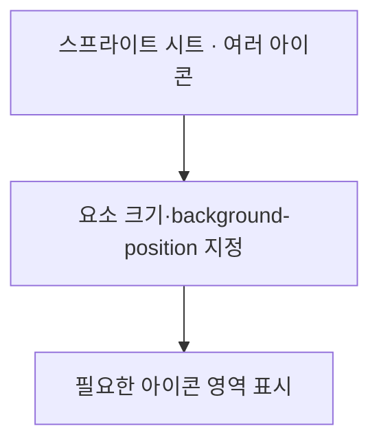
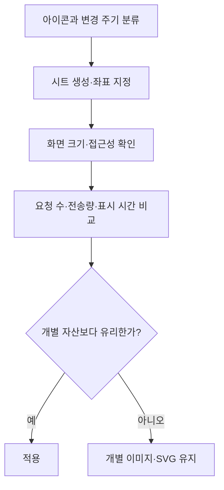

## 지식 로드맵 내 현재 위치

현재 위치: 소프트웨어 공학 → 웹 화면 자산·성능 → **스프라이트**

## 30초 인출

- 본질: 웹의 **이미지 스프라이트** 는 여러 작은 그림을 한 이미지에 모아 필요한 부분만 표시하는 기법
- 메커니즘: 이미지 시트 다운로드 → 요소의 크기·배경 위치 지정 → 해당 영역만 화면에 표시

핵심 용어

- **이미지 스프라이트(Image Sprite)** : 작은 그래픽을 하나의 이미지 시트에 모아 각 요소가 필요한 부분만 표시하는 방식
- **스프라이트 시트(Sprite Sheet)** : 여러 그래픽을 한 파일 안의 서로 다른 위치에 배치한 이미지
- **background-position** : CSS 배경 이미지의 표시 위치를 지정하는 속성
- **HTTP/2** : 한 연결에서 여러 요청·응답을 함께 처리하는 HTTP 버전
- **SVG 심볼(Symbol)** : SVG 그림을 재사용 가능한 단위로 정의하고 `use` 요소로 참조하는 방식

---

## 1교시 예상문제 (10점)

> CSS 이미지 스프라이트의 원리와 적용 시 유의점을 설명하시오. (예상·10점)

---

## 1교시 10점 답안

### Ⅰ. 개요

| 구분 | 핵심 |
|---|---|
| 정의 | **이미지 스프라이트** 는 여러 작은 그림을 한 시트에 모아 배경 위치로 필요한 영역만 표시하는 기법 |
| 목적 | 작은 이미지의 요청 수 감소와 공통 화면 자산의 일괄 관리 |

### Ⅱ. 표시 구조

### Ⅲ. 적용 판단

| 적합한 경우 | 확인할 점 |
|---|---|
| 함께 쓰고 변경 주기가 비슷한 작은 아이콘 | 시트 크기와 한 아이콘 변경 시 전체 캐시 갱신 |
| 반복 요청이 실제 병목인 화면 | **HTTP/2** 환경의 개별 이미지 요청과 성능 비교 |

제언: 요청 수만 보지 말고 시트의 크기·갱신 빈도·실제 로딩 시간을 함께 측정한 뒤 적용

---

## 2~4교시 예상문제 (25점)

> CSS 이미지 스프라이트의 구성과 표시 원리를 설명하고, 개별 이미지 및 SVG 심볼 방식과 비교하여 적용 기준과 문제점·대응책을 제시하시오. (예상·25점)

---

## 2~4교시 25점 답안

## Ⅰ. 스프라이트 개요

| 구분 | 핵심 |
|---|---|
| 정의 | **이미지 스프라이트** 는 여러 작은 그림을 한 시트에 모아 배경 위치로 필요한 영역만 표시하는 기법 |
| 목적 | 작은 이미지의 요청 수 감소와 공통 화면 자산의 일괄 관리 |

## Ⅱ. 시트와 화면 요소의 관계

시트 전체를 받아도 각 요소에는 지정한 크기의 영역만 보이는 구조

## Ⅲ. 구현 방식 비교

| 기준 | CSS 비트맵 스프라이트 | 개별 이미지 | **SVG 심볼** |
|---|---|---|---|
| 구성 | 여러 그림을 하나의 비트맵에 배치 | 그림마다 파일 분리 | 재사용할 벡터 그림을 심볼로 정의 |
| 표시 | 시트와 **background-position** | 파일별 이미지 주소 | `use` 요소의 심볼 참조 |
| 변경 | 일부 수정에도 시트 파일 갱신 | 해당 파일만 갱신 | 심볼 정의와 참조 방식에 따라 달라짐 |
| 선택 | 요청 수 감소의 이점이 큰 아이콘 묶음 | 독립 변경·캐시가 중요한 그림 | 크기·색상 조정이 필요한 단순 벡터 아이콘 |

## Ⅳ. 적용·검증 순서

요청 수의 감소만으로 성능 향상을 단정하지 않는 판단. MDN도 **HTTP/2** 에서는 작은 파일을 나눠 요청하는 편이 더 유리할 수 있음을 설명

## Ⅴ. 한계·대응책

| 한계 | 대응 | 판단 근거 |
|---|---|---|
| 작은 수정에도 큰 시트의 캐시 무효화 | 변경 주기가 다른 그림을 분리 | 재다운로드 크기·빈도 |
| 잘못된 좌표·크기로 아이콘 잘림 | 시트 생성과 좌표 매핑 자동화·화면 시험 | 해상도별 표시 결과 |
| 장식 이미지와 의미 있는 이미지의 혼동 | 대체 텍스트가 필요한 정보성 그림은 별도 요소로 제공 | 보조기술에서의 의미 전달 |

## Ⅵ. 기술사적 제언

| 한계 | 해결 방안 |
|---|---|
| 아이콘 요청 수만 줄이고 시트 갱신 비용을 확인하지 않아 실제 로딩 효과가 불분명한 경우 | 변경 주기가 비슷한 장식 아이콘만 묶어 시험하고, 개별 파일 방식과 전송량·캐시 적중·표시 시간을 같은 화면에서 비교 |

## 출제 이력과 검증 출처

- 공식 문제지 원문 확인 전까지 직접 기출로 단정하지 않음
- [MDN, CSS 이미지 스프라이트 구현과 HTTP/2 유의점](https://developer.mozilla.org/en-US/docs/Web/CSS/Guides/Images/Implementing_image_sprites)

## 연결 토픽

- 연관 토픽: [웹 성능 최적화](./164_web_performance_optimization.md), [반응형 웹](./110_responsive_web.md)
