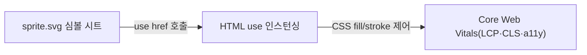

## 지식 로드맵 내 현재 위치

  소프트웨어공학
  웹 아키텍처·성능 엔지니어링
  <strong>스프라이트(Sprite)</strong>

## 30초 인출

- 본질: 웹 페이지 로딩 시 수십 개의 개별 아이콘, 버튼, 로고 이미지를 다운로드할 때 발생하는 TCP 연결 오버헤드와 왕복 지연(RTT)을 최소화하기 위해, 여러 장의 조각 이미지를 하나의 통합 시트(Sprite Sheet)로 병합한 후 CSS 배경 좌표(`background-position`)를 통해 필요한 영역만 선택적으로 렌더링하는 웹 프론트엔드 성능 최적화 기법
- 메커니즘: 개별 이미지 에셋 수집 $\rightarrow$ 빌드 도구를 통한 단일 스프라이트 시트 패킹 $\rightarrow$ CSS 좌표(X, Y 오프셋) 자동 매핑 $\rightarrow$ 브라우저 단일 HTTP 요청 다운로드 $\rightarrow$ CSS 뷰포트 슬라이싱 렌더링
- 산출물: 통합 스프라이트 시트(`sprite.png`/`sprite.svg`) · CSS 좌표 스타일시트(`sprite.css`) · 빌드 번들러 설정서(`webpack.config.js`)

핵심 용어

- **Sprite Sheet(스프라이트 시트)**: 다수의 작은 2차원 그래픽 및 UI 컴포넌트들을 격자 또는 여백 없이 하나의 큰 이미지 파일로 합쳐놓은 그래픽 맵
- **background-position**: CSS에서 배경 이미지의 표시 시작 위치를 X축과 Y축 음수(-) 오프셋 좌표로 지정하여 특정 영역만 노출시키는 속성
- **RTT(Round Trip Time)**: 패킷이 브라우저에서 서버로 전송되어 다시 브라우저로 응답이 도착하기까지 걸리는 네트워크 왕복 소요 시간
- **텍스처 아틀라스(Texture Atlas)**: 게임 엔진에서 드로우 콜(Draw Call)을 줄이기 위해 사용되던 컴퓨터 그래픽스 원천 기술로, 웹 CSS 스프라이트의 기원

---

## 1교시 예상문제 (10점)

> 스프라이트(Sprite)의 정의와 목적, 핵심 메커니즘을 설명하시오. (예상)

---

## 1교시 10점 답안

### 1. 정의·목적

- 정의: 웹 페이지 로딩 시 수십 개의 개별 아이콘, 버튼, 로고 이미지를 다운로드할 때 발생하는 TCP 연결 오버헤드와 왕복 지연(RTT)을 최소화하기 위해, 여러 장의 조각 이미지를 하나의 통합 시트(Sprite Sheet)로 병합한 후 CSS 배경 좌표(`background-position`)를 통해 필요한 영역만 선택적으로 렌더링하는 웹 프론트엔드 성능 최적화 기법
- 목적: 여러 작은 이미지를 한 파일로 묶고 위치를 지정해 반복 요청 오버헤드를 줄인다.

### 2. 핵심 관계

- 제언: 적용 전후 요청 수·전송량·렌더링 성능을 비교하고 화면 크기별 유지관리 비용도 고려한다.
---

## 2~4교시 예상문제 (25점)

> 스프라이트(Sprite)의 개념과 목적을 설명하고, 핵심 메커니즘과 구성요소·절차, 적용 시 문제점과 대응 방안을 제시하시오. (25점, 예상)

---

## 2~4교시 25점 답안

### 1. 개요 및 필요성

### HTTP 요청 폭증과 네트워크 병목

웹 페이지가 화려해질수록 수십 개의 작은 버튼, 아이콘, 뱃지 이미지가 추가된다. HTTP/1.1 환경에서는 브라우저가 동일 호스트당 동시에 유지할 수 있는 TCP 연결 수가 6개 내외로 제한되어 있어, 50개의 아이콘을 다운로드하려면 큐잉 지연(HoL 블로킹)과 빈번한 TCP 핸드셰이크 오버헤드가 발생한다.

스프라이트 기술은 수십 개의 HTTP 요청을 **단 1개의 요청으로 통합**함으로써, 네트워크 왕복 시간(RTT)을 대폭 단축시키고 웹 브라우저의 초기 화면 렌더링 속도를 극대화한다.

### CSS 스프라이트 vs SVG 스프라이트 vs 아이콘 폰트 비교

| 구분 | CSS 스프라이트 (비트맵) | SVG 스프라이트 (벡터) | 아이콘 폰트 (Font Awesome 등) |
|---|---|---|---|
| **기반 포맷** | PNG, WebP 비트맵 이미지 | XML 기반 SVG 벡터 심볼 | 웹 폰트 파일 (WOFF, WOFF2) |
| **요청 수** | **단 1회의 HTTP 요청** | **단 1회의 HTTP 요청 (또는 인라인)** | 단 1~2회의 웹 폰트 요청 |
| **해상도 독립성** | 고해상도(레티나)에서 픽셀 깨짐 발생 | **무한 확대해도 완벽한 선명도 유지** | 벡터 기반으로 선명도 유지 |
| **스타일 제어** | CSS 색상 변경 불가 (이미지 고정) | **CSS `fill`, `stroke`로 실시간 변경 가능** | CSS `color` 속성으로 단색 변경 가능 |
| **접근성(a11y)** | `title`, `alt` 제공 한계 | `<title>`, `<desc>` 태그 내장 지원 | 스크린 리더 오류 및 깜빡임(FOIT) 존재 |

### 2. 아키텍처 및 핵심 메커니즘

### 네트워크 워터폴 비교: 개별 이미지 vs 스프라이트 시트

| 구분 | 개별 이미지 다운로드 | 스프라이트 시트 |
|---|---|---|
| **HTTP 요청 수** | N회 — 동시 연결 한계(6개)로 순차 블로킹 | 단 1회 — 1회 전송 100% 수신 |
| **주요 지연 요인** | TCP/RTT 지연, 연결 큐 대기, 헤더 오버헤드, 회선 병목 | 없음 (영구 로컬 캐시 저장) |
| **렌더링 결과** | 총 지연시간 폭증 및 CLS 발생 | CSS `background-position` 슬라이싱으로 0ms 지연 없는 즉각 출력 |

결과적으로 RTT 90% 단축과 FCP(First Contentful Paint) 극대화를 얻는다.

### 모던 SVG 심볼 스프라이트(`<use>`) 및 Core Web Vitals 최적화

### HTTP 프로토콜 진화에 따른 스프라이트의 기술적 위상

| 프로토콜 환경 | 핵심 판단 |
|---|---|
| **HTTP/1.1** | 필수 최적화: 도메인당 6개 동시 연결 제약·회선 병목(HoL)을 회피하고, 적용만으로 로딩 시간 50% 이상 단축 |
| **HTTP/2·HTTP/3** | 선택적 최적화: 단일 TCP/QUIC 연결 멀티플렉싱으로 다중 요청 오버헤드가 완화되지만, 슬로우 스타트 극복·HPACK 헤더 압축 측면에서 여전히 유효 |

### 3. 실무 적용 및 고려사항

### 위험 대응 매트릭스

| 위험 | 대책 | 효과 |
|---|---|---|
| 아이콘 1개만 디자인이 수정되어도 전체 스프라이트 시트가 갱신되어 클라이언트 캐시 전체가 무효화 | 변경 빈도가 높은 프로모션 배너와 영구적인 시스템 UI 아이콘을 별도 시트로 분리 운영 | 브라우저 캐시 적중률(Hit Ratio) 90% 이상 유지 |
| 개발자가 포토샵으로 좌표를 일일이 측정하고 CSS를 수작업 수정하다가 픽셀 오차 및 생산성 저하 | 빌드 도구(webpack-spritesmith, Vite 플러그인)를 통해 이미지 자동 패킹 및 CSS 자동 생성 | 좌표 수작업 관리 공수 100% 제거 |
| 스마트폰 레티나 고밀도 디스플레이에서 비트맵 이미지가 흐리게 번지는 품질 결함 발생 | SVG 심볼 스프라이트(`<svg><use href="#icon"/></svg>`)로 전면 전환 | 모든 해상도에서 무손실 벡터 품질 및 다크모드 색상 지원 |

### 4. 기술사 답안 차별화 포인트

### 모던 웹의 표준: SVG 심볼 스프라이트(`<use>` 태그)

비트맵 스프라이트의 치명적 한계(해상도 종속성, 색상 변경 불가, 캐시 무효화 범위)를 극복하기 위해 최신 웹 표준에서는 **SVG 스프라이트**를 채택한다. 각 아이콘을 `<symbol id="icon-name">` 형태로 하나의 SVG 파일에 정의하고, HTML에서는 `<svg><use href="/sprite.svg#icon-name"/></svg>`로 호출한다. 이 방식은 완벽한 벡터 그래픽을 유지하면서도 CSS `currentColor`를 통해 다크 모드에 즉각 반응할 수 있는 모던 프론트엔드 아키텍처의 정수이다.

### Core Web Vitals(LCP, CLS) 지표와의 정량적 연계

구글의 검색 순위 알고리즘인 **Core Web Vitals**와 연계하여 서술한다. 스프라이트 시트는 개별 이미지의 네트워크 지연으로 인해 레이아웃이 덜컥거리는 현상인 **CLS(Cumulative Layout Shift)**를 0으로 억제하며, 브라우저가 화면의 주요 콘텐츠를 빠르게 그리는 **LCP(Largest Contentful Paint)** 시간을 단축시킨다. 실무적 웹 성능 지표를 결론에 제시하면 답안의 완성도가 극대화된다.

### 5. 결론 및 종합 제언

### 학습자 통찰 메모 — 답안 밖

[핵심 통찰]
스프라이트는 과거 게임 엔진의 '텍스처 아틀라스'에서 유래하여 HTTP/1.1의 회선 병목을 극복한 고전 최적화 기법이다. 그러나 현대 모바일 웹 환경에서도 **"SVG 심볼 스프라이트(`<use>`)"**의 형태로 진화하여, 해상도 독립성과 다크 모드 대응, 그리고 구글 Core Web Vitals(LCP/CLS)를 사수하는 핵심 프론트엔드 엔지니어링 표준으로 확고히 자리 잡고 있다.

나라면:
본 시험에서 스프라이트 관련 문제가 출제되면, 전통적인 비트맵 `background-position` 방식에 머무르지 않고 **(1) HTTP/2 멀티플렉싱 환경에서도 여전히 유효한 핸드셰이크 절감 효과, (2) 모던 웹의 표준인 SVG 심볼 스프라이트(`<symbol>` + `<use>`) 아키텍처, (3) LCP 단축 및 레이아웃 이동(CLS) 0을 달성하는 Core Web Vitals 지표 연계**를 3단락에 명쾌하게 제시하겠다.

### 실전 답안용 기술사적 제언

- **판정 기준**: 프론트엔드 아이콘 요청 수가 20건 이상이며 모바일 초기 접속 시 CLS 지표가 0.1 초과할 때 도입 판정
- **대응 방안**: Vite/Webpack 빌드 파이프라인에서 SVG 심볼 스프라이트를 자동 생성하고 HTML `<use>` 태그로 표준화
- **검증 체계**: Lighthouse CI를 통해 LCP 1.5초 이내, CLS 0 달성 및 Retina 디스플레이 렌더링 무결성 검증
- **기대 효과**: 정적 에셋 HTTP 요청 수 90% 이상 단축 및 네트워크 대역폭 절감, 웹 접근성(a11y) 완벽 보장

### 6. 참고 및 연계 학습

- [웹 성능 최적화 기법](./164_web_performance_optimization.md)
- [서비스 워커(Service Worker)](./147_service_worker.md)
- [성능 요구사항(Performance Requirement)](./149_performance_requirement.md)
- [반응형 웹(Responsive Web)](./110_responsive_web.md)
---
