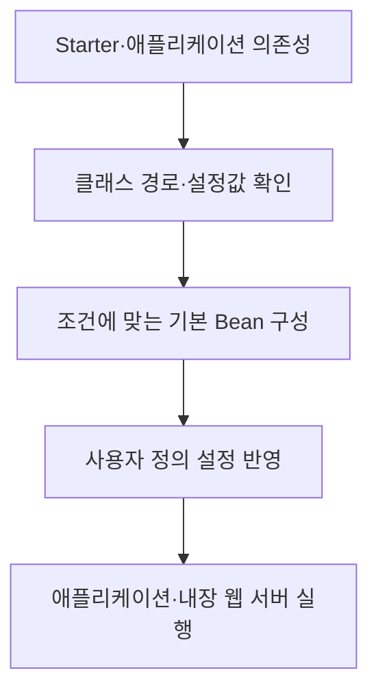

## 지식 로드맵 내 현재 위치

현재 위치: 소프트웨어 공학 → 애플리케이션 프레임워크 → **스프링 부트**

## 30초 인출

- 본질: **스프링 부트** 는 스프링 애플리케이션의 의존성·설정·실행을 간편하게 구성하는 도구
- 메커니즘: Starter 의존성 선택 → 환경에 맞는 조건부 자동 설정 → 내장 서버와 애플리케이션 실행

핵심 용어

- **Spring Boot(스프링 부트)** : 스프링 애플리케이션의 의존성 관리·자동 설정·독립 실행을 지원하는 프레임워크
- **Starter** : 특정 기능에 필요한 의존성을 함께 제공하는 Spring Boot 의존성 묶음
- **Auto-configuration(자동 설정)** : 클래스 경로·설정값·사용자 정의 구성에 따라 필요한 Bean을 조건부로 등록하는 기능
- **내장 웹 서버(Embedded Web Server)** : 애플리케이션과 함께 실행되는 웹 서버 구성
- **Actuator** : 애플리케이션의 상태·측정값 등 운영 정보를 확인하는 Spring Boot 기능

---

## 1교시 예상문제 (10점)

> Spring Boot의 핵심 구성과 자동 설정의 작동 원리를 설명하시오. (예상·10점)

---

## 1교시 10점 답안

### Ⅰ. 개요

| 구분 | 핵심 |
|---|---|
| 정의 | **Spring Boot** 는 스프링 애플리케이션의 의존성·설정·실행을 간편하게 구성하는 프레임워크 |
| 목적 | 반복 설정의 감소와 애플리케이션 실행·배포 준비의 단순화 |

### Ⅱ. 핵심 구성

| 구성 | 역할 |
|---|---|
| **Starter** | 웹·데이터 등 필요한 라이브러리 묶음 선택 |
| **Auto-configuration** | 라이브러리·설정 조건에 맞는 기본 Bean 등록 |
| **내장 웹 서버** | 별도 서버 설치 없이 웹 애플리케이션 실행 |

제언: 자동 설정의 실제 적용 조건을 확인하고 필요한 부분만 명시적으로 변경

---

## 2~4교시 예상문제 (25점)

> Spring Boot의 구성과 자동 설정 메커니즘을 설명하고, 운영 기능 및 적용 시 문제점·대응책을 제시하시오. (예상·25점)

---

## 2~4교시 25점 답안

## Ⅰ. Spring Boot 개요

| 구분 | 핵심 |
|---|---|
| 정의 | **Spring Boot** 는 스프링 애플리케이션의 의존성·설정·실행을 간편하게 구성하는 프레임워크 |
| 목적 | 반복 설정의 감소와 애플리케이션 실행·배포 준비의 단순화 |

## Ⅱ. 핵심 구성

| 구성 | 역할 |
|---|---|
| **Starter** | 웹·데이터 등 필요한 라이브러리 묶음 선택 |
| **Auto-configuration** | 라이브러리·설정 조건에 맞는 기본 Bean 등록 |
| **내장 웹 서버** | 별도 서버 설치 없이 웹 애플리케이션 실행 |

## Ⅲ. 자동 설정과 실행 흐름

조건에 맞지 않거나 사용자가 직접 정의한 구성에는 기본 자동 설정이 적용되지 않을 수 있는 구조

## Ⅳ. 운영 기능과 노출 통제

| 운영 요소 | 제공 정보 | 확인할 점 |
|---|---|---|
| **Actuator** 상태 | 애플리케이션 상태·준비 여부 | 상태 점검의 대상과 의미 |
| 측정값 | 요청·JVM 등 운영 지표 | 필요한 메트릭과 수집 범위 |
| 관리 엔드포인트 | 운영 조회·관리 기능 | 인증·접근 경로·민감 정보 노출 |

**Actuator** 는 별도 의존성을 추가해 사용하는 기능이며, 모든 관리 정보를 기본으로 외부에 공개한다는 뜻은 아닌 구분

## Ⅴ. 문제점·대응책

| 문제 | 대응 | 확인할 결과 |
|---|---|---|
| 자동 설정 결과를 모르고 기능 충돌 | 조건 평가 내용과 적용 Bean 확인 | 의도한 구성의 실제 적용 |
| 의존성·설정 판본 불일치 | 프로젝트에 맞는 의존성 관리와 업그레이드 시험 | 기동·기능 호환성 |
| 관리 엔드포인트의 과다 노출 | 필요한 항목만 공개하고 접근 권한 제한 | 운영 정보의 보호 |

## Ⅵ. 기술사적 제언

| 문제 | 해결 방안 |
|---|---|
| 자동 설정을 믿고 운영에 배포했으나 실제 Bean과 관리 엔드포인트 구성이 의도와 다른 경우 | 배포 전 설정 결과와 노출 엔드포인트를 확인하는 점검표를 만들고, 환경별 차이를 기동 시험으로 검증 |

## 출제 이력과 검증 출처

- 공식 문제지 원문 확인 전까지 직접 기출로 단정하지 않음
- [Spring Boot, Starter와 의존성 관리](https://docs.spring.io/spring-boot/reference/using/build-systems.html)
- [Spring Boot, 내장 웹 서버](https://docs.spring.io/spring-boot/how-to/webserver.html)
- [Spring Boot, Actuator 엔드포인트](https://docs.spring.io/spring-boot/reference/actuator/endpoints.html)

## 연결 토픽

- 연관 토픽: [SOA](./187_soa.md), [CI/CD](./095_ci_cd.md)
