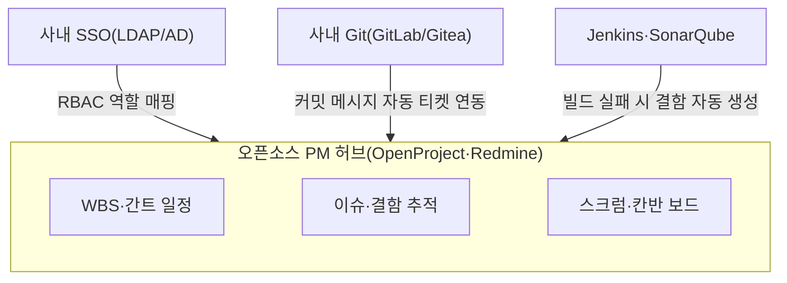

## 지식 로드맵 내 현재 위치

  소프트웨어공학
  프로젝트 관리·협업 플랫폼
  <strong>오픈소스 프로젝트관리 소프트웨어(Open Source PM Software)</strong>

## 30초 인출

- 본질: 상용 클라우드 SaaS 도구(Jira, Asana 등)의 가파른 구독료 인상과 망분리 환경의 데이터 외부 유출 위험을 극복하기 위해, 프라이빗 온프레미스 인프라에 직접 배포하여 WBS 일정 관리, 결함 추적, Git 형상 관리 및 CI/CD 파이프라인을 자유롭게 연동·커스터마이징하는 오픈소스 협업 엔지니어링 플랫폼
- 메커니즘: 사내 컨테이너 환경 자체 호스팅 $\rightarrow$ 사내 SSO(LDAP/AD) 및 RBAC 권한 연동 $\rightarrow$ 프로젝트 WBS 및 애자일 칸반 보드 템플릿 구성 $\rightarrow$ Git 커밋 웹훅 연동을 통한 이슈 자동 종결 $\rightarrow$ 실시간 진척/품질 지표 가시화
- 산출물: 사내 PM 포털 인스턴스 · 권한 및 워크플로우 명세서 · Git-이슈 자동 연동 훅 스크립트 · 진척·결함 대시보드

핵심 용어

- **데이터 주권(Data Sovereignty)**: 기업 및 국가의 핵심 지적 자산(기획서, 소스코드, 결함 정보)이 해외 퍼블릭 클라우드에 종속되지 않고 자체 관할 인프라 내에 온전히 통제되어야 한다는 원칙
- **Redmine**: Ruby on Rails 기반의 대표적 오픈소스 이슈 추적 및 프로젝트 관리 소프트웨어로, 강력한 RBAC와 수천 개의 커뮤니티 플러그인을 제공하는 표준 도구
- **OpenProject**: 직관적인 모던 웹 UI를 제공하며 타임라인(Gantt), WBS, 스크럼/칸반, 문서 관리를 단일 패키지로 제공하는 엔터프라이즈급 오픈소스 PM 도구
- **통합 ALM(Application Lifecycle Management)**: 요구사항 관리, 소스 형상 관리, 빌드/배포, 결함 추적의 전 생명주기를 단일 도구 체인으로 일원화하는 체계

---

## 1교시 예상문제 (10점)

> 오픈소스 프로젝트관리 소프트웨어(Open Source PM Software)의 정의와 목적, 핵심 메커니즘을 설명하시오. (예상)
---

## 1교시 10점 답안

### 1. 정의·목적

- 정의: 상용 클라우드 SaaS 도구(Jira, Asana 등)의 가파른 구독료 인상과 망분리 환경의 데이터 외부 유출 위험을 극복하기 위해, 프라이빗 온프레미스 인프라에 직접 배포하여 WBS 일정 관리, 결함 추적, Git 형상 관리 및 CI/CD 파이프라인을 자유롭게 연동·커스터마이징하는 오픈소스 협업 엔지니어링 플랫폼
- 목적: 해당 토픽의 주요 문제를 해결하고 필요한 기능을 제공한다.

### 2. 핵심 관계

- 제언: 핵심 작동 원리를 적용해 직접 효과를 검증한다.
---

## 2~4교시 예상문제 (25점)

> 오픈소스 프로젝트관리 소프트웨어(Open Source PM Software)의 개념과 목적을 설명하고, 핵심 메커니즘과 구성요소·절차, 적용 시 문제점과 대응 방안을 제시하시오. (25점, 예상)
---

## 2~4교시 25점 답안

### 1. 개요 및 필요성

### 상용 클라우드 SaaS 도구의 한계와 자체 호스팅의 필연성

Jira, Asana, Monday.com 등 클라우드 SaaS 기반 상용 PM 도구는 뛰어난 사용성을 제공하지만, 사용자 수 증가에 따른 라이선스 구독료가 기하급수적으로 폭증한다. 특히 국방, 공공, 금융, 핵심 R&D 조직의 경우 **망분리(망격리) 법적 규제**로 인해 외부 퍼블릭 클라우드 접속이 원천 차단되어 있으며, 소스코드와 결함 정보의 해외 유출 우려(데이터 주권 침해)가 심각하다.

오픈소스 프로젝트 관리 소프트웨어는 사내 프라이빗 서버에 자체 호스팅(Self-Hosted)함으로써 비용을 절감하고, 최고 수준의 내부 보안 통제권과 조직 맞춤형 커스터마이징 자유도를 제공한다.

### 상용 SaaS PM 도구 vs 오픈소스 PM 소프트웨어 비교

| 구분 | 상용 SaaS PM 도구 (Jira Cloud 등) | 오픈소스 PM 소프트웨어 (Redmine, OpenProject) |
|---|---|---|
| **설치 환경** | 벤더사 관리 퍼블릭 멀티테넌트 클라우드 | **사내 온프레미스 서버 / 프라이빗 클라우드** |
| **비용 구조** | 사용자당 월/연 단위 구독료 (TCO 지속 증가) | **라이선스 비용 무료 (서버 인프라 및 운영 공수만 발생)** |
| **데이터 통제권** | 벤더사 정책 및 해외 리전에 종속 | **완벽한 데이터 주권 및 폐쇄망 내부 데이터 통제권 확보** |
| **망분리 지원** | **인터넷 연결 필수 (폐쇄망 도입 불가)** | **완전 격리된 에어갭(Air-Gapped) 폐쇄망 100% 지원** |
| **확장성/수정** | 벤더 제공 마켓플레이스 API 제약 | **소스코드 직접 수정 및 커스텀 플러그인 무한 확장** |

### 2. 아키텍처 및 핵심 메커니즘

### 폐쇄망 오픈소스 PM 및 통합 ALM 아키텍처

### 가치 흐름(Value Stream) 자동화 파이프라인

### 대표 오픈소스 PM 소프트웨어 비교

| 소프트웨어 | 핵심 판단 |
|---|---|
| **Redmine** | 안정성·생태계: Ruby on Rails 기반으로 커뮤니티 플러그인이 가장 풍부하고, 검증된 안정성과 정밀한 RBAC 역할 권한 제어 제공 |
| **OpenProject** | 모던 엔터프라이즈: 타임라인·간트 차트·WBS·애자일 보드 기본 내장, Jira를 대체할 수 있는 세련된 모던 반응형 UI 제공 |
| **Taiga** | 순수 애자일: 스크럼·칸반 방법론에 완벽히 특화, UI/UX가 미려하여 디자이너·프론트엔드 개발팀 선호도 우수 |
| **GitLab Community Edition** | 올인원 ALM: Git 저장소·이슈 트래커·칸반 보드·CI/CD를 단일 화면에 통합하여 도구 파편화를 해소하는 표준 환경 |

### 3. 실무 적용 및 고려사항

### 위험 대응 매트릭스

| 위험 | 대책 | 효과 |
|---|---|---|
| Redmine 버전 업그레이드 시 비표준 루비 플러그인 충돌로 사내 포털 접속 불가 장애 발생 | Docker 컨테이너 기반 표준 이미지로 패키징하고 플러그인 의존성을 사전 스테이징 테스트 환경에서 검증 | 무중단 업그레이드 및 런타임 안정성 보장 |
| 투박한 레거시 웹 UI로 인해 실무 개발자들이 이슈 등록을 기피하고 개인 엑셀로 회귀 | 소스코드 관리, 이슈 트래커, CI/CD가 단일 뷰로 결합된 GitLab CE 올인원 플랫폼 전환 | 개발자의 자발적 이슈 연동률 95% 달성 |
| 오픈소스 자체 취약점(CVE) 미패치로 인한 내부 폐쇄망 횡적 침해 사고 발생 | 컨테이너 이미지 보안 스캐너(Trivy, Grype)를 도입하여 주기적 정기 보안 패치 파이프라인 자동화 | 알려진 오픈소스 보안 취약점 100% 조기 조치 |

### 4. 기술사 답안 차별화 포인트

### 단순 도구 도입을 넘어선 '통합 ALM 및 가치 흐름(Value Stream)' 완성

오픈소스 PM 도구를 단순히 "이슈 게시판"으로 도입하면 실패한다. 요구사항 명세 $\rightarrow$ WBS 일정 할당 $\rightarrow$ Git 브랜치 생성 $\rightarrow$ Pull Request 코드 리뷰 $\rightarrow$ CI 자동 테스트 $\rightarrow$ 결함 자동 종결로 이어지는 **"통합 ALM 가치 흐름(Value Stream Management)"**을 구축해야 한다. 도구 간 웹훅(Webhook)과 REST API 연동 체계를 답안의 2단락에 구체적으로 도식화하면 높은 실무 전문성을 입증할 수 있다.

### 망분리 환경의 소프트웨어 공급망 보안(SBOM) 거버넌스 연계

국가 안보 및 금융 보안 가이드라인에 따라 폐쇄망 내부로 유입되는 모든 오픈소스 도구와 라이브러리는 **SBOM(Software Bill of Materials)** 기반으로 무결성을 검증받아야 한다. 오픈소스 PM 도구 내에 사내 소스코드 보안 검사(SonarQube)와 의존성 정적 점검(Dependency-Check) 결과를 자동으로 결함 티켓으로 생성하는 **데브섹옵스(DevSecOps) 거버넌스 결합**을 결론으로 제언한다.

### 5. 결론 및 종합 제언

### 학습자 통찰 메모 — 답안 밖

[핵심 통찰]
오픈소스 프로젝트 관리 도구는 단순히 '상용 라이선스 비용을 아끼기 위한 대체재'가 아니다. 국가 안보, 금융, 국방 등 에어갭(Air-Gapped) 망분리 환경에서 **'데이터 주권을 지키고 소프트웨어 가치 흐름(Value Stream) 전체를 기업의 입맛대로 통제하기 위한 전략적 무기'**다. Git 형상 및 CI/CD와 결합될 때 최고의 엔지니어링 시너지를 발휘한다.

나라면:
본 시험에서 오픈소스 PM 도구가 출제되면, Redmine이나 OpenProject의 기능 나열에 그치지 않고 **(1) 망분리 규제 환경에서의 데이터 주권 및 사내 LDAP/AD 연동 아키텍처, (2) 커밋 해시부터 이슈 종결까지 이어지는 통합 ALM 가치 흐름 자동화, (3) 폐쇄망 소프트웨어 공급망 보안을 위한 SBOM 및 Trivy 컨테이너 취약점 거버넌스**를 3단락에 명쾌하게 제시하겠다.

### 실전 답안용 기술사적 제언

- **판정 기준**: 망분리 규제 기관에서 해외 클라우드 SaaS 사용 불가 및 상용 도구 구독료 부담률 40% 이상 급증 시 도입
- **대응 방안**: Docker/K8s 기반 OpenProject 또는 GitLab CE 프라이빗 배포 및 사내 LDAP 연동 RBAC 구축
- **검증 체계**: Git 커밋 웹훅 기반 티켓 자동 종결 및 SonarQube 정적 진단 연계 데브섹옵스 파이프라인 가동
- **기대 효과**: 데이터 외부 유출 위험 100% 원천 차단 및 연간 소프트웨어 라이선스 비용 수억 원 절감

### 6. 참고 및 연계 학습

- [애플리케이션 수명주기 관리(ALM)](./107_alm.md)
- [스크럼(Scrum) 및 칸반(Kanban)](./025_scrum.md)
- [CI/CD 파이프라인 엔지니어링](./095_ci_cd.md)
- [오픈소스 라이선스 검증 체계](./018_open_source_license.md)
---
