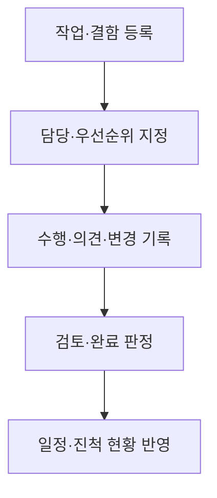

## 지식 로드맵 내 현재 위치

현재 위치: 소프트웨어 공학 → 프로젝트 협업·도구 → **오픈소스 프로젝트관리 소프트웨어**

## 30초 인출

- 본질: **오픈소스 프로젝트관리 소프트웨어** 는 공개된 소스코드를 바탕으로 일정·작업·이슈를 함께 관리하는 도구
- 메커니즘: 프로젝트와 역할 설정 → 작업·결함 등록 → 담당·상태·기한 추적 → 변경·진척 공유

핵심 용어

- **오픈소스 프로젝트관리 소프트웨어(Open Source PM Software)** : 소스코드를 확인·수정·배포할 수 있는 라이선스 아래 제공되는 프로젝트 작업·이슈 관리 도구
- **이슈 추적(Issue Tracking)** : 작업·결함·요청을 식별자로 등록하고 상태·담당자·처리 이력을 관리하는 기능
- **워크플로(Workflow)** : 이슈가 등록에서 완료까지 이동하는 상태와 전환 조건
- **RBAC(Role-Based Access Control)** : 사용자의 역할에 따라 프로젝트와 작업의 접근 권한을 부여하는 방식
- **자가 호스팅(Self-hosting)** : 조직이 자체 인프라에 소프트웨어를 설치·운영하는 방식
- **ALM(Application Lifecycle Management)** : 요구·개발·시험·배포 등 애플리케이션 생명주기의 활동과 정보를 연결해 관리하는 체계

---

## 1교시 예상문제 (10점)

> 오픈소스 프로젝트관리 소프트웨어의 주요 기능과 도입 시 확인할 사항을 설명하시오. (예상·10점)

---

## 1교시 10점 답안

### Ⅰ. 개요

| 구분 | 핵심 |
|---|---|
| 정의 | **오픈소스 프로젝트관리 소프트웨어** 는 공개 소스코드를 바탕으로 작업·일정·이슈의 협업과 추적을 지원하는 도구 |
| 목적 | 작업 책임과 진행 상태의 공유, 변경·결함 처리 이력의 확보 |

### Ⅱ. 핵심 기능

| 기능 | 관리 대상 |
|---|---|
| 작업·일정 | 작업 범위·담당·기한·진척 |
| **이슈 추적** | 결함·변경 요청의 상태와 처리 이력 |
| 권한·협업 | 역할별 접근, 의견·문서 공유 |

제언: 기능 목록보다 조직의 작업 흐름·권한·자료 이전 요구에 맞춰 도입 시험

---

## 2~4교시 예상문제 (25점)

> 오픈소스 프로젝트관리 소프트웨어의 구성과 운영 방식을 설명하고, 도입 판단 기준과 문제점·대응책을 제시하시오. (예상·25점)

---

## 2~4교시 25점 답안

## Ⅰ. 오픈소스 프로젝트관리 소프트웨어 개요

| 구분 | 핵심 |
|---|---|
| 정의 | **오픈소스 프로젝트관리 소프트웨어** 는 공개 소스코드를 바탕으로 작업·일정·이슈의 협업과 추적을 지원하는 도구 |
| 목적 | 작업 책임과 진행 상태의 공유, 변경·결함 처리 이력의 확보 |

## Ⅱ. 핵심 기능

| 기능 | 관리 대상 |
|---|---|
| 작업·일정 | 작업 범위·담당·기한·진척 |
| **이슈 추적** | 결함·변경 요청의 상태와 처리 이력 |
| 권한·협업 | 역할별 접근, 의견·문서 공유 |

Redmine은 역할별 권한·이슈 상태·간트 등을, OpenProject는 작업 패키지의 상태·담당·일정 등을 제공하는 사례

## Ⅲ. 작업 처리와 협업 흐름

저장소·빌드·시험 도구와의 연계는 조직의 **ALM** 범위에 따라 선택하는 확장 기능

## Ⅳ. 도입·운영 선택 기준

| 판단 축 | 확인 사항 |
|---|---|
| 배치 | **자가 호스팅** 가능 여부, 조직의 운영 인력·백업 책임 |
| 업무 적합성 | 작업 유형· **워크플로** ·보고 방식의 구성 가능 범위 |
| 접근 | 프로젝트별 **RBAC** 와 외부 협력자 권한 |
| 지속 운영 | 보안 업데이트, 플러그인 호환성, 데이터 반출·이전 방식 |

오픈소스 라이선스만으로 운영비가 없어지거나 보안이 자동 확보되는 것은 아닌 구분

## Ⅴ. 한계·대응책

| 한계 | 대응 | 확인할 결과 |
|---|---|---|
| 사용자별 작업 방식이 달라 기록 누락 | 필수 이슈 유형·상태·완료 기준 합의 | 일관된 진행 현황 |
| 자체 운영의 패치·백업 부담 | 운영 책임자와 복구 절차 지정 | 업데이트·복구 가능성 |
| 플러그인과 외부 도구 연계 오류 | 지원 판본·연동 범위 시험 | 이슈·코드 기록의 연결 무결성 |

## Ⅵ. 기술사적 제언

| 한계 | 해결 방안 |
|---|---|
| 도구를 설치했지만 팀마다 이슈 상태와 완료 의미가 달라 진척을 비교하기 어려운 경우 | 도입 전에 공통 이슈 유형·전환 조건·완료 기준을 정하고 한 팀에서 시험한 뒤 프로젝트별 확장 |

## 출제 이력과 검증 출처

- 공식 문제지 원문 확인 전까지 직접 기출로 단정하지 않음
- [Redmine, 주요 기능](https://www.redmine.org/projects/redmine/wiki/features)
- [OpenProject, Community Edition](https://www.openproject.org/community-edition/)
- [OpenProject, 작업 패키지](https://www.openproject.org/docs/user-guide/work-packages/)

## 연결 토픽

- 연관 토픽: [ALM](./107_alm.md), [스크럼](./025_scrum.md), [오픈소스 라이선스](./018_open_source_license.md)
