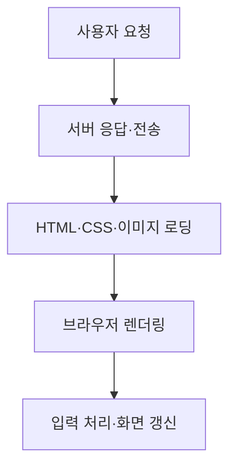
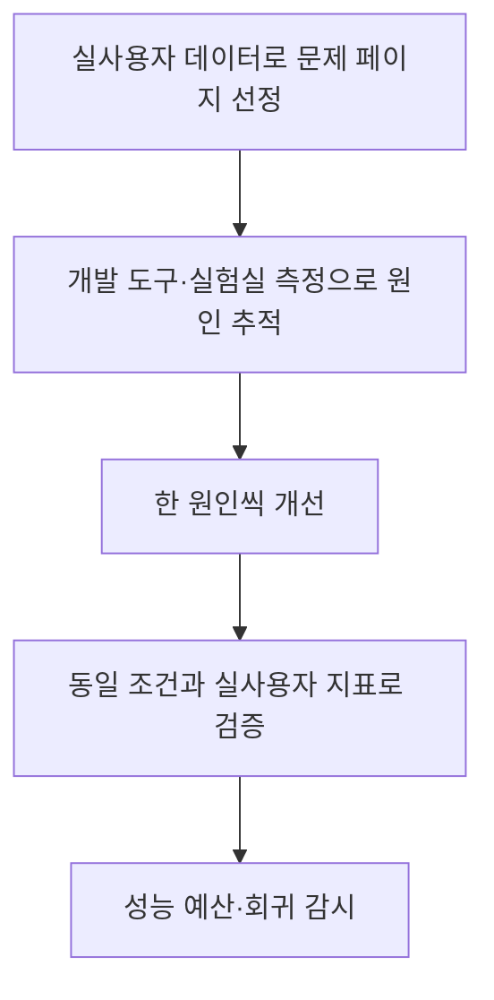

## 학습 위치

소프트웨어공학 → 품질·성능 → **웹 성능 최적화**

## 30초 인출

- **본질**: 웹 성능 최적화는 화면 표시·입력 반응·시각적 안정성을 측정하고, 느린 구간의 원인을 제거하는 활동
- **메커니즘**: 실제 사용자 지표 확인 → 네트워크·리소스·메인 스레드 병목 진단 → 원인별 개선 → 재측정

핵심 용어

- **Core Web Vitals**: 사용자 경험을 로딩·반응성·시각적 안정성의 세 축으로 살피는 웹 지표 집합
- **LCP(Largest Contentful Paint)**: 뷰포트의 주요 콘텐츠가 표시되기까지의 로딩 지표
- **INP(Interaction to Next Paint)**: 사용자 상호작용에 화면이 반응하기까지의 반응성 지표
- **CLS(Cumulative Layout Shift)**: 예기치 않은 화면 이동을 누적해 보는 시각적 안정성 지표
- **CRP(Critical Rendering Path)**: 브라우저가 문서를 화면의 픽셀로 표현하는 데 필요한 처리 경로
- **성능 예산(Performance Budget)**: 리소스 크기나 사용자 지표의 허용 범위를 정해 변경 시 회귀를 확인하는 기준

---

## 1교시 예상문제 (10점)

> 웹 성능 최적화의 개념과 핵심 측정 지표 및 개선 방향을 설명하시오.

---

## 1교시 10점 답안

### I. 개요

| 구분 | 핵심 |
|---|---|
| 정의 | **웹 성능 최적화**: 화면 표시·입력 반응·시각적 안정성의 병목을 측정·개선하는 활동 |
| 목적 | 실제 사용자의 로딩·반응 경험 개선과 성능 회귀 방지 |

### II. 핵심 지표와 개선 방향

| 지표 | 확인할 경험 | 대표 개선 방향 |
|---|---|---|
| **LCP** | 주요 콘텐츠 표시 | 초기 응답·주요 이미지·렌더링 차단 리소스 개선 |
| **INP** | 입력 후 화면 반응 | 긴 JavaScript 작업 분할·메인 스레드 부담 축소 |
| **CLS** | 예기치 않은 화면 이동 | 이미지·광고 영역 크기 예약, 동적 삽입 관리 |

**제언**: 실제 사용자 지표로 병목을 정하고 개선 전후를 같은 조건에서 비교.

---

## 2~4교시 예상문제 (25점)

> 웹 성능 최적화의 개념과 사용자 중심 지표를 설명하고, 병목 진단·개선·검증 방안을 제시하시오.

---

## 2~4교시 25점 답안

### I. 개요

| 구분 | 핵심 |
|---|---|
| 정의 | **웹 성능 최적화**: 화면 표시·입력 반응·시각적 안정성의 병목을 측정·개선하는 활동 |
| 목적 | 실제 사용자의 로딩·반응 경험 개선과 성능 회귀 방지 |

**측정 → 진단 → 개선 → 재측정**의 반복으로 사용자 경험의 원인을 파악하고 변경 효과를 확인.

### II. 사용자 경험 지표

| 지표 | 확인할 경험 | 대표 개선 방향 |
|---|---|---|
| **LCP** | 주요 콘텐츠 표시 | 초기 응답·주요 이미지·렌더링 차단 리소스 개선 |
| **INP** | 입력 후 화면 반응 | 긴 JavaScript 작업 분할·메인 스레드 부담 축소 |
| **CLS** | 예기치 않은 화면 이동 | 이미지·광고 영역 크기 예약, 동적 삽입 관리 |

- **Core Web Vitals**는 세 경험을 함께 보되, 하나의 점수만으로 모든 페이지와 사용자를 설명할 수 없으므로 경로·기기별 측정값 확인.

### III. 병목의 위치와 원인

| 구간 | 병목 예 | 주로 영향받는 지표 |
|---|---|---|
| 서버·전송 | 느린 응답, 큰 전송량 | LCP |
| 리소스·렌더링 | 주요 이미지 지연, 렌더링 차단 | LCP·CLS |
| 메인 스레드 | 긴 JavaScript 작업, 과도한 DOM 처리 | INP |

### IV. 원인별 개선 방법

| 확인된 원인 | 개선 방법 | 검증 포인트 |
|---|---|---|
| 주요 이미지 로딩 지연 | 적절한 크기·형식 제공, 발견·우선순위 조정 | LCP 요소의 요청·표시 시점 |
| 사용하지 않는 코드 전송 | 코드 분할·불필요한 리소스 제거 | 전송량과 실행 시간 |
| 긴 입력 처리 작업 | 작업 분할·불필요한 계산 축소 | 상호작용 구간의 INP |
| 이미지·동적 콘텐츠 크기 미확정 | 표시 영역 크기 사전 예약 | 이동을 일으킨 요소와 CLS |

첫 화면의 **LCP** 이미지를 무조건 지연 로딩하면 오히려 주요 콘텐츠 표시가 늦어질 수 있으므로, 화면 위치와 측정 결과에 따라 선택.

### V. 측정과 운영

| 측정 관점 | 활용 |
|---|---|
| 실사용자 데이터 | 실제 기기·네트워크에서 발생한 문제의 우선순위 결정 |
| 실험실 측정 | 같은 조건에서 병목 재현과 변경 전후 비교 |
| 성능 예산 | 릴리스 이후 리소스 증가와 지표 악화 감시 |

### VI. 문제와 해결 방안

| 문제 | 해결 방안 |
|---|---|
| 도구 점수만 높이고 실제 사용자 지연은 방치 | 실제 사용자 지표로 문제 경로를 먼저 선정한 뒤 재현·검증 |
| 모든 페이지에 동일한 최적화 기법 적용 | LCP·INP·CLS의 원인을 각각 찾아 영향이 큰 구간부터 개선 |
| 배포 후 성능 악화 반복 | 성능 예산과 주기적 사용자 지표 점검으로 회귀 확인 |

### 참고 자료

- [web.dev, Optimize Largest Contentful Paint](https://web.dev/articles/optimize-lcp)
- [web.dev, Optimize Interaction to Next Paint](https://web.dev/articles/optimize-inp)
- [web.dev, Optimize Cumulative Layout Shift](https://web.dev/articles/optimize-cls)
