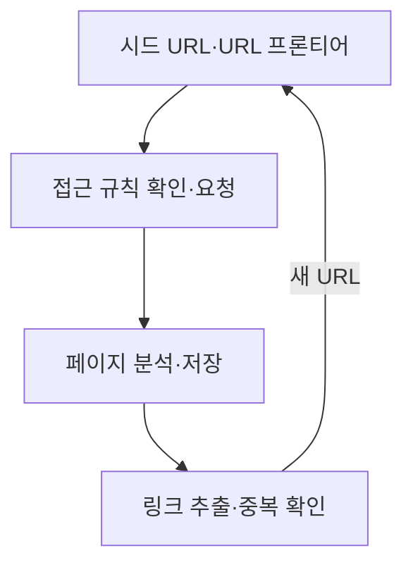
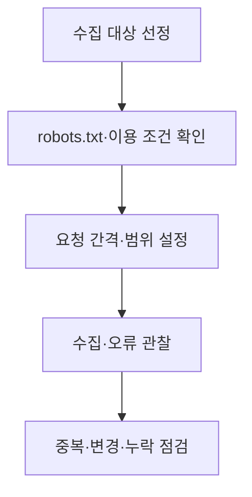

## 학습 위치

소프트웨어공학 → 데이터 수집 → **웹 크롤링**

## 30초 인출

- **본질**: 웹 크롤링은 시작 URL에서 페이지를 가져오고 링크를 따라가며 정해진 범위의 웹 자원을 자동 수집하는 활동
- **메커니즘**: 수집 대상 관리 → 접근 규칙 확인 → 페이지 요청·분석 → 신규 URL 선별 → 반복

핵심 용어

- **시드 URL(Seed URL)**: 크롤링을 시작할 때 입력하는 주소
- **URL 프론티어(URL Frontier)**: 앞으로 방문할 URL의 우선순위·요청 간격 등을 관리하는 대기열
- **중복 제거(Deduplication)**: 이미 방문했거나 같은 콘텐츠를 가리키는 URL의 재수집 억제
- **robots.txt**: 사이트가 크롤러에 접근 허용·제한 경로를 알리는 파일; 접근 통제·저작권 허가를 대신하지는 않음
- **웹 스크래핑(Web Scraping)**: 특정 페이지에서 필요한 데이터 항목을 추출하는 처리
- **블룸 필터(Bloom Filter)**: 적은 메모리로 집합 포함 가능성을 검사하는 확률적 자료구조; 거짓 양성 가능성 존재

---

## 1교시 예상문제 (10점)

> 웹 크롤링의 개념과 핵심 구성요소를 설명하시오.

---

## 1교시 10점 답안

### I. 개요

| 구분 | 핵심 |
|---|---|
| 정의 | **웹 크롤링**: 시작 URL에서 페이지를 가져오고 링크를 따라가며 웹 자원을 자동 수집하는 활동 |
| 목적 | 정해진 범위의 웹 페이지를 검색·분석 등에 활용할 수 있도록 수집 |

### II. 기본 구조

**제언**: 호스트별 요청 간격과 접근 규칙을 지키면서 방문 URL과 수집 오류를 관리.

---

## 2~4교시 예상문제 (25점)

> 웹 크롤링의 구조와 절차를 설명하고, 대규모 수집 시 고려사항과 대응 방안을 제시하시오.

---

## 2~4교시 25점 답안

### I. 개요

| 구분 | 핵심 |
|---|---|
| 정의 | **웹 크롤링**: 시작 URL에서 페이지를 가져오고 링크를 따라가며 웹 자원을 자동 수집하는 활동 |
| 목적 | 정해진 범위의 웹 페이지를 검색·분석 등에 활용할 수 있도록 수집 |

| 구분 | 웹 크롤링 | 웹 스크래핑 |
|---|---|---|
| 초점 | URL을 발견하고 페이지를 수집 | 수집한 페이지에서 필요한 데이터 추출 |
| 관계 | 수집 단계 | 추출 단계; 같은 파이프라인에서 함께 사용 가능 |

### II. 수집 구조

| 구성요소 | 역할 |
|---|---|
| **URL 프론티어** | 방문 대상의 우선순위와 호스트별 요청 간격 관리 |
| 다운로더 | 허용된 URL에 요청하고 응답·오류 기록 |
| 파서·링크 추출기 | 문서에서 필요한 콘텐츠와 다음 URL 추출 |
| 중복·범위 판정기 | 이미 방문한 URL과 수집 범위 밖 URL 제외 |
| 저장소 | 페이지·메타데이터·수집 상태 보관 |

### III. 순회·중복 관리

| 처리 지점 | 핵심 판단 | 대응 |
|---|---|---|
| URL 발견 | 수집 범위·정규화 결과 | 스킴·호스트·경로 정책과 정규화 규칙 적용 |
| 방문 예약 | 동일 호스트 과부하 가능성 | 호스트별 요청 간격·동시성 제한 |
| 응답 처리 | 실패·재시도 여부 | 상태 코드에 따른 재시도와 중단 조건 분리 |
| 링크 재투입 | 방문 여부 | URL 집합·필요 시 **블룸 필터**로 중복 후보 판정 |

**블룸 필터**는 중복 후보를 메모리 효율적으로 찾지만 거짓 양성이 있으므로, 누락을 허용할 수 없는 수집에서는 정확한 저장소 확인과 조합.

### IV. 접근 정책과 수집 품질

| 고려사항 | 확인 항목 |
|---|---|
| 사이트 부하 | 요청 속도, 오류 증가, 재시도 횟수 |
| 접근 허용 | **robots.txt**, 사이트 이용 조건, 인증·접근 권한 |
| 데이터 품질 | 중복 문서, 깨진 링크, 갱신 주기, 동적 페이지의 실제 콘텐츠 |
| 활용 범위 | 개인정보·저작물의 수집·저장·재이용 조건 |

**robots.txt**는 크롤링 경로를 알리는 수단이며, 법적 이용 허가나 비밀 보호 장치로 오인하지 않도록 구분.

### V. 규모 확장 시 판단

| 요구 | 설계 선택 | 유의점 |
|---|---|---|
| 대상 URL 증가 | 프론티어 분할·작업자 병렬화 | 호스트별 요청 제한의 일관성 |
| 동적 페이지 수집 | 필요한 경우 브라우저 렌더링 | 실행 비용과 접근 정책 확인 |
| 반복 수집 | 변경된 페이지 우선 방문 | 최신성·수집 비용의 균형 |

모든 사이트에 헤드리스 브라우저를 적용하거나 특정 저장소·도구를 필수 구성으로 고정하지 않고 수집 대상에 맞게 선택.

### VI. 문제와 해결 방안

| 문제 | 해결 방안 |
|---|---|
| 무한 링크·중복 URL로 수집 낭비 | URL 정규화·범위·깊이 기준 및 방문 기록 적용 |
| 집중 요청으로 대상 서버에 부담 | 호스트별 속도 제한, 응답 오류 관찰, 재시도 조절 |
| 수집 성공으로 이용 허가까지 확보했다고 오인 | 접근 규칙과 데이터 활용 조건을 별도로 확인 |

### 참고 자료

- [MDN, Crawler](https://developer.mozilla.org/en-US/docs/Glossary/Crawler)
- [Google Search Central, Introduction to robots.txt](https://developers.google.com/search/docs/crawling-indexing/robots/intro)
