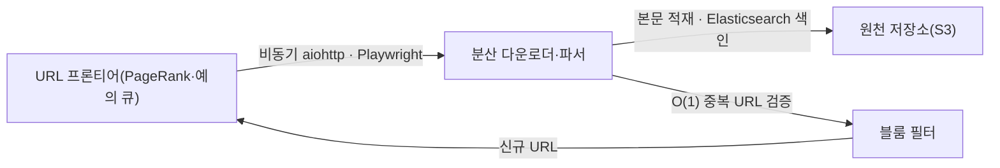
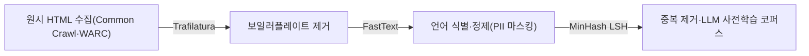

## 지식 로드맵 내 현재 위치

  소프트웨어공학
  데이터 수집·정보 검색 엔지니어링
  <strong>웹크롤링(Web Crawling)</strong>

## 30초 인출

- 본질: 전 세계 웹상에 분산된 방대한 하이퍼텍스트 문서를 체계적으로 수집·색인하기 위해, 사전 정의된 시드(Seed) URL로부터 출발하여 하이퍼링크를 재귀적으로 탐색·다운로드하고 중복을 제거하여 데이터베이스에 구조화 적재하는 분산 자동화 소프트웨어 로봇 시스템
- 메커니즘: 시드 URL 주입 $\rightarrow$ URL 프론티어 큐 스케줄링(우선순위 및 예의 제어) $\rightarrow$ HTML/헤드리스 동적 다운로드 $\rightarrow$ 파싱 및 본문·링크 추출 $\rightarrow$ 중복 URL 검증(Bloom Filter) $\rightarrow$ 저장소 적재 및 재귀 순회
- 산출물: 수집 원천 코퍼스 데이터셋 · 검색 인덱스(Inverted Index) · 사이트 맵 링크 토폴로지 · 크롤링 감사 로그

핵심 용어

- **URL Frontier(URL 프론티어)**: 수집할 대상 URL들을 관리하는 핵심 스케줄러 큐로, 탐색 우선순위(Priority)와 대상 서버에 DoS 부하를 주지 않는 예의(Politeness)를 보장하는 모듈
- **Bloom Filter(블룸 필터)**: 수억 개의 방문 URL 중복 여부를 최소한의 메모리로 $O(1)$ 시간 복잡도에 판별할 수 있는 해시 기반 확률적 자료구조
- **robots.txt (로봇 배제 표준)**: 웹사이트 관리자가 웹 크롤러 로봇의 접근 권한과 수집 허용 범위를 명시해 둔 국제 표준 텍스트 규약
- **헤드리스 브라우저(Headless Browser)**: GUI 화면 없이 백그라운드에서 HTML 파싱, CSS 스타일링, JavaScript 실행을 완결하는 브라우저 런타임(Puppeteer, Playwright)

---

## 1교시 예상문제 (10점)

> 웹크롤링(Web Crawling)의 정의와 목적, 핵심 메커니즘을 설명하시오. (예상)
---

## 1교시 10점 답안

### 1. 정의·목적

- 정의: 전 세계 웹상에 분산된 방대한 하이퍼텍스트 문서를 체계적으로 수집·색인하기 위해, 사전 정의된 시드(Seed) URL로부터 출발하여 하이퍼링크를 재귀적으로 탐색·다운로드하고 중복을 제거하여 데이터베이스에 구조화 적재하는 분산 자동화 소프트웨어 로봇 시스템
- 목적: 웹 페이지를 정해진 범위와 규칙에 따라 자동 수집해 검색·분석용 데이터를 만든다.

### 2. 핵심 관계

- 제언: 호스트별 요청 속도·중복 제거·수집 상태를 관리하고 접근 정책과 오류를 지속 점검한다.
---

## 2~4교시 예상문제 (25점)

> 웹크롤링(Web Crawling)의 개념과 목적을 설명하고, 핵심 메커니즘과 구성요소·절차, 적용 시 문제점과 대응 방안을 제시하시오. (25점, 예상)
---

## 2~4교시 25점 답안

### 1. 개요 및 필요성

### 정보 폭증과 웹 자동 탐색 엔진의 필요성

전 세계 웹사이트에 분산된 수천억 개의 웹 페이지 정보를 수작업으로 수집하는 것은 불가능하다. 검색 엔진, 생성형 AI 거대언어모델(LLM) 학습, 이커머스 가격 비교 등 현대 데이터 집약적 비즈니스는 웹 크롤링 기술을 기반으로 전 세계 데이터를 실시간 확보한다.

그러나 단순 무차별 수집은 대상 서버의 트래픽 과부하를 유발하여 DoS 공격으로 간주될 수 있으며, 동적 자바스크립트 렌더링 미지원 및 저작권 침해 분쟁 등 고도의 엔지니어링 및 법적 고려사항이 수반된다.

### 웹 크롤링 vs 웹 스크래핑 비교

| 구분 | 웹 크롤링 (Web Crawling) | 웹 스크래핑 (Web Scraping) |
|---|---|---|
| **핵심 목적** | **웹 전체를 탐색(Explore)하고 검색 색인(Index)을 구축** | **특정 대상 페이지에서 필요한 데이터(Extract)를 정밀 추출** |
| **작업 범위** | 링크를 재귀적으로 따라가는 대규모 전방위 탐색 | 사전에 지정된 특정 URL군 및 타깃 컴포넌트 한정 |
| **핵심 모듈** | **URL 프론티어, 크롤러 스파이더, 중복 제거 필터** | **DOM 셀렉터, 정규표현식 파서, 데이터 파이프라인** |
| **대표 사례** | 구글/네이버 검색 로봇, LLM 사전학습 데이터 수집기 | 부동산 실거래가 수집기, 항공권 최저가 비교 봇 |

### 2. 아키텍처 및 핵심 메커니즘

### 대규모 분산 웹 크롤러 아키텍처

### 블룸 필터(Bloom Filter) 및 LLM 코퍼스 정제 파이프라인

### 크롤러 4대 핵심 컴포넌트

| 컴포넌트 | 핵심 판단 |
|---|---|
| **① URL 프론티어** | 스케줄러: 다음에 방문할 수억 개 URL을 분산 메모리에 보관하고, 동일 호스트 연속 폭탄 요청을 딜레이 제어로 방지 |
| **② 다운로더(Fetcher)** | 수집 엔진: DNS 캐싱·비동기 논블로킹 I/O 초고속 패치, React·Vue SPA 대응 헤드리스 브라우저 렌더링 |
| **③ 블룸 필터(Bloom Filter)** | 중복 차단: 방문한 수억 개 URL을 메모리 효율적으로 O(1) 검증, False Positive 허용 대신 무한 중복 탐색 원천 차단 |
| **④ 스파이더 덫 방어기** | 루프 방지: 무한 달력 페이지·동적 세션 ID URL 정규화, 디렉터리 깊이(Depth) 제한 및 방문 횟수 상한 통제 |

### 3. 실무 적용 및 고려사항

### 위험 대응 매트릭스

| 위험 | 대책 | 효과 |
|---|---|---|
| 동적 파라미터가 포함된 무한 달력 링크에 빠져 크롤러가 영구 루프(Spider Trap)에 갇힘 | URL 정규화(Canonicalization) 엔진 구축 및 최대 탐색 깊이(Max Depth = 5) 엄격 제한 | 크롤러 무한 루프 100% 방지 및 인프라 보호 |
| 짧은 시간에 단일 IP로 대량의 요청을 전송하여 타깃 사이트의 WAF(Cloudflare)에 IP 대역 차단 | 프록시 IP 로테이션 풀 구축, 요청 간격 지수 백오프 랜덤화, 합법적 User-Agent 명시 | IP 차단율 90% 감소 및 안정적 수집 유지 |
| 타깃 기업이 구축한 데이터베이스를 무단 수집하여 서비스에 활용하다가 부정경쟁방지법 소송 피소 | `robots.txt` 준수 의무화, 타깃 기업 공식 Open API 제휴 우선, 원저작권 메타데이터 명시 | 법적 분쟁 리스크 원천 차단 및 컴플라이언스 준수 |

### 4. 기술사 답안 차별화 포인트

### LLM 시대의 대규모 웹 코퍼스 수집 파이프라인

최신 AI 생태계에서 웹 크롤러는 **거대언어모델(LLM) 사전학습 데이터 구축의 원천 기술**이다. Common Crawl과 같은 대규모 크롤러는 원시 HTML을 그대로 저장하지 않고, **Trafilatura 기반의 보일러플레이트(광고, 헤더, 푸터) 제거 $\rightarrow$ FastText 기반 언어 식별 $\rightarrow$ MinHash LSH 기반 중복 문서 제거**로 이어지는 고도화된 정제 파이프라인을 필수적으로 통과시킨다. 단순 수집을 넘어선 "데이터 전처리 파이프라인"을 함께 제시하면 최고 득점을 확보할 수 있다.

### 윤리적 크롤링(Ethical Crawling) 프로토콜

크롤러 설계의 최우선 덕목은 타깃 서버의 운영을 방해하지 않는 윤리성이다. `robots.txt`의 `Crawl-delay` 파라미터를 철저히 준수하고, 크롤러의 HTTP `User-Agent` 헤더에 운영자 연락처 이메일을 투명하게 명시하는 **'책임감 있는 크롤러 아키텍처 거버넌스'**를 결론으로 강조한다.

### 5. 결론 및 종합 제언

### 학습자 통찰 메모 — 답안 밖

[핵심 통찰]
웹 크롤링은 단순한 스크립트 작성 기술이 아니다. 대상 서버를 마비시키지 않는 '예의(Politeness)' 제어, 수억 개 URL을 $O(1)$에 걸러내는 '블룸 필터', 스파이더 덫을 회피하는 'URL 정규화', 그리고 **LLM 파운데이션 모델의 양질 학습 데이터를 빚어내는 AI 시대 데이터 엔지니어링의 시발점**이다.

나라면:
본 시험에서 웹 크롤링이 출제되면, URL 프론티어와 다운로더, 블룸 필터 순환 구조를 도식화한 뒤 **(1) DoS 유발을 방지하는 예의 큐와 robots.txt 준수 프로토콜, (2) False Positive를 통제하며 메모리를 절약하는 블룸 필터 해시 메커니즘, (3) 원시 웹 문서를 LLM 학습 코퍼스로 승화시키는 Trafilatura-MinHash 정제 파이프라인**을 3단락에 명쾌하게 구성하겠다.

### 실전 답안용 기술사적 제언

- **판정 기준**: 대규모 웹 데이터 수집 시 타깃 서버 응답 지연율 5% 이내 유지 및 robots.txt 100% 준수
- **대응 방안**: Redis 기반 Bloom Filter 중복 제거와 호스트별 분산 예의 큐(Politeness Delay) 엔진 구축
- **검증 체계**: Playwright 헤드리스 클러스터 기반 SPA 동적 렌더링 검증 및 MinHash LSH 기반 데이터셋 무결성 검증
- **기대 효과**: IP 차단 없는 안정적 대용량 수집 보증 및 법적 분쟁 리스크 원천 차단, 고품질 AI 데이터 확보

### 6. 참고 및 연계 학습

- [스크래핑(Scraping)](./071_scraping.md)
- [알고리즘 복잡도 Big-O](./125_algorithm_complexity_big_o.md)
- [방향성 비순환 그래프(DAG)](./143_dag.md)
- [오픈소스 프로젝트 관리 소프트웨어](./161_open_source_pm_software.md)
---
