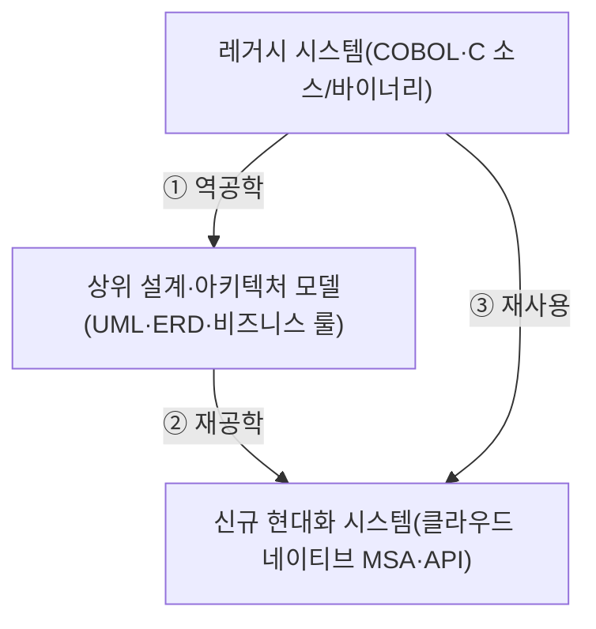
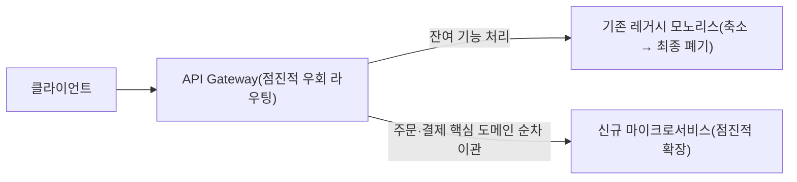

## 지식 로드맵 내 현재 위치

  소프트웨어공학
  유지보수·레거시 현대화
  <strong>SW 유지보수 3R(역공학·재공학·재사용)</strong>

## 30초 인출

- 본질: 전체 소프트웨어 생명주기 TCO의 70~80%를 잠식하는 유지보수 비용 위기와 문서 유실을 극복하기 위해, 레거시 소스코드로부터 유실된 설계를 추출(역공학)하고, 아키텍처와 코드를 현대화(재공학)하며, 검증된 자산을 부품화하여 신규 시스템에 조립(재사용)함으로써 소프트웨어 수명을 연장하고 개발 생산성을 극대화하는 3대 공학 체계
- 메커니즘: 레거시 소스코드 정적·동적 분석을 통한 아키텍처/데이터 모델 복원(역공학) $\rightarrow$ 복원된 설계를 기반으로 클라우드 네이티브 현대화(재공학) $\rightarrow$ 공통 모듈 표준 인터페이스화(재사용) $\rightarrow$ 유지보수성 지표 검증
- 산출물: 역공학 모델(UML 클래스/시퀀스/ERD) · 재공학 아키텍처 명세서 · 재사용 컴포넌트 저장소(Repository)

핵심 용어

- **역공학(Reverse Engineering)**: 이미 구현되어 가동 중인 소스코드, 데이터베이스 스키마, 실행 바이너리로부터 설계 문서, 데이터 모델, 요구사항을 거꾸로 추출하는 기법
- **재공학(Re-engineering)**: 역공학으로 추출된 설계 정보를 바탕으로, 시스템의 유지보수성과 확장성을 개선하기 위해 새로운 하드웨어/소프트웨어 플랫폼이나 아키텍처로 재구현하는 기법
- **재사용(Reuse)**: 이미 개발되어 기능성과 신뢰성이 검증된 소프트웨어 부품(컴포넌트, 프레임워크, 라이브러리)을 새로운 시스템 구축 시 다시 조립하여 활용하는 기법
- **리먼(Lehman)의 소프트웨어 진화 법칙**: 프로그램은 지속적으로 변화해야 하며(제1법칙), 변화할수록 복잡도가 증가하므로 선제적 유지보수와 구조 개선이 필수적이라는 소프트웨어 공학 법칙

---

## 1교시 예상문제 (10점)

> SW 유지보수 3R(역공학·재공학·재사용)의 정의와 목적, 핵심 메커니즘을 설명하시오. (예상)
---

## 1교시 10점 답안

### 1. 정의·목적

- 정의: 전체 소프트웨어 생명주기 TCO의 70~80%를 잠식하는 유지보수 비용 위기와 문서 유실을 극복하기 위해, 레거시 소스코드로부터 유실된 설계를 추출(역공학)하고, 아키텍처와 코드를 현대화(재공학)하며, 검증된 자산을 부품화하여 신규 시스템에 조립(재사용)함으로써 소프트웨어 수명을 연장하고 개발 생산성을 극대화하는 3대 공학 체계
- 목적: 해당 토픽의 주요 문제를 해결하고 필요한 기능을 제공한다.

### 2. 핵심 관계

- 제언: 핵심 작동 원리를 적용해 직접 효과를 검증한다.
---

## 2~4교시 예상문제 (25점)

> SW 유지보수 3R(역공학·재공학·재사용)의 개념과 목적을 설명하고, 핵심 메커니즘과 구성요소·절차, 적용 시 문제점과 대응 방안을 제시하시오. (25점, 예상)
---

## 2~4교시 25점 답안

### 1. 개요 및 필요성

### 레거시 소프트웨어의 위기와 유지보수 4대 유형

기업의 핵심 비즈니스를 지탱하는 대다수 레거시 시스템은 수십 년간 주먹구구식 핫픽스가 누적되면서 "스파게티 코드"로 변질되고 설계 문서는 유실된다. 전체 IT 예산의 80%가 단순 운영 유지보수에 소모되는 "레거시 병목"이 발생한다.

유지보수를 무작정 새로운 프로젝트로 엎어버리는 빅뱅(Big-Bang) 방식은 기존 코드에 녹아있는 수많은 예외 처리와 도메인 지식을 유실시켜 대규모 실패를 낳는다. 3R은 기존 소프트웨어 자산을 체계적으로 보존하고 진화시키는 핵심 수단이다.

### 소프트웨어 유지보수 4대 유형 분석

| 구분 | 비중 | 목적 및 주요 활동 | 촉발 요인 |
|---|---|---|---|
| **수정 유지보수 (Corrective)** | 20% | 운영 중 발견된 소프트웨어 결함, 런타임 오류 및 버그 수정 | 결함 리포트, 장애 발생 |
| **적응 유지보수 (Adaptive)** | 25% | OS 업그레이드, DBMS 변경, 클라우드 이전, 법률 개정 대응 | 외부 인프라/규제 환경 변화 |
| **완전 유지보수 (Perfective)** | **50% (최다)** | **사용자 요구에 따른 신규 기능 추가, 성능 튜닝, UI 개선** | **비즈니스 요구사항 진화** |
| **예방 유지보수 (Preventive)** | 5% | 잠재적 오류 예방 및 유지보수성 향상을 위한 리팩토링 | 기술 부채 상환, 코드 인스펙션 |

### 2. 아키텍처 및 핵심 메커니즘

### 3R 프레임워크의 유기적 순환 아키텍처

### 스트랭글러 피그(Strangler Fig) 점진적 재공학 아키텍처

빅뱅(Big-Bang) 재구축의 실패 위험을 원천 제거하고 무중단 상태에서 100% 현대화를 달성한다.

### 3R 핵심 활동 및 메커니즘

| 3R 핵심 활동 | 핵심 판단 |
|---|---|
| **① 역공학(Reverse)** | 지식 자산 복원: 소스코드 파싱으로 AST·콜 그래프 복원(정적 분석), 런타임 트레이싱으로 실제 트랜잭션 흐름 가시화(동적 분석) |
| **② 재공학(Re-engineering)** | 시스템 현대화: 코드 재구조화(Restructuring)로 스파게티 코드 제거, 비정규화 레거시 DB를 3정규형·NoSQL로 전환하는 데이터 재공학 |
| **③ 재사용(Reuse)** | 생산성 극대화: 생성 중심(Generative)·합성 중심(Composition) 재사용 기법, 표준 레포지토리에 컴포넌트 메타데이터 색인·배포 |
| **④ 리팩토링(Refactoring)** | 미시적 품질 개선: 외부 동작(인터페이스·기능) 100% 보존, 클래스 분할·메서드 추출로 코드 냄새(Code Smell)만 제거 |

### 3. 실무 적용 및 고려사항

### 위험 대응 매트릭스

| 위험 | 대책 | 효과 |
|---|---|---|
| 원개발자 전원 퇴사 및 문서 부재로 사소한 세법 변경에도 금융 시스템 전체가 마비될 위험 | 자동화 정적 역공학 도구(CAST, SonarQube)를 활용하여 비즈니스 규칙 및 ERD 자동 복원 | 업무 로직 가시성 100% 확보 및 분석 공수 80% 단축 |
| 레거시를 한 번에 전면 교체(Big-Bang)하려다 엣지 케이스 누락으로 대규모 서비스 장애 발생 | 스트랭글러 피그(Strangler Fig) 패턴을 적용하여 핵심 모듈부터 점진적 마이크로서비스 전환 | 빅뱅 실패 리스크 원천 차단 및 무중단 전환 |
| 재사용 컴포넌트의 인터페이스 불일치로 어댑터 개발 공수가 신규 개발 비용보다 커짐 | OpenAPI Specification(OAS) 기반 표준 인터페이스 정의 및 시맨틱 버저닝(SemVer) 준수 | 컴포넌트 결합 비용 70% 절감 및 신속한 조립 |

### 4. 기술사 답안 차별화 포인트

### 생성형 AI(LLM) 기반의 차세대 코드 역공학(Code Reverse Engineering)

과거의 역공학은 규칙 기반 파서(Parser)에 의존하여 비즈니스 의도(Intent)를 읽어내는 데 한계가 있었다. 최신 소프트웨어 공학에서는 **대규모 언어모델(LLM)을 활용한 시맨틱 역공학**을 수행한다. 20년 된 COBOL이나 레거시 C 코드를 프롬프트에 주입하여 "자연어 비즈니스 요구사항 명세서"를 자동 생성하고, 이를 현대적 Java/Spring 코드로 자동 변환(Code Migration)하는 차세대 3R 패러다임을 제시한다.

### 마틴 파울러의 스트랭글러 피그(Strangler Fig) 패턴 연계

레거시 재공학의 성공률을 극대화하는 표준 실무 패턴으로 **스트랭글러 피그 패턴**을 강조한다. 나무를 둘러싸며 자라는 무화과나무처럼, 레거시 시스템 앞단에 API 게이트웨이를 두고 신규 기능을 마이크로서비스로 하나씩 개발하여 라우팅을 우회시킨다. 점진적으로 레거시 시스템을 잠식하여 최종적으로 레거시를 걷어내는 **"무중단 점진적 재공학 아키텍처"**를 결론으로 도식화한다.

### 5. 결론 및 종합 제언

### 학습자 통찰 메모 — 답안 밖

[핵심 통찰]
소프트웨어는 건물이 아니다. 한 번 지어놓고 방치하면 부패하며, 리먼의 법칙처럼 환경에 맞추어 끊임없이 진화해야 한다. 유지보수 3R은 유실된 과거의 지식을 되살려내는 **역공학**, 현재의 낡은 구조를 갈아엎는 **재공학**, 그리고 미래의 중복 비용을 막아내는 **재사용**이 맞물린 소프트웨어 수명 연장의 생명공학이다.

나라면:
본 시험에서 3R이 출제되면, 4대 유지보수 분류와 3R의 개념적 순환도를 제시한 뒤 **(1) 빅뱅 전환의 참사를 막는 마틴 파울러의 스트랭글러 피그(Strangler Fig) 점진적 마이그레이션 아키텍처, (2) COBOL 등 레거시 코드를 자연어 스펙으로 복원하는 생성형 AI(LLM) 시맨틱 역공학, (3) OAS 기반 표준 컴포넌트 재사용 거버넌스**를 3단락에 명쾌하게 제시하겠다.

### 실전 답안용 기술사적 제언

- **판정 기준**: 레거시 유지보수성 지수(MI) 40 이하 및 단순 기능 변경에 4주 이상 소요 시 3R 현대화 전환 판정, 완료 통과선은 MI 65 이상 개선
- **대응 방안**: LLM 기반 시맨틱 역공학으로 업무 규칙을 복원하고 스트랭글러 피그 패턴을 통한 점진적 MSA 재공학 착수
- **검증 체계**: 신·구 시스템 간 트랜잭션 듀얼 런(Dual Run)을 통해 데이터 정합성 및 기능 등가성(Equivalence) 100% 검증
- **기대 효과**: 레거시 기술 부채 70% 해소, 시스템 유지보수 공수 절감 및 클라우드 네이티브 기반 비즈니스 민첩성 회복

### 6. 참고 및 연계 학습

- [리팩토링(Refactoring)](./006_refactoring.md)
- [CBD(Component Based Development)](./128_cbd.md)
- [소프트웨어 기술 부채(Technical Debt)](./016_technical_debt.md)
- [OpenAPI Specification(OAS)](./135_oas.md)
---
