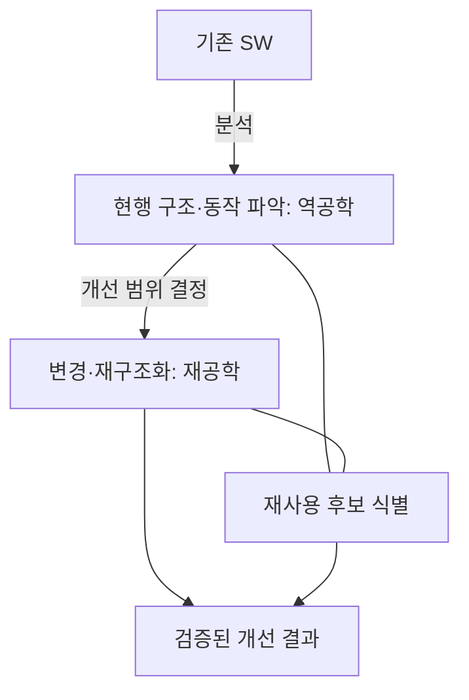
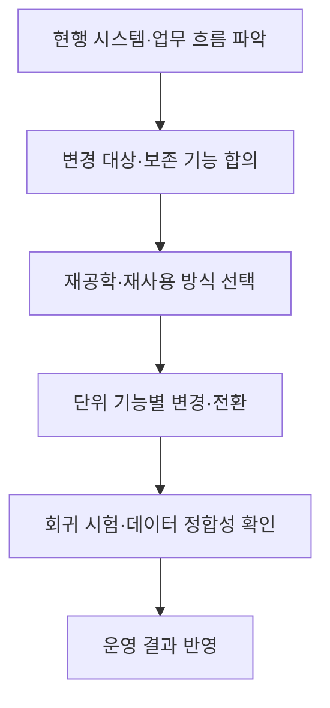

## 학습 위치

소프트웨어공학 → 소프트웨어 유지보수 → **3R**

## 30초 인출

- **본질**: 유지보수 3R은 기존 SW를 이해하는 **역공학**, 구조를 개선하는 **재공학**, 검증된 자산을 다시 쓰는 **재사용**의 세 활동
- **메커니즘**: 현행 시스템 분석 → 설계·업무 규칙 복원 → 변경·개선 범위 결정 → 기능 검증과 자산 재사용

핵심 용어

- **역공학(Reverse Engineering)**: 구현된 시스템을 분석해 구성·설계·동작에 대한 상위 수준의 정보를 알아내는 활동
- **재공학(Re-engineering)**: 기존 시스템을 분석·변경해 기능을 보존하거나 개선하며 품질·유지보수성을 높이는 활동
- **재사용(Reuse)**: 기존 코드·컴포넌트·설계·시험 자산을 다른 개발·개선 작업에 활용하는 활동
- **리팩터링(Refactoring)**: 외부에서 관찰되는 동작을 유지하면서 내부 구조를 개선하는 작업
- **회귀 시험(Regression Testing)**: 변경 후 기존 기능에 의도하지 않은 결함이 생겼는지 확인하는 시험
- **스트랭글러 패턴(Strangler Fig Pattern)**: 기존 시스템 기능을 점진적으로 새 구현으로 옮겨 교체하는 방식

---

## 1교시 예상문제 (10점)

> 소프트웨어 유지보수 3R의 개념과 관계를 설명하시오.

---

## 1교시 10점 답안

### I. 개요

| 구분 | 핵심 |
|---|---|
| 정의 | **유지보수 3R**: 기존 SW의 이해·개선·자산 활용을 위한 역공학·재공학·재사용 활동 |
| 목적 | 변경 영향 파악, 유지보수성 개선, 기존 자산의 가치 활용 |

### II. 3R의 역할

| 활동 | 핵심 질문 | 대표 결과 |
|---|---|---|
| **역공학** | 현재 시스템은 어떻게 동작하는가? | 구조·의존 관계·업무 규칙 파악 |
| **재공학** | 무엇을 어떻게 개선할 것인가? | 코드·구조·데이터의 개선 |
| **재사용** | 검증된 무엇을 다시 쓸 것인가? | 코드·설계·시험 자산 활용 |

**제언**: 현행 동작을 먼저 파악한 뒤 변경 범위와 재사용 대상을 정하고 회귀 시험으로 기능 보존을 확인.

---

## 2~4교시 예상문제 (25점)

> 소프트웨어 유지보수 3R의 개념과 상호 관계를 설명하고, 레거시 시스템 개선에 적용하는 절차와 유의사항을 제시하시오.

---

## 2~4교시 25점 답안

### I. 개요

| 구분 | 핵심 |
|---|---|
| 정의 | **유지보수 3R**: 기존 SW의 이해·개선·자산 활용을 위한 역공학·재공학·재사용 활동 |
| 목적 | 변경 영향 파악, 유지보수성 개선, 기존 자산의 가치 활용 |

문서와 구현이 어긋난 레거시 시스템에서는 실제 동작을 확인하지 않은 변경이 장애와 기능 누락으로 이어질 수 있으므로, 이해·개선·검증을 연결.

### II. 3R의 역할과 관계

| 활동 | 핵심 질문 | 대표 결과 |
|---|---|---|
| **역공학** | 현재 시스템은 어떻게 동작하는가? | 구조·의존 관계·업무 규칙 파악 |
| **재공학** | 무엇을 어떻게 개선할 것인가? | 코드·구조·데이터의 개선 |
| **재사용** | 검증된 무엇을 다시 쓸 것인가? | 코드·설계·시험 자산 활용 |

**재사용**은 반드시 재공학 이후에만 일어나는 단계가 아니라 기존 자산의 식별·활용을 가리키는 독립적 관점.

### III. 역공학과 재공학의 깊이

| 구분 | 입력·활동 | 판단할 사항 |
|---|---|---|
| 역공학 | 코드·데이터·실행 흐름 분석, 의존 관계와 업무 규칙 복원 | 실제 동작과 문서의 차이, 변경 영향 |
| 재공학 | 코드 재구조화, 데이터·아키텍처 변경, 필요한 경우 점진적 교체 | 보존할 기능, 전환 순서, 데이터 정합성 |
| 재사용 | 코드·컴포넌트·설계·시험 자산 검토 | 적합성, 의존성, 품질, 라이선스 |

**리팩터링**은 외부 동작을 보존하는 내부 구조 개선으로, 재공학의 한 방법이 될 수 있으나 재공학 전체와 동일한 개념은 아님.

### IV. 레거시 개선 적용 절차

| 방식 | 적용 판단 | 주의점 |
|---|---|---|
| 내부 구조 개선 | 동작은 유지하고 코드 품질을 높일 때 | 회귀 시험 기반 확보 |
| 점진적 기능 교체 | 전면 전환 부담이 크고 기능을 분리할 수 있을 때 | 신·구 시스템 간 데이터·호출 경계 관리 |
| 기존 자산 재사용 | 적합한 컴포넌트·설계가 있을 때 | 숨은 의존성과 변경 비용 확인 |

### V. 유지보수 유형과 3R의 위치

| 유지보수 유형 | 변경 목적 | 3R의 기여 |
|---|---|---|
| 수정 | 발견된 결함 해결 | 영향 범위 역공학, 수정 결과 회귀 시험 |
| 적응 | 플랫폼·외부 환경 변화 대응 | 구조 분석과 필요한 재공학 |
| 완전 | 기능·성능·사용성 개선 | 검증된 자산 재사용과 구조 개선 |
| 예방 | 장래 결함·변경 비용 축소 | 의존 관계 정리와 리팩터링 |

유지보수 유형별 비율이나 절감률을 보편적 수치로 단정하지 않고 시스템별 현황으로 판단.

### VI. 문제와 해결 방안

| 한계 | 해결 방안 |
|---|---|
| 문서만 믿고 변경해 숨은 업무 규칙 누락 | 코드·데이터·실행 결과를 함께 분석하고 현행 동작을 시험으로 기록 |
| 일괄 교체 중 기능·데이터 정합성 상실 | 기능별 전환과 신·구 결과 비교, 회귀 시험 수행 |
| 재사용 자산의 의존성과 품질을 확인하지 않음 | 인터페이스·라이선스·시험 이력을 검토한 뒤 채택 |

### 참고 자료

- [Martin Fowler, Strangler Fig Application](https://martinfowler.com/bliki/StranglerFigApplication.html)
