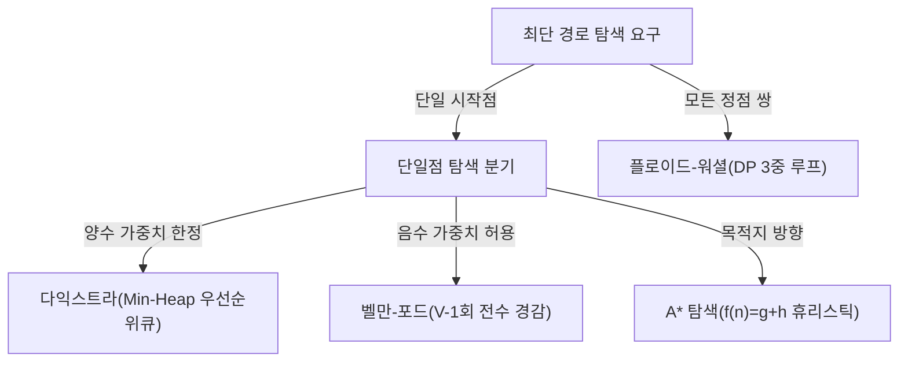
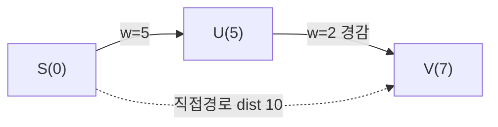

## 지식 로드맵 내 현재 위치

  소프트웨어공학
  알고리즘·그래프 이론
  <strong>최단경로 알고리즘(Shortest Path Algorithm)</strong>

## 30초 인출

- 본질: 가중치 그래프에서 가능한 모든 경로를 전수 조사할 때 발생하는 팩토리얼($N!$) 수준의 지수적 폭증을 방지하기 위해, "부분 경로의 최적합이 전체 최단 경로를 이룬다"는 최적 부분 구조(Optimal Substructure)를 기반으로 간선 경감(Edge Relaxation)을 수행하여 목적지까지의 최소 비용 경로를 다항 시간 내에 도출하는 핵심 알고리즘군
- 메커니즘: 그래프 토폴로지 모델링 $\rightarrow$ 가중치 특성(양수/음수) 및 탐색 범위(단일점/전체쌍) 판정 $\rightarrow$ 최적 알고리즘 선정 $\rightarrow$ 간선 경감(Relaxation) 반복 $\rightarrow$ 최단 거리 배열 및 역추적 경로 확정
- 산출물: 최단 거리 배열(Distance Array) · 직전 선행 노드 테이블(Predecessor Table) · 네트워크 라우팅 테이블

핵심 용어

- **간선 경감(Edge Relaxation)**: 시작점에서 정점 $v$까지의 기존 최단 거리보다 중간 정점 $u$를 거쳐서 가는 거리(`dist[u] + weight(u,v)`)가 더 짧을 경우, 최단 거리를 더 작은 값으로 갱신하는 기본 연산
- **최적 부분 구조(Optimal Substructure)**: 어떤 경로 $A \rightarrow B$가 최단 경로라면, 그 사이에 포함된 부분 경로 $A \rightarrow C$ 역시 반드시 $A$에서 $C$로 가는 최단 경로여야 한다는 동적 계획법의 핵심 성질
- **음수 사이클(Negative Weight Cycle)**: 사이클을 구성하는 간선들의 가중치 합이 음수가 되어, 사이클을 돌 때마다 경로 비용이 무한히 음의 무한대로 감소하여 최단 경로가 성립하지 않는 그래프 상태
- **휴리스틱 추정값(Heuristic $h(n)$)**: A* 알고리즘에서 현재 노드에서 최종 목적지 노드까지 도달하는 데 예상되는 잔여 비용 추정치 (직선거리 등)

---

## 1교시 예상문제 (10점)

> 최단경로 알고리즘(Shortest Path Algorithm)의 정의와 목적, 핵심 메커니즘을 설명하시오. (예상)
---

## 1교시 10점 답안

### 1. 정의·목적

- 정의: 가중치 그래프에서 가능한 모든 경로를 전수 조사할 때 발생하는 팩토리얼($N!$) 수준의 지수적 폭증을 방지하기 위해, "부분 경로의 최적합이 전체 최단 경로를 이룬다"는 최적 부분 구조(Optimal Substructure)를 기반으로 간선 경감(Edge Relaxation)을 수행하여 목적지까지의 최소 비용 경로를 다항 시간 내에 도출하는 핵심 알고리즘군
- 목적: 가중치 그래프에서 가능한 모든 경로를 전수 조사할 때 발생하는 팩토리얼($N!$) 수준의 지수적 폭증을 방지하기 위해, "부분 경로의 최적합이 전체 최단 경로를 이룬다"는 최적 부분 구조(Optimal Substructure)를 기반으로 간선 경감(Edge Relaxation)을 수행하여 목적지까지의 최소 비용 경로를 다항 시간 내에 도출하는 핵심 알고리즘군

### 2. 핵심 관계

- 제언: 핵심 작동 원리를 적용해 직접 효과를 검증한다.
---

## 2~4교시 예상문제 (25점)

> 최단경로 알고리즘(Shortest Path Algorithm)의 개념과 목적을 설명하고, 핵심 메커니즘과 구성요소·절차, 적용 시 문제점과 대응 방안을 제시하시오. (25점, 예상)
---

## 2~4교시 25점 답안

### 1. 개요 및 필요성

### 전수 탐색의 복잡도 폭증과 최단 경로 문제의 본질

네트워크 패킷 라우팅, 내비게이션 길안내, 물류 공급망 최적화에서 $N$개의 도시를 연결하는 모든 경로를 전수 조사하는 완전 탐색은 $O(N!)$의 지수 폭증을 유발하여 연산이 불가능하다.

최단경로 알고리즘은 **"최적 부분 구조"**를 활용하여 이미 계산된 부분 경로의 해를 재활용함으로써, 다항 시간($O(V^2)$, $O(E \log V)$ 등) 내에 완벽한 최단 경로를 보장하는 전산학의 필수 알고리즘이다.

### 4대 최단경로 알고리즘 핵심 비교

| 구분 | 다익스트라 (Dijkstra) | 벨만-포드 (Bellman-Ford) | 플로이드-워셜 (Floyd-Warshall) | A* 알고리즘 |
|---|---|---|---|---|
| **문제 유형** | **단일 시작점 $\rightarrow$ 모든 정점** | **단일 시작점 $\rightarrow$ 모든 정점** | **모든 정점 쌍 간 최단 경로** | **단일 시작점 $\rightarrow$ 특정 목적점** |
| **시간 복잡도** | **$O((V+E)\log V)$ (우선순위 큐)** | **$O(V \cdot E)$** | **$O(V^3)$** | **$O(E)$ (휴리스틱에 좌우)** |
| **음수 가중치** | **불가 (오동작)** | **가능 (음수 사이클 탐지)** | **가능 (음수 사이클 탐지)** | 불가 (양수 한정) |
| **알고리즘 기법** | 탐욕법 (Greedy) | 동적 계획법 (DP) | 동적 계획법 (3중 루프) | 휴리스틱 기반 최선 우선 탐색 |
| **대표 응용** | OSPF 네트워크 라우팅 | 금융 차익거래, RIP 라우팅 | 도시 간 거리 행렬 계산 | 게임 길찾기, 로봇 자율주행 |

### 2. 아키텍처 및 핵심 메커니즘

### 4대 최단경로 알고리즘 선택 의사결정 트리

### 간선 경감(Relaxation) 원리 및 OSPF/RIP 라우팅 연계

간선 경감 공식 `if (dist[V] > dist[U] + w(U,V))`에 따라 `dist[V] = 5 + 2 = 7`로 거리 갱신에 성공한다. 링크 상태 프로토콜인 OSPF·IS-IS는 다익스트라 기반 SPF 트리를 계산한다.

### 핵심 알고리즘별 동작 원리

| 알고리즘 | 핵심 판단 |
|---|---|
| **① 다익스트라** | 그리디·우선순위큐: 미방문 노드 중 시작점에서 가장 가까운 노드를 선택 확정하고 인접 간선만 경감 (음수 가중치 시 역전 오류) |
| **② 벨만-포드** | 음수 사이클 탐지: 모든 간선 E개에 경감 연산을 V-1번 반복하여 확정, V번째에도 거리가 줄면 음수 사이클 판정 |
| **③ 플로이드-워셜** | DP 3중 루프: 경유지 k를 거치는 `D[i][j] = min(D[i][j], D[i][k]+D[k][j])`로 모든 정점 쌍 최단 거리를 V×V 행렬로 일괄 산출 |
| **④ A* 알고리즘** | 휴리스틱 가이드: 평가 함수 f(n) = g(n) + h(n)으로 목적지 방향 우선 탐색, 다익스트라 대비 탐색 공간 90% 축소 |

### 3. 실무 적용 및 고려사항

### 위험 대응 매트릭스

| 위험 | 대책 | 효과 |
|---|---|---|
| 금융 통화 환전망에서 로그 변환 환율을 계산할 때 음수 가중치로 다익스트라 알고리즘 오동작 | 벨만-포드(Bellman-Ford) 알고리즘을 적용하여 음수 가중치 처리 및 차익 거래 사이클 감지 | 비정상 무한 환차익 기회 100% 자동 포착 |
| 대도시 실시간 내비게이션 길안내 시 수십만 교차로 다익스트라 전방위 탐색으로 서버 마비 | 목적지 직선거리를 휴리스틱으로 결합한 A* 및 도로망 축약 계층(Contraction Hierarchies) 도입 | 길찾기 연산 지연시간 5초에서 0.05초로 단축 |
| 네트워크 라우터 간 거리 벡터 갱신 시 링크 단절로 인한 무한 계수(Count-to-Infinity) 루프 발생 | 링크 상태 라우팅 프로토콜(OSPF)로 전환하여 토폴로지 전체를 다익스트라로 즉각 재계산 | 네트워크 수렴 시간(Convergence Time) 수초 내 단축 |

### 4. 기술사 답안 차별화 포인트

### 네트워크 라우팅 프로토콜과의 완벽한 1:1 기술 연계

최단경로 알고리즘은 네트워크 엔지니어링의 핵심 기반이다. **링크 상태(Link-State) 프로토콜인 OSPF와 IS-IS는 다익스트라 알고리즘**을 사용하여 각 라우터가 독자적으로 최단 경로 트리를 구성한다. 반면 **거리 벡터(Distance-Vector) 프로토콜인 RIP와 BGP는 벨만-포드 알고리즘의 원리**를 분산 환경에 맞게 변형하여 인접 이웃과 홉 수를 교환한다. 알고리즘과 네트워크 프로토콜의 상관관계를 답안에 기술하면 채점관에게 강한 인상을 남긴다.

### 초대규모 지리정보 처리를 위한 축약 계층(Contraction Hierarchies)

노드 수가 수천만 개에 달하는 글로벌 내비게이션(Google Maps, TMAP) 환경에서는 기본 다익스트라나 A*로도 동시 수만 건의 요청을 감당할 수 없다. 도로망의 중요도에 따라 노드를 사전에 축약(Shortcut 간선 추가)하여 계층화해 두는 **축약 계층(Contraction Hierarchies, CH)** 전처리 기법을 3단락 또는 결론에 제시하여 최신 실무 라우팅 엔지니어링 역량을 과시한다.

### 5. 결론 및 종합 제언

### 학습자 통찰 메모 — 답안 밖

[핵심 통찰]
최단경로 알고리즘은 단순히 교과서 속 코딩 테스트 문제가 아니다. 인터넷 패킷의 흐름을 지휘하는 **OSPF(다익스트라)**와 **RIP(벨만-포드)**, 자율주행과 내비게이션의 **A* 휴리스틱**, 그리고 금융 거래의 **음수 사이클 차익거래 탐지**에 이르기까지 현실의 모든 인프라를 지탱하는 수학적 척추다.

나라면:
본 시험에서 최단경로가 출제되면, 4대 알고리즘의 비교표와 간선 경감(Relaxation) 메커니즘을 정확히 도출한 뒤 **(1) OSPF 링크상태(다익스트라)와 RIP 거리벡터(벨만포드)의 1:1 통신망 연계, (2) 금융 환전망에서 로그 변환을 통한 음수 사이클 차익거래 탐지, (3) 초대규모 내비게이션 처리를 위한 축약 계층(Contraction Hierarchies) 가속화**를 3단락에 명쾌하게 제시하겠다.

### 실전 답안용 기술사적 제언

- **판정 기준**: 그래프 탐색 범위(단일점/전체쌍) 및 가중치 특성(음수 존재 여부)에 따라 알고리즘 선정
- **대응 방안**: 양수 단일점은 Min-Heap 다익스트라, 음수 가중치는 벨만-포드, 1:1 목적점은 A* 알고리즘 적용
- **검증 체계**: $V$번째 간선 경감 시 거리 변화 여부를 계측하여 음수 사이클(Negative Cycle) 존재 100% 무결성 검증
- **기대 효과**: $N!$ 경로 전수 탐색 대비 다항 시간 내 경로 확정 및 패킷 라우팅 수렴 속도 극대화

### 6. 참고 및 연계 학습

- [다익스트라 알고리즘(Dijkstra)](./189_dijkstra_algorithm.md)
- [최단 경로 알고리즘 A*](./127_a_star_algorithm.md)
- [최소 신장 트리(MST)](./194_minimum_spanning_tree.md)
- [탐욕 알고리즘(Greedy)](./196_greedy_algorithm.md)
---
