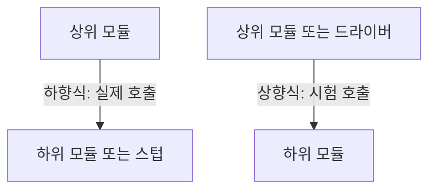
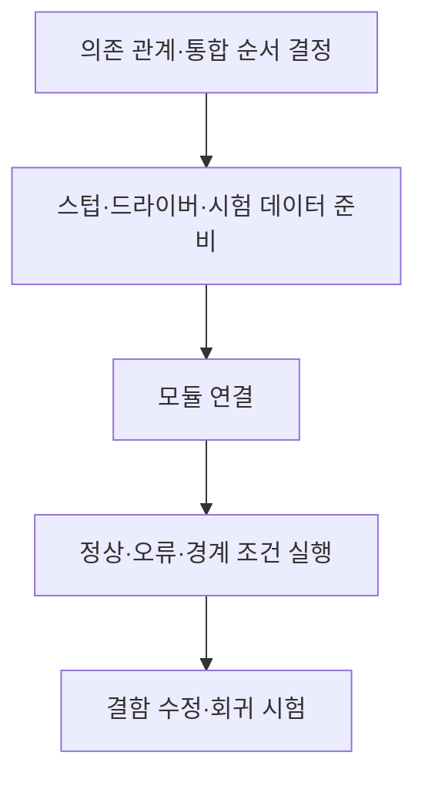

## 학습 위치

소프트웨어공학 → 시험 수준 → **통합 테스트**

## 30초 인출

- **본질**: 통합 테스트는 함께 동작하는 모듈 사이의 인터페이스와 데이터 흐름을 검증하는 시험 수준
- **메커니즘**: 통합 순서 결정 → 필요한 스텁·드라이버 준비 → 모듈 연결 → 인터페이스·오류 처리 검증

핵심 용어

- **통합 테스트(Integration Test)**: 결합된 구성요소 간 상호작용과 인터페이스를 확인하는 시험
- **하향식 통합(Top-down Integration)**: 상위 모듈에서 하위 모듈로 결합 범위를 넓히는 방식
- **상향식 통합(Bottom-up Integration)**: 하위 모듈에서 상위 모듈로 결합 범위를 넓히는 방식
- **테스트 스텁(Test Stub)**: 아직 연결하지 않은 하위 모듈을 대신해 호출 결과를 제공하는 시험용 구성요소
- **테스트 드라이버(Test Driver)**: 아직 연결하지 않은 상위 모듈을 대신해 하위 모듈을 호출하는 시험용 구성요소
- **빅뱅 통합(Big-bang Integration)**: 모듈을 한꺼번에 결합해 시험하는 방식
- **계약 시험(Contract Testing)**: 서비스 간 요청·응답 형식과 기대 동작의 약속을 확인하는 시험

---

## 1교시 예상문제 (10점)

> 통합 테스트의 개념과 하향식·상향식 통합에서 스텁과 드라이버의 역할을 설명하시오.

---

## 1교시 10점 답안

### I. 개요

| 구분 | 핵심 |
|---|---|
| 정의 | **통합 테스트**: 결합된 모듈 사이의 인터페이스·데이터 흐름·상호작용을 검증하는 시험 |
| 목적 | 개별 모듈 시험만으로 찾기 어려운 연결부 결함 발견 |

### II. 통합 방향과 시험 대역

| 방식 | 결합 방향 | 필요한 시험 대역 |
|---|---|---|
| **하향식** | 상위 → 하위 | 미완성 하위 모듈 대신 **스텁** |
| **상향식** | 하위 → 상위 | 미완성 상위 호출자 대신 **드라이버** |

**제언**: 의존성과 결함 위험을 기준으로 통합 순서를 정하고 연결부의 정상·오류 흐름을 모두 검증.

---

## 2~4교시 예상문제 (25점)

> 통합 테스트의 개념과 통합 전략을 비교하고, 스텁·드라이버를 활용한 단계적 검증 및 결함 대응 방안을 설명하시오.

---

## 2~4교시 25점 답안

### I. 개요

| 구분 | 핵심 |
|---|---|
| 정의 | **통합 테스트**: 결합된 모듈 사이의 인터페이스·데이터 흐름·상호작용을 검증하는 시험 |
| 목적 | 개별 모듈 시험만으로 찾기 어려운 연결부 결함 발견 |

| 시험 수준 | 주로 확인하는 것 |
|---|---|
| 단위 테스트 | 개별 구성요소의 동작 |
| 통합 테스트 | 구성요소 간 데이터·호출·오류 처리 |
| 시스템 테스트 | 완성된 시스템의 요구사항 충족 |

### II. 통합 방향과 시험 대역

| 방식 | 결합 방향 | 필요한 시험 대역 |
|---|---|---|
| **하향식** | 상위 → 하위 | 미완성 하위 모듈 대신 **스텁** |
| **상향식** | 하위 → 상위 | 미완성 상위 호출자 대신 **드라이버** |

### III. 통합 전략 비교

| 전략 | 특징 | 유의점 |
|---|---|---|
| 하향식 | 상위 제어 흐름을 먼저 검증 | 하위 모듈을 대체할 스텁 필요 |
| 상향식 | 하위 기능·데이터 처리를 먼저 검증 | 호출을 만들어 줄 드라이버 필요 |
| 샌드위치 | 상·하위 양쪽에서 병행 | 중간 결합 지점·시험 대역 관리 |
| 빅뱅 | 구성요소를 한꺼번에 결합 | 실패 시 원인 범위가 넓어짐 |

**점진적 통합**은 새로 연결한 경계에서 결함을 발견·격리하기 쉬우나 스텁·드라이버 제작 비용을 고려.

### IV. 검증 절차와 대상

| 인터페이스 항목 | 대표 결함 |
|---|---|
| 데이터 형식·스키마 | 필드명·타입·직렬화 불일치 |
| 호출 순서·상태 | 초기화 전 호출, 중복 처리 |
| 오류·시간 제한 | 실패 전파, 타임아웃·재시도 불일치 |

### V. 서비스 환경의 통합 검증

| 검증 방법 | 확인 범위 | 한계 |
|---|---|---|
| **계약 시험** | 제공자와 소비자 간 인터페이스 호환성 | 실제 인프라·전체 동작까지 보장하지 않음 |
| 실제 의존 서비스 연결 시험 | 데이터베이스·브로커 등의 동작 | 환경 준비·격리 비용 발생 |
| 종단간 시험 | 여러 서비스의 업무 흐름 | 결함 위치 파악이 어려울 수 있음 |

계약 시험·컨테이너 기반 시험은 전통적 통합 전략을 일괄 대체하는 기술이 아니라, 검증 범위를 보완하는 방법.

### VI. 문제와 해결 방안

| 한계 | 해결 방안 |
|---|---|
| 모듈 완성 후 일괄 결합해 결함 위치 불명 | 위험·의존성 기준으로 단계적 통합과 회귀 시험 수행 |
| 스텁만 통과하고 실제 하위 서비스에서 실패 | 시험 대역 교체 후 실제 연결 시험 수행 |
| 정상 요청만 검증해 오류 전파 누락 | 타임아웃·재시도·비정상 응답까지 시험 |
