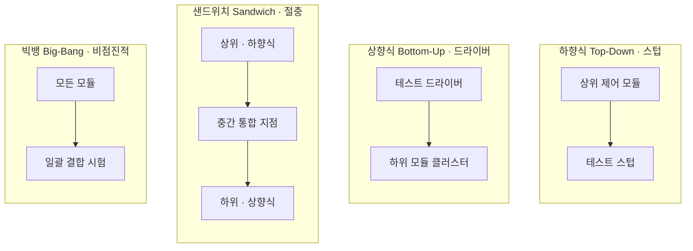
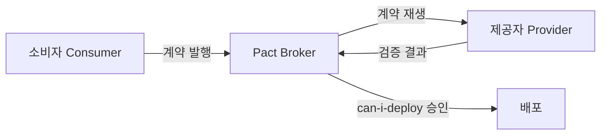

## 지식 로드맵 내 현재 위치

  소프트웨어공학
  소프트웨어 테스팅·품질 보증
  <strong>통합 테스트(Integration Test)</strong>

## 30초 인출

- 본질: 단위 테스트를 통과한 개별 모듈들이 상호 결합할 때 발생하는 데이터 타입 불일치, 인터페이스 프로토콜 오류, 예외 처리 누락을 검증하기 위해, 모듈 간의 상호작용과 데이터 통신 흐름의 정합성을 체계적으로 검증하는 V-모델 상세설계 기반 테스트 레벨
- 메커니즘: 단위 모듈 수집 → 점진적 통합 전략(하향식/상향식/샌드위치) 수립 → 테스트 하네스(드라이버/스텁) 배치 → 인터페이스 결합 시험 → 결함 격리 및 정합성 검증
- 산출물: 통합 테스트 계획서 · 인터페이스 테스트 케이스 명세서 · 테스트 하네스 스크립트 · 결함 원인 분석 보고서

핵심 용어

- **테스트 드라이버(Test Driver)**: 상향식 통합 테스트에서 아직 개발되지 않은 상위 모듈을 대신하여, 하위 모듈에 테스트 데이터를 전달하고 결과를 수신하는 가상 호출 프로그램
- **테스트 스텁(Test Stub)**: 하향식 통합 테스트에서 아직 개발되지 않은 하위 모듈을 대신하여, 상위 모듈의 호출에 미리 정해진 가상의 결과값만 반환하는 임시 더미 루틴
- **빅뱅 통합(Big-Bang Integration)**: 모든 단위 모듈이 완성될 때까지 기다렸다가 일괄 결합하여 테스트하는 비점진적 방식으로, 결함 원인 격리가 극도로 어려움
- **소비자 주도 계약 테스팅(Pact CDC)**: 마이크로서비스 환경에서 API 소비자가 기대하는 인터페이스 계약서를 기준으로 제공자의 호환성을 검증하는 최신 기법
- **Testcontainers**: 테스트 시점에 실제 DBMS·메시지 브로커를 Docker 컨테이너로 자동 기동·폐기하여 운영 환경과의 불일치를 줄이는 테스트 라이브러리

---

## 1교시 예상문제 (10점)

> 통합 테스트(Integration Test)의 정의와 목적, 핵심 메커니즘을 설명하시오. (예상)
---

## 1교시 10점 답안

### 1. 정의·목적

- 정의: 단위 테스트를 통과한 개별 모듈들이 상호 결합할 때 발생하는 데이터 타입 불일치, 인터페이스 프로토콜 오류, 예외 처리 누락을 검증하기 위해, 모듈 간의 상호작용과 데이터 통신 흐름의 정합성을 체계적으로 검증하는 V-모델 상세설계 기반 테스트 레벨
- 목적: 해당 토픽의 주요 문제를 해결하고 필요한 기능을 제공한다.

### 2. 핵심 관계

- 제언: 핵심 작동 원리를 적용해 직접 효과를 검증한다.
---

## 2~4교시 예상문제 (25점)

> 통합 테스트(Integration Test)의 개념과 목적을 설명하고, 핵심 메커니즘과 구성요소·절차, 적용 시 문제점과 대응 방안을 제시하시오. (25점, 예상)
---

## 2~4교시 25점 답안

### 1. 개요 및 필요성

### 단위 테스트의 한계와 인터페이스 결합 병목

아무리 개별 클래스나 함수가 단위 테스트에서 100% 커버리지를 달성했더라도, 서로 다른 개발자가 만든 모듈을 결합하는 순간 시스템은 멈춰 선다. 날짜 포맷(`YYYY-MM-DD` vs `Timestamp`) 불일치, 널(Null) 포인터 예외 전파, 비동기 호출 타임아웃 등 대부분의 치명적 결함은 **모듈 간의 접점인 "인터페이스"**에서 발생한다.

통합 테스트는 소프트웨어 아키텍처 상세설계 단계에서 정의된 인터페이스 규격과 데이터 교환 흐름이 실제 런타임 환경에서 완벽하게 작동하는지 검증하는 필수 공정이다.

### 점진적 통합 vs 비점진적 통합 비교

| 구분 | 비점진적 통합 (Non-Incremental) | 점진적 통합 (Incremental) |
|---|---|---|
| **대표 방식** | **빅뱅 통합 (Big-Bang)** | **하향식(Top-Down), 상향식(Bottom-Up), 샌드위치(Sandwich)** |
| **결합 전략** | 모든 모듈을 한 번에 일괄 결합 | 모듈을 하나씩 또는 클러스터 단위로 단계별 결합 |
| **결함 격리** | **결함 발생 시 원인 추적 극도로 곤란** | **방금 결합된 모듈 또는 인터페이스로 결함 즉시 격리** |
| **하네스 비용** | 드라이버/스텁 작성 불필요 (비용 0) | 드라이버 또는 스텁 개발 공수 필요 |
| **적용 권장** | 초소형 단기 토이 프로젝트 | **엔터프라이즈 및 미션 크리티컬 중대형 시스템** |

### 2. 아키텍처 및 핵심 메커니즘

### 4대 통합 테스트 전략 아키텍처

통합 테스트는 시스템의 제어 흐름과 데이터 종속성에 따라 4가지 전략으로 구분되며, 테스트 하네스(스텁·드라이버)의 위치가 전략을 가른다.

### 통합 방식별 상세 특징 및 테스트 하네스

| 방식 | 하네스 | 판단 |
|---|---|---|
| **하향식** Top-Down | 테스트 스텁(Test Stub) | 상위 골격 조기 시연, 다수 스텁 제작 공수 |
| **상향식** Bottom-Up | 테스트 드라이버(Test Driver) | 핵심 로직 조기 검증, 상위 골격 완성 지연 |
| **샌드위치** Sandwich | 스텁·드라이버 병용 | 대규모 프로젝트 적합, 설계 난이도 상승 |
| **빅뱅** Big-Bang | 하네스 불필요 | 결함 원인 격리 곤란, 중대형 시스템 금기 |

### 모던 MSA 통합 검증: Pact CDC 및 Testcontainers 아키텍처

클라우드 및 마이크로서비스 환경에서는 모든 서비스를 직접 기동하지 않고도 인터페이스 계약을 검증하는 모던 테스팅 파이프라인이 필수적이다. 계약 검증은 소비자가 발행한 계약을 중앙 저장소가 중계해 제공자가 재생 검증하는 폐루프로 흐르고, 실제 런타임 의존성은 Testcontainers가 컨테이너로 대체한다.

### 3. 실무 적용 및 고려사항

### 위험 대응 매트릭스

| 위험 | 대책 | 효과 |
|---|---|---|
| 오픈 2주 전 빅뱅 통합을 시도하다가 수천 개의 런타임 오류가 터져 프로젝트 일정 파탄 | 모듈 완성 즉시 클러스터 단위로 결합하는 점진적 상향식 통합(Bottom-Up) 전략 강제 | 결함 모듈 즉시 격리 및 디버깅 공수 70% 절감 |
| 마이크로서비스 간 DTO 필드명 오타 및 API 변경 사항 미공유로 배포 후 서비스 다운 | 소비자 주도 계약 테스팅(Pact CDC)을 CI 파이프라인에 연동하여 API 호환성 자동 검증 | 인터페이스 스펙 불일치 오류 빌드 시점 100% 차단 |
| 가짜 Mock 객체로만 통합 테스트를 통과시킨 후 운영 DB와 실제 연동 시 SQL 문법 에러 발생 | Testcontainers를 도입하여 실제 PostgreSQL, Redis 컨테이너를 동적으로 띄워 통합 검증 | 프로덕션 환경과의 불일치 결함 완벽 제거 |

### 4. 기술사 답안 차별화 포인트

### MSA 시대의 소비자 주도 계약 테스트(Pact CDC)

수백 개의 마이크로서비스가 얽힌 환경에서는 모든 서비스를 로컬에 다 띄우고 하향식/상향식 테스트를 수행하는 것이 불가능하다. 최신 아키텍처에서는 **Pact 기반의 소비자 주도 계약 테스팅(Consumer-Driven Contract Testing)**을 수행한다. API 소비자가 기대하는 요청/응답 명세(Pact 파일)를 생성하고, 제공자 측 파이프라인에서 이를 실행하여 실제 호환성을 검증하는 모던 통합 테스트 표준을 제시한다.

### Testcontainers 기반의 프로덕션 근접 통합 테스트

과거에는 인메모리 DB(H2)나 가짜 Mock을 사용하다가 실제 Oracle/PostgreSQL의 방언(Dialect) 차이로 장애가 났다. 현대 통합 테스트는 **Testcontainers 라이브러리**를 사용하여 Docker 컨테이너로 실제 DBMS, Kafka, Redis를 테스트 시점에 자동 프로비저닝하고 테스트 후 폐기하는 실무적 테스트 엔지니어링 역량을 강조한다.

### 학습자 통찰 메모 — 답안 밖

- [핵심 통찰]: 단위 테스트가 '모듈이 자기 할 일을 제대로 하는가'를 증명한다면, 통합 테스트는 '모듈들이 말을 서로 알아듣는가'를 검증하는 공정이다. 빅뱅 방식의 파멸을 막기 위해 전통적으로는 스텁과 드라이버를 활용한 점진적 통합을 썼고, 클라우드 MSA로 넘어가면서는 Pact와 Testcontainers가 이를 완전히 계승·대체했다.
- [나라면]: 2교시형 문제 출제 시, V-모델 상세설계와 통합 테스트의 관계를 1단락에 도식화하고, 2단락에서 하향식/상향식/샌드위치/빅뱅을 스텁과 드라이버 비용 측면에서 비교하겠다. 3단락에서는 MSA 전환 시 모든 서버를 로컬에 기동할 수 없는 한계를 지적하며, 'Pact CDC 계약 검증 + Testcontainers' 파이프라인을 실무 아키텍처로 제시하여 최고 득점을 확보하겠다.

### 실전 답안용 기술사적 제언

- **판정 기준**: 모듈 간 API 직렬화 스키마 호환성 100% 만족 및 통합 테스트 시 Mock 대체율 30% 이하(실제 컨테이너 기반 검증 비율 70% 이상) 달성 여부
- **대응 방안**: 상위 기획 단계부터 OpenAPI/Proto 명세를 단일 진실 공급원(SSOT)으로 정의하고, Pact Broker 기반 계약 검증과 Testcontainers 런타임 검증을 CI/CD 품질 게이트로 의무화
- **검증 체계**: PR 생성 시 Pact CDC 파이프라인 자동 구동 → 하위 호환성 위반 시 빌드 Fail 처리 → Testcontainers 통합 시험 통과 시 스테이징 배포 승인
- **기대 효과**: 배포 후 인터페이스 불일치 장애 제로화 및 E2E 테스트 대기 시간 80% 단축으로 일일 다회 무중단 배포 실현

### 5. 참고 및 연계 학습

- [소프트웨어 테스트 유형 및 레벨](./003_sw_test_types_and_levels.md)
- [블랙박스 테스트(Black-box Test)](./008_black_box_test.md)
- [화이트박스 테스트(White-box Test)](./013_white_box_test.md)
- [회귀 테스트(Regression Test)](./061_regression_test.md)
---
