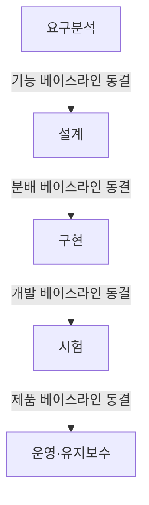
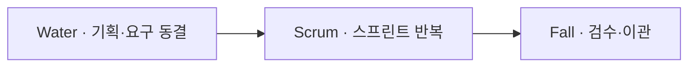

## 지식 로드맵 내 현재 위치

  소프트웨어공학
  개발 방법론·공학 프로세스
  <strong>폭포수 개발 방법론(Waterfall)</strong>

## 30초 인출

- 본질: 소프트웨어 생명주기(SDLC)를 요구분석, 설계, 구현, 시험, 유지보수의 순차적 단계로 명확히 구분하고, 각 단계의 산출물을 공식 검토하여 베이스라인(Baseline)으로 동결한 후 다음 단계로 진행하는 전통적인 계획 주도형 선형 순차 소프트웨어 공학 방법론
- 메커니즘: 요구사항 분석 및 SRS 확정 → 아키텍처 및 상세설계(SDD) → 소스코드 구현 및 단위 검증 → 통합 및 시스템 시험 → 고객 검수 및 품질 게이트 통과
- 산출물: 요구사항 명세서(SRS) · 시스템 설계서(SDD) · 소스코드 및 형상물 · 시험 결과 보고서 · 운영 이관 계획서

핵심 용어

- **선형 순차 모델(Linear Sequential Model)**: 이전 단계의 산출물이 완전히 승인되어야만 다음 단계가 시작되는 비중첩 직렬 진행 아키텍처 모델
- **베이스라인(Baseline)**: 공식적으로 검토·합의되어 향후 개발의 기준점이 되는 특정 시점의 산출물 집합으로, 변경 통제 위원회(CCB) 승인 없이 임의 수정 불가
- **보엠의 변경 비용 곡선(Boehm's Curve)**: 요구분석 단계에서 결함을 수정하는 비용을 1로 볼 때, 테스트 및 운영 단계에서 수정하는 비용은 50~100배 지수 폭증한다는 법칙
- **워터-스크럼-폴(Water-Scrum-Fall)**: 상위 계획/예산 및 최종 검수/배포는 폭포수로 통제하되, 중간 구현 및 테스트는 애자일 스프린트로 반복하는 현대적 절충 모델

---

## 1교시 예상문제 (10점)

> 폭포수 개발 방법론(Waterfall)의 정의와 목적, 핵심 메커니즘을 설명하시오. (예상)

---

## 1교시 10점 답안

### 1. 정의·목적

- 정의: 소프트웨어 생명주기(SDLC)를 요구분석, 설계, 구현, 시험, 유지보수의 순차적 단계로 명확히 구분하고, 각 단계의 산출물을 공식 검토하여 베이스라인(Baseline)으로 동결한 후 다음 단계로 진행하는 전통적인 계획 주도형 선형 순차 소프트웨어 공학 방법론
- 목적: 요구분석부터 유지보수까지 단계를 순차 진행하며 각 단계 산출물을 승인·관리한다.

### 2. 핵심 관계

- 제언: 요구사항 불확실성을 초기에 줄이고 단계별 기준선·변경 통제를 운영하며 위험은 조기 시제품으로 확인한다.
---

## 2~4교시 예상문제 (25점)

> 폭포수 개발 방법론(Waterfall)의 개념과 목적을 설명하고, 핵심 메커니즘과 구성요소·절차, 적용 시 문제점과 대응 방안을 제시하시오. (25점, 예상)

---

## 2~4교시 25점 답안

### 1. 개요 및 필요성

### 계획 주도 개발의 가치와 태생적 한계

국방 무기 체계, 원자력 제어, 대형 공공 인프라, 차세대 금융 계정계처럼 실패가 인명 피해나 천문학적 금융 손실로 직결되는 도메인은 요구사항의 추적성과 문서화가 엄격히 요구된다. 폭포수 모델은 프로젝트 전 과정을 정형화된 단계로 통제하여 높은 예측 가능성을 제공한다.

그러나 프로젝트 극후반부에 이르러서야 실제 동작하는 소프트웨어가 완성되므로, 비즈니스 환경이 급변하거나 고객이 실물을 본 후 요구사항을 뒤엎을 경우 천문학적인 재작업 비용이 발생하는 "빅뱅 리스크"를 안고 있다.

### 폭포수 vs 나선형 vs 애자일 모델 비교

| 구분 | 폭포수 방법론 (Waterfall) | 나선형 모델 (Spiral) | 애자일 방법론 (Agile) |
|---|---|---|---|
| **개발 철학** | **계획 주도 (선형 순차적)** | **위험 분석 주도 (점진적 반복)** | **가치 주도 (유연한 반복과 적응)** |
| **요구사항 고정** | **초기 분석 단계 동결 원칙** | 반복 주기(Spiral)마다 재평가 | 상시 변경 수용 (스프린트 백로그 관리) |
| **동작 SW 출시** | **프로젝트 극후반부 (빅뱅 릴리스)** | 각 주기별 위험 제거 프로토타입 | **1~4주 단위 동작하는 기능 지속 배포** |
| **고객 참여** | 프로젝트 착수 및 최종 검수 시점 집중 | 각 사이클 검토 시점 참여 | **전 개발 스프린트에 걸쳐 상시 참여** |
| **적합한 분야** | **요구사항이 명확한 공공/국방/금융 코어** | 고위험·대규모 R&D 연구 개발 | 시장 변화가 빠른 모바일/웹/SaaS |

### 2. 아키텍처 및 핵심 메커니즘

### 폭포수 방법론 5단계 생명주기 및 베이스라인 체계

폭포수 모델의 핵심은 각 단계가 완료될 때마다 공식 베이스라인을 수립하여 임의 수정을 엄격히 통제하는 데 있다.

### 단계별 주요 태스크 및 핵심 산출물

| 단계 | 주요 태스크 | 핵심 산출물 |
|---|---|---|
| **요구분석** | 이해관계자 인터뷰, 기능 분할, 요구사항 추적 매트릭스(RTM) 구성 | 요구사항 명세서(SRS), 사용자 요구사항 정의서 |
| **설계** | 기본설계(아키텍처·네트워크·DB), 상세설계(클래스·API 규격) | 시스템 아키텍처 설계서(SAD), 데이터베이스 설계서(ERD) |
| **구현** | 시큐어 코딩 규칙 준수 프로그래밍, 정적 코드 검사 | 소스코드, 단위 테스트 케이스 및 결과서 |
| **시험** | 통합 테스트, 성능 부하 시험(BMT), 사용자 인수 시험(UAT) | 통합 테스트 결과서, 결함 조치 리포트, 인수 확인서 |

### 현대적 하이브리드 거버넌스: Water-Scrum-Fall 아키텍처

엄격한 계약·감리 요구와 급변하는 기능 요구를 동시에 수용하기 위해, 현대 엔터프라이즈는 거버넌스와 실행을 분리한 하이브리드 모델을 채택한다. 시작과 끝은 폭포수 거버넌스가 통제하고 가운데 실행만 스프린트로 반복한다.

### 3. 실무 적용 및 고려사항

### 위험 대응 매트릭스

| 위험 | 대책 | 효과 |
|---|---|---|
| 프로젝트 후반부에야 실물 동작을 확인한 발주처의 대규모 요구 변경으로 납기 파행 | 요구분석 단계에서 피그마(Figma) 와이어프레임 및 프로토타이핑(Prototyping) 병행 도입 | 요구사항 오해 100% 해소 및 후반부 변경 요청 60% 감소 |
| 코딩 완료 후 통합 시험 단계에서 인터페이스 불일치 및 잠재 결함이 대량 분출 | 단계별 Fagan 인스펙션(동료 검토) 의무화 및 CI 파이프라인 조기 연동 | 결함 유출 80% 사전 차단 및 재작업 공수 절감 |
| 형식적인 방대한 산출물 작성에 개발 공수의 40% 이상이 매몰되어 실무 생산성 저하 | 모델 기반 시스템 공학(MBSE) 도구 도입 및 경량화 문서 템플릿 표준화 | 서류 작업 공수 50% 절감 및 실무 코딩 집중 |

### 4. 기술사 답안 차별화 포인트

### 하이브리드 거버넌스: 워터-스크럼-폴(Water-Scrum-Fall)

실제 엔터프라이즈 환경에서는 순수 애자일만으로 사업 예산과 계약 일정을 관리하기 어렵다. 기술사 답안에서는 **워터-스크럼-폴(Water-Scrum-Fall)** 모델을 제시한다. 상위 RFP 조달, 요구분석, 전체 아키텍처 수립은 폭포수(Water)로 엄격히 관리하고, 세부 기능 개발과 단위 시험은 2주 단위의 스크럼(Scrum) 스프린트로 빠르게 반복하며, 최종 릴리스 및 감리 검수는 다시 폭포수(Fall) 베이스라인으로 완결 짓는 **현실적 하이브리드 거버넌스**를 답안의 차별화로 제시한다.

### 변경 통제 위원회(CCB)와 영향도 분석 자동화

폭포수 모델의 성패는 변경을 무조건 막는 것이 아니라, "변경을 어떻게 통제하는가"에 달려있다. 요구사항 변경 요청(CR) 접수 시 **형상 관리 도구(Jira/GitLab)와 요구추적표(RTM)를 연동하여 소스코드 및 테스트 케이스에 미치는 변경 영향도(Impact Analysis)**를 자동 산출하는 성숙한 CCB 체계를 결론으로 강조한다.

### 학습자 통찰 메모 — 답안 밖

- [핵심 통찰]: 폭포수 모델은 결코 구시대의 유물이 아니다. 전체 예산 확정과 인허가 심사가 필수적인 공공·국방·금융 사업에서는 폭포수의 '베이스라인 관리'가 유일한 계약적 방패막이다. 다만 구현 과정의 유연성을 결합한 하이브리드 모델(Water-Scrum-Fall)로 진화한 것이다.
- [나라면]: 1교시형 단답 출제 시, 5단계와 베이스라인(기능-분배-개발-제품-운영)을 정확히 연결하고 보엠의 변경 비용 곡선(1:5:10:50:100)을 명시하겠다. 2교시형 서술에서는 폭포수의 치명적 약점인 '빅뱅 리스크'를 해결하기 위해 초기 프로토타이핑과 CCB 기반의 영향도 분석 체계를 엔지니어링 방안으로 제시하겠다.

### 실전 답안용 기술사적 제언

- **판정 기준**: 각 단계 종료 시 산출물 검토율 100% 완료 및 요구사항 추적 매트릭스(RTM) 매핑율 100% 충족 여부
- **대응 방안**: 상위 분석/설계는 폭포수 기준 베이스라인으로 동결하되, 상세 구현은 2주 스프린트의 스크럼 방식을 결합한 Water-Scrum-Fall 파이프라인 정착
- **검증 체계**: 단계별 게이트 검토 회의 → 동료 인스펙션(Fagan) → CCB 변경 영향도 분석 → 최종 감리 검수
- **기대 효과**: 대규모 프로젝트 납기 준수율 95% 이상 달성 및 개발 후반부 변경으로 인한 재작업 비용 50% 절감

### 5. 참고 및 연계 학습

- [애자일 방법론(Agile)](./119_agile_methodology.md)
- [SW 개발 방법론 비교](./139_sw_development_methodologies.md)
- [요구공학(Requirements Engineering)](./040_requirements_engineering.md)
- [형상 관리(Configuration Management)](./011_configuration_management.md)
---
