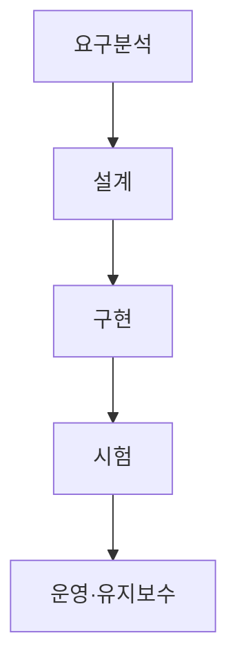
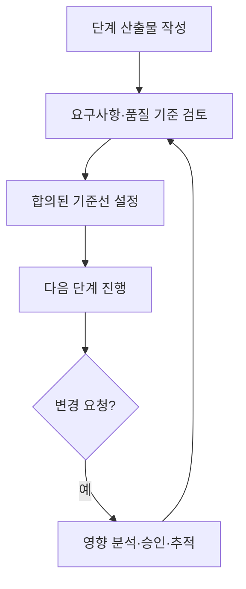

## 학습 위치

소프트웨어공학 → 개발 생명주기 모델 → **폭포수 모델**

## 30초 인출

- **본질**: 폭포수 개발 방법론은 요구분석·설계·구현·시험을 순서대로 진행하고 앞 단계 결과를 다음 단계의 입력으로 삼는 개발 모델
- **메커니즘**: 단계별 작업·산출물 정의 → 검토 → 다음 단계 진행 → 변경 시 앞 단계 영향 확인

핵심 용어

- **폭포수 모델(Waterfall Model)**: 개발 활동을 순차적 단계로 구분해 진행하는 생명주기 모델
- **요구사항 명세서(SRS, Software Requirements Specification)**: 구현·검증할 요구사항을 정리한 문서
- **기준선(Baseline)**: 검토·합의해 이후 변경을 관리할 기준으로 삼은 산출물 상태
- **요구사항 추적성(Requirements Traceability)**: 요구사항과 설계·구현·시험 결과의 연결을 확인할 수 있는 성질
- **변경 영향 분석(Impact Analysis)**: 변경 요청이 일정·비용·설계·시험에 미치는 영향을 살피는 활동
- **점진적 개발(Incremental Development)**: 기능을 여러 증분으로 나누어 개발·검증하는 방식

---

## 1교시 예상문제 (10점)

> 폭포수 개발 방법론의 개념과 단계, 장단점을 설명하시오.

---

## 1교시 10점 답안

### I. 개요

| 구분 | 핵심 |
|---|---|
| 정의 | **폭포수 개발 방법론**: 요구분석·설계·구현·시험을 순차적으로 수행하는 생명주기 모델 |
| 목적 | 단계별 산출물과 검토 기준을 명확히 하여 개발 진행을 관리 |

### II. 기본 흐름

| 강점 | 유의점 |
|---|---|
| 단계·산출물·검토 시점이 명확 | 늦게 드러난 요구 변경에 재작업 가능성 |

**제언**: 요구 불확실성을 초기에 확인하고 단계별 검토와 변경 영향 분석을 연결.

---

## 2~4교시 예상문제 (25점)

> 폭포수 개발 방법론의 구조와 적용 조건을 설명하고, 요구사항 변경·늦은 결함 발견 문제의 대응 방안을 제시하시오.

---

## 2~4교시 25점 답안

### I. 개요

| 구분 | 핵심 |
|---|---|
| 정의 | **폭포수 개발 방법론**: 요구분석·설계·구현·시험을 순차적으로 수행하는 생명주기 모델 |
| 목적 | 단계별 산출물과 검토 기준을 명확히 하여 개발 진행을 관리 |

| 적용 판단 | 확인 항목 |
|---|---|
| 요구의 안정성 | 핵심 기능·수락 기준을 초기부터 합의할 수 있는가? |
| 검토 필요성 | 단계별 산출물과 승인 기록이 중요한가? |

### II. 단계와 산출물

| 단계 | 주요 활동 | 대표 산출물 |
|---|---|---|
| 요구분석 | 기능·품질·수락 기준 정의 | **SRS**, 요구사항 추적표 |
| 설계 | 구조·데이터·인터페이스 정의 | 설계서·인터페이스 명세 |
| 구현 | 코드 작성·단위 검증 | 코드·단위 시험 결과 |
| 시험 | 통합·시스템·인수 검증 | 시험 결과·결함 조치 기록 |

**기준선**은 합의된 산출물을 관리하는 수단이며 모든 단계에서 같은 종류의 기준선을 기계적으로 '동결'하는 것은 아님.

### III. 다른 개발 모델과 비교

| 관점 | 폭포수 | 반복·점진적 개발 |
|---|---|---|
| 작업 구성 | 단계별 순차 진행 중심 | 기능별 반복과 증분 전달 중심 |
| 피드백 시점 | 후속 단계에서 동작 결과 확인 가능 | 각 반복에서 결과 확인 가능 |
| 변경 대응 | 앞 단계 산출물 영향 분석 필요 | 우선순위·반복 계획에 반영 |

계약·문서가 필요한 사업이어도 반복 개발을 병행할 수 있으므로 도메인만으로 한 방법론을 고정하지 않음.

### IV. 검토·변경 통제

| 통제 대상 | 수행 내용 |
|---|---|
| 요구 변경 | 설계·시험·일정에 미치는 영향 검토 |
| 결함 | 발견 단계와 원인 단계 연결, 후속 산출물 수정 |
| 추적성 | 요구사항에서 시험 결과까지 대응 여부 확인 |

### V. 적용상의 한계와 보완

| 한계 | 보완 방안 |
|---|---|
| 실제 사용 결과를 늦게 확인 | 초기 시제품·사용자 검토로 요구 해석 확인 |
| 후속 단계에서 설계 결함 발견 | 단계별 리뷰와 인터페이스 조기 검증 |
| 변경 영향 누적 | 변경 영향 분석과 기준선·추적표 갱신 |

결함 수정 비용이 항상 일정한 배수로 증가한다는 식의 수치화 대신, 발견 시점과 시스템 구조에 따른 재작업 위험을 평가.

### VI. 문제와 해결 방안

| 한계 | 해결 방안 |
|---|---|
| 요구사항이 모호한 채 설계 단계 진입 | 시제품·수락 기준·이해관계자 검토로 조기 확인 |
| 단계 승인 뒤 변경을 사실상 금지 | 영향 분석·승인·기준선 갱신을 통한 통제된 변경 |
| 시험 단계에 결함이 몰림 | 요구·설계 검토와 인터페이스 시험을 앞당겨 수행 |
