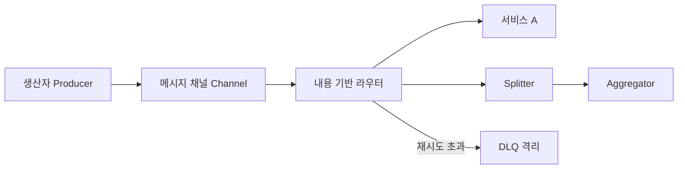
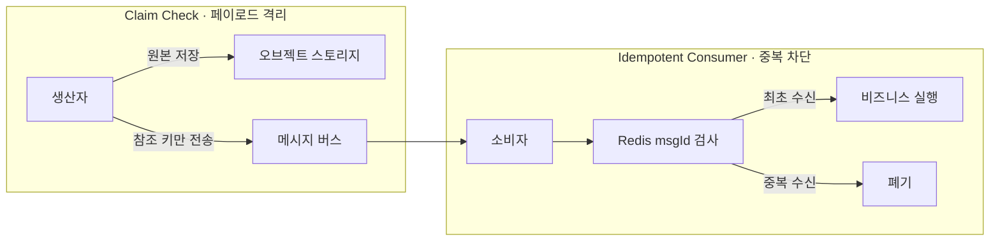

## 지식 로드맵 내 현재 위치

  소프트웨어공학
  소프트웨어 아키텍처·분산 통합 패턴
  <strong>EIP(Enterprise Integration Patterns)</strong>

## 30초 인출

- 본질: 서로 다른 프로토콜과 데이터 포맷을 가진 이기종 엔터프라이즈 시스템 간의 비동기 메시징 통합 시 반복적으로 발생하는 설계 문제를 해결하기 위해, 그레고르 호페(Gregor Hohpe) 등이 65가지 표준 설계 패턴으로 정립한 기술 독립적 통합 아키텍처 패턴 언어
- 메커니즘: 생산자(Producer) 메시지 발행 → 메시지 채널(Channel) 전송 → 내용 기반 라우터(Router) 분기 → 메시지 변환기(Transformer) 포맷 일원화 → 엔드포인트 소비자(Consumer) 수신
- 산출물: EIP 통합 토폴로지 맵 · 메시지 라우팅 명세서 · 데이터 매핑 정의서 · DLQ 장애 격리 운영서

핵심 용어

- **Content-Based Router**: 메시지 페이로드의 데이터 내용이나 헤더 속성값(예: 결제수단, 목적지 국가)을 검사하여 목적지 채널로 동적 분기하는 라우팅 패턴
- **Splitter & Aggregator**: 하나의 거대한 복합 주문 메시지를 여러 개별 아이템 단위로 쪼개어(Splitter) 병렬 처리한 후, 상관관계 ID(Correlation ID)로 다시 하나로 합치는(Aggregator) 패턴
- **Claim Check**: 수십 MB에 달하는 대용량 페이로드는 오브젝트 스토리지(S3)에 저장하고, 메시지 큐에는 해당 참조 키(Key)만 전달하여 메시지 브로커 메모리를 보호하는 패턴
- **Dead Letter Channel(DLQ)**: 최대 재시도 횟수를 초과했거나 포맷 오류로 처리가 불가능한 독성 메시지(Poison Pill)를 별도 큐로 격리하여 메인 파이프라인 마비를 방지하는 패턴
- **Idempotent Consumer**: 수신한 메시지 ID를 분산 캐시에 기록·검사하여 같은 메시지를 한 번만 처리하는 멱등 수신 패턴

---

## 1교시 예상문제 (10점)

> EIP(Enterprise Integration Patterns)의 정의와 목적, 핵심 메커니즘을 설명하시오. (예상)

---

## 1교시 10점 답안

### 1. 정의·목적

- 정의: 서로 다른 프로토콜과 데이터 포맷을 가진 이기종 엔터프라이즈 시스템 간의 비동기 메시징 통합 시 반복적으로 발생하는 설계 문제를 해결하기 위해, 그레고르 호페(Gregor Hohpe) 등이 65가지 표준 설계 패턴으로 정립한 기술 독립적 통합 아키텍처 패턴 언어
- 목적: 메시지 페이로드의 데이터 내용이나 헤더 속성값(예: 결제수단, 목적지 국가)을 검사하여 목적지 채널로 동적 분기하는 라우팅 패턴

### 2. 핵심 관계

- 제언: 메시지 형식·라우팅·변환·오류 처리를 요구에 맞춰 선택하고 관측 가능한 계약으로 운영한다.
---

## 2~4교시 예상문제 (25점)

> EIP(Enterprise Integration Patterns)의 개념과 목적을 설명하고, 핵심 메커니즘과 구성요소·절차, 적용 시 문제점과 대응 방안을 제시하시오. (25점, 예상)

---

## 2~4교시 25점 답안

### 1. 개요 및 필요성

### 점대점(P2P) 스파게티 통합의 파멸과 EIP의 등장

기업 내 시스템이 증가할수록 시스템 간 점대점(Point-to-Point) 직접 연동 방식은 $N(N-1)/2$로 결합도가 폭증하여, 단 하나의 시스템 변경에도 전사 인터페이스가 연쇄 파탄하는 스파게티 구조를 낳는다.

EIP는 파이프 & 필터(Pipe & Filter) 아키텍처를 기반으로, 이기종 시스템 간 비동기 메시지 교환에 필요한 **라우팅, 변환, 채널링, 장애 격리의 65가지 표준 패턴 카탈로그**를 제시하여 전사 시스템의 느슨한 결합(Decoupling)을 완성한다.

### EIP vs ESB vs API Gateway 비교

| 구분 | EIP (Enterprise Integration Patterns) | ESB (Enterprise Service Bus) | API Gateway |
|---|---|---|---|
| **본질 및 위상** | **메시지 기반 시스템 통합을 위한 설계 패턴 카탈로그** | EIP 패턴들을 탑재한 중앙 집중형 미들웨어 제품군 | 마이크로서비스 아키텍처의 전면 단일 진입 창구 |
| **통합 패러다임** | **비동기 이벤트·메시지 지향 (Message-Oriented)** | 무거운 중앙 버스 기반 프로토콜 변환 및 라우팅 | 동기식 REST/gRPC 기반 API 라우팅 및 인가 |
| **구현 라이브러리** | **Apache Camel, Spring Integration** | Mule ESB, Oracle Service Bus, Tibco | Kong, Spring Cloud Gateway, Envoy |
| **아키텍처 위치** | 서비스 내부 또는 서비스 간 경량 메시지 파이프라인 | 전사 레거시 및 ERP/코어 뱅킹 백본 | 외부 클라이언트와 내부 MSA 서비스 경계 |

### 2. 아키텍처 및 핵심 메커니즘

### EIP 메시지 처리 파이프라인 아키텍처

EIP는 파이프 & 필터 스타일을 따라 메시지가 채널을 거치며 라우팅, 변환, 집계되는 일련의 표준 파이프라인을 구축한다.

### EIP 대표 핵심 4대 패턴

| 패턴 | 역할 | 판단 |
|---|---|---|
| **Content-Based Router** | 페이로드 내용 검사 후 수신 채널 동적 분기 | 발신자는 수신자 주소를 몰라도 중앙 채널로만 전송 |
| **Splitter & Aggregator** | 복합 메시지 분할 병렬 처리 후 Correlation ID로 집계 | 대용량 주문서를 아이템 단위로 나눠 처리량 확보 |
| **Claim Check** | 대용량 원본은 오브젝트 스토리지 보관, 참조 키만 전송 | 브로커 메모리 부하 없이 페이로드 경량화 |
| **Dead Letter Channel(DLQ)** | 처리 불가 메시지를 별도 에러 큐로 격리 | 독성 메시지로 인한 정상 처리 블로킹 방지 |

### 고성능 EIP 최적화: Claim Check & Idempotent Consumer 패턴

대규모 엔터프라이즈 환경에서 메시지 브로커의 성능 고갈과 중복 처리를 방지하기 위한 핵심 패턴 연계 구조이다. Claim Check는 페이로드를 스토리지로 격리해 브로커를 보호하고, Idempotent Consumer는 메시지 ID 검사로 중복 소비를 차단한다.

### 3. 실무 적용 및 고려사항

### 위험 대응 매트릭스

| 위험 | 대책 | 효과 |
|---|---|---|
| 네트워크 일시 타임아웃으로 브로커가 메시지를 재전송(At-least-once)하여 결제 중복 승인 사고 발생 | 고유 메시지 ID를 Redis 분산 캐시에 기록하고 중복 여부를 체크하는 Idempotent Consumer 패턴 적용 | 중복 결제 사고 100% 원천 차단 |
| Splitter로 분할된 하위 작업 중 특정 서비스 장애로 응답이 없어 Aggregator 대기열 무한 락 발생 | Completion Timeout(예: 3초) 설정 및 부분 수신 시 폴백(Fallback) 정책 강제화 | 메시지 큐 메모리 고갈 및 파이프라인 동결 방지 |
| 수십 MB 대용량 첨부파일이 Kafka 큐로 직접 쏟아져 브로커 메모리 고갈(OOM) 및 클러스터 마비 | 원본 파일은 S3에 저장하고 다운로드 URI만 메시지에 담아 전송하는 Claim Check 패턴 적용 | 브로커 메모리 사용량 95% 절감 및 처리량 극대화 |

### 4. 기술사 답안 차별화 포인트

### 중앙 모놀리식 ESB의 쇠퇴와 경량 임베디드 EIP(Apache Camel)의 부활

과거 2000년대 온프레미스 엔터프라이즈를 지배했던 중앙 집중식 상용 ESB 솔루션은 단일 장애점(SPOF)과 벤더 종속성으로 인해 마이크로서비스 환경에서 배제되었다. 그러나 그 근간인 EIP 철학은 **Apache Camel, Spring Integration과 같은 경량 프레임워크를 통해 각 마이크로서비스 내부로 임베디드**되어 화려하게 부활했다. 현대 클라우드 네이티브 환경에서 EIP가 어떻게 분산 마이크로서비스 아키텍처와 융합되는지 서술하여 아키텍처 진화 통찰을 보여준다.

### 분산 사가 패턴(Saga Pattern)과 EIP의 결합

마이크로서비스 환경에서 2PC(Two-Phase Commit)의 대안으로 쓰이는 **오케스트레이션 기반 사가 패턴**을 구현할 때, EIP의 **Routing Slip(동적 경로 결정)과 Message Filter, Wire Tap** 패턴이 핵심 엔진으로 쓰인다. 분산 트랜잭션의 보상 흐름을 통제하는 실무적 설계 역량을 답안의 결론으로 제시한다.

### 학습자 통찰 메모 — 답안 밖

- [핵심 통찰]: EIP는 특정 벤더의 상용 소프트웨어가 아니라 객체지향의 GoF 디자인 패턴처럼 분산 메시징 세계의 '표준 문법'이다. 중앙 집중형 ESB는 사라졌을지언정, 마이크로서비스 내부의 Apache Camel과 카프카 스트림즈 안에서 EIP 패턴들은 그대로 살아 숨 쉬고 있다.
- [나라면]: EIP 문제가 나오면 단순 패턴 나열을 피하고, 1단락에 P2P 통합의 $N(N-1)/2$ 복잡도 문제를 지적하겠다. 2단락에서 핵심 4대 패턴(Content-Based Router, Splitter/Aggregator, Claim Check, DLQ)을 도식화하고, 3단락에서 분산 환경의 최대 난제인 '중복 수신 방지(Idempotent Consumer)'와 '사가 오케스트레이션(Routing Slip)' 실무 적용 방안을 제시하겠다.

### 실전 답안용 기술사적 제언

- **판정 기준**: 분산 시스템 간 결합도 제로(완전 비동기 디커플링) 달성 및 메시지 유실율 0%(At-least-once + 멱등성 보장) 달성 여부
- **대응 방안**: 전사 메시징 백본에 EIP 표준 카탈로그(Routing, Splitter, Aggregator)를 적용하고, 대용량 페이로드는 Claim Check, 장애 격리는 DLQ로 이원화
- **검증 체계**: Apache Camel 라우트 단위 테스트 → Chaos Engineering 기반 네트워크 단절 실험 → DLQ 모니터링 알림 검증
- **기대 효과**: 시스템 간 결합도 완벽 해소, 브로커 메모리 부하 90% 이상 절감 및 무중단 비동기 파이프라인 완성

### 5. 참고 및 연계 학습

- [메시지 큐(Message Queue)](./140_message_queue.md)
- [이벤트 주도 아키텍처(EDA)](./078_event_driven_architecture.md)
- [마이크로서비스 아키텍처(MSA)](./035_msa.md)
- [API 게이트웨이(API Gateway)](./075_api_gateway.md)
---
