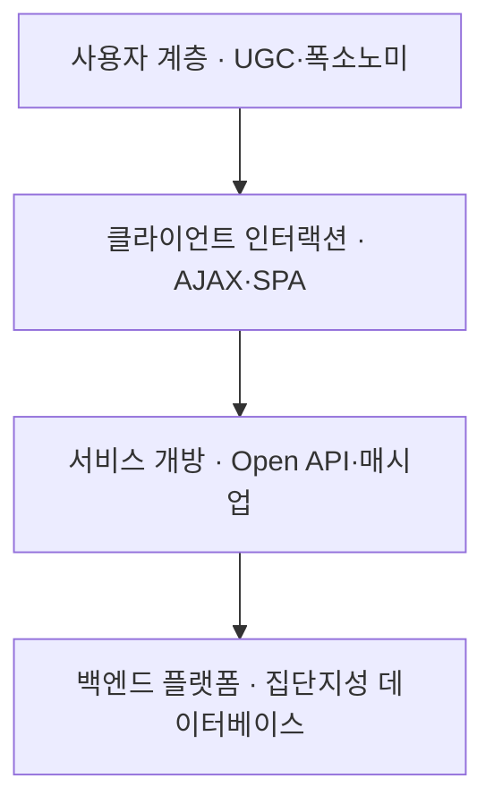
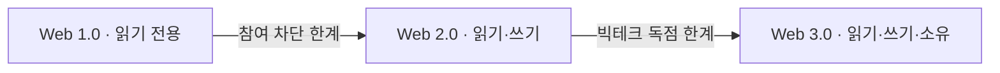

## 지식 로드맵 내 현재 위치

  소프트웨어공학
  웹 아키텍처·인터넷 패러다임
  <strong>Web 2.0</strong>

## 30초 인출

- 본질: 웹 브라우저를 단순한 일방향 문서 열람 도구에서 소프트웨어 실행 플랫폼으로 전환하고, 사용자가 능동적 생산자(Prosumer)로서 콘텐츠를 직접 제작·공유하며, Open API와 AJAX를 통해 집단지성(Collective Intelligence)과 네트워크 효과를 창출하는 개방형 양방향 웹 아키텍처 패러다임
- 메커니즘: 사용자 상호작용 → AJAX 비동기 데이터 교환 → RESTful Open API 호출 및 매시업(Mashup) 서비스 결합 → 집단지성 데이터베이스 축적 → 플랫폼 네트워크 효과 창출
- 산출물: Open API 규격서 · REST 엔드포인트 아키텍처 명세 · 매시업 애플리케이션 · 플랫폼 거버넌스 정책서

핵심 용어

- **플랫폼으로서의 웹(Web as a Platform)**: 소프트웨어를 PC에 설치하지 않고, 웹 브라우저를 실행 환경 삼아 서비스(SaaS) 형태로 기능을 제공하는 아키텍처 철학
- **AJAX(Asynchronous JavaScript and XML)**: 웹 페이지 전체를 다시 로딩하지 않고 백그라운드에서 서버와 비동기적으로 데이터를 교환하는 브라우저 인터랙션 기술
- **매시업(Mashup)**: 공개된 서로 다른 웹 서비스들의 Open API를 조합하여 완전히 새로운 독창적인 서비스를 창출하는 기법 (예: 지도 API + 부동산 매물 데이터)
- **폭소노미(Folksonomy)**: 중앙 집중적 정형 분류 체계(Taxonomy) 대신, 일반 사용자들이 자발적으로 부여한 태그(Tag)를 기반으로 지식을 유연하게 분류하는 집단지성 기법

---

## 1교시 예상문제 (10점)

> Web 2.0의 정의와 목적, 핵심 메커니즘을 설명하시오. (예상)

---

## 1교시 10점 답안

### 1. 정의·목적

- 정의: 웹 브라우저를 단순한 일방향 문서 열람 도구에서 소프트웨어 실행 플랫폼으로 전환하고, 사용자가 능동적 생산자(Prosumer)로서 콘텐츠를 직접 제작·공유하며, Open API와 AJAX를 통해 집단지성(Collective Intelligence)과 네트워크 효과를 창출하는 개방형 양방향 웹 아키텍처 패러다임
- 목적: 웹 브라우저를 단순한 일방향 문서 열람 도구에서 소프트웨어 실행 플랫폼으로 전환하고, 사용자가 능동적 생산자(Prosumer)로서 콘텐츠를 직접 제작·공유하며, Open API와 AJAX를 통해 집단지성(Collective Intelligence)과 네트워크 효과를 창출하는 개방형 양방향 웹 아키텍처 패러다임

### 2. 핵심 관계

- 제언: 참여 기능을 개방할 때 권한·개인정보·신뢰성 통제를 설계하고 사용자 행동으로 개선한다.
---

## 2~4교시 예상문제 (25점)

> Web 2.0의 개념과 목적을 설명하고, 핵심 메커니즘과 구성요소·절차, 적용 시 문제점과 대응 방안을 제시하시오. (25점, 예상)

---

## 2~4교시 25점 답안

### 1. 개요 및 필요성

### 일방향 웹의 한계와 "플랫폼으로서의 웹" 패러다임

과거 Web 1.0은 웹마스터가 제작한 정적 HTML 문서를 사용자가 일방적으로 열람하는 "읽기 전용(Read-Only)" 웹이었다. 소프트웨어는 CD-ROM에 담겨 PC에 설치되었으며, 브라우저는 단순한 뷰어에 불과했다.

팀 오라일리(Tim O'Reilly)가 주창한 Web 2.0은 웹 브라우저를 완벽한 소프트웨어 실행 플랫폼으로 탈바꿈시켰다. 사용자가 직접 데이터를 생산(UGC)하고, 기업은 자사 데이터를 Open API로 개방하여 외부 생태계와 융합함으로써 **"사용자가 늘어날수록 시스템의 가치가 증폭되는 네트워크 효과"**를 실현하였다.

### Web 1.0 vs Web 2.0 vs Web 3.0 핵심 비교

| 구분 | Web 1.0 | Web 2.0 | Web 3.0 |
|---|---|---|---|
| **기본 패러다임** | **읽기 전용 (Read-Only)** | **읽기 및 쓰기 (Read-Write)** | **읽기, 쓰기 및 소유 (Read-Write-Own)** |
| **사용자 역할** | 수동적 정보 소비자 | **능동적 콘텐츠 생산자 (Prosumer)** | 데이터 주권 보유자 및 분산 기여자 |
| **핵심 기술** | 정적 웹 서버, HTML, 디렉터리 포털 | **AJAX, REST Open API, RSS, 클라우드** | 블록체인, DID, 스마트 컨트랙트, 탈중앙 스토리지 |
| **서비스 형태** | 정적 홈페이지, 개인 블로그 | **소셜 미디어(SNS), SaaS, 매시업 플랫폼** | DApp(탈중앙화 앱), DAO, 메타버스 |
| **데이터 소유권** | 사이트 운영 기업 독점 | **중앙 빅테크 플랫폼 독점** | **개인 사용자 분산 소유 (소버린 데이터)** |

### 2. 아키텍처 및 핵심 메커니즘

### Web 2.0 계층별 아키텍처 및 생태계

Web 2.0은 브라우저를 실행 플랫폼 삼아 프론트엔드 비동기 통신과 백엔드 Open API가 유기적으로 맞물리는 4계층 아키텍처를 가진다.

### Web 2.0 4대 기술 기둥

| 기술 기둥 | 역할 | 판단 |
|---|---|---|
| **AJAX** | 백그라운드 비동기 통신으로 화면 깜빡임 없는 앱 경험 제공 | React·Vue 등 SPA 프레임워크의 기술적 근간 |
| **REST Open API** | HTTP 메서드·URI 기반으로 자원을 표준 인터페이스로 개방 | JSON 포맷으로 가볍고 직관적인 데이터 교환 생태계 조성 |
| **매시업(Mashup)** | 서로 다른 Open API를 조립해 신규 서비스 창출 | 지도 API + 부동산 매물처럼 외부 API 결합만으로 플랫폼 구축 |
| **집단지성·폭소노미** | 사용자가 직접 지식을 생산·교정하고 태그로 분류 | 위키백과·지식iN처럼 데이터 자산으로 축적 |

### 웹 패러다임 진화: Web 1.0 vs Web 2.0 vs Web 3.0

사용자 역할과 데이터 주권의 관점에서 웹의 진화 궤적을 비교한다. 앞 세대의 한계가 다음 세대의 전환 동인이 된다.

### 3. 실무 적용 및 고려사항

### 위험 대응 매트릭스

| 위험 | 대책 | 효과 |
|---|---|---|
| 서드파티 개발자에게 개방된 REST Open API로 악의적 매크로 및 DoS 트래픽 폭주 | API Gateway 도입, API Key 발급 및 초당 처리율 제한(Rate Limiting/Throttling) 강제화 | 백엔드 시스템 가용성 100% 보장 및 과부하 차단 |
| 누구나 콘텐츠를 올릴 수 있어 가짜 뉴스, 악성 링크, 저작권 침해 게시물 범람 | AI 기반 텍스트/이미지 유해성 자동 검열 파이프라인 및 집단지성 신고 평판 시스템 연계 | 유해 콘텐츠 유통율 90% 이상 사전 차단 |
| 수많은 비동기 AJAX 호출 간의 타이밍 오차로 인한 화면 상태 불일치(Race Condition) | React/Vue 기반 단방향 데이터 바인딩 및 전역 상태 관리 라이브러리(Zustand, Redux) 적용 | 비동기 상태 동기화 결함 100% 제거 |

### 4. 기술사 답안 차별화 포인트

### 플랫폼 봉건주의의 한계와 탈중앙화 Web 3.0으로의 진화

Web 2.0은 대중의 참여와 공유를 표방했으나, 결과적으로 모든 데이터와 광고 수익이 구글, 메타 등 소수 빅테크 기업에 집중되는 **"플랫폼 봉건주의(Platform Feudalism)"**를 낳았다. 플랫폼 기업의 일방적 계정 정지, 프라이버시 침해, 데이터 독점 폐해가 부각되면서, 블록체인과 영지식 증명 기반으로 사용자에게 데이터 주권과 보상을 되돌려주는 **Web 3.0(탈중앙화 웹)**으로의 필연적 진화 방향을 결론으로 제시한다.

### 금융 마이데이터(MyData)와 현대적 Open API 거버넌스

국내 금융권에서 추진된 **마이데이터(MyData)** 사업은 Web 2.0의 Open API 철학이 국가적 표준 인프라로 안착한 대표 사례이다. 스크래핑 방식의 보안 취약점을 극복하기 위해 금융결제원 표준 Open API와 OAuth 2.0 인가 체계를 구축한 실무 사례를 답안에 접목하여 정책적·기술적 식견을 입증한다.

### 학습자 통찰 메모 — 답안 밖

- [핵심 통찰]: Web 2.0은 기술의 발명이 아니라 '웹을 어떻게 바라볼 것인가'에 대한 패러다임 시프트다. 브라우저를 단순 렌더러에서 운영체제(OS) 수준의 런타임 플랫폼으로 격상시켰고, 이것이 오늘날의 SaaS, 마이데이터, 클라우드 네이티브의 직접적인 뿌리가 되었다.
- [나라면]: 1교시형 단답 시 참여·공유·개방의 3대 철학과 AJAX, Open API, 매시업의 3대 기술 축을 깔끔한 매트릭스로 정리하겠다. 2교시형 출제 시에는 Web 2.0의 결실인 플랫폼 경제가 봉건주의적 데이터 독점으로 이어졌음을 비판하고, 데이터 주권을 사용자에게 환원하는 Web 3.0과 국내 금융 마이데이터 거버넌스를 대비하여 깊이 있는 통찰을 보여주겠다.

### 실전 답안용 기술사적 제언

- **판정 기준**: Open API 호출 응답시간 p95 200ms 이하 달성 및 서드파티 매시업 연동 시 데이터 무결성 99.99% 보장 여부
- **대응 방안**: 클라이언트 측 AJAX/SPA 비동기 최적화와 함께, 백엔드에는 API Gateway 기반의 Throttling 및 OAuth 2.0 인가 체계 강제화
- **검증 체계**: OpenAPI 스펙 정합성 검사 → 부하 테스트(JMeter/k6) → AI 기반 유해물 자동 필터링 → SLA 모니터링
- **기대 효과**: 외부 서드파티 생태계 확장을 통한 네트워크 가치 극대화 및 대규모 동시 트래픽 환경의 서비스 무중단 안정성 확보

### 5. 참고 및 연계 학습

- [REST(Representational State Transfer)](./015_rest.md)
- [오픈 API(Open API)](./022_open_api.md)
- [AJAX 비동기 통신](./199_ajax.md)
- [API 게이트웨이(API Gateway)](./075_api_gateway.md)
---
