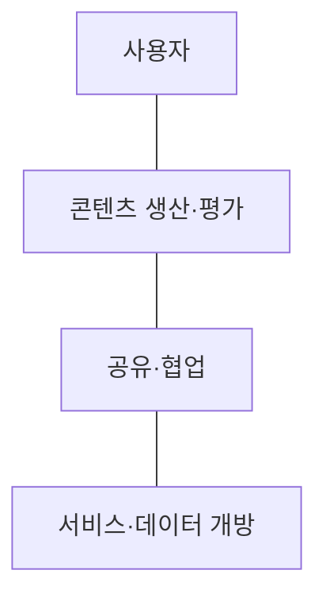
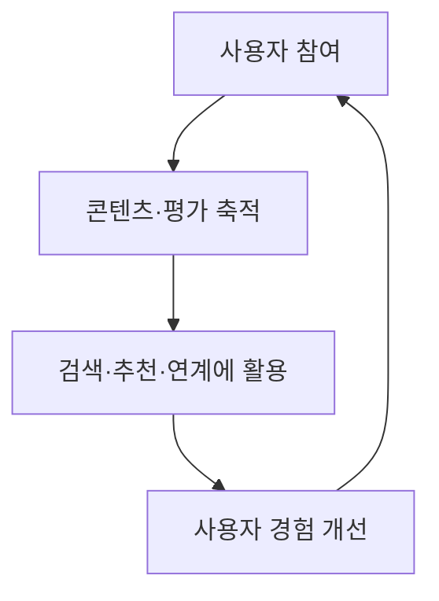

## 학습 위치

소프트웨어공학 → 웹 서비스 발전 → **Web 2.0**

## 30초 인출

- **본질**: Web 2.0은 사용자가 웹에서 콘텐츠를 만들고 공유하며 서비스가 참여·연결을 통해 발전하는 웹 활용 방식
- **메커니즘**: 사용자 참여 → 콘텐츠·데이터 축적 → 공개 인터페이스를 통한 서비스 결합 → 피드백·재사용

핵심 용어

- **Web 2.0**: 사용자 참여·공유·개방을 강조하는 웹 서비스의 발전 양상
- **사용자 생성 콘텐츠(UGC, User-Generated Content)**: 서비스 운영자 외에 사용자가 직접 만든 글·사진·영상 등
- **플랫폼으로서의 웹(Web as a Platform)**: 웹이 단순 문서 전달을 넘어 서비스와 데이터가 결합되는 기반이 된다는 관점
- **오픈 API(Open API)**: 외부에서 서비스 기능·데이터를 정해진 조건으로 사용할 수 있도록 공개한 인터페이스
- **매시업(Mashup)**: 여러 서비스의 기능·데이터를 조합해 만든 서비스
- **폭소노미(Folksonomy)**: 사용자가 직접 부여한 태그를 이용해 정보를 분류하는 방식
- **AJAX(Asynchronous JavaScript and XML)**: 페이지 전체를 다시 받지 않고 필요한 데이터를 비동기로 주고받는 웹 개발 방식

---

## 1교시 예상문제 (10점)

> Web 2.0의 개념과 핵심 특징을 설명하시오.

---

## 1교시 10점 답안

### I. 개요

| 구분 | 핵심 |
|---|---|
| 정의 | **Web 2.0**: 사용자 참여·공유·개방을 통해 콘텐츠와 서비스가 발전하는 웹 활용 방식 |
| 목적 | 이용자가 정보 생산·연결에 참여하고 웹의 데이터를 재사용할 수 있도록 함 |

### II. 핵심 특징

| 특징 | 사용자·서비스에서 보이는 모습 |
|---|---|
| 참여 | 이용자가 글·태그·평가 등 콘텐츠 생산 |
| 공유 | 이용자 간 콘텐츠 전파·협업 |
| 개방 | **오픈 API** 등을 통한 데이터·기능 연계 |

**제언**: 참여·개방 기능과 함께 콘텐츠 신뢰성·접근 권한·개인정보 처리 기준을 설계.

---

## 2~4교시 예상문제 (25점)

> Web 2.0의 개념과 핵심 특징을 설명하고, 기술적 구현 요소와 서비스 운영상 고려사항을 제시하시오.

---

## 2~4교시 25점 답안

### I. 개요

| 구분 | 핵심 |
|---|---|
| 정의 | **Web 2.0**: 사용자 참여·공유·개방을 통해 콘텐츠와 서비스가 발전하는 웹 활용 방식 |
| 목적 | 이용자가 정보 생산·연결에 참여하고 웹의 데이터를 재사용할 수 있도록 함 |

| 관점 | 이전의 일반적 웹 서비스 | Web 2.0의 강조점 |
|---|---|---|
| 정보 흐름 | 운영자가 게시하고 이용자가 소비 | 이용자가 생산·평가·재배포에 참여 |
| 서비스 경계 | 한 사이트의 기능 중심 | 외부 기능·데이터와 연계 |

이 구분은 시대의 모든 웹사이트를 양분하는 절대적 분류가 아니라 서비스 설계 경향의 비교.

### II. 핵심 특징

| 특징 | 사용자·서비스에서 보이는 모습 |
|---|---|
| 참여 | 이용자가 글·태그·평가 등 콘텐츠 생산 |
| 공유 | 이용자 간 콘텐츠 전파·협업 |
| 개방 | **오픈 API** 등을 통한 데이터·기능 연계 |

실선은 상호 연관된 특징의 묶음이며 필수 실행 순서를 뜻하지 않음.

### III. 구현 요소

| 요소 | 기여 | 예 |
|---|---|---|
| **UGC** | 사용자가 직접 콘텐츠 축적 | 위키·후기·영상 |
| **폭소노미** | 이용자 태그로 탐색·분류 | 사용자 태그 |
| **AJAX** | 필요한 데이터를 비동기로 갱신 | 검색 제안·댓글 갱신 |
| **오픈 API** | 외부의 기능·데이터 활용 | 지도·결제 등 연계 |
| **매시업** | 기존 서비스를 조합해 새로운 경험 제공 | 지도와 위치 데이터 결합 |

**AJAX**나 **오픈 API**는 Web 2.0을 가능하게 하는 수단이며 모든 Web 2.0 서비스의 필수 구현 요소는 아님.

### IV. 참여와 서비스 개선 흐름

| 운영 판단 | 확인 사항 |
|---|---|
| 참여 유도 | 기여·수정·신고가 쉬운가? |
| 품질 유지 | 오류·스팸·저작권 문제를 관리하는가? |
| 개방 범위 | 사용 조건·호출 제한·데이터 권한을 명시하는가? |

### V. 적용 범위와 한계

| 적용 | 이점 | 주의점 |
|---|---|---|
| 커뮤니티·지식 공유 | 다양한 이용자의 지식 축적 | 허위 정보·악성 게시물 |
| 외부 서비스 연계 | 기능·데이터 조합 | 외부 API 변경·장애 의존 |
| 개인화·추천 | 참여 데이터 활용 | 개인정보·편향·투명성 |

Web 3.0을 Web 2.0의 필연적인 다음 단계나 모든 플랫폼 문제의 자동 해결책으로 단정하지 않음.

### VI. 문제와 해결 방안

| 문제 | 해결 방안 |
|---|---|
| 사용자 콘텐츠의 품질·권리 문제 | 신고·검토·수정 절차와 권리 정책 마련 |
| 외부 연계로 권한·데이터 노출 | API 인증·인가와 최소 공개 범위 적용 |
| 서비스 활용이 특정 플랫폼에 집중 | 데이터 반출·상호운용성 조건을 설계 단계에서 검토 |
