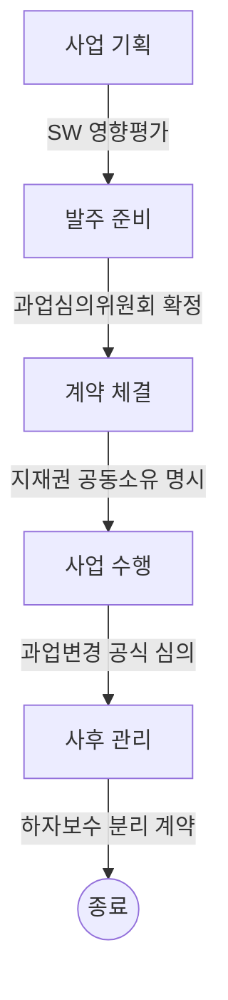
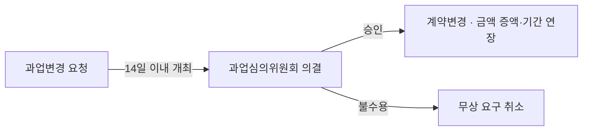

## 지식 로드맵 내 현재 위치

  소프트웨어공학
  소프트웨어 법제도·공공 거버넌스
  <strong>공공SW사업 법제도 가이드 (NIPA)</strong>

## 30초 인출

- 본질: 개정 소프트웨어진흥법을 바탕으로 불명확한 요구사항 발주, 무상 과업 추가, 강제 파견 상주 등 공공SW 시장의 고질적 불공정 관행을 타파하고, 'SW 제값 주기'와 수주자 권익을 보호하기 위해 정보통신산업진흥원(NIPA)이 기획부터 사후관리까지 전 주기 절차를 체계화한 국가 표준 사업 집행 지침
- 메커니즘: 사업 기획(SW사업 영향평가) → 발주 준비(과업심의위원회 확정 및 상용SW 직접구매) → 계약(지식재산권 공동소유) → 수행(원격지 개발 및 과업변경 공식 심의) → 사후관리(하자보수 분리)
- 산출물: SW사업 영향평가 검토서 · 과업심의위원회 심의의결서 · 원격지 개발 보안계획서 · 과업변경 계약변경서

핵심 용어

- **과업심의위원회**: 공공SW사업의 과업 내용 확정, 적정 사업기간 산정, 계약 후 과업 변경에 따른 금액 및 기간 조정을 의무적으로 심의·의결하는 법적 위원회
- **SW사업 영향평가**: 공공기관이 소프트웨어 개발 사업을 기획할 때, 민간 시장에 이미 존재하는 상용 제품과의 중복 여부 및 시장 침해 가능성을 사전 검토하는 제도
- **상용SW 직접구매(분리발주)**: 총사업비 3억 원 이상 공공사업 중 2천만 원 이상의 상용SW를 통합 SI 용역에 묶지 않고 발주기관이 제조사로부터 직접 분리하여 구매하는 제도
- **원격지 개발**: 수주 사업자가 발주기관 청사에 상주 파견되지 않고, 보안 요건을 충족하는 자체 사무실이나 제3의 작업장에서 SW를 개발하는 제도

## 1. 개요 및 필요성

### 공공SW 시장의 구조적 악순환과 법제도 가이드의 등장

대한민국 공공SW 시장은 장기간 "불명확한 RFP 발주 → 무상 과업 추가 → 잦은 납기 지연 및 수주기업 적자 → 핵심 개발자 이탈 및 공공 시스템 품질 붕괴"라는 참담한 악순환에 빠져 있었다.

정보통신산업진흥원(NIPA)의 공공SW사업 법제도 가이드는 개정 **소프트웨어진흥법**을 현장에 착근시키기 위해 기획부터 검수까지 발주자와 수주자가 준수해야 할 5대 핵심 제도를 강제화하여 **SW 제값 주기 실현과 건전한 산업 생태계 상생**을 도모한다.

### 공공SW사업 5대 핵심 제도 체계

| 핵심 제도 | 관련 법조항 | 목적 및 핵심 내용 |
|---|---|---|
| **SW사업 영향평가** | 소프트웨어진흥법 제43조 | 민간 소프트웨어 시장 침해 방지 및 상용 소프트웨어 도입 우선 검토 |
| **과업심의위원회** | 소프트웨어진흥법 제50조 | **사업 발주 전 과업 내용/기간 확정, 수행 중 과업 변경 및 금액 조정 의무 심의** |
| **적정 사업기간 산정** | 소프트웨어진흥법 제45조 | 무리한 납기 설정으로 인한 부실 방지 (적정 개발기간 산정 공식 준수) |
| **상용SW 직접구매** | 소프트웨어진흥법 제54조 | 상용SW 단가 깎기(후려치기) 방지 및 제조사 유지보수 권리 보장 |
| **원격지 개발 활성화** | 소프트웨어진흥법 제49조 | 발주처 상주 강요 금지, 수주자가 제안한 보안 작업장소 상호협의 원칙 |

## 2. 아키텍처 및 핵심 메커니즘

### 공공SW사업 전 생명주기 법제도 프로세스

공공SW사업은 기획부터 사후관리까지 5단계에 걸쳐 법적 통제 장치가 의무화되어 있다.

### 위원회 및 감리제도 비교

| 구분 | 과업심의위원회 | 계약심의위원회 | 공공 감리제도 |
|---|---|---|---|
| **법적 근거** | 소프트웨어진흥법 제50조 | 국가계약법 제28조의2 | 전자정부법 제57조 |
| **주요 심의 내용** | **과업 내용 확정, 과업 변경 및 계약금액 조정** | 입찰 참가자격 제한, 입찰 담합 분쟁 | 시스템 품질, 아키텍처, 성능, 보안 점검 |
| **개최 시점** | 발주 전(사전 심의), 개발 수행 중(변경 시) | 입찰 담합 또는 부정당 제재 발생 시 | 3단계 감리 (착수, 중간, 종료) |
| **참여 위원** | SW 기술 전문가, 학계, 발주기관 담당자 | 조달·법률·회계 전문가 | 공인 감리법인 소속 수석감리원 |

### 과업변경심의위원회 공식 심의 및 통제 메커니즘

수행 중 발생하는 요구사항 변경을 제도화하여 수주사의 부당한 무상 노동을 방지하는 핵심 절차이다. 발주자·수주자 어느 쪽 요청이든 심의를 거치지 않은 무상 과업 추가는 성립하지 않는다.

## 3. 실무 적용 및 고려사항

### 위험 대응 매트릭스

| 위험 | 대책 | 효과 |
|---|---|---|
| 발주기관이 예산 부족을 이유로 과업심의위원회를 미개최하고 서면 갈음하여 무상 과업 강요 | 수주사의 공식 과업변경 심의 신청권 발동 및 공공SW 모니터링단 신고 연계 | 부당 무상 과업 100% 원천 차단 및 정당 대가 수령 |
| 발주처 담당자가 보안 규정을 구실로 원격지 개발을 부당 반려하고 100% 청사 파견 상주 강요 | VDI(가상 데스크톱), VPN, 화면 캡처 방지, DLP가 결합된 표준 원격 보안 모델 선제 제시 | 원격지 개발 승인율 90% 이상 확보 및 근무 환경 개선 |
| 상용SW 직접구매(분리발주) 품목과 SI 시스템 간 인터페이스 연동 결함 시 책임 공방 발생 | 사업 착수 직후 인터페이스 PoC 의무화 및 소프트웨어 분리발주 연계 상생 협약 체결 | 책임 소재 명확화 및 연동 결함 조기 격리 |

## 4. 기술사 답안 차별화 포인트

### 디지털서비스 전문계약제도와의 시너지

과거 6개월 이상 걸리던 공공 조달 입찰 절차를 탈피하여, 공공 클라우드 SaaS를 며칠 만에 수의계약으로 도입할 수 있는 **'디지털서비스 전문계약제도'**와의 연계성을 강조한다. 구축형 SI 사업 위주의 공공 시장을 상용 클라우드 SaaS 구독형 모델로 전환하여 민간 소프트웨어 생태계를 활성화하는 미래지향적 정책 제언을 제시한다.

### 원격지 개발을 위한 공공 DevSecOps 플랫폼 구축

원격지 개발이 현장에서 기피되는 근본 원인은 공공기관의 보안 유출 공포이다. 기술사 답안에서는 조달청이나 행정안전부가 주도하여 **"공공 표준 보안 클라우드 DevSecOps 플랫폼"**을 제공하고, 모든 소스코드와 빌드 파이프라인을 국가 공인 클라우드 격리망 내에서만 다루도록 하는 **인프라 혁신 대안**을 결론으로 제언한다.

### 학습자 통찰 메모 — 답안 밖

- [핵심 통찰]: 공공SW 법제도 가이드는 '을의 눈물'을 닦아주기 위한 정책에 그치지 않고, 공공 정보화 사업의 품질을 근본적으로 보장하기 위한 공학적 거버넌스 체계다. 제값을 주지 않고 무상 과업을 강요하면 반드시 차세대 시스템 오픈 장애로 이어진다.
- [나라면]: 1교시형 단답 시 5대 핵심 제도(영향평가, 과업심의, 적정기간, 직접구매, 원격지개발)의 법조항과 목적을 한눈에 표로 정리하겠다. 2교시형 출제 시에는 과업변경 절차의 실효성을 높이기 위한 수주사의 심의신청권과, 원격지 개발을 안착시키기 위한 정부 주도 보안 클라우드 DevSecOps 인프라 대안을 기술사적 해법으로 제시하겠다.

### 실전 답안용 기술사적 제언

- **판정 기준**: 발주 전 과업심의위원회 개최율 100% 및 과업 변경 시 계약금액/기간 반영률 100% 충족 여부
- **대응 방안**: 사업 착수 단계에서 과업 범위를 기능점수(FP) 기반으로 세분화하고, 변경 발생 시 14일 이내 과업변경심의위원회를 가동하는 상생 거버넌스 수립
- **검증 체계**: 사전 과업 심의의결서 확인 → 상용SW 직접구매 목록 조달청 등록 → 과업변경 시 계약 증액 체결 → 3단계 공공 감리 검수
- **기대 효과**: 공공SW 제값 주기 정착, 수주사 개발 생산성 30% 향상 및 무리한 납기 단축으로 인한 개통 장애 원천 방지

## 5. 참고 및 연계 학습

- [과업심의위원회](./048_task_deliberation_committee.md)
- [상용SW 직접구매 제도](./101_commercial_sw_direct_purchase.md)
- [원격지 개발 가이드라인](./103_remote_development.md)
- [기능 점수(Function Point) 산정](./130_function_point.md)
