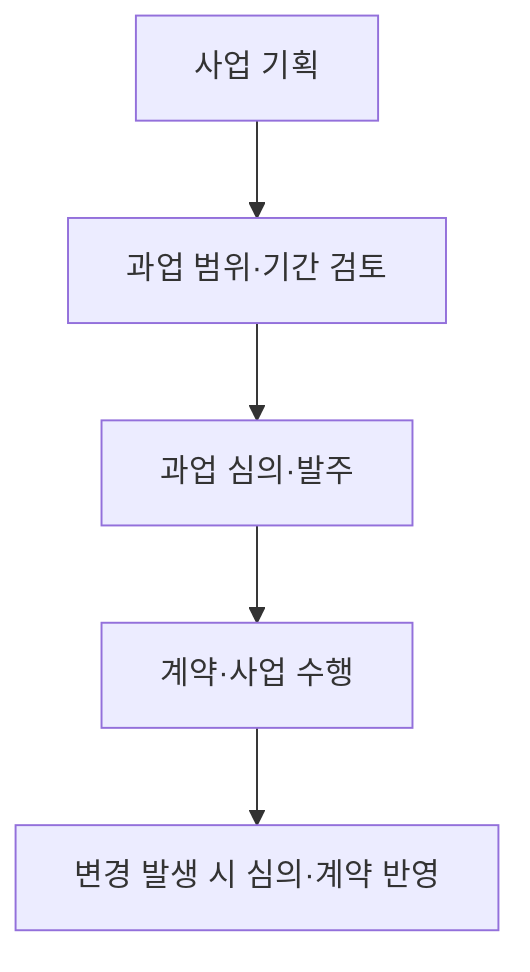
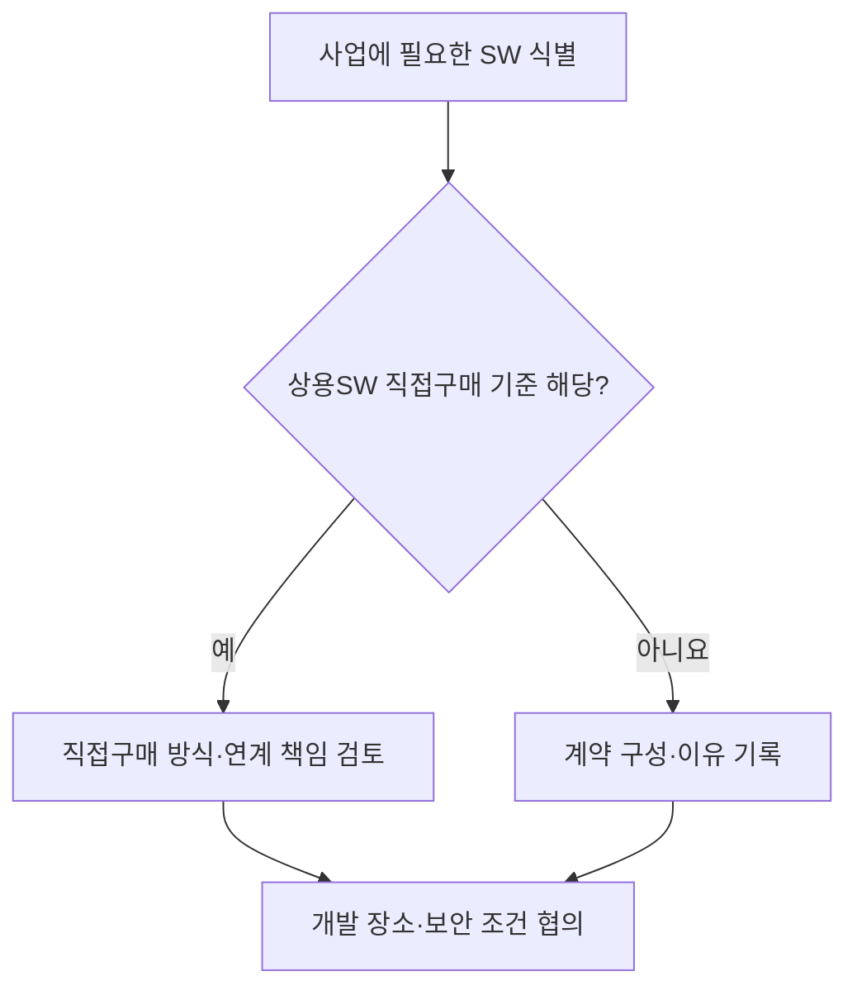

## 학습 위치

소프트웨어공학 → 공공 SW사업 → **법제도 적용**

## 30초 인출

- **본질**: 공공SW사업 법제도 가이드는 발주·계약·수행 단계에서 적용할 소프트웨어 진흥법령과 실무 절차를 연결해 안내하는 자료
- **메커니즘**: 사업 기획 → 과업 범위·기간 결정 → 과업 심의·발주 → 수행·변경 심의 → 검수·기록

핵심 용어

- **공공SW사업 법제도 가이드**: 공공 소프트웨어 사업에 적용할 법령·고시와 발주 실무를 연결하는 안내 자료; 법령 자체는 아님
- **NIPA(National IT Industry Promotion Agency, 정보통신산업진흥원)**: 공공 SW사업의 법제도 안내·지원 자료를 제공하는 기관
- **소프트웨어 진흥법**: 소프트웨어 산업 진흥과 공공 소프트웨어 사업의 발주·수행 등에 관한 법률
- **SW사업 영향평가**: 공공 SW사업이 민간 SW 시장에 미치는 영향을 사업 기획 단계에서 검토하는 제도
- **과업심의위원회**: 공공 SW사업의 과업 내용 확정과 변경 및 계약금액·기간 조정 사항을 심의하는 위원회
- **상용SW 직접구매**: 정해진 기준에 따라 발주기관이 사업에 쓰는 상용 소프트웨어를 직접 구매하는 제도
- **원격지 개발**: 사업자가 발주기관 외의 장소에서 보안 요건을 고려해 개발하는 수행 형태

---

## 1교시 예상문제 (10점)

> 공공SW사업 법제도 가이드의 목적과 발주·수행 단계의 주요 제도를 설명하시오.

---

## 1교시 10점 답안

### I. 개요

| 구분 | 핵심 |
|---|---|
| 정의 | **공공SW사업 법제도 가이드**: 공공 SW사업의 기획·발주·수행에 적용할 법제도와 실무 절차를 안내하는 자료 |
| 목적 | 과업 범위·대가·수행 조건을 명확히 하고 관련 법령 준수 지원 |

### II. 주요 적용 지점

| 단계 | 주요 제도·판단 |
|---|---|
| 기획 | **SW사업 영향평가**, 과업 범위·적정 기간 검토 |
| 발주 | **과업심의위원회**, **상용SW 직접구매** 대상 확인 |
| 수행 | 과업 변경 심의, 수행 장소·보안 조건 협의 |

**제언**: 안내 자료의 문구만 따르지 말고 사업 시점의 현행 법령·고시와 심의 결과를 확인.

---

## 2~4교시 예상문제 (25점)

> 공공SW사업 법제도 가이드의 위치와 주요 제도를 설명하고, 과업 범위·계약 변경을 통제하는 방안을 제시하시오.

---

## 2~4교시 25점 답안

### I. 개요

| 구분 | 핵심 |
|---|---|
| 정의 | **공공SW사업 법제도 가이드**: 공공 SW사업의 기획·발주·수행에 적용할 법제도와 실무 절차를 안내하는 자료 |
| 목적 | 과업 범위·대가·수행 조건을 명확히 하고 관련 법령 준수 지원 |

| 규범·자료 | 역할 |
|---|---|
| **소프트웨어 진흥법**·시행령·고시 | 사업에 적용할 법적 의무와 세부 기준 |
| **NIPA** 등의 안내 자료 | 제도별 실무 적용·점검을 돕는 설명 |

가이드는 현행 법령의 대체물이 아니며 개정 여부와 사업 유형을 함께 확인.

### II. 사업 단계별 주요 제도

| 단계 | 주요 제도·판단 |
|---|---|
| 기획 | **SW사업 영향평가**, 과업 범위·적정 기간 검토 |
| 발주 | **과업심의위원회**, **상용SW 직접구매** 대상 확인 |
| 수행 | 과업 변경 심의, 수행 장소·보안 조건 협의 |

### III. 과업 범위·변경 통제

| 시점 | 확인 사항 | 기록 |
|---|---|---|
| 발주 전 | 개발 범위·요구사항·기간의 명확성 | 과업 내용·심의 결과 |
| 수행 중 | 변경의 범위·일정·대가 영향 | 변경 요청·영향 분석 |
| 변경 확정 | 심의 결과의 계약 반영 여부 | 계약 변경·이력 |

**소프트웨어 진흥법 제50조**는 과업 내용 확정과 변경에 따른 계약금액·계약기간 조정을 **과업심의위원회** 심의 대상으로 규정. 심의 결과의 반영에는 법령상 예외와 절차를 함께 확인.

### IV. 상용SW 구매와 개발 장소

| 쟁점 | 핵심 판단 |
|---|---|
| **상용SW 직접구매** | 법령·고시의 적용 기준과 구매·연계 책임 확인 |
| **원격지 개발** | 사업자의 수행 장소 제안과 발주기관의 보안 요건 검토 |

금액 기준이나 특정 보안 도구를 모든 사업에 공통으로 적용한다고 단정하지 않음.

### V. 증빙과 점검

| 점검 대상 | 확인할 자료 |
|---|---|
| 사업 기획 | 영향평가·요구사항·기간 산정 근거 |
| 과업 심의 | 심의 요청·의결·계약 반영 이력 |
| 구매·연계 | 상용SW 구매 판단과 인터페이스 책임 |
| 수행 장소 | 장소 제안·보안 조건·합의 결과 |

정량 효과를 임의로 약속하기보다 대상 사업의 절차·계약·증빙이 연결됐는지 확인.

### VI. 문제와 해결 방안

| 문제 | 해결 방안 |
|---|---|
| 과업 범위가 모호해 무상 추가 업무 분쟁 | 요구사항·수락 기준과 변경 심의·계약 조정 경로 명시 |
| 가이드의 과거 기준을 현행 법령처럼 사용 | 사업 착수 시점의 법률·시행령·고시 대조 |
| 직접구매 SW와 구축 사업의 연계 책임 불명 | 구매·구축·시험 단계의 인터페이스 책임 합의 |

### 참고 자료

- [국가법령정보센터, 소프트웨어 진흥법](https://www.law.go.kr/lsInfoP.do?lsId=000751)
