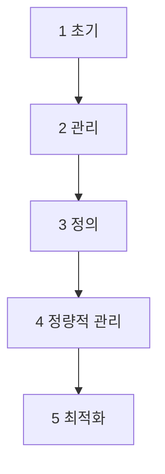
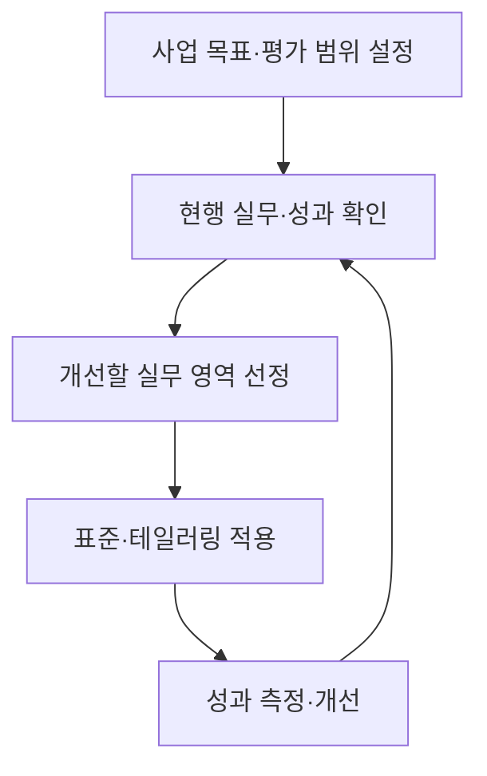

## 학습 위치

소프트웨어공학 → 프로세스 개선·평가 → **CMMI**

## 30초 인출

- **본질**: CMMI는 조직의 개발·서비스 수행 역량을 공통 실무 모델로 평가하고 개선하는 체계
- **메커니즘**: 목표·범위 설정 → 수행 방식 평가 → 개선할 실무 선정 → 적용·성과 측정 → 재평가

핵심 용어

- **CMMI(Capability Maturity Model Integration)**: 조직의 업무 수행 역량과 프로세스를 개선·평가하기 위한 모델
- **성숙도 수준(Maturity Level)**: 조직의 적용 범위에 대해 정해진 실무 집합을 단계적으로 평가한 수준
- **능력 수준(Capability Level)**: 특정 실무 영역의 수행 역량을 나타내는 수준
- **실무 영역(Practice Area)**: 관련 실무를 묶은 CMMI 모델의 구성 단위
- **테일러링(Tailoring)**: 조직 표준을 프로젝트 특성에 맞게 조정하는 활동
- **정량적 관리(Quantitative Management)**: 측정과 통계적 기법으로 프로세스 변동·성과를 관리하는 방식

---

## 1교시 예상문제 (10점)

> CMMI의 개념과 성숙도 수준을 설명하시오.

---

## 1교시 10점 답안

### I. 개요

| 구분 | 핵심 |
|---|---|
| 정의 | **CMMI**: 조직의 수행 역량을 실무 모델로 평가·개선하는 체계 |
| 목적 | 조직의 프로세스 성과와 예측 가능성을 단계적으로 향상 |

### II. 성숙도 수준

| 수준 | 핵심 상태 |
|---|---|
| 1 초기 | 수행 방식이 예측하기 어렵고 반응적 |
| 2 관리 | 프로젝트 단위의 계획·수행·측정·통제 |
| 3 정의 | 조직 표준을 적용·조정 |
| 4 정량적 관리 | 데이터·통계에 근거한 성과 관리 |
| 5 최적화 | 성과에 근거한 지속적 개선 |

**제언**: 수준 달성 자체보다 사업 목표와 연결되는 실무·성과 지표를 우선 개선.

---

## 2~4교시 예상문제 (25점)

> CMMI의 개념과 성숙도 수준을 설명하고, 조직의 프로세스 개선에 적용하는 방법과 유의점을 제시하시오.

---

## 2~4교시 25점 답안

### I. 개요

| 구분 | 핵심 |
|---|---|
| 정의 | **CMMI**: 조직의 수행 역량을 실무 모델로 평가·개선하는 체계 |
| 목적 | 조직의 프로세스 성과와 예측 가능성을 단계적으로 향상 |

| 적용 질문 | 판단 내용 |
|---|---|
| 무엇을 개선할 것인가? | 품질·납기·변경 대응 등 사업 목표 |
| 어디에 적용할 것인가? | 조직·사업·실무 영역의 평가 범위 |

### II. 성숙도 수준

| 수준 | 핵심 상태 |
|---|---|
| 1 초기 | 수행 방식이 예측하기 어렵고 반응적 |
| 2 관리 | 프로젝트 단위의 계획·수행·측정·통제 |
| 3 정의 | 조직 표준을 적용·조정 |
| 4 정량적 관리 | 데이터·통계에 근거한 성과 관리 |
| 5 최적화 | 성과에 근거한 지속적 개선 |

단계가 높다고 특정 제품 품질이나 프로젝트 성공이 자동 보장되는 것은 아님.

### III. 성숙도와 능력 수준

| 관점 | 평가 범위 | 활용 |
|---|---|---|
| **성숙도 수준** | 정해진 실무 영역 집합을 조직 범위에서 평가 | 조직 차원의 단계적 개선 경로 |
| **능력 수준** | 선택한 실무 영역의 수행 수준 | 특정 병목 영역의 집중 개선 |

모델 버전과 평가 방식에 따라 세부 수준·적용 범위가 달라질 수 있으므로 평가 시 사용한 공식 모델을 확인.

### IV. 조직 개선 적용 흐름

| 단계 | 증거 |
|---|---|
| 현행 평가 | 실제 작업 방식·결과·장애 원인 |
| 개선 실행 | 담당·절차·도구·교육의 변경 |
| 성과 확인 | 품질·납기·재작업 등 목표 지표의 추세 |

### V. 정량적 관리의 역할

| 관리 대상 | 확인할 질문 |
|---|---|
| 프로세스 변동 | 측정값의 변화가 우연인지 구조적 원인인지? |
| 성과 예측 | 현재 수행 방식이 목표 달성에 충분한지? |
| 개선 효과 | 조치 이후 실제 성과가 나아졌는지? |

**정량적 관리**는 수준 4의 특징이지만 모든 실무에 같은 관리도나 임의의 통과율을 강제하는 뜻은 아님.

### VI. 문제와 해결 방안

| 문제 | 해결 방안 |
|---|---|
| 평가용 문서만 만들고 실제 수행은 바뀌지 않음 | 실제 프로젝트 작업 기록과 성과를 개선 근거로 사용 |
| 조직 표준을 모든 팀에 동일하게 적용 | 위험·규모·방식에 맞게 **테일러링**하고 결과 확인 |
| 수준 상승을 사업 성과로 오인 | 품질·납기 등 목표 지표와 평가 결과를 함께 추적 |

### 참고 자료

- [CMMI Institute, Levels of Capability and Performance](https://dev.cmmiinstitute.com/learning/appraisals/levels)
- [ISACA, CMMI Model Quick Reference Guide](https://www.isaca.org/resources/reference-guide/cmmi-model-quick-reference-guide)
