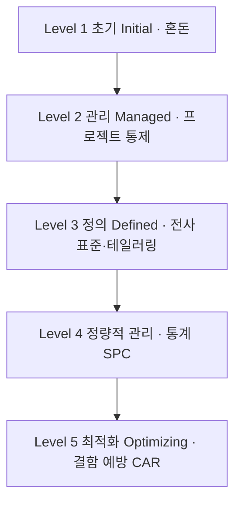

## 지식 로드맵 내 현재 위치

  소프트웨어공학
  소프트웨어 품질 보증·프로세스 평가
  <strong>CMMI(Capability Maturity Model Integration)</strong>

## 30초 인출

- 본질: 소프트웨어 개발 조직의 품질과 납기 통제를 특정 개인의 영웅적 역량에 의존하지 않고, 조직 차원의 표준 프로세스와 정량적 데이터 기반의 통계적 공정 관리(SPC)를 통해 예측 가능하고 재현 가능한 고품질 소프트웨어를 반복 생산하도록 지원하는 SEI/ISACA 프로세스 통합 성숙도 모델
- 메커니즘: 프로세스 혼돈(Level 1) → 프로젝트 차원 관리(Level 2) → 전사 표준화 및 테일러링(Level 3) → 통계적 정량 관리(Level 4) → 지속적 결함 예방 및 공정 최적화(Level 5)
- 산출물: 조직 표준 프로세스 자산(OSSP) · 테일러링 계획서 · 통계적 공정 관리도(Control Chart) · CMMI 심사 결과 보고서

핵심 용어

- **단계적 표현(Staged Representation)**: 조직 전체의 프로세스 성숙도를 1단계부터 5단계까지 순차적으로 평가하여 조직 단위 성숙도 레벨(Maturity Level)을 부여하는 방식
- **연속적 표현(Continuous Representation)**: 조직이 필요로 하는 개별 프로세스 영역(PA)을 선별하여 능력 레벨(Capability Level 0~3)을 집중 개선하는 맞춤형 방식
- **통계적 공정 관리(SPC, Statistical Process Control)**: 공정의 변동성을 관리 상한선(UCL)과 관리 하한선(LCL)으로 통제하여 결함 발생률과 개발 생산성을 수학적으로 예측하는 기법
- **테일러링(Tailoring)**: 조직 표준 프로세스(OSSP)를 개별 프로젝트의 특성, 규모, 위험도, 계약 조건에 맞추어 합리적으로 가감 조정하는 표준 활동

---

## 1교시 예상문제 (10점)

> CMMI(Capability Maturity Model Integration)의 정의와 목적, 핵심 메커니즘을 설명하시오. (예상)

---

## 1교시 10점 답안

### 1. 정의·목적

- 정의: 소프트웨어 개발 조직의 품질과 납기 통제를 특정 개인의 영웅적 역량에 의존하지 않고, 조직 차원의 표준 프로세스와 정량적 데이터 기반의 통계적 공정 관리(SPC)를 통해 예측 가능하고 재현 가능한 고품질 소프트웨어를 반복 생산하도록 지원하는 SEI/ISACA 프로세스 통합 성숙도 모델
- 목적: 조직의 프로세스 역량을 평가하고 반복 가능한 개선 방향을 제시한다.

### 2. 핵심 관계

- 제언: 평가 결과를 사업 목표와 연결해 개선 순서를 정하고 실제 성과 지표로 효과를 확인한다.
---

## 2~4교시 예상문제 (25점)

> CMMI(Capability Maturity Model Integration)의 개념과 목적을 설명하고, 핵심 메커니즘과 구성요소·절차, 적용 시 문제점과 대응 방안을 제시하시오. (25점, 예상)

---

## 2~4교시 25점 답안

### 1. 개요 및 필요성

### 개인 의존적 개발의 한계와 프로세스 성숙도

소프트웨어 개발 프로젝트가 소수의 천재 개발자(Hero)의 야근과 개인기에만 의존하면, 해당 인력이 이탈하는 순간 프로젝트는 파탄에 직면한다. 제품의 품질이 일정하지 않고 일정과 예산 예측이 불가능한 현상을 "소프트웨어 위기"라 부른다.

CMMI는 **"우수한 프로세스에서 우수한 품질의 제품이 나온다"**는 철학을 바탕으로, 조직의 개발 역량을 체계적인 5단계 성숙도 레벨로 정형화하여 **예측 가능하고 재현 가능한 엔지니어링 프로세스**를 정립한다.

### CMMI vs SPICE vs ISO 9001 비교

| 구분 | CMMI (v2.0 / v3.0) | SPICE (ISO/IEC 33000 / 15504) | ISO 9001 |
|---|---|---|---|
| **주관 기관** | 미국 카네기멜론 SEI / ISACA | ISO / IEC 국제표준화기구 | ISO 국제표준화기구 |
| **적용 영역** | **소프트웨어, 시스템 엔지니어링, R&D** | 소프트웨어 프로세스 평가 및 개선 | 제조 및 전 산업 일반 품질경영시스템 |
| **평가 모델** | **단계적(1~5) 및 연속적(0~3) 병행** | 연속적 모델 중심 (능력 0~5단계) | 요구사항 충족 여부 단일 합격/불합격 |
| **핵심 지향** | **조직의 프로세스 개선 및 비즈니스 성과 연계** | 국제 표준 규격 준수 평가 | 고객 요구 충족 및 품질 보증 체계 |

### 2. 아키텍처 및 핵심 메커니즘

### CMMI 5대 성숙도 레벨 (Staged Model)

CMMI 단계적 모델은 조직의 프로세스 진화 과정을 5단계의 계층 구조로 정의한다.

| 레벨 | 핵심 활동 |
|---|---|
| **Level 5** 최적화 | 지속적 프로세스 혁신, 원인 분석·해결(CAR), 정량적 결함 예방 |
| **Level 4** 정량적 관리 | 통계적 공정 관리(SPC), 공정 성능 베이스라인, 품질·납기 수학적 예측 |
| **Level 3** 정의 | 전사 표준 프로세스 자산화(OSSP), 프로젝트별 테일러링 준수 |
| **Level 2** 관리 | 프로젝트 단위 계획, 요구사항·형상 관리, 측정 및 분석 |
| **Level 1** 초기 | 표준 프로세스 부재, 영웅적 개인 의존, 일정·비용 초과 다발 |

### 단계적 표현 vs 연속적 표현 구조

| 표현 방식 | 평가 단위 | 판단 |
|---|---|---|
| **단계적 표현** Staged | 조직 전체를 성숙도 레벨(1~5)로 종합 평가 | 입찰 자격·공인 인증 등 대외 신뢰 입증에 활용 |
| **연속적 표현** Continuous | 개별 프로세스 영역(PA)별 능력 레벨(0~3) 평가 | 요구사항·형상 관리처럼 병목 영역 집중 개선에 적합 |

### Level 4 통계적 공정 관리(SPC)와 결함 통제 메커니즘

CMMI 고성숙도(High Maturity, Level 4/5)의 핵심은 관리도(Control Chart)의 관리 상한선(UCL)과 하한선(LCL) 사이에서 공정 변동을 통제하고, 한계선 밖 이상치를 근본 원인 분석으로 제거하는 폐루프다.

### 3. 실무 적용 및 고려사항

### 위험 대응 매트릭스

| 위험 | 대책 | 효과 |
|---|---|---|
| CMMI 심사 통과만을 위해 실무와 동떨어진 수천 장의 가짜 산출물을 작성하는 '페이퍼 CMMI' 전락 | Jira, Confluence, Git 등 실제 개발 도구의 API와 CMMI 프로세스 영역을 100% 자동 매핑 | 문서 작성 오버헤드 80% 감축 및 실질적 품질 향상 |
| 소규모 스타트업이나 애자일 조직에 무거운 Level 3 전사 표준 프로세스를 강요하여 개발 속도 마비 | 조직 특성과 규모에 맞게 필수 프로세스만 선별하여 간소화하는 테일러링(Tailoring) 가이드라인 엄격 적용 | 애자일의 속도와 CMMI의 품질 통제력 동시 확보 |
| Level 4 통계적 공정 관리 시 잘못된 표본 추출로 공정 능력 지수($C_p, C_{pk}$)의 신뢰성 상실 | 프로젝트 규모(FP/LOC)와 도메인 복잡도를 정규화한 표준 결함 밀도 지표 수립 | 품질 예측 신뢰성 95% 이상 확보 |

### 4. 기술사 답안 차별화 포인트

### CMMI v2.0/v3.0과 애자일/DevOps의 융합

과거 CMMI v1.3은 무거운 폭포수 모델에 치우쳐 애자일 환경과 대립한다는 비판을 받았다. 그러나 **CMMI v2.0 및 v3.0**은 스크럼(Scrum), 칸반(Kanban), DevOps 파이프라인을 핵심 프랙티스로 정식 통합하였다. 답안에서는 **"지속적 통합/배포(CI/CD) 로그에서 품질 메트릭을 실시간 수집하여 CMMI Level 4 통계적 공정 관리를 자동화하는 모던 CMMI 체계"**를 제시하여 현대적 엔지니어링 감각을 보여준다.

### 공정 성능 모델(PPM) 기반의 비즈니스 ROI 예측

CMMI 고성숙도(High Maturity)는 단순한 인증 마크가 아니라 비즈니스 투자 수익(ROI)을 입증하는 도구이다. **공정 성능 모델(Process Performance Model)**을 활용하여 "코드 리뷰 시간을 20% 늘리면 배포 후 장애율이 45% 감소하고 유지보수 비용이 3억 원 절감된다"는 식의 **정량적 의사결정 시뮬레이션 역량**을 결론으로 강조한다.

### 학습자 통찰 메모 — 답안 밖

- [핵심 통찰]: CMMI의 본질은 '서류 만들기'가 아니라 '데이터로 일하기'다. Level 3까지는 상식적인 프로세스 정리지만, 진짜 차별화는 Level 4의 통계적 관리(SPC)와 Level 5의 결함 예방(CAR)에서 나온다.
- [나라면]: 1교시형 단답 출제 시 5단계 계층과 핵심 단어(혼돈-프로젝트-전사표준-통계-최적화)를 명확히 구조화하고, 단계적 모델과 연속적 모델의 차이를 비교하겠다. 2교시형 출제 시에는 과거 '페이퍼 CMMI'의 폐해를 지적하고, Jira/GitLab 기반 실시간 메트릭 수집을 결합한 'CMMI v3.0 + DevOps' 융합 모델을 기술사적 해법으로 제시하겠다.

### 실전 답안용 기술사적 제언

- **판정 기준**: 전사 프로젝트 표준 테일러링 준수율 100% 및 결함 밀도 관리도 상한선(UCL) 이내 통제율 98% 달성 여부
- **대응 방안**: CMMI v2.0/v3.0 거버넌스를 기반으로 GitOps CI/CD 파이프라인과 자동 연동되는 정량적 품질 통제 체계 구축
- **검증 체계**: 동료 인스펙션 증적 자동 추출 → 공정 성능 모델(PPM) 분석 → 통계적 공정 관리도 이상치 모니터링 → SCAMPI 심사
- **기대 효과**: 소프트웨어 납기 지연율 0% 수렴, 프로젝트 재작업 비용 40% 절감 및 글로벌 수주 경쟁력 확보

### 5. 참고 및 연계 학습

- [SPICE (ISO/IEC 15504)](./016_spice.md)
- [SW 개발 방법론 비교](./139_sw_development_methodologies.md)
- [형상 관리(Configuration Management)](./011_configuration_management.md)
- [소프트웨어 품질 비용(PAF 모델)](./150_software_quality_cost.md)
---
