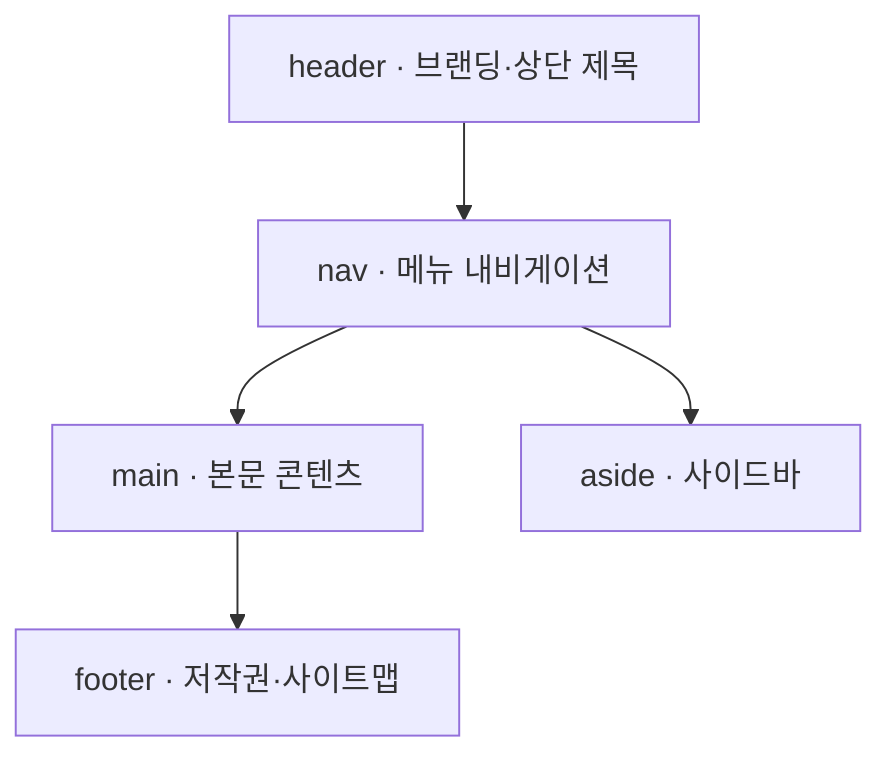

## 지식 로드맵 내 현재 위치

  소프트웨어공학
  웹 아키텍처·클라이언트 엔지니어링
  <strong>HTML5</strong>

## 30초 인출

- 본질: ActiveX, Flash 등 비표준 바이너리 플러그인 종속을 완전히 타파하고, 브라우저 자체를 멀티미디어 재생·로컬 저장소·고성능 2D/3D 그래픽 및 양방향 실시간 통신이 가능한 범용 독립 애플리케이션 플랫폼으로 도약시킨 W3C/WHATWG 국제 표준 웹 마크업 규격
- 메커니즘: 시맨틱 마크업 파싱 → 의미론적 DOM 트리 구성 → 네이티브 미디어/캔버스 엔진 바인딩 → Web Worker 백그라운드 연산 → WebSocket 전이중(Full-Duplex) 실시간 데이터 스트리밍
- 산출물: HTML5 시맨틱 마크업 문서 · CSS3 스타일시트 · 클라이언트 스크립트 모듈 · 웹앱 매니페스트(`manifest.json`)

핵심 용어

- **시맨틱 태그(Semantic Tags)**: 브라우저와 검색엔진, 스크린 리더에게 문서 구조의 의미론적 역할을 명확히 전달하는 전용 요소 (`<header>`, `<nav>`, `<article>`, `<footer>` 등)
- **플러그인 프리(Plugin-free)**: 보안 취약점과 브라우저 다운의 원흉이었던 ActiveX, Silverlight, Flash 설치 없이 브라우저 내장 엔진만으로 모든 기능을 실행하는 환경
- **WebSocket**: 클라이언트와 서버가 단 1회의 핸드셰이크 후 단일 TCP 연결 상에서 실시간 양방향 전이중(Full-Duplex) 통신을 가능하게 하는 프로토콜
- **Web Worker**: 브라우저의 메인 UI 스레드를 방해하지 않고, 무거운 CPU 연산이나 대량 데이터 가공을 백그라운드 독립 스레드에서 병렬 처리하는 API

## 1. 개요 및 필요성

### 비표준 플러그인의 종말과 애플리케이션 플랫폼으로서의 웹

과거 웹은 단순한 텍스트 뷰어에 불과하여, 음악이나 동영상을 재생하고 결제를 처리하려면 마이크로소프트의 ActiveX나 어도비의 Flash 같은 폐쇄형 바이너리 플러그인을 강제로 설치해야 했다. 이는 심각한 악성코드 감염 통로가 되었고, 스마트폰 모바일 브라우저와의 단절을 초래했다.

HTML5는 별도 플러그인 없이 **네이티브 오디오/비디오, 2D/3D 그래픽, 로컬 스토리지, 실시간 웹소켓**을 웹 표준으로 흡수함으로써, 브라우저를 데스크톱과 모바일 네이티브 앱을 대체하는 범용 애플리케이션 런타임 플랫폼으로 혁신하였다.

### HTML4 vs XHTML 1.0 vs HTML5 비교

| 구분 | HTML4 | XHTML 1.0 | HTML5 |
|---|---|---|---|
| **표준화 기구** | W3C (1997년) | W3C (2000년) | **W3C / WHATWG (2014년 표준 확정)** |
| **문법 철학** | 느슨한 SGML 기반 | 극도로 엄격한 XML 문법 강제 | **유연하고 실용적인 웹 환경 지향** |
| **멀티미디어** | 플러그인 필수 (ActiveX, Flash) | 플러그인 필수 | **`<video>`, `<audio>` 네이티브 내장 (플러그인 프리)** |
| **문서 구조화** | 단순 `
`, `` 남용 | `
` 중심 구조화 | **시맨틱 전용 태그 제공 (`<nav>`, `<article>` 등)** |
| **클라이언트 저장소**| 쿠키(Cookie, 4KB 제약) | 쿠키 | **Web Storage(5MB), IndexedDB(수십 GB)** |
| **실시간 통신** | 주기적 HTTP 폴링 의존 | 폴링 의존 | **WebSocket, SSE, WebRTC 네이티브 지원** |

## 2. 아키텍처 및 핵심 메커니즘

### HTML5 시맨틱 레이아웃 및 내장 엔진 구조

HTML5는 기존 무의미한 `
` 태그를 대체하여 검색엔진과 보조공학 기기가 명확히 이해할 수 있는 시맨틱 문서 구조를 정의한다. 문서는 header·nav에서 시작해 본문(main·aside)을 거쳐 footer로 닫히고, 재생·그래픽·통신·저장은 브라우저 내장 엔진이 플러그인 없이 담당한다.

### HTML5 주요 신규 API 체계

| API | 역할 | 판단 |
|---|---|---|
| **WebSocket** | 단일 TCP 채널에서 전이중(Full-Duplex) 실시간 통신 | 폴링 방식 대비 네트워크 오버헤드 대폭 절감 |
| **Web Worker** | UI 스레드와 분리된 백그라운드 스레드에서 대용량 연산 | 연산 중에도 화면이 멈추지 않는 멀티스레딩 |
| **Web Storage·IndexedDB** | 쿠키(4KB) 한계를 넘어 5MB~수십 GB를 브라우저에 보관 | 오프라인 동작 PWA 애플리케이션의 핵심 기반 |
| **Geolocation API** | GPS·Wi-Fi·기지국 정보로 위경도 좌표 획득 | 네이티브 앱 설치 없이 정밀한 위치기반 서비스 제공 |

### 고성능 비동기 아키텍처: 메인 UI 스레드 vs Web Worker 스레드

UI 블로킹 현상을 원천 차단하는 HTML5 멀티스레드 구조이다. 두 스레드는 DOM을 공유하지 않고 메시지로만 협업한다.

- **메인 스레드**: 사용자 이벤트 처리와 DOM 렌더링 전담 — 무거운 연산을 `postMessage`로 위임해 UI 프리징(Freezing)을 방지한다
- **워커 스레드**: 이미지 필터링·대용량 정렬·암호화 같은 CPU 집중 연산을 격리된 힙·스택에서 병렬 처리하며, DOM에는 접근할 수 없다

## 3. 실무 적용 및 고려사항

### 위험 대응 매트릭스

| 위험 | 대책 | 효과 |
|---|---|---|
| 구형 사내 인트라넷 또는 레거시 브라우저(IE 등)에서 신규 HTML5 시맨틱 태그 및 API 미지원 | Modernizr 라이브러리로 기능 지원 여부를 동적 감지하고, 미지원 시 Polyfill 스크립트 주입 | 크로스 브라우징 호환성 100% 확보 |
| 클라이언트 Web Storage(LocalStorage)에 민감한 JWT 토큰 및 개인정보 평문 저장 시 XSS 유출 위험 | 민감 인증 정보는 `HttpOnly`, `Secure` 플래그가 설정된 쿠키에 저장하고, 로컬 스토리지는 암호화 적용 | 토큰 탈취 및 세션 하이재킹 공격 원천 차단 |
| 수천 개의 WebSocket 동시 연결 시 서버 소켓 파일 디스크립터(FD) 고갈 및 백엔드 다운 | WebSocket 서버 앞단에 Netty 기반 게이트웨이 배치 및 커넥션 풀링/하트비트 타임아웃 관리 | 동시 접속 10만 건 이상의 고가용성 보장 |

## 4. 기술사 답안 차별화 포인트

### 프로그레시브 웹 앱(PWA)으로의 완성

HTML5의 등장은 웹을 모바일 네이티브 앱과 경쟁할 수 있는 반열에 올려놓았다. 답안에서는 HTML5를 단순히 태그 몇 개 추가된 기술로 보지 않고, **Service Worker(백그라운드 동기화 및 오프라인 캐싱) + Web App Manifest(홈 화면 아이콘 추가) + Web Push(푸시 알림)**가 결합된 **PWA(Progressive Web Apps)**의 모체로서 기술한다. 이를 통해 모바일 앱스토어 수수료(30%)를 회피하고 웹의 접근성을 극대화하는 비즈니스 임팩트를 강조한다.

### 웹 접근성(KWCAG / WCAG 2.1)과 시맨틱 마크업

HTML5 시맨틱 태그는 단순한 코드 가독성 향상이 아니라, 시각장애인과 고령자를 위한 **스크린 리더(Screen Reader) 음성 안내의 랜드마크(Landmark) 역할**을 수행한다. 공공기관 및 금융사 웹사이트의 법적 의무 사항인 '한국형 웹 콘텐츠 접근성 지침(KWCAG 2.2)'을 준수하기 위한 필수 엔지니어링 도구로서의 가치를 결론으로 제시한다.

### 학습자 통찰 메모 — 답안 밖

- [핵심 통찰]: HTML5의 진정한 가치는 마크업 태그가 아니라 '브라우저를 OS로 승격시킨 API 생태계'에 있다. 과거 데스크톱 설치형 플러그인(ActiveX, Flash)의 보안 지옥을 웹 표준이라는 단일 울타리로 통합하여 오늘날의 모바일 크로스 플랫폼 세상을 열었다.
- [나라면]: 1교시형 단답 시 플러그인 프리 철학과 4대 핵심 API(WebSocket, Web Worker, Canvas, Web Storage)를 명확히 구조화하겠다. 2교시형 출제 시에는 구형 시스템 호환성을 위한 Polyfill 전략과 XSS 보안 대책을 다루고, 궁극적으로 Service Worker와 결합한 PWA(Progressive Web Apps)로 네이티브 앱을 대체하는 발전 방향을 제시하겠다.

### 실전 답안용 기술사적 제언

- **판정 기준**: 플러그인 의존도 0% 달성 및 웹 접근성(KWCAG 2.2) 검사 통과율 100% 충족 여부
- **대응 방안**: 시맨틱 태그 기반 문서 구조화, 고부하 연산의 Web Worker 위임 및 WebSocket 기반 저지연 양방향 통신 인프라 구축
- **검증 체계**: W3C HTML5 유효성 검사 → Modernizr 브라우저 기능 감지 → 웹 접근성 자동 검증 도구(Axe/Lighthouse) → XSS 모의해킹
- **기대 효과**: 플랫폼 종속성 완전 탈피, 페이지 로딩 속도 40% 개선 및 데스크톱/모바일 일원화 반응형 서비스 완성

## 5. 참고 및 연계 학습

- [Web 2.0](./183_web_2_0.md)
- [서비스 워커(Service Worker)](./147_service_worker.md)
- [웹 성능 최적화](./164_web_performance_optimization.md)
- [AJAX 비동기 통신](./199_ajax.md)
