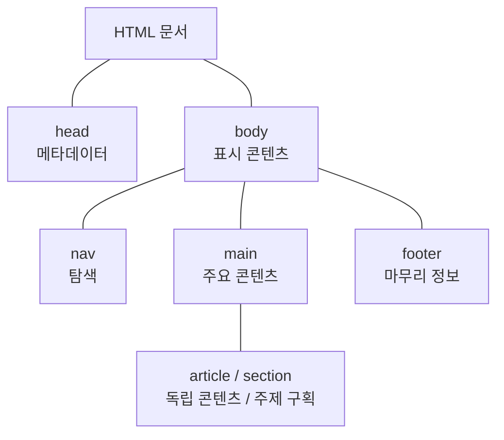
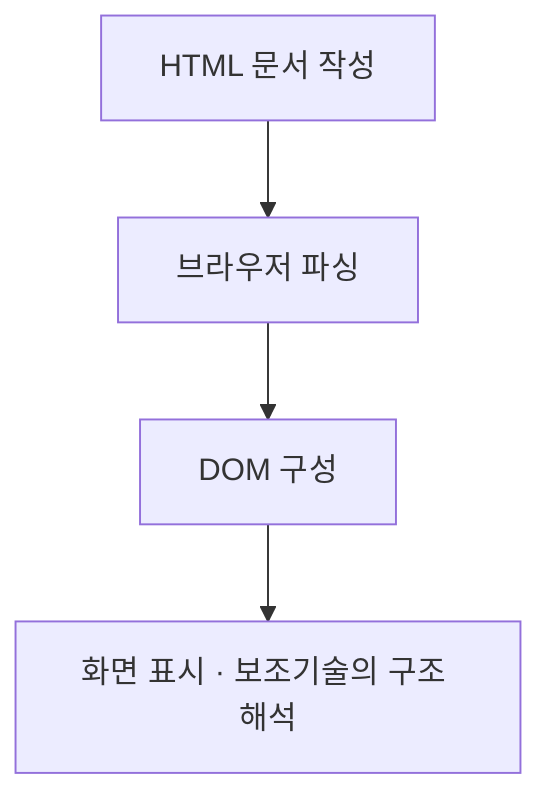

## 지식 로드맵 내 현재 위치

  소프트웨어공학웹 표준<strong>HTML5</strong>

## 30초 인출

- 본질: **HTML5**는 웹 문서의 구조와 의미를 표현하는 HTML 표준의 현대적 규격. 시맨틱 요소, 폼, 오디오·비디오 요소 등이 핵심
- 메커니즘: 의미에 맞는 요소로 문서 작성 → 브라우저의 파싱과 문서 객체 모델(DOM) 구성 → 화면·보조기술에 구조 전달

핵심 용어

- **HTML5(HyperText Markup Language 5)**: 웹 문서의 내용과 구조를 기술하는 HTML의 현대적 규격
- **시맨틱 요소(Semantic Element)**: `header`, `nav`, `main`, `article`처럼 콘텐츠의 역할을 드러내는 HTML 요소
- **DOM(Document Object Model)**: 브라우저가 문서를 노드 트리로 표현하여 스크립트 등이 접근하도록 하는 모델
- **점진적 향상(Progressive Enhancement)**: 기본 콘텐츠와 기능을 우선 제공하고, 지원되는 브라우저 기능을 추가 적용하는 방식

---

## 1교시 예상문제 (10점)

> HTML5의 개념과 주요 구성요소 및 웹 접근성 측면의 활용을 설명하시오. (예상)

---

## 1교시 10점 답안

### I. 개요

| 구분 | 내용 |
|---|---|
| 정의 | **HTML5**는 웹 문서의 내용·구조를 기술하는 HTML의 현대적 규격 |
| 목적 | 의미 있는 문서 구조와 표준 요소를 통해 기기·브라우저 간 일관된 콘텐츠 제공 |

### II. 핵심 구성

| 구성 | 역할 | 예 |
|---|---|---|
| 시맨틱 요소 | 콘텐츠의 역할 표현 | `main`, `nav`, `article` |
| 폼 기능 | 입력 유형·기본 검증 | `email`, `required` |
| 미디어 요소 | 브라우저에서 음성·영상 재생 | `audio`, `video` |

**제언:** 콘텐츠 의미에 맞는 요소를 선택하고 키보드 조작·보조기술 동작까지 확인.

---

## 2~4교시 예상문제 (25점)

> HTML5의 개념과 구성요소를 설명하고, 시맨틱 마크업의 구조와 웹 애플리케이션 적용 시 고려사항을 제시하시오. (25점, 예상)

---

## 2~4교시 25점 답안

### I. HTML5의 개요

| 구분 | 내용 |
|---|---|
| 정의 | **HTML5**는 웹 문서의 내용·구조를 기술하는 HTML의 현대적 규격 |
| 목적 | 의미 있는 문서 구조와 표준 요소를 통한 일관된 콘텐츠 제공 |
| 범위 | 문서 의미·입력 폼·미디어 요소가 중심이며, WebSocket·Web Worker 등은 연계되는 별도 웹 API |

### II. 시맨틱 문서 구조

선은 **문서의 포함 관계**를 나타냄. 요소의 배치 순서나 사용을 강제하는 흐름이 아님.

### III. 구성요소와 처리 관계

| 구성 | 역할 | 활용 시 유의점 |
|---|---|---|
| 시맨틱 요소 | 콘텐츠의 구조와 의미 전달 | 시각적 배치만으로 요소를 선택하지 않음 |
| 입력 폼 | 입력 유형·제약 표현 | 서버에서도 입력값 검증 |
| `audio`·`video` | 웹 문서 내 미디어 재생 | 자막·대체 수단 제공 |
| DOM | 문서에 대한 프로그램 접근 | HTML 요소와 DOM API를 구별 |

이 화살표는 **브라우저의 처리 순서**를 나타냄.

### IV. 웹 애플리케이션과의 관계

| 구분 | HTML5와의 관계 |
|---|---|
| CSS | 문서의 시각적 표현을 담당하는 별도 기술 |
| JavaScript | DOM을 이용해 문서와 상호작용하는 별도 언어 |
| WebSocket·Web Worker | 실시간 통신·백그라운드 처리를 위한 별도 웹 API |
| PWA | 서비스 워커·매니페스트 등을 결합한 애플리케이션 방식 |

HTML5만으로 실시간 통신, 오프라인 동작 또는 PWA 기능이 자동 구현되는 것은 아님.

### V. 적용 문제와 대응

| 문제 | 대응 |
|---|---|
| 모양만 고려한 요소 선택 | 콘텐츠의 역할에 맞춰 시맨틱 요소와 제목 계층 사용 |
| 브라우저별 기능 차이 | 필요한 기능의 지원 여부 확인 및 점진적 향상 |
| 시각적 표현에만 의존한 조작 | 키보드 탐색·이름·자막 등 접근성 검증 |

### VI. 제언

| 단계 | 적용 방향 |
|---|---|
| 설계 | 콘텐츠 구조와 의미를 먼저 정의 |
| 구현 | 의미에 맞는 요소와 기본 폼·미디어 기능 활용 |
| 검증 | 브라우저 호환성 및 웹 접근성을 실제 이용 경로에서 확인 |

### 참고 및 연계 학습

- [Web 2.0](./183_web_2_0.md)
- [서비스 워커](./147_service_worker.md)
- [AJAX](./199_ajax.md)
