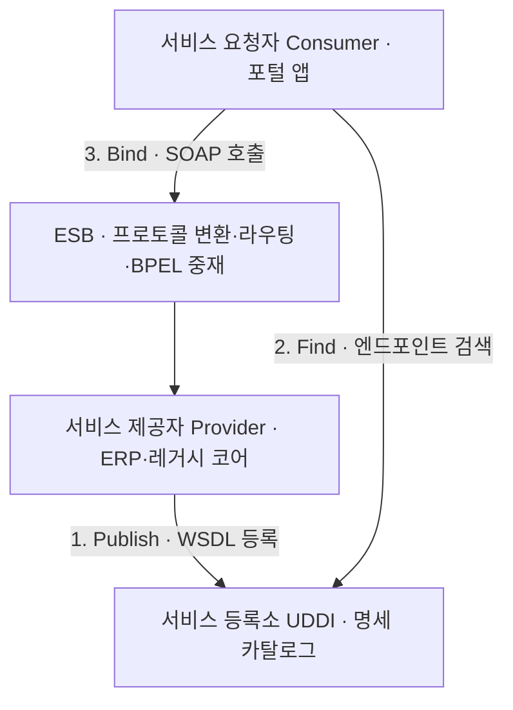

## 지식 로드맵 내 현재 위치

  소프트웨어공학
  소프트웨어 아키텍처·분산 통합
  <strong>SOA(Service Oriented Architecture)</strong>

## 30초 인출

- 본질: 대규모 엔터프라이즈의 업무 기능을 독립적이고 재사용 가능한 표준 '서비스' 단위로 분할하고, 플랫폼에 독립적인 표준 인터페이스(WSDL)와 엔터프라이즈 서비스 버스(ESB)를 통해 느슨하게 결합(Loose Coupling)하여 비즈니스 민첩성을 극대화하는 아키텍처 스타일
- 메커니즘: 서비스 제공자가 기능 구현 후 WSDL 명세 → UDDI 등록소에 게시(Publish) → 서비스 요청자가 등록소에서 검색(Find) → SOAP/HTTP 프로토콜로 직접 바인딩(Bind) 및 호출 → ESB 메시지 중재
- 산출물: 서비스 명세서(WSDL) · 서비스 비즈니스 프로세스(BPEL) 모델 · ESB 연계 정의서 · 전사 서비스 포트폴리오 맵

핵심 용어

- **WSDL(Web Services Description Language)**: 서비스가 제공하는 메서드, 입력 파라미터, 반환값, 네트워크 통신 프로토콜을 기술한 XML 기반 표준 인터페이스 명세서
- **UDDI(Universal Description, Discovery and Integration)**: 전사 또는 글로벌 단위로 서비스 제공자가 등록한 WSDL을 검색하고 조회할 수 있는 서비스 등록 디렉터리
- **SOAP(Simple Object Access Protocol)**: HTTP, HTTPS, SMTP 등을 통해 XML 기반의 정형화된 메시지를 교환하는 분산 컴퓨팅 통신 프로토콜
- **ESB(Enterprise Service Bus)**: 이기종 시스템 및 서비스 간의 프로토콜 변환, 지능형 라우팅, 메시지 변환, 트랜잭션을 중재하는 중앙 집중식 통합 미들웨어

## 1. 개요 및 필요성

### 전사 레거시 사일로의 한계와 비즈니스 민첩성

기업이 성장할수록 ERP, CRM, 그룹웨어, 계정계 등 시스템이 부서별로 독자 구축되는 "사일로(Silo) 현상"이 심화된다. 새로운 결합 상품이나 비즈니스 프로세스를 하나 출시하려 해도 수십 개 시스템의 데이터베이스를 직접 수정해야 하므로 수개월의 개발 지연과 막대한 비용이 발생했다.

SOA는 모든 시스템의 비즈니스 로직을 표준 계약(Contract)을 갖춘 독립적 '서비스'로 포장하고, 이들을 레고 블록처럼 조합(Orchestration)하여 **신규 비즈니스 프로세스를 수일 만에 조립·출시하는 엔터프라이즈 민첩성**을 제공한다.

### SOA vs 마이크로서비스(MSA) 비교

| 구분 | 서비스 지향 아키텍처 (SOA) | 마이크로서비스 아키텍처 (MSA) |
|---|---|---|
| **설계 범위** | **전사적(Enterprise-wide) 거버넌스 및 통합** | 단일 애플리케이션 또는 서비스 도메인 경계 |
| **통합 백본** | **스마트 파이프 (Smart Pipe: 강력한 ESB 미들웨어)** | 멍청한 파이프 (Dumb Pipe: 경량 REST/gRPC/Kafka) |
| **데이터베이스** | 전사 공용 중앙 DB 공유 모델 일반적 | **서비스별 독립 데이터베이스 (Database-per-service)** |
| **통신 프로토콜** | 무거운 SOAP / XML / WS-* 표준 규격 | 경량 RESTful JSON / gRPC / Protobuf |
| **서비스 크기** | 비즈니스 도메인 단위의 거친 입도(Coarse-grained) | 기능 단위의 매우 세밀한 입도(Fine-grained) |

## 2. 아키텍처 및 핵심 메커니즘

### SOA 3각 상호작용 및 ESB 연동 아키텍처

SOA는 서비스 제공자, 서비스 요청자, 서비스 등록소의 3각 관계와 중앙 ESB를 통해 유기적으로 작동한다.

### SOA 핵심 4대 구성 요소

| 구성 요소 | 역할 | 판단 |
|---|---|---|
| **SOAP** | Envelope·Header·Body로 구성된 정형화된 XML 메시지 교환 표준 | WS-Security로 메시지 단위 암호화·디지털 서명 제공 |
| **WSDL** | 호출 방법·포트 타입·파라미터 스키마를 기술한 XML 명세서 | 플랫폼·개발 언어에 독립적인 인터페이스 계약 보장 |
| **UDDI** | WSDL 서비스를 등록(White/Yellow/Green Pages)하고 검색하는 디렉터리 | 런타임에 동적으로 최적 서비스 탐색 |
| **ESB** | 이기종 시스템의 프로토콜·데이터 구조를 중앙에서 실시간 변환 | 단일 인터페이스 허브로 점대점(P2P) 복잡성을 O(N)으로 통제 |

### 아키텍처 진화: SOA (스마트 파이프) vs MSA (멍청한 파이프)

중앙 집중형 ESB의 한계와 이를 극복한 마이크로서비스 아키텍처의 철학적 대비이다.

- **SOA 한계**: 중앙 ESB가 단일 장애점(SPOF)·병목이 되고, 벤더 종속적인 무거운 XML 스택에 묶인다
- **MSA 장점**: 장애가 서비스 단위로 격리되어 독립 배포가 가능하고, 폴리글랏·클라우드 네이티브에 최적이다

## 3. 실무 적용 및 고려사항

### 위험 대응 매트릭스

| 위험 | 대책 | 효과 |
|---|---|---|
| 중앙 집중형 ESB에 전사 트래픽과 복잡한 비즈니스 로직이 집중되어 단일 장애점(SPOF) 발생 | ESB 노드 클러스터링 및 비즈니스 로직은 서비스 내부로 환원하고 ESB는 순수 라우팅만 수행 | 가용성 99.99% 확보 및 병목 완벽 해소 |
| 수십 MB에 달하는 무거운 XML SOAP 메시지 파싱으로 인한 서버 CPU 과열 및 응답 지연 | 내부 고성능 통신 구간은 경량 JSON/REST 또는 gRPC 바이너리 프로토콜로 점진적 전환 | 처리량 3배 향상 및 페이로드 크기 70% 절감 |
| 서비스 재사용성을 높이려다 서비스 간 순환 참조(Circular Dependency) 및 디버깅 미로 발생 | 상향식 서비스 계층 구조(엔터티 서비스 → 기능 서비스 → 오케스트레이션 서비스) 엄격화 | 아키텍처 결합도 통제 및 유지보수 생산성 증대 |

## 4. 기술사 답안 차별화 포인트

### 중앙 거버넌스(SOA)에서 분산 자율성(MSA)으로의 아키텍처 진화

SOA의 실패 원인은 서비스 지향 철학 자체가 아니라, **중앙 집중형 무거운 ESB 솔루션에 과도한 로직을 집어넣어 결국 '분산된 모놀리스'를 만들었기 때문**이다. 기술사 답안에서는 "스마트 파이프와 멍청한 엔드포인트(SOA)" 구조가 어떻게 마틴 파울러의 **"멍청한 파이프와 스마트 엔드포인트(MSA)"** 철학으로 진화했는지를 역사적 아키텍처 맥락에서 명쾌하게 대비하여 최고 수준의 통찰력을 제시한다.

### 레거시 코어 뱅킹 현대화를 위한 SOA 스트랭글러 패턴

메인프레임과 대형 상용 RDBMS로 구축된 금융 계정계를 하루아침에 MSA로 바꿀 수는 없다. 기존 SOA/ESB 인프라의 WSDL 인터페이스 전면에 **API Gateway를 배치하고 스트랭글러 피그(Strangler Fig) 패턴**을 적용하여 점진적으로 MSA로 전환하는 현실적 마이그레이션 전략을 답안의 실무 결론으로 강조한다.

### 학습자 통찰 메모 — 답안 밖

- [핵심 통찰]: MSA의 부모는 SOA다. '업무를 서비스로 쪼개어 재사용한다'는 SOA의 사상은 완전히 옳았으나, 2000년대 상용 ESB 벤더들의 과도한 마케팅과 무거운 XML/SOAP 스택이 아키텍처를 침몰시켰다. 오늘날 MSA는 그 반성을 딛고 가벼운 REST/Kafka/독립DB로 다시 태어난 현대판 SOA다.
- [나라면]: 1교시형 단답 시 3각 관계(Provider-Consumer-Registry)와 4대 요소(SOAP, WSDL, UDDI, ESB)를 완벽히 도식화하겠다. 2교시형 서술에서는 SOA가 대형 엔터프라이즈에서 겪었던 3대 병목(SPOF, 무거운 XML, 단일 DB)을 진단하고, 이를 극복한 마이크로서비스 아키텍처와의 구조적·철학적 차이를 3단락에 명쾌히 비교하겠다.

### 실전 답안용 기술사적 제언

- **판정 기준**: 전사 서비스 재사용율 60% 이상 달성 및 ESB 장애 시 서비스 간 우회 결합 차단율 100% 충족 여부
- **대응 방안**: 레거시 코어 업무는 WSDL 표준 서비스로 캡슐화하되, 중앙 ESB 과부하를 막기 위해 서비스 계층화(Entity-Task-Process) 및 API Gateway 분산 배치
- **검증 체계**: WSDL 유효성 검증 → ESB 부하 스트레스 시험 → 엔드투엔드 트랜잭션 추적(APM) → 고가용성(HA) 페일오버 검증
- **기대 효과**: 레거시 자산의 안전한 재사용, 신규 비즈니스 서비스 출시 기간(TTM) 50% 단축 및 미래 MSA 전환 기반 확보

## 5. 참고 및 연계 학습

- [마이크로서비스 아키텍처(MSA)](./035_msa.md)
- [EIP(Enterprise Integration Patterns)](./182_eip.md)
- [REST(Representational State Transfer)](./015_rest.md)
- [API 게이트웨이(API Gateway)](./075_api_gateway.md)
