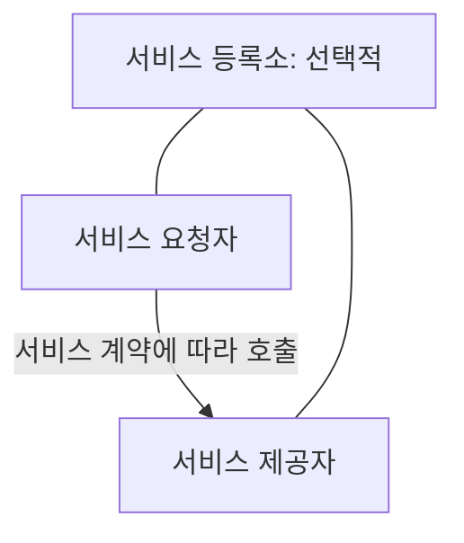
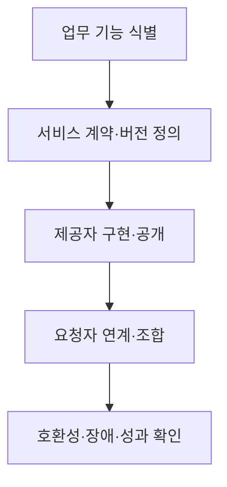

## 지식 로드맵 내 현재 위치

소프트웨어공학 → 분산 아키텍처 → **서비스 지향 아키텍처**

## 30초 인출

- 본질: **SOA**는 업무 기능을 명확한 계약을 가진 서비스로 제공하고, 여러 시스템이 이를 조합·재사용하도록 설계하는 아키텍처 방식
- 메커니즘: 서비스 경계 정의 → 계약 공개 → 요청자와 제공자 연결 → 서비스 조합·운영

핵심 용어

- **SOA(Service-Oriented Architecture, 서비스 지향 아키텍처)** : 업무 기능을 계약을 가진 서비스로 분리하고 조합하는 아키텍처 방식
- **서비스 계약(Service Contract)** : 서비스의 기능·입출력·오류·호출 조건을 정한 약속
- **서비스 제공자(Service Provider)** : 계약에 따라 기능을 구현·제공하는 주체
- **서비스 요청자(Service Consumer)** : 계약을 통해 서비스 기능을 이용하는 주체
- **서비스 등록소(Service Registry)** : 서비스 설명과 위치를 게시·찾는 선택적 구성요소
- **ESB(Enterprise Service Bus)** : 서비스 간 라우팅·변환·연계를 중재하는 통합 미들웨어
- **SOAP(Simple Object Access Protocol)** : XML 메시지 교환을 위한 프로토콜
- **WSDL(Web Services Description Language)** : 웹 서비스의 인터페이스를 기술하는 언어
- **UDDI(Universal Description, Discovery and Integration)** : 웹 서비스 정보를 등록·탐색하는 명세

---

## 1교시 예상문제 (10점)

> SOA의 개념과 서비스 계약·제공자·요청자의 관계를 설명하시오. (예상)

---

## 1교시 10점 답안

### Ⅰ. 개요

| 구분 | 핵심 |
|---|---|
| 정의 | **SOA** 는 업무 기능을 계약으로 공개하고 여러 시스템이 조합·재사용하도록 하는 아키텍처 방식 |
| 목적 | 시스템 간 기능 재사용과 변경 영향 축소 |

### Ⅱ. 핵심 관계

| 핵심 요소 | 역할 |
|---|---|
| 제공자 | 계약에 맞는 기능 구현 |
| 요청자 | 계약을 통해 기능 사용 |
| 계약 | 양측의 독립 변경을 위한 인터페이스 기준 |

**제언:** 서비스 경계와 계약 버전을 관리하고 호출 실패·변경 호환성을 함께 검증

---

## 2~4교시 예상문제 (25점)

> SOA의 구조와 설계 원칙을 설명하고, 이기종 시스템 통합 시 서비스 계약·변경·장애를 관리하는 방안을 제시하시오. (예상)

---

## 2~4교시 25점 답안

## Ⅰ. 개요

| 구분 | 핵심 |
|---|---|
| 정의 | **SOA** 는 업무 기능을 계약으로 공개하고 여러 시스템이 조합·재사용하도록 하는 아키텍처 방식 |
| 목적 | 시스템 간 기능 재사용과 변경 영향 축소 |

| 설계 대상 | 판단 |
|---|---|
| 서비스 경계 | 어떤 업무 기능을 독립적으로 제공할지 결정 |
| 계약 | 호출자와 제공자가 공유할 안정적 규격 정의 |

## Ⅱ. 핵심 관계

| 핵심 요소 | 역할 |
|---|---|
| 제공자 | 계약에 맞는 기능 구현 |
| 요청자 | 계약을 통해 기능 사용 |
| 계약 | 양측의 독립 변경을 위한 인터페이스 기준 |

등록소가 있으면 서비스의 설명·위치를 찾는 데 사용하지만 **UDDI 등록소가 있어야만 SOA가 성립하는 것은 아님**.

## Ⅲ. 설계 원칙과 구성 선택

| 원칙 | 의미 | 검증 질문 |
|---|---|---|
| 계약 중심 | 내부 구현과 외부 인터페이스 분리 | 제공자 변경 후 요청자 수정이 필요한가? |
| 느슨한 결합 | 호출자가 제공자의 내부 기술에 의존하지 않음 | 데이터·오류 형식이 계약으로 정의됐는가? |
| 재사용·조합 | 공통 기능을 여러 업무에서 사용 | 범용화를 위해 업무 의미가 흐려지지 않는가? |

| 선택적 기술 | 역할 |
|---|---|
| **SOAP**·**WSDL** | XML 웹 서비스의 메시지·계약 방식 |
| **ESB** | 이기종 서비스 사이의 라우팅·변환·중재 |
| **UDDI** | 웹 서비스 등록·발견 |

**SOA**는 설계 방식이며 SOAP·WSDL·UDDI·ESB를 모두 필수로 요구하는 기술 묶음이 아님.

## Ⅳ. 이기종 시스템 통합 흐름

| 연계 지점 | 통제 |
|---|---|
| 데이터 | 표준 형식·변환 책임 |
| 변경 | 계약 버전·이전 버전 호환 기간 |
| 운영 | 호출 추적·타임아웃·장애 격리 |

## Ⅴ. SOA와 마이크로서비스의 관계

| 관점 | SOA | 마이크로서비스 |
|---|---|---|
| 초점 | 서비스 계약을 통한 시스템 통합·재사용 | 작은 서비스의 자율적 개발·배포 |
| 운영 | 조직에 따라 중앙 중재·거버넌스 활용 | 서비스별 운영·배포 자율성 강조 |
| 공통점 | 업무 경계·서비스 계약·분산 통신 고려 | 업무 경계·서비스 계약·분산 통신 고려 |

**SOA=공유 DB·ESB 필수**, **MSA=독립 DB·경량 통신 필수**처럼 둘을 고정된 제품 구성을 기준으로 대립시키지 않음.

## Ⅵ. 한계과 기술사적 제언

| 한계 | 해결 방안 |
|---|---|
| 서비스 경계가 불분명해 호출·책임 중복 | 업무 기능·데이터 소유·계약 책임을 함께 정의 |
| 중앙 중재 지점에 변환·업무 로직 집중 | 중재 책임을 제한하고 병목·장애 경로를 검증 |
| 계약 변경이 여러 요청자를 동시에 깨뜨림 | 버전·호환성 정책과 소비자 관점의 계약 시험 적용 |
