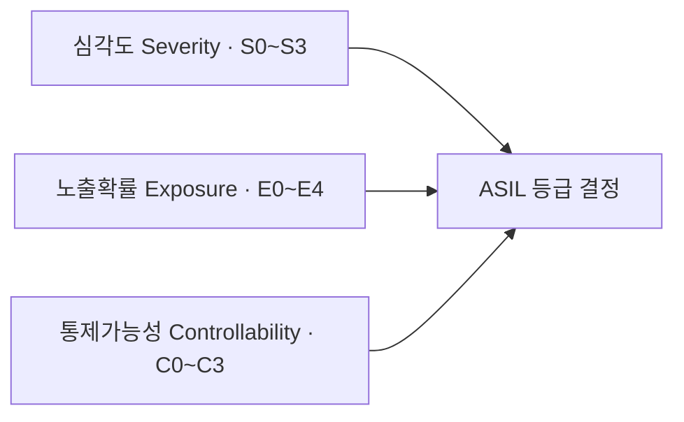
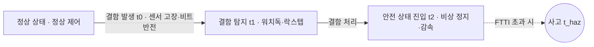

## 지식 로드맵 내 현재 위치

  소프트웨어공학
  임베디드·미션 크리티컬 안전 공학
  <strong>기능안전(Functional Safety)</strong>

## 30초 인출

- 본질: 전기·전자·프로그래머블(E/E/PE) 시스템의 하드웨어 고장이나 소프트웨어 결함으로 인한 오작동이 발생하더라도 인명 피해나 환경 재앙으로 번지지 않도록, 사전에 위험도를 분석하고 시스템을 허용 가능한 안전 상태(Safe State)로 전이시키는 국제 표준 기반 안전 무결성 공학 체계
- 메커니즘: 위험원 분석 및 위험 평가(HARA) → 안전 무결성 등급(SIL/ASIL) 결정 → 안전 목표 및 안전 요구사항 도출 → V-모델 기반 체계적 결함 방지(MISRA, MC/DC) → 안전 상태(Fail-Safe) 천이
- 산출물: 위험원 분석 보고서(HARA) · 안전 요구사항 명세서(SRS) · 안전 케이스(Safety Case) · 기능안전 감사/평가 보고서

핵심 용어

- **HARA(Hazard Analysis and Risk Assessment)**: 시스템의 오작동으로 인한 위험원을 식별하고, 심각도(S), 노출확률(E), 통제가능성(C)을 조합하여 위험도를 정량화하는 분석 활동
- **ASIL(Automotive Safety Integrity Level)**: 차량 기능안전 표준인 ISO 26262에서 정의한 안전 무결성 등급으로, QM(품질관리)부터 A, B, C, D(가장 엄격)까지 5단계로 분류
- **FTTI(Fault Tolerant Time Interval)**: 시스템에 결함이 발생한 시점부터 위험한 사고(Hazard)로 전이되기 전까지 안전 메커니즘이 안전 상태로 전환을 완료해야 하는 허용 한계 시간
- **MC/DC(Modified Condition/Decision Coverage)**: 복합 조건식 내 각 개별 조건이 다른 조건에 영향을 받지 않고 전체 결정문의 결과를 독립적으로 변경함을 검증하는 고신뢰성 테스트 커버리지 기준

---

## 1교시 예상문제 (10점)

> 기능안전(Functional Safety)의 정의와 목적, 핵심 메커니즘을 설명하시오. (예상)

---

## 1교시 10점 답안

### 1. 정의·목적

- 정의: 전기·전자·프로그래머블(E/E/PE) 시스템의 하드웨어 고장이나 소프트웨어 결함으로 인한 오작동이 발생하더라도 인명 피해나 환경 재앙으로 번지지 않도록, 사전에 위험도를 분석하고 시스템을 허용 가능한 안전 상태(Safe State)로 전이시키는 국제 표준 기반 안전 무결성 공학 체계
- 목적: 시스템의 위험원이 허용 가능한 수준을 넘지 않도록 안전 기능과 보증 활동을 관리한다.

### 2. 핵심 관계

- 제언: 위험 분석에서 안전 요구·검증 증거까지 추적하고 독립 검토와 변경 영향 분석을 수행한다.
---

## 2~4교시 예상문제 (25점)

> 기능안전(Functional Safety)의 개념과 목적을 설명하고, 핵심 메커니즘과 구성요소·절차, 적용 시 문제점과 대응 방안을 제시하시오. (25점, 예상)

---

## 2~4교시 25점 답안

### 1. 개요 및 필요성

### 전장화의 가속과 생명 직결 미션 크리티컬 결함

자율주행차, 도심항공교통(UAM), 원자력 제어기, 의료 로봇 등 현대 시스템은 소프트웨어의 판단에 인간의 생명을 전적으로 위임하고 있다. 고속도로를 100km/h로 질주하는 차량의 조향(Steering)이나 제동(Brake) ECU 소프트웨어에 널 포인터 역참조나 메모리 누수가 발생한다면 즉각 대형 참사로 이어진다.

기능안전(Functional Safety)은 결함이 전혀 없는 소프트웨어는 불가능하다는 공학적 전제하에, **"결함이 발생하더라도 정해진 시간(FTTI) 내에 위험을 탐지하여 안전 상태로 전이시키는 안전 무결성 보증 체계"**를 확립한다.

### 산업 도메인별 기능안전 국제 표준 체계

| 산업 도메인 | 표준 규격 | 안전 무결성 척도 | 주요 요구사항 및 특징 |
|---|---|---|---|
| **기본 모표준** | **IEC 61508** | **SIL 1 ~ SIL 4** | 전기·전자·프로그래머블 시스템 전반의 기본 안전 표준 |
| **자동차 전장** | **ISO 26262** | **ASIL QM, A, B, C, D** | 차량 E/E 시스템 대상, V-모델 전주기 개발 및 ASIL D 최고 요구 |
| **철도 제어** | **IEC 62278 (EN 50128)**| **SIL 0 ~ SIL 4** | 열차 신호 및 궤도 제어 시스템 소프트웨어 안전 규격 |
| **항공 우주** | **DO-178C** | **DAL A ~ DAL E** | 항공기 탑재 소프트웨어 검증, DAL A 등급 시 100% MC/DC 강제 |
| **의료 기기** | **IEC 62304** | **Class A, B, C** | 환자 생명 위해도에 따른 의료용 소프트웨어 생명주기 표준 |

### 2. 아키텍처 및 핵심 메커니즘

### HARA 3요소 및 ASIL 매트릭스 아키텍처

ISO 26262의 ASIL 등급은 심각도, 노출확률, 통제가능성의 3차원 위험 매트릭스를 통해 결정된다. 세 지표가 모두 높은 S3·E4·C3 조합이 최고 위험 수준을 결정한다.

| 등급 | 대표 적용 시스템 |
|---|---|
| **ASIL D** | 조향·제동 ECU — 100% MC/DC 강제 |
| **ASIL C** | 차간 거리 유지(ACC), 긴급 제동 보조(AEB) |
| **ASIL B** | 스마트 크루즈 컨트롤, 에어백 전개 제어 |
| **ASIL A** | 후방 카메라, 차선 이탈 경고(LDW) |
| **QM** | 비안전 인포테인먼트, 내비게이션 |

### 기능안전 핵심 메커니즘

| 메커니즘 | 역할 | 판단 |
|---|---|---|
| **Fail-Safe·Fail-Operational** | 고장 시 기능 차단 후 안전 정지 / 고장 후에도 최소 기능 유지 | 일반 차량 제동은 Fail-Safe, 자율주행 조향은 Fail-Operational |
| **듀얼 코어 락스텝(Lockstep)** | 두 독립 CPU 코어의 결과를 클록 단위 대조 | 알파 입자·전자기 노이즈 비트 반전(Bit-flip) 즉각 감지 |
| **MISRA C·시큐어 코딩** | 동적 메모리 할당·재귀 호출 금지 규칙 적용 | 정적 분석(QAC, Coverity)으로 런타임 예외를 컴파일 시점 차단 |
| **MC/DC 테스트 커버리지** | 복합 조건식의 각 조건이 결과에 미치는 독립적 영향 검증 | ASIL D·DO-178C DAL A 통과의 필수 검증 항목 |

### 결함 허용 시간 간격(FTTI)과 안전 상태(Safe State) 전이 시계열

안전 메커니즘은 결함 발생부터 사고로 이어지기 전의 골든타임(FTTI) 이내에 작동해야 한다.

- **안전 판정 공식**: 결함 탐지 시간 + 결함 처리 시간 < FTTI — 안전 메커니즘이 허용 한계 시간 이내에 안전 상태 진입을 완료해야 결함의 사고 전이를 차단한다

### 3. 실무 적용 및 고려사항

### 위험 대응 매트릭스

| 위험 | 대책 | 효과 |
|---|---|---|
| ASIL D 시스템에서 하드웨어 단일 결함(비트 반전)으로 CPU 연산 오류가 제어기에 그대로 전파 | 듀얼 코어 락스텝(Lockstep) MCU 도입 및 ECC(오류 정정 코드) 메모리 하드웨어 적용 | 단일 고장 탐지율(SPFM) 99% 이상 달성 |
| 복잡한 C++ 포인터 연산 및 동적 메모리(`malloc`) 누수로 런타임 힙 고갈 및 스티어링 락다운 | MISRA C:2012 코딩 표준 강제화 및 정적 검사 도구를 통한 빌드 단계 컴파일 차단 | 포인터 런타임 메모리 오류 100% 원천 예방 |
| 레벨 3 이상 자율주행 중 제동/조향 결함 시 Fail-Safe(단순 정지) 적용으로 고속도로 후방 추돌 | 이중화 제어기를 갖춘 Fail-Operational(기능 지속) 구조로 설계하여 안전 갓길 자율 정차 유도 | 2차 대형 교통사고 위험율 제로화 |

### 4. 기술사 답안 차별화 포인트

### Fail-Safe에서 Fail-Operational (자율주행 레벨 4/5)로의 패러다임 전환

과거 레벨 2 자율주행까지는 고장 시 운전자에게 제어권을 넘기고 비상 정지하는 **Fail-Safe**로 충분했다. 그러나 운전자의 개입이 없는 완전 자율주행(레벨 4/5)이나 로보택시에서는 고장 시 멈춰 서면 그 자체가 도로 위의 치명적 장애물이 된다. 답안에서는 고장이 발생해도 최소 10초 이상 조향과 제동을 유지하며 갓길로 대피시키는 **Fail-Operational (이중화 아키텍처)**의 필연적 요구를 강조한다.

### SOTIF (ISO 21448)와 기능안전의 융합

전통적 기능안전(ISO 26262)은 '부품의 고장'을 다룬다. 그러나 인공지능 자율주행은 **카메라나 라이다가 고장 나지 않았음에도, 역광이나 폭설로 인해 장애물을 인식하지 못하는 "의도된 기능의 한계"**가 발생한다. 기술사 답안에서는 기능안전(ISO 26262)과 이를 보완하는 **SOTIF(Safety of the Intended Functionality, ISO 21448)**의 통합 프레임워크를 결론으로 제시하여 최신 전장 엔지니어링 식견을 뽐낸다.

### 학습자 통찰 메모 — 답안 밖

- [핵심 통찰]: 기능안전은 "소프트웨어가 버그 없이 완벽해야 한다"는 이상론이 아니라, "반드시 고장이 날 텐데 그때 어떻게 안전하게 죽일 것인가(Safe State)"를 규정하는 냉철한 엔지니어링이다. FTTI라는 시간 제약 안에서 탐지-처리가 끝나는가가 생사를 가른다.
- [나라면]: 1교시형 단답 시 HARA 3요소(심각도 S, 노출확률 E, 통제가능성 C)와 ASIL 등급(QM, A~D)을 명쾌히 표로 제시하겠다. 2교시형 서술에서는 고장 시간표(FTTI)를 도식화하고, 자율주행 시대로 가면서 Fail-Safe(단순 정지)에서 Fail-Operational(기능 지속)로 진화하는 아키텍처와, 시스템 고장이 없어도 환경 한계로 사고가 나는 SOTIF(ISO 21448)의 융합을 기술사적 해법으로 제시하겠다.

### 실전 답안용 기술사적 제언

- **판정 기준**: ASIL D 핵심 제어 경로의 MC/DC 테스트 커버리지 100% 달성 및 안전 메커니즘 조치 시간 &lt; FTTI 검증 완료 여부
- **대응 방안**: 시스템 레벨 HARA 분석을 통해 ASIL을 분배하고, MISRA 준수 정적 분석과 듀얼 락스텝 하드웨어를 결합한 안전 상태 천이 체계 구축
- **검증 체계**: HARA 위험성 평가 → V-모델 단위/통합 검증 → 결함 주입 테스트(FIT) → 독립 공인기관 Safety Case 감사
- **기대 효과**: 미션 크리티컬 시스템의 인명 사고율 제로화, 글로벌 기능안전 공인 인증(TÜV) 획득 및 PL(제조물 책임) 리스크 원천 차단

### 5. 참고 및 연계 학습

- [소프트웨어 안전성 진단 가이드](./137_sw_safety_diagnosis_guide.md)
- [화이트박스 테스트(MC/DC)](./013_white_box_test.md)
- [카오스 테스트(Chaos Engineering)](./176_chaos_test.md)
- [V-모델(V-Model)](./002_v_model.md)
---
