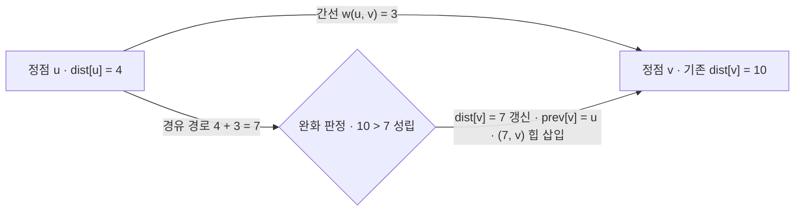

## 지식 로드맵 내 현재 위치

  소프트웨어공학
  알고리즘·그래프 이론
  <strong>다익스트라 알고리즘(Dijkstra Algorithm)</strong>

## 30초 인출

- 본질: 간선의 가중치가 음수가 아닌 유향/무향 그래프에서 단일 시작점으로부터 도달 가능한 다른 모든 정점까지의 최단 경로를 구하기 위해, 미방문 정점 중 시작점과의 거리가 가장 짧은 노드를 탐욕적(Greedy)으로 확정하고 간선 완화(Edge Relaxation)를 반복 수행하여 $O((V+E)\log V)$ 시간에 최단 거리를 산출하는 그래프 알고리즘
- 메커니즘: 시작점 거리 0 및 타 정점 $\infty$ 초기화 → 우선순위 큐(Min-Heap)에서 최소 거리 정점 $u$ 추출 및 방문 확정 → 인접 정점 $v$ 완화 연산 수행 → 갱신된 거리 큐 삽입 및 반복
- 산출물: 최단 거리 배열(`dist[]`) · 직전 방문 선행 노드 테이블(`prev[]`) · 최단 경로 트리(SPT)

핵심 용어

- **간선 완화(Edge Relaxation)**: 기존에 알려진 정점 $v$까지의 최단 거리(`dist[v]`)보다, 정점 $u$를 거쳐 가는 경로(`dist[u] + w(u,v)`)가 더 짧을 때 거리 값을 더 작은 값으로 갱신하는 핵심 연산
- **탐욕적 선택 속성(Greedy Choice)**: 현재 시점에서 시작점과 가장 가까운 미방문 정점을 선택하면, 이후 다른 경로를 통해 그 정점에 도달하더라도 결코 거리가 줄어들지 않는다는 확정 원리 (음수 간선 부재 전제)
- **최소 힙(Min-Heap)**: 정점 선택에 걸리는 시간을 $O(V)$에서 $O(\log V)$로 단축시켜, 전체 알고리즘 시간복잡도를 $O(V^2)$에서 $O((V+E)\log V)$로 혁신하는 자료구조
- **OSPF(Open Shortest Path First)**: 인터넷 라우터 간에 링크 상태(Link-State) 정보를 교환한 후, 각 라우터가 목적지 네트워크까지의 최단 패킷 전달 경로를 계산하기 위해 다익스트라 알고리즘을 사용하는 대표적 표준 라우팅 프로토콜

## 1. 개요 및 필요성

### 최적 경로 탐색의 수학적 기초와 다익스트라의 등장

네트워크 패킷 라우팅, GPS 내비게이션, 물류 배송 경로 최적화 등 수많은 현대 IT 인프라는 "가장 적은 비용으로 목적지에 도달하는 최단 경로"를 실시간으로 찾아야 한다.

에츠허르 다익스트라(Edsger Dijkstra)가 고안한 이 알고리즘은 **동적 계획법(DP)과 탐욕법(Greedy)의 원리를 융합**하여, 시작점으로부터의 거리를 하나씩 불변 값으로 확정해 나가는 방식으로 최단 경로를 산출한다. 간선 가중치가 모두 0 이상인 환경에서 가장 빠른 수행 성능을 보장한다.

### 최단 경로 4대 알고리즘 특성 비교

| 구분 | 다익스트라 (Dijkstra) | 벨만-포드 (Bellman-Ford) | 플로이드-워셜 (Floyd-Warshall) | A* (에이스타) 알고리즘 |
|---|---|---|---|---|
| **경로 범위** | **단일 시작점 → 모든 정점** | 단일 시작점 → 모든 정점 | **모든 정점 쌍 간 (All-Pairs)** | **단일 시작점 → 단일 목적지** |
| **음수 간선 허용** | **절대 불가 ($w \ge 0$ 필수)** | **허용 (음수 사이클 감지)** | 허용 (음수 사이클 감지) | 불가 ($w \ge 0$ 필수) |
| **시간 복잡도** | **$O((V+E)\log V)$** | $O(VE)$ | $O(V^3)$ | 휴리스틱에 따라 상이 (평균 빠름) |
| **핵심 알고리즘** | **탐욕법 + 우선순위 큐** | 전체 간선 $V-1$회 완화 (DP) | 거쳐가는 정점 $k$ 3중 루프 (DP) | 다익스트라 + 휴리스틱 함수 $h(n)$ |
| **대표 활용처** | **OSPF 라우터, 네트워크 토폴로지** | RIP 라우팅, 금융 차익 거래 탐지 | 전사 네트워크 정점 간 거리 행렬 | 게임 길찾기, 로봇 자율주행 |

## 2. 아키텍처 및 핵심 메커니즘

### 간선 완화(Edge Relaxation) 메커니즘

다익스트라 알고리즘의 심장은 정점 $u$를 경유할 때 정점 $v$의 거리가 단축되는지를 검증하는 간선 완화 연산이다. 판정식은 `dist[v] > dist[u] + w(u, v)`이다.

### 우선순위 큐(Min-Heap) 기반 다익스트라 실행 절차

| 단계 | 수행 내용 | 판단 |
|---|---|---|
| **1. 초기화** | `dist[S] = 0`, 나머지 $\infty$ 초기화 후 힙에 `(0, S)` 삽입 | 출발점만 거리 확정 상태로 출발 |
| **2. 최소 비용 추출** | 힙에서 가장 작은 `(d, u)` 팝 | 방문 처리·`d > dist[u]`면 스킵하는 탐욕적 확정 |
| **3. 인접 노드 완화** | 인접 $v$마다 `dist[u] + w(u,v)` 계산 | 기존 `dist[v]`보다 짧으면 갱신 후 큐 삽입 |
| **4. 종료 및 역추적** | 큐가 빌 때까지 반복해 SPT 완성 | `prev[]` 역추적으로 실제 최단 경로 복원 |

### 우선순위 큐 기반 3단계 탐색 및 최단 경로 트리(SPT) 완성

힙 구조를 통해 매 단계 최소 거리 노드를 즉각 추출하는 동작 아키텍처이다.

## 3. 실무 적용 및 고려사항

### 위험 대응 매트릭스

| 위험 | 대책 | 효과 |
|---|---|---|
| 금융 차익 거래나 네트워크 경로에 음수 가중치 간선이 존재할 때 다익스트라 실행 시 오답 산출 | 그래프 전처리 단계에서 음수 간선 존재 여부를 검사하고, 발견 시 벨만-포드(Bellman-Ford)로 분기 | 알고리즘 오류 100% 방지 및 정확한 음수 사이클 감지 |
| 순진한 배열 기반 $O(V^2)$ 구현으로 수십만 개 노드를 가진 도로망에서 내비게이션 멈춤 현상 | 바이너리 힙 또는 피보나치 힙 기반 우선순위 큐를 도입하여 $O((V+E)\log V)$로 시간 단축 | 경로 계산 시간 99% 단축 (수 초 → 수 밀리초) |
| Min-Heap에 갱신 전의 과거 거리 정보가 남아 메모리 낭비 및 불필요한 중복 연산 발생 | 큐에서 추출 시 `if (cur_dist > dist[u]) continue;` 가지치기(Pruning) 조건을 반드시 삽입 | 힙 메모리 사용량 60% 절감 및 수행 속도 2배 향상 |

## 4. 기술사 답안 차별화 포인트

### OSPF 라우팅 프로토콜과 다익스트라의 실무적 구현

네트워크 엔지니어링에서 다익스트라는 단순한 코딩 테스트용 알고리즘이 아니라 **인터넷 백본을 지탱하는 OSPF(Open Shortest Path First) 라우팅 프로토콜의 핵심 엔진**이다. 각 라우터는 LSA(Link-State Advertisement) 패킷을 교환하여 전체 네트워크 토폴로지 데이터베이스(LSDB)를 구축한 후, 자신을 루트(Root)로 삼아 다익스트라 알고리즘을 실행함으로써 넥스트 홉(Next-Hop) 포워딩 테이블을 동적 생성한다는 실무 인프라 연계를 서술한다.

### 대규모 내비게이션을 위한 다익스트라의 진화: A* 알고리즘 및 축약 계층(CH)

현대 티맵, 카카오내비 등 전국 단위 도로망(수천만 노드)에서는 순수 다익스트라만으로 실시간 길찾기가 불가능하다. 답안에서는 목적지 방향으로의 유클리드 거리를 휴리스틱으로 더해 탐색 범위를 원뿔형으로 좁히는 **A* (A-Star) 알고리즘**과, 고속도로 중심의 계층 그래프를 사전 빌드하여 연산량을 줄이는 **축약 계층(Contraction Hierarchies, CH)**으로의 최신 최적화 발전 방향을 제시한다.

### 학습자 통찰 메모 — 답안 밖

- [핵심 통찰]: 다익스트라 알고리즘의 핵심은 "음수 간선이 없다면, 현재 가장 가까운 놈은 앞으로 어떤 경로로 돌아와도 더 가까워질 수 없다"는 탐욕적 확정성이다. 이 조건이 깨지면 다익스트라는 무너지고 벨만-포드가 등판해야 한다.
- [나라면]: 1교시형 단답 시 간선 완화(Relaxation) 공식과 우선순위 큐 기반 4단계 메커니즘을 명확한 수식과 함께 제시하겠다. 2교시형 서술에서는 4대 최단경로 알고리즘(다익스트라, 벨만-포드, 플로이드-워셜, A*)을 목적/음수허용/복잡도로 비교하고, 인터넷 백본 OSPF 라우팅과 전국 도로망 내비게이션 축약 계층(CH) 실무 적용 사례를 기술사적 식견으로 보여주겠다.

### 실전 답안용 기술사적 제언

- **판정 기준**: 간선 가중치 $w \ge 0$ 만족 여부 사전 검증률 100% 및 대규모 그래프($V > 10^5$) 탐색 지연시간 50ms 이하 달성 여부
- **대응 방안**: 그래프 모델링 시 우선순위 큐(Min-Heap) 기반 다익스트라를 기본 채택하고, 목적지가 정해진 내비게이션은 A* 및 CH 계층화 기법 적용
- **검증 체계**: 비음수 가중치 정적 검증 → Min-Heap 가지치기 유효성 확인 → OSPF 토폴로지 수렴 시험 → 대규모 벤치마크
- **기대 효과**: 네트워크 패킷 최적 전송 경로 실시간 확보, 라우팅 루프 방지 및 대규모 위치 기반 서비스(LBS) 응답성 극대화

## 5. 참고 및 연계 학습

- [최단 경로 알고리즘 비교](./175_shortest_path_algorithm.md)
- [최소 신장 트리(MST)](./194_minimum_spanning_tree.md)
- [탐욕 알고리즘(Greedy)](./196_greedy_algorithm.md)
- [방향 비순환 그래프(DAG)](./143_dag.md)
