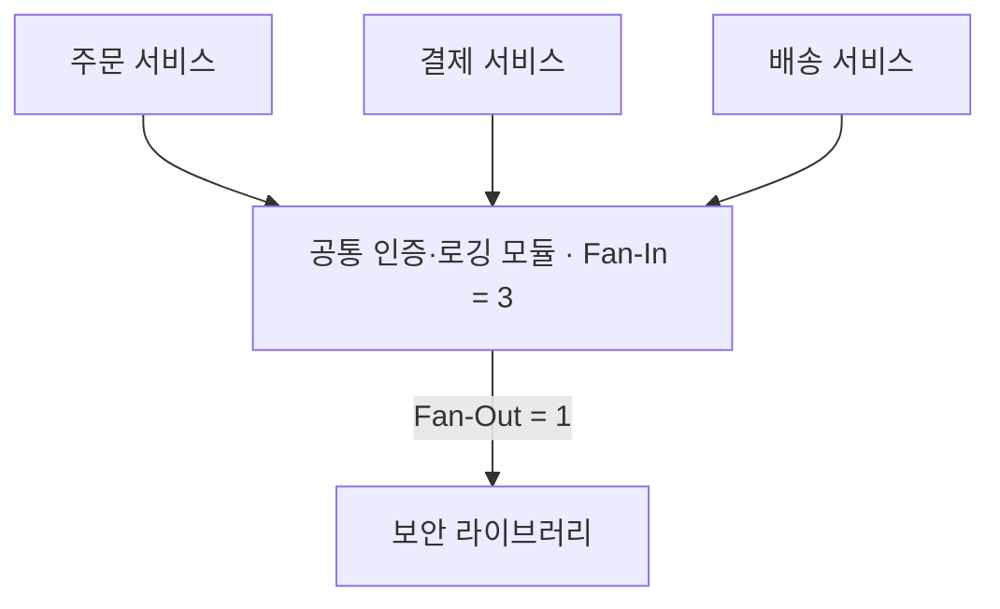

## 지식 로드맵 내 현재 위치

  소프트웨어공학
  소프트웨어 설계 원칙·아키텍처 품질
  <strong>모듈성(결합도·응집도)</strong>

## 30초 인출

- 본질: 대규모 소프트웨어의 복잡성을 통제하고 분할 정복(Divide & Conquer)을 실현하기 위해, 소프트웨어를 자율적이고 독립적인 모듈 단위로 분해하고, 모듈 간 상호 의존성을 최소화(저결합도: Loose Coupling)하며 모듈 내부의 책임 집중도를 극대화(고응집도: High Cohesion)하여 변경 파급효과를 완벽히 격리하는 핵심 소프트웨어 공학 설계 원리
- 메커니즘: 도메인 요구 분석 → 단일 책임(SRP) 기반 모듈 분할 → 인터페이스 추상화 및 최소 데이터 전달 → 정량 메트릭(LCOM, Fan-in/out) 측정 → 고응집·저결합 모듈성 확정
- 산출물: 모듈 아키텍처 구조도 · 결합도/응집도 분석 보고서 · LCOM 정적 분석 리포트 · 모듈 인터페이스 정의서

핵심 용어

- **결합도(Coupling)**: 모듈과 모듈 간의 상호 의존성의 정도를 나타내며, 낮을수록(Loose Coupling) 모듈의 독립성이 높아 변경에 안전함
- **응집도(Cohesion)**: 모듈 내부의 구성 요소들이 단일한 목적을 달성하기 위해 얼마나 긴밀하게 집중되어 있는지를 나타내며, 높을수록(High Cohesion) 유지보수성이 뛰어남
- **LCOM(Lack of Cohesion in Methods)**: 클래스 내 메서드들이 인스턴스 필드를 공유하지 않는 정도를 수학적으로 계측하여 응집도의 결여를 판정하는 객체지향 메트릭
- **Fan-In / Fan-Out**: 특정 모듈을 호출하는 상위 모듈의 수(Fan-In)와, 특정 모듈이 호출하는 하위 모듈의 수(Fan-Out)로, 높은 Fan-In과 낮은 Fan-Out이 이상적 아키텍처임

---

## 1교시 예상문제 (10점)

> 모듈성(결합도·응집도)의 정의와 목적, 핵심 메커니즘을 설명하시오. (예상)
---

## 1교시 10점 답안

### 1. 정의·목적

- 정의: 모듈성은 소프트웨어를 역할이 분명한 모듈로 나누고, 모듈 간 결합은 낮추며 내부 응집은 높이는 설계 원리다.
- 목적: 변경 영향을 줄이고 모듈을 독립적으로 이해·개발·시험·유지보수할 수 있게 한다.

### 2. 핵심 관계

- 제언: 모듈 경계를 정할 때 책임을 응집시키고 의존 관계를 단순화해 변경 영향을 제한한다.
---

## 2~4교시 예상문제 (25점)

> 모듈성(결합도·응집도)의 개념과 목적을 설명하고, 핵심 메커니즘과 구성요소·절차, 적용 시 문제점과 대응 방안을 제시하시오. (25점, 예상)
---

## 2~4교시 25점 답안

### 1. 개요 및 필요성

### 거대 소프트웨어의 복잡성 폭발과 모듈화

소프트웨어 규모가 커짐에 따라 코드 라인 수의 증가는 버그 발생 가능성을 지수 함수적으로 폭증시킨다. 하나의 함수나 모듈이 수만 줄에 달하고 전역 변수를 사방에서 참조하는 모놀리스 시스템은 사소한 버그 하나를 고치려다 시스템 전체가 다운되는 파멸을 낳는다.

모듈성(Modularity)은 "문제를 잘게 쪼개어 독립적으로 해결한다"는 분할 정복(Divide and Conquer)과 정보 은닉(Information Hiding)을 구현하는 공학적 뼈대이다. **결합도를 최소화(자료 결합도)하고 응집도를 극대화(기능적 응집도)**함으로써 시스템의 수정성, 재사용성, 테스트 용이성을 극대화한다.

### 결합도와 응집도의 상반 관계 매트릭스

| 품질 속성 | 나쁜 상태 (Worst) | 이상적인 상태 (Best) | 공학적 달성 원칙 |
|---|---|---|---|
| **결합도 (Coupling)** | **내용 결합도 (Content)**: 타 모듈 내부 변수 직접 수정 | **자료 결합도 (Data)**: 파라미터 값만 전달 | **정보 은닉, 인터페이스 캡슐화, DIP** |
| **응집도 (Cohesion)** | **우연적 응집도 (Coincidental)**: 아무 연관 없는 함수 집합 | **기능적 응집도 (Functional)**: 오직 1개 단일 작업 전담 | **단일 책임 원칙(SRP), 고순도 도메인 모델** |
| **변경 파급력** | 나비효과 (1줄 수정으로 전사 장애) | **완벽한 변경 격리 (Local Change)** | 모듈 내부 수정이 외부 인터페이스에 무영향 |
| **단위 테스트** | 테스트 불가능 (전체 시스템 기동 필수) | **완전한 격리 테스트 가능 (Mock 불필요)** | 모듈 단위 독립적 TDD 구축 가능 |

### 2. 아키텍처 및 핵심 메커니즘

### 결합도 6단계 및 응집도 7단계 스펙트럼

결합도는 낮을수록, 응집도는 높을수록 우수한 소프트웨어 아키텍처이다.

**결합도 6단계 (약한 결합 → 강한 결합)**

| 순위 | 유형 | 특징 |
|---|---|---|
| 1 | **자료 결합도(Data)** — Best | 순수 값 파라미터만 전달 |
| 2 | 스탬프 결합도(Stamp) | 구조체·DTO 전달 |
| 3 | 제어 결합도(Control) | 플래그로 타 모듈 흐름 통제 |
| 4 | 외부 결합도(External) | 외부 통신·프로토콜 공유 |
| 5 | 공통 결합도(Common) | 전역 변수(Global) 공유 |
| 6 | **내용 결합도(Content)** — Worst | 타 모듈 내부 변수 직접 수정 |

**응집도 7단계 (강한 집중 → 약한 집중)**

| 순위 | 유형 | 특징 |
|---|---|---|
| 1 | **기능적 응집도(Functional)** — Best | 오직 1개 단일 작업 전담 |
| 2 | 순차적 응집도(Sequential) | A의 출력이 B의 입력 |
| 3 | 통신적 응집도(Communicational) | 동일 입력 기반 처리 |
| 4 | 절차적 응집도(Procedural) | 순차적 흐름 실행 |
| 5 | 시간적 응집도(Temporal) | 동시 시점 실행(초기화) |
| 6 | 논리적 응집도(Logical) | 유사 기능 묶음 |
| 7 | **우연적 응집도(Coincidental)** — Worst | 연관 없는 함수 집합 |

### 모듈성 평가 지표 및 구조적 규칙

| 지표 | 역할 | 판단 |
|---|---|---|
| **LCOM** | 메서드 간 공유 인스턴스 필드 수 차이로 응집도 결여 계측 | 0에 가까울수록 고응집, 높으면 클래스 분할 필요 |
| **Fan-In·Fan-Out** | 호출받는 수·호출하는 수의 구조 관계도 | Fan-In 높을수록 재사용성 우수, Fan-Out은 3~4 이하 유지 |
| **마이어 5대 기준** | 분해성·조합성·이해성·연속성·보호성 평가 | 오류가 경계를 넘어 연쇄 파급되지 않는 보호성(Protection) 필수 |
| **정보 은닉** | 파나스(Parnas)가 제창한 모듈화 제1원리 | 변경 가능성 높은 내부 자료구조·알고리즘은 private 은닉 |

### 이상적 아키텍처: 높은 Fan-In과 낮은 Fan-Out 구조

모듈의 재사용성과 안정성을 보장하는 아키텍처 호출 토폴로지이다. 이상형은 높은 Fan-In과 낮은 Fan-Out의 다이아몬드 구조다.

- **Fan-In이 높다**: 여러 모듈이 공유하여 재사용성이 증명되므로 철저한 단위 테스트가 필수다
- **Fan-Out이 낮다**: 타 모듈을 적게 호출해 독립성이 극대화되며, Fan-Out이 5를 넘으면 위험 신호다

### 3. 실무 적용 및 고려사항

### 위험 대응 매트릭스

| 위험 | 대책 | 효과 |
|---|---|---|
| 싱글톤 전역 객체(Global State) 남용으로 인해 스레드 세이프티 파탄 및 공통 결합도(Common) 발생 | 의존성 주입(DI: Dependency Injection) 프레임워크를 도입하여 인스턴스 생명주기를 IoC 컨테이너로 격리 | 동시성 결함 100% 제거 및 단위 테스트 모킹 용이성 확보 |
| 특정 비즈니스 로직을 변경했을 때 전혀 무관한 15개 파일이 연쇄 컴파일 에러를 일으키는 변경 전파 | 구체 클래스 직접 참조를 제거하고 인터페이스 분리 원칙(ISP) 및 의존성 역전(DIP) 적용 | 변경 파급 범위 단일 모듈로 완벽 격리 |
| 만능 클래스(God Object)에 수십 개 업무 메서드가 뒤섞여 LCOM 수치 폭증 및 가독성 마비 | 단일 책임 원칙(SRP) 기반으로 클래스를 3~4개의 고응집 기능별 서비스 클래스로 세분화 리팩토링 | 클래스당 라인 수 80% 감축 및 유지보수 생산성 3배 증대 |

### 4. 기술사 답안 차별화 포인트

### 객체지향 응집도 결여(LCOM) 메트릭의 수학적 분석

많은 수험생이 응집도를 정성적 개념으로만 서술한다. 기술사 답안에서는 치담버와 케머러(Chidamber & Kemerer)의 **LCOM(Lack of Cohesion in Methods) 수식**을 제시한다. 클래스 내 임의의 두 메서드 쌍 $(M_i, M_j)$에 대해 공통 인스턴스 변수를 전혀 공유하지 않는 쌍의 집합 크기 $P$와, 공유하는 쌍의 집합 크기 $Q$에 대하여 $LCOM = \max(0, P - Q)$로 정의됨을 서술하고, LCOM 값이 클수록 클래스를 분할해야 한다는 **정량적 엔지니어링 메트릭**을 강조한다.

### 마이크로서비스(MSA)의 도메인 경계와 모듈성의 진화

전통적 모듈성이 단일 JVM 메모리 내 클래스/패키지 분할을 의미했다면, 현대 분산 환경에서는 **DDD(도메인 주도 설계)의 바운디드 컨텍스트(Bounded Context)와 마이크로서비스**가 모듈성의 새로운 단위이다. 서비스 간에는 REST/Kafka를 통한 자료 결합도를 유지하고, 서비스 내부 도메인은 고응집 Aggregate로 묶는 **분산 아키텍처 수준의 모듈성 확장**을 결론으로 제시한다.

### 학습자 통찰 메모 — 답안 밖

- [핵심 통찰]: 결합도와 응집도는 소프트웨어 공학의 알파이자 오메가다. 스프링의 DI/IoC, 객체지향의 SOLID 원칙, DDD의 바운디드 컨텍스트, MSA까지... 소프트웨어 공학 역사의 모든 진보는 결국 "어떻게 하면 결합도를 낮추고 응집도를 올릴 것인가"라는 질문에 대한 대답이었다.
- [나라면]: 1교시형 단답 시 결합도 6단계(자-스-제-외-공-내)와 응집도 7단계(기-순-교-절-시-논-우)를 완벽히 암기하여 위상 스펙트럼으로 제시하겠다. 2교시형 출제 시에는 Fan-In/Fan-Out 다이아몬드 구조와 LCOM 수식을 정량 지표로 제시하고, 모듈성 원리가 현대 MSA 및 헥사고날 아키텍처로 어떻게 확장되었는지를 연결하여 득점 포인트를 극대화하겠다.

### 실전 답안용 기술사적 제언

- **판정 기준**: 모듈 간 결합도가 자료/스탬프 결합도 수준으로 통제되고, 클래스별 LCOM=0(완전 응집) 및 모듈 Fan-Out 4 이하 달성 여부
- **대응 방안**: 단일 책임 원칙(SRP) 기반 도메인 분할 및 인터페이스 기반 의존성 역전(DIP)을 전사 코딩 컨벤션으로 강제화
- **검증 체계**: SonarQube 정적 분석 기반 LCOM/순환 참조 측정 → ArchUnit 아키텍처 규칙 단위 테스트 → PR 리뷰 게이트
- **기대 효과**: 변경 파급효과 원천 격리, 신규 기능 추가 시 회귀 결함 발생률 70% 감소 및 분산 MSA 전환 비용 최소화

### 5. 참고 및 연계 학습

- [객체지향 설계 5대 원칙(SOLID)](./047_solid_principles.md)
- [추상 클래스와 인터페이스](./205_abstract_class_and_interface.md)
- [마이크로서비스 아키텍처(MSA)](./035_msa.md)
- [소프트웨어 아키텍처 기술서(SAD)](./202_sad.md)
---
