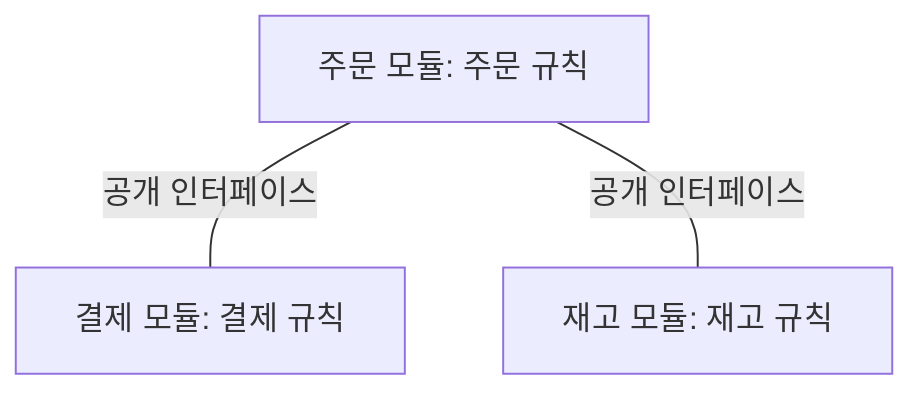
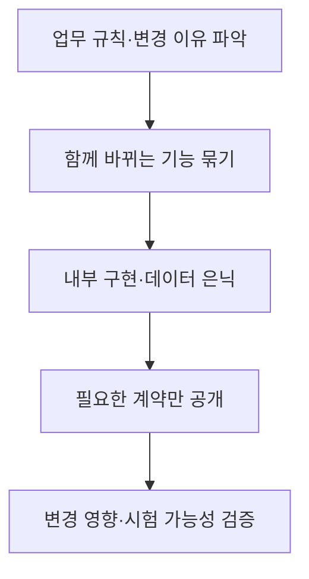

## 학습 위치

소프트웨어공학 → 소프트웨어 설계 → **모듈성**

## 30초 인출

- **본질**: 모듈성은 소프트웨어를 역할이 분명한 단위로 나누고, 단위 간 의존은 낮추며 내부 역할은 모으는 설계 특성
- **메커니즘**: 변경 이유에 따라 모듈 분리 → 내부 구현 은닉 → 명확한 인터페이스 제공 → 결합도·응집도 점검

핵심 용어

- **모듈성(Modularity)**: 시스템을 독립적으로 이해·변경할 수 있는 단위로 나눈 정도
- **결합도(Coupling)**: 모듈 사이의 의존 정도; 일반적으로 낮을수록 변경 파급이 적음
- **응집도(Cohesion)**: 한 모듈 내부 요소가 하나의 책임에 얼마나 집중하는지 나타내는 정도
- **정보 은닉(Information Hiding)**: 바뀔 가능성이 있는 내부 결정은 감추고 필요한 인터페이스만 공개하는 설계 원칙
- **자료 결합(Data Coupling)**: 필요한 데이터를 매개변수로 전달하는 형태의 결합
- **내용 결합(Content Coupling)**: 다른 모듈 내부 구현에 직접 접근하는 강한 결합
- **LCOM(Lack of Cohesion in Methods)**: 클래스 메서드의 응집 부족을 계량하려는 지표군; 변형별 계산법이 다름
- **Fan-in/Fan-out**: 한 모듈을 호출하는 모듈 수/한 모듈이 호출하는 모듈 수

---

## 1교시 예상문제 (10점)

> 모듈성의 개념과 결합도·응집도의 관계를 설명하시오.

---

## 1교시 10점 답안

### I. 개요

| 구분 | 핵심 |
|---|---|
| 정의 | **모듈성**: 시스템을 역할이 분명한 모듈로 나누고 외부 의존을 줄이는 설계 특성 |
| 목적 | 변경 영향을 국소화하고 각 모듈의 이해·시험·재사용을 쉽게 함 |

### II. 결합도와 응집도

| 관점 | 낮은 품질 | 바람직한 방향 |
|---|---|---|
| **결합도**: 모듈 사이 의존 | 내부 구현·전역 상태 공유 | 필요한 인터페이스만 의존 |
| **응집도**: 모듈 내부 역할 | 무관한 기능을 한 모듈에 혼합 | 관련 기능을 한 책임으로 묶음 |

**제언**: 변경 이유가 다른 기능은 분리하고 외부에는 안정적인 인터페이스만 공개.

---

## 2~4교시 예상문제 (25점)

> 모듈성의 개념과 결합도·응집도를 설명하고, 모듈 경계 설계와 품질 평가·개선 방안을 제시하시오.

---

## 2~4교시 25점 답안

### I. 개요

| 구분 | 핵심 |
|---|---|
| 정의 | **모듈성**: 시스템을 역할이 분명한 모듈로 나누고 외부 의존을 줄이는 설계 특성 |
| 목적 | 변경 영향을 국소화하고 각 모듈의 이해·시험·재사용을 쉽게 함 |

| 설계 질문 | 판단 기준 |
|---|---|
| 무엇을 한 모듈에 묶는가? | 같은 책임과 변경 이유를 가진 기능 |
| 무엇을 밖에 드러내는가? | 다른 모듈이 사용해야 하는 최소 인터페이스 |

### II. 결합도와 응집도

| 관점 | 낮은 품질 | 바람직한 방향 |
|---|---|---|
| **결합도**: 모듈 사이 의존 | 내부 구현·전역 상태 공유 | 필요한 인터페이스만 의존 |
| **응집도**: 모듈 내부 역할 | 무관한 기능을 한 모듈에 혼합 | 관련 기능을 한 책임으로 묶음 |

실선은 **정적 의존 관계**의 표시이며 실행 순서를 의미하지 않음.

### III. 결합도·응집도의 유형

| 구분 | 대표 유형 | 의미 |
|---|---|---|
| 약한 결합 | 자료 결합 | 필요한 값만 매개변수로 전달 |
| 강한 결합 | 공통 결합·내용 결합 | 전역 자료 또는 타 모듈 내부 구현에 의존 |
| 높은 응집 | 기능적 응집 | 한 모듈이 명확한 한 목적을 수행 |
| 낮은 응집 | 논리적·우연적 응집 | 비슷해 보이거나 무관한 기능을 임의로 묶음 |

전통적 유형 분류는 설계 상태를 설명하는 도구이며, 언어·아키텍처가 달라도 모든 결합을 한 순위만으로 판정하지 않음.

### IV. 경계 설계와 정보 은닉

| 설계 수단 | 역할 |
|---|---|
| 책임 분리 | 무관한 기능이 같은 모듈에서 함께 바뀌는 문제 축소 |
| 인터페이스 설계 | 호출자가 내부 자료 구조에 직접 의존하는 문제 축소 |
| 의존성 역전 | 상위 정책이 하위 구현에 직접 묶이는 문제 축소 |

### V. 모듈성 평가

| 관찰 항목 | 해석할 질문 | 주의점 |
|---|---|---|
| 변경 파급 범위 | 한 기능 변경에 함께 수정한 모듈이 많은가? | 요구 변화의 특성도 함께 검토 |
| 순환 의존 | 모듈끼리 상호 참조해 분리하기 어려운가? | 패키지·서비스 경계를 함께 확인 |
| **LCOM** | 클래스 내부 역할이 흩어져 있는가? | 변형별 값의 의미와 언어 특성 확인 |
| **Fan-in/Fan-out** | 호출 관계가 특정 모듈에 집중되는가? | 무조건 높고 낮음을 목표로 삼지 않음 |

지표 하나의 고정 기준값으로 좋은 설계를 판정하지 않고 실제 변경·시험·운영 증거와 함께 해석.

### VI. 문제와 해결 방안

| 문제 | 해결 방안 |
|---|---|
| 공통 상태를 여러 모듈이 직접 수정 | 상태 소유 모듈을 정하고 명시적 인터페이스로 접근 |
| 한 모듈에 무관한 업무 기능 집중 | 변경 이유별로 책임을 나누고 의존 관계 재설계 |
| 지표만 맞추려 과도하게 분할 | 업무 경계와 변경 이력을 기준으로 결합 비용 확인 |
