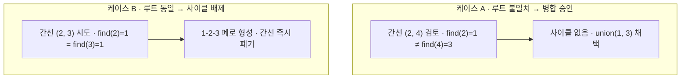

## 지식 로드맵 내 현재 위치

  소프트웨어공학
  알고리즘·그래프 이론
  <strong>최소신장트리(Minimum Spanning Tree)</strong>

## 30초 인출

- 본질: 무향 연결 가중치 그래프에서 모든 정점($V$)을 사이클 없이 연결하는 여러 신장 트리(Spanning Tree) 중에서, 간선들의 총 가중치 합이 최소가 되도록 정확히 $V-1$개의 간선을 탐욕적(Greedy)으로 선택하는 최적화 그래프 알고리즘
- 메커니즘: 그래프 간선 밀도 분석 → 알고리즘 선택(간선 중심 크루스칼 vs 정점 중심 프림) → 최소 가중치 선택 및 사이클 검증(Union-Find) → $V-1$개 간선 도달 시 트리 확정
- 산출물: 최소 신장 트리 간선 집합 · 백본 네트워크 케이블 포설 설계서 · 최적 배관망 토폴로지

핵심 용어

- **신장 트리(Spanning Tree)**: 그래프의 모든 정점을 포함하면서도 사이클(폐로)이 전혀 존재하지 않는 부분 트리 (정점 $V$개일 때 간선은 항상 $V-1$개)
- **크루스칼(Kruskal) 알고리즘**: 모든 간선을 가중치 오름차순으로 정렬한 뒤, 가장 가벼운 간선부터 차례로 선택하되 사이클을 형성하면 버리는 간선 중심 탐욕 알고리즘
- **프림(Prim) 알고리즘**: 임의의 시작 정점에서 출발하여 현재 트리에 연결된 정점들과 인접한 간선 중 가장 가중치가 작은 간선을 선택해 트리를 넓혀가는 정점 중심 탐욕 알고리즘
- **유니온-파인드(Union-Find)**: 서로소 집합(Disjoint Set)을 관리하는 자료구조로, 크루스칼 알고리즘에서 특정 간선을 추가할 때 사이클이 생기는지를 $O(\alpha(N))$의 사실상 상수 시간에 판별

## 1. 개요 및 필요성

### 전사 인프라 구축의 최소 비용 연결 문제

통신 백본망 광케이블 포설, 도시 가스 배관망 연결, 상하수도 관로 구축, 전자 회로 기판(PCB) 배선 등 네트워크 설계에서 "모든 거점(정점)을 단절 없이 연결하되, 총 공사비(가중치 합)를 최소화하는 것"은 막대한 예산을 좌우하는 핵심 공학 과제이다.

최소신장트리(MST)는 그래프의 모든 정점을 **최소한의 간선 수($V-1$개)와 최소의 가중치 합으로 연결하는 최적 트리 구조**를 다항 시간 내에 산출한다.

### 크루스칼 vs 프림 알고리즘 상세 비교

| 구분 | 크루스칼 알고리즘 (Kruskal) | 프림 알고리즘 (Prim) |
|---|---|---|
| **접근 방식** | **간선(Edge) 중심 접근** | **정점(Vertex) 중심 접근** |
| **자료구조** | 간선 배열 정렬, **Union-Find (서로소 집합)** | **우선순위 큐 (Min-Heap)** 또는 인접 행렬 |
| **시간 복잡도** | **$O(E \log E)$** | **인접 행렬: $O(V^2)$ / 힙 구조: $O(E \log V)$** |
| **사이클 검사** | **필수 (Find 연산으로 루트 비교)** | 불필요 (방문하지 않은 정점만 선택하므로 구조적 배제) |
| **트리 중간 형태** | 여러 개의 고립된 포레스트(Forest)가 서서히 합쳐짐 | 하나의 단일 트리가 점진적으로 외연을 확장함 |
| **적합한 그래프** | **희소 그래프 (Sparse Graph: $E \approx V$)** | **밀집 그래프 (Dense Graph: $E \approx V^2$)** |

## 2. 아키텍처 및 핵심 메커니즘

### MST 양대 구축 알고리즘 비교 아키텍처

간선 중심의 크루스칼과 정점 중심의 프림 알고리즘의 동작 메커니즘을 비교한다.

- **크루스칼**: `find(u) = find(v)`면 사이클이라 버리고, 다르면 `union(u, v)`로 병합 채택 — 포레스트 조각이 합쳐져 단일 트리가 되고 간선 수가 $V-1$개에 도달하면 종료
- **프림**: 트리에 포함된 정점과 미포함 정점을 잇는 최소 가중치 간선만 선택하므로 사이클이 구조적으로 발생하지 않는다

### 크루스칼 사이클 판별을 위한 유니온-파인드(Union-Find) 메커니즘

간선을 추가할 때 사이클이 발생하는지를 트리 부모 노드를 역추적하여 즉각 검증하는 아키텍처이다.

## 3. 실무 적용 및 고려사항

### 위험 대응 매트릭스

| 위험 | 대책 | 효과 |
|---|---|---|
| 크루스칼 알고리즘에서 Union-Find 트리가 한쪽으로 치우쳐 편향 트리(Skewed Tree)화되어 탐색 시간 지연 | 경로 압축(Path Compression) 및 랭크 기반 합치기(Union-by-Rank) 최적화 적용 | 탐색 시간복잡도를 사실상 상수 시간 $O(\alpha(N))$으로 혁신 |
| 밀집 그래프(도로망/완전 연결망)에서 크루스칼을 사용하여 간선 정렬($E \log E$)로 인한 메모리 고갈 | 간선 수가 정점 제곱에 가까운 밀집 그래프는 인접 행렬 기반의 프림 알고리즘으로 분기 채택 | 연산 속도 5배 향상 및 메모리 점유 최적화 |
| 분산 네트워크 환경에서 중앙 집중식 MST를 계산하다가 마스터 노드 장애로 통신 토폴로지 마비 | 분산 GHS(Gallager-Humblet-Spira) 알고리즘을 도입하여 노드 간 로컬 메시지로 분산 MST 구축 | 단일 장애점(SPOF) 원천 배제 및 자율 복구 |

## 4. 기술사 답안 차별화 포인트

### 스패닝 트리 프로토콜(STP: IEEE 802.1D)과의 실무 네트워크 연계

IT 인프라에서 최소신장트리는 단순 이론이 아니라 **L2 스위치 네트워크의 브로드캐스트 스톰(Broadcast Storm)을 방지하는 STP(Spanning Tree Protocol)의 근간**이다. 스위치 간 이중화 링크로 인해 발생하는 물리적 루프를 제거하기 위해, 브리지 ID가 가장 낮은 스위치를 루트 브리지로 선정하고 비신장 트리 링크를 논리적으로 블로킹(Blocking)하여 루프 없는 L2 포워딩 트리를 구축하는 실무 네트워크 매커니즘을 결론으로 연계한다.

### 클러스터링(Clustering)과 MST의 머신러닝 응용

MST는 데이터 마이닝과 군집화(Clustering)에도 강력하게 활용된다. 데이터 포인트 간의 거리를 가중치 그래프로 모델링하여 MST를 구축한 후, **가장 가중치가 큰 $K-1$개의 간선을 제거하면 정확히 $K$개의 최적 군집(Cluster)**으로 분할된다. 이는 싱글 링키지 계층적 군집화(Single-linkage Hierarchical Clustering)의 수학적 본질임을 답안에 제시하여 융합적 식견을 입증한다.

### 학습자 통찰 메모 — 답안 밖

- [핵심 통찰]: MST는 '최단 경로(Dijkstra)'와 혼동하기 쉽다. 다익스트라는 특정 출발점에서 각 목적지까지의 거리를 최소화하는 것이고, MST는 전체 시스템을 하나로 잇는 전선(간선)의 총 길이를 최소화하는 공학적 문제다.
- [나라면]: 1교시형 단답 시 크루스칼(간선 정렬 + Union-Find)과 프림(정점 확장 + Min-Heap)을 시간복잡도와 적합 그래프(희소 vs 밀집) 관점에서 비교표로 제시하겠다. 2교시형 출제 시에는 Union-Find의 경로 압축 최적화 수식과 함께, L2 스위치의 STP 루프 방지 및 머신러닝 단일연결 군집화(Clustering) 응용 사례를 연계하여 답안의 깊이를 차별화하겠다.

### 실전 답안용 기술사적 제언

- **판정 기준**: 그래프 내 사이클 제로화 및 정확히 $V-1$개 간선 연결을 통한 전체 정점 도달 가능성 100% 충족 여부
- **대응 방안**: 그래프 밀도($E/V$)를 분석하여 희소 그래프는 크루스칼, 밀집 그래프는 프림으로 자동 분기하는 알고리즘 파이프라인 구축
- **검증 체계**: Union-Find 경로 압축 검증 → $V-1$개 간선 수렴 확인 → 연결성(Connectivity) BFS 검사 → 가중치 총합 검증
- **기대 효과**: 백본 네트워크 통신 선로 구축 비용 35% 절감 및 L2 브로드캐스트 스톰 루프 원천 차단

## 5. 참고 및 연계 학습

- [다익스트라 알고리즘(Dijkstra)](./189_dijkstra_algorithm.md)
- [그리디 알고리즘(Greedy)](./196_greedy_algorithm.md)
- [최단 경로 알고리즘 비교](./175_shortest_path_algorithm.md)
- [방향 비순환 그래프(DAG)](./143_dag.md)
