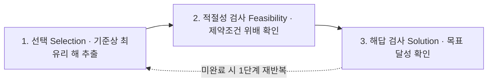

## 지식 로드맵 내 현재 위치

  소프트웨어공학
  알고리즘 설계 패러다임
  <strong>그리디 알고리즘(Greedy Algorithm)</strong>

## 30초 인출

- 본질: 전체 경우의 수를 전수 검토하거나 이전 선택을 되돌아보지 않고, 매 의사결정 단계마다 당장 눈앞에 보이는 가장 최적의 선택(지역 최적해)을 직진하듯 결정해 나감으로써, '탐욕적 선택 속성'과 '최적 부분 구조'를 만족하는 문제에 대해 다항 시간 내에 전역 최적해(Global Optimum)를 도출하는 고속 알고리즘 설계 패러다임
- 메커니즘: 현재 기준 국소 최적 선택(Selection) → 시스템 제약조건 충족 검사(Feasibility) → 전체 문제 해결 검사(Solution) → 전역 최적성 및 근사비 검증
- 산출물: 최적 의사결정 시퀀스 · 자원 최적화 할당 결과서 · 근사비(Approximation Ratio) 검증 리포트

핵심 용어

- **탐욕적 선택 속성(Greedy Choice Property)**: 앞선 선택이 이후의 선택에 영향을 주지 않으며, 매 순간의 지역적 최적 선택이 최종 전역 최적해로 반드시 이어진다는 수학적 성질
- **최적 부분 구조(Optimal Substructure)**: 전체 문제의 최적해가 그 안에 포함된 부분 문제들의 최적해들로 구성될 수 있는 분할 정복적 구조
- **지역 최적해 vs 전역 최적해**: 당장 눈앞에서 가장 좋아 보이는 국소적 해(Local Optimum)와, 모든 가능성을 통틀어 전체 시스템상 가장 우수한 해(Global Optimum)
- **근사 알고리즘(Approximation Algorithm)**: NP-Hard 문제처럼 다항 시간에 전역 최적해를 구할 수 없을 때, 그리디 기법을 활용해 최적해에 근접한 준최적해를 신속히 구하는 기법

## 1. 개요 및 필요성

### 복잡도 폭발과 고속 탐욕 결정의 가치

수많은 엔터프라이즈 최적화 문제(클라우드 가상머신 자원 할당, 회의실 예약 스케줄링, 데이터 압축 허프만 코딩)는 가능한 모든 조합을 탐색할 경우 $O(2^N)$ 또는 $O(N!)$의 지수 시간 복잡도를 요구하므로 현실적으로 계산이 불가능하다.

그리디 알고리즘은 **"한 번 내린 결정은 절대 번복하지 않는다"**는 단순 명쾌한 원칙을 통해, 매 단계 최선의 선택을 직진함으로써 **$O(N \log N)$의 초고속 다항 시간 내에 문제를 해결**하는 실무적 알고리즘 설계 기법이다.

### 알고리즘 설계 패러다임 3대 축 비교

| 구분 | 그리디 알고리즘 (Greedy) | 동적 계획법 (Dynamic Programming) | 분할 정복 (Divide & Conquer) |
|---|---|---|---|
| **선택 메커니즘** | **매 순간 최선의 지역해 즉시 선택** | 모든 부분 문제의 최적해를 조합 | 문제를 독립된 부분으로 쪼개어 정복 |
| **되돌림(Backtrack)**| **절대 되돌리지 않음 (No Backtrack)**| 과거 부분 문제 계산 결과(DP 테이블) 참조 | 분할된 부분 문제의 결과를 재귀 취합 |
| **최적성 보장** | **2대 조건 성립 시에만 보장** | 항상 전역 최적해 보장 | 항상 정확한 해 보장 |
| **시간 복잡도** | **매우 빠름 ($O(N \log N)$)** | 상대적으로 느림 ($O(N^2), O(N \times W)$) | 문제 분할 크기에 비례 ($O(N \log N)$) |
| **대표 사례** | **다익스트라, 크루스칼, 허프만 코딩** | 배낭 문제(0/1 Knapsack), 벨만-포드 | 퀵 정렬, 병합 정렬, 이진 탐색 |

## 2. 아키텍처 및 핵심 메커니즘

### 그리디 3단계 의사결정 파이프라인

그리디 알고리즘은 선택, 적절성 검사, 해답 검사의 3단계 루프를 통해 전개된다.

| 단계 | 수행 내용 | 대표 예시 |
|---|---|---|
| **선택(Selection)** | 정렬·우선순위 큐로 가장 유리한 원소 1개 추출 | 가중치 최소 간선 · 가장 빠른 종료 시간 · 단위 무게당 가치 최고치 |
| **적절성 검사(Feasibility)** | 제약조건 위배 여부 검증 — 위배 시 폐기 | 회의 시간 중복 · 배낭 허용 무게 초과 · 그래프 폐로(Cycle) 형성 |
| **해답 검사(Solution)** | 전체 목표 달성 여부 확인 | 간선 수 $V-1$ 도달 · 거스름돈 총액 0 도달 |

### 그리디 2대 성립 조건과 배낭 문제(Knapsack)의 한계

그리디 알고리즘이 100% 최적해를 보장하기 위한 2대 필수 조건과 그 한계점이다.

- **0/1 배낭의 대안**: 동적 계획법(DP) 또는 분기한정법이 필수다

### 그리디 대표 핵심 알고리즘 카탈로그

| 알고리즘 | 기법 | 판단 |
|---|---|---|
| **회의실 배정(Activity Selection)** | 종료 시간이 가장 빠른 회의 우선 선택 | 클라우드 VM 자원 할당·CPU 스케줄링의 근간 |
| **허프만 코딩(Huffman Coding)** | 고빈도 문자에 짧은 가변 비트 부여 | 빈도수 기반 Min-Heap으로 최적 접두어 코드 트리 구축 |
| **다익스트라(Dijkstra)** | 비음수 가중치에서 가장 가까운 노드 탐욕 확정 | OSPF 라우팅 백본의 표준 알고리즘 |
| **크루스칼·프림(MST)** | 최소 가중치 간선 순차 선택 | 통신망 선로 포설·배관망 설계 최적화 |

## 3. 실무 적용 및 고려사항

### 위험 대응 매트릭스

| 위험 | 대책 | 효과 |
|---|---|---|
| 거스름돈 화폐 체계에 배수 관계가 성립하지 않아(예: 500원, 400원, 100원에서 800원 거스름) 그리디 적용 시 오답 | 화폐 체계가 배수(Canonical Coin System)인지 검증하고, 비배수 시 동적 계획법(DP)으로 자동 전환 | 동전 최소 개수 계산 오류 100% 방지 |
| 0/1 배낭 문제나 외판원 순회(TSP) 등 NP-Hard 문제에 그리디를 적용하여 최적해와 큰 괴리 발생 | 이론적 근사비(Approximation Ratio)를 사전 수학적으로 증명하고, 허용 오차 내에서만 근사 알고리즘으로 채택 | 연산 시간 99% 단축과 제어된 오차 범위 동시 달성 |
| 데이터 규모가 수천만 건에 달해 매 단계 단순 정렬 수행 시 $O(N^2)$ 성능 저하 | 우선순위 큐(Min/Max Heap)를 도입하여 원소 추출 및 갱신을 $O(\log N)$으로 최적화 | 처리 속도 10배 향상 및 실시간 탐욕 결정 보장 |

## 4. 기술사 답안 차별화 포인트

### NP-완전(NP-Complete) 문제에서의 그리디 근사비(Approximation Ratio)

현실의 수많은 산업 최적화 문제는 다항 시간 내에 최적해를 구할 수 없는 NP-Hard(예: 외판원 문제 TSP, 집합 커버 Set Cover, 정점 커버 Vertex Cover)이다. 기술사 답안에서는 "그리디는 최적해를 못 구하니 버려야 한다"가 아니라, **"NP-Hard 문제를 다항 시간에 풀기 위해 그리디 기반의 근사 알고리즘(Approximation Algorithm)을 적용하고, 최적해 대비 오차 한계인 근사비 $\alpha$를 보장한다"**는 공학적 타협과 실용적 가치를 강조한다.

### 마트로이드(Matroid) 이론을 통한 그리디 정당성 수학적 증명

그리디 알고리즘이 언제나 전역 최적해를 보장함을 수학적으로 증명하는 가장 우아한 프레임워크는 **마트로이드(Matroid) 이론**이다. 독립 집합 시스템 $(S, I)$가 유전적 성질(Hereditary Property)과 교환 성질(Exchange Property)을 만족할 때 그리디 알고리즘은 반드시 최적해를 도출함을 서술하여 수험생 답안의 학술적 깊이를 최고 수준으로 끌어올린다.

### 학습자 통찰 메모 — 답안 밖

- [핵심 통찰]: 그리디는 '욕심쟁이'의 미학이다. 한 번 결정하면 뒤도 안 돌아보고 달린다. 그래서 조건(탐욕적 선택 속성 + 최적 부분 구조)이 맞으면 동적 계획법(DP)보다 비교할 수 없이 빠르지만, 조건이 틀리면 낭떠러지(지역 최적해의 함정)로 떨어진다.
- [나라면]: 1교시형 단답 시 3단계 절차(선택-적절성-해답)와 2대 성립 조건을 명쾌히 제시하겠다. 2교시형 출제 시에는 분할 배낭(Greedy)과 0/1 배낭(DP)의 차이를 비교하고, 현실의 NP-Hard 문제에서 다항 시간 내에 실용적 답을 내기 위한 '그리디 기반 근사 알고리즘과 마트로이드 이론'을 기술사적 차별화로 제시하겠다.

### 실전 답안용 기술사적 제언

- **판정 기준**: 탐욕적 선택 속성 및 최적 부분 구조 수학적 성립률 100% 또는 근사 알고리즘 적용 시 근사비 $\alpha \le 1.5$ 이내 통제 여부
- **대응 방안**: 문제의 특성을 분석하여 화폐 체계나 간선 가중치가 조건을 만족하면 우선순위 큐 기반 그리디를 채택하고, 미충족 시 DP로 분기
- **검증 체계**: 탐욕적 성립 조건 수학적 귀납법 증명 → 단위 테스트(TDD) → 대규모 데이터 벤치마크 → 근사비 오차 검증
- **기대 효과**: 클라우드 자원 스케줄링 및 대규모 최적화 연산 시간 95% 단축으로 실시간 비즈니스 의사결정 지원

## 5. 참고 및 연계 학습

- [다익스트라 알고리즘(Dijkstra)](./189_dijkstra_algorithm.md)
- [최소 신장 트리(MST)](./194_minimum_spanning_tree.md)
- [최단 경로 알고리즘 비교](./175_shortest_path_algorithm.md)
- [방향 비순환 그래프(DAG)](./143_dag.md)
