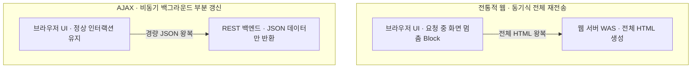
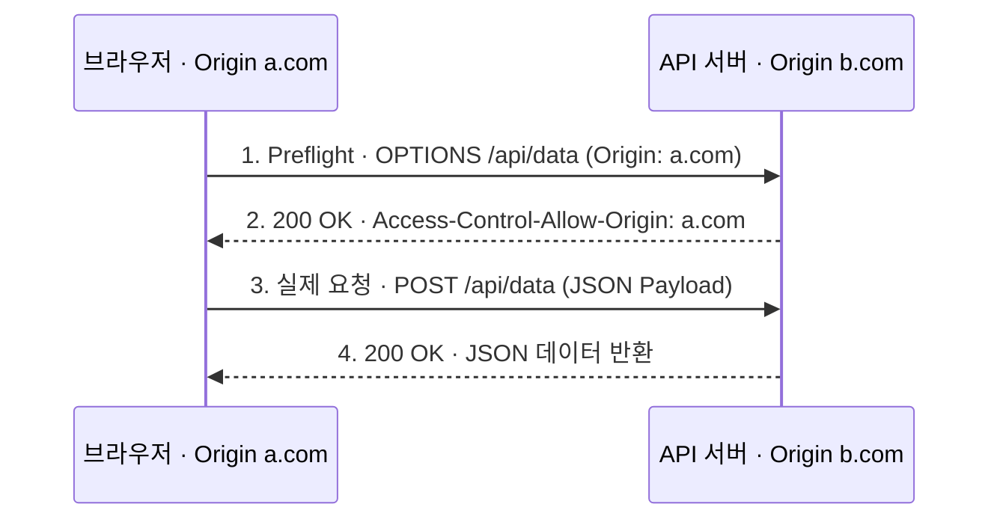

## 지식 로드맵 내 현재 위치

  소프트웨어공학
  웹 아키텍처·클라이언트 엔지니어링
  <strong>AJAX(Asynchronous JavaScript and XML)</strong>

## 30초 인출

- 본질: 전체 웹페이지를 새로고침하여 화면이 하얗게 깜빡이는 블로킹 현상 없이, 브라우저 백그라운드에서 XMLHttpRequest 또는 Fetch API를 통해 서버와 비동기적으로 경량 데이터(JSON/XML)를 교환하고 DOM을 부분 갱신하여 데스크톱 앱 수준의 매끄러운 사용자 경험을 제공하는 웹 기술의 결합체
- 메커니즘: 사용자 이벤트 발생 → XHR/Fetch 비동기 HTTP 요청 → 백엔드 JSON 데이터 반환 → Promise 비동기 수신 → DOM 동적 부분 조작 및 렌더링
- 산출물: 비동기 데이터 통신 모듈 · REST API 엔드포인트 정의서 · CORS 보안 설정 명세서

핵심 용어

- **비동기 통신(Asynchronous)**: 서버에 요청을 보낸 후 응답이 올 때까지 브라우저 화면 렌더링과 사용자 입력 처리를 멈추지 않고 계속 수행하는 통신 방식
- **DOM 부분 갱신(Partial DOM Update)**: 서버로부터 전체 HTML 문서를 다시 받아 새로고침하는 대신, 변경이 필요한 특정 HTML 요소(Element)만 선별하여 교체하는 기법
- **동일 출처 정책(SOP, Same-Origin Policy)**: 브라우저가 보안을 위해 프로토콜, 도메인, 포트가 일치하는 동일 출처의 자원에만 AJAX 통신을 허용하는 핵심 보안 원칙
- **교차 출처 리소스 공유(CORS)**: 서로 다른 출처 간에도 서버가 특정 HTTP 헤더(`Access-Control-Allow-Origin`)를 응답하여 안전하게 자원을 공유하도록 허용하는 W3C 표준 메커니즘

---

## 1교시 예상문제 (10점)

> AJAX(Asynchronous JavaScript and XML)의 정의와 목적, 핵심 메커니즘을 설명하시오. (예상)
---

## 1교시 10점 답안

### 1. 정의·목적

- 정의: 전체 웹페이지를 새로고침하여 화면이 하얗게 깜빡이는 블로킹 현상 없이, 브라우저 백그라운드에서 XMLHttpRequest 또는 Fetch API를 통해 서버와 비동기적으로 경량 데이터(JSON/XML)를 교환하고 DOM을 부분 갱신하여 데스크톱 앱 수준의 매끄러운 사용자 경험을 제공하는 웹 기술의 결합체
- 목적: 해당 토픽의 주요 문제를 해결하고 필요한 기능을 제공한다.

### 2. 핵심 관계

- 제언: 핵심 작동 원리를 적용해 직접 효과를 검증한다.
---

## 2~4교시 예상문제 (25점)

> AJAX(Asynchronous JavaScript and XML)의 개념과 목적을 설명하고, 핵심 메커니즘과 구성요소·절차, 적용 시 문제점과 대응 방안을 제시하시오. (25점, 예상)
---

## 2~4교시 25점 답안

### 1. 개요 및 필요성

### 동기식 웹의 화면 깜빡임 한계와 AJAX의 혁신

과거 웹 1.0 시절에는 사용자가 버튼 하나를 누를 때마다 브라우저가 화면 전체를 하얗게 비우고(Whiteout) 서버로부터 수십 KB의 전체 HTML을 다시 다운로드받아 렌더링해야 했다. 네트워크가 느릴수록 화면 깜빡임과 렉이 극심하여 데스크톱 앱과 같은 반응성을 제공하는 것이 불가능했다.

2005년 제시 제임스 가렛(Jesse James Garrett)이 명명한 AJAX는 **브라우저 내장 자바스크립트 엔진과 비동기 HTTP 통신 객체(XHR/Fetch)를 융합**하여, 화면 깜빡임 없이 백그라운드에서 필요한 데이터만 가져와 화면의 일부분만 번개처럼 교체하는 현대 웹 인터랙션의 표준을 확립했다.

### 전통적 웹(동기식) vs AJAX 웹(비동기식) 비교

| 구분 | 전통적 웹 통신 모델 (Synchronous) | AJAX 비동기 통신 모델 (Asynchronous) |
|---|---|---|
| **통신 방식** | **동기식 요청/응답 (요청 중 브라우저 UI 정지)** | **비동기식 백그라운드 요청 (UI 멈춤 없음)** |
| **데이터 교환**| **HTML 전체 페이지 일괄 다운로드** | **필요한 데이터 조각(JSON/XML)만 선별 전송** |
| **화면 갱신** | **전체 화면 새로고침 (깜빡임 발생, Blank)** | **DOM(Document Object Model) 부분 갱신** |
| **네트워크 부하**| 헤더, 메뉴, 푸터 등 중복 데이터 반복 전송 | 순수 페이로드만 교환하여 중복 전송 제거·트래픽 대폭 절감 |
| **사용자 경험**| 느리고 단절된 웹페이지 탐색 경험 | **데스크톱 및 모바일 네이티브 앱 수준의 리치 UX** |

### 2. 아키텍처 및 핵심 메커니즘

### 전통적 웹 vs AJAX 통신 아키텍처 비교

전체 페이지 재요청 방식과 백그라운드 비동기 통신 방식의 구조적 차이이다.

- **동기식의 대가**: 화면이 하얗게 깜빡임(Whiteout)하며 응답 도착까지 사용자 입력이 정지하고, 헤더·CSS·JS 재다운로드로 트래픽 낭비가 극심하다
- **비동기의 이점**: 자바스크립트가 필요한 div 요소만 즉각 교체하는 DOM 동적 부분 갱신(No Reloading)으로 초고속 반응성을 확보한다

### AJAX 보안의 핵심: SOP와 CORS 프리플라이트(Preflight) 메커니즘

브라우저의 동일 출처 정책(SOP)을 안전하게 우회하여 이기종 API 서버와 통신하기 위한 CORS 메커니즘이다.

- **SOP/CORS 보안 통제의 실무적 가치**: 악의적인 제3자 사이트가 사용자의 쿠키나 세션으로 타사 API를 위조 호출(CSRF)하는 것을 브라우저 엔진이 원천 차단한다

### 3. 실무 적용 및 고려사항

### 위험 대응 매트릭스

| 위험 | 대책 | 효과 |
|---|---|---|
| 프론트엔드와 백엔드 도메인이 달라 브로커 통신 시 CORS 차단 에러 발생 | 백엔드에 `Access-Control-Allow-Origin` 명시적 화이트리스트 설정 또는 Nginx 리버스 프록시 연계 | CORS 차단 오류 100% 해소 및 안전한 도메인 격리 |
| 네트워크 지연으로 인해 먼저 보낸 요청이 나중에 도착하여 화면 데이터가 뒤섞이는 경쟁 상태(Race Condition) | 최신 AbortController를 도입하여 신규 AJAX 요청 발생 시 이전 미완료 요청을 즉각 취소(Abort) | 화면 데이터 역전 결함 100% 원천 방지 |
| 모바일 웹에서 무분별한 잦은 비동기 폴링(Polling)으로 인한 스마트폰 배터리 및 데이터 과다 소모 | 주기적 폴링 대신 WebSocket 또는 Server-Sent Events(SSE) 기반의 푸시 스트리밍으로 전환 | 네트워크 트래픽 90% 절감 및 배터리 소모 최소화 |

### 4. 기술사 답안 차별화 포인트

### XHR에서 모던 Fetch API 및 Async/Await로의 클라이언트 진화

과거 AJAX는 `XMLHttpRequest` 객체의 난해한 이벤트 리스너와 콜백 지옥(Callback Hell)으로 인해 유지보수성이 극도로 나빴다. 기술사 답안에서는 ES6+ 표준인 **Promise 기반의 Fetch API와 `async/await` 구문**을 제시한다. 이를 통해 에러 핸들링(`try-catch`)을 간결화하고, **AbortController를 결합하여 사용자 이탈 시 불필요한 백엔드 요청을 능동적으로 취소하는 모던 프론트엔드 비동기 엔지니어링 역량**을 과시한다.

### Single Page Application(SPA)과 클라이언트 사이드 라우팅

AJAX는 단순한 통신 기법을 넘어 **React, Vue, Angular 기반의 SPA(Single Page Application)** 시대를 열었다. 브라우저의 `History API (pushState, popState)`와 AJAX를 결합하여, URL 주소가 변경되더라도 페이지를 새로고침하지 않고 클라이언트 라우터가 필요한 컴포넌트 데이터만 비동기 로딩하는 **현대 웹 애플리케이션 아키텍처의 패러다임 변화**를 결론으로 도출한다.

### 학습자 통찰 메모 — 답안 밖

- [핵심 통찰]: AJAX는 자바스크립트의 신기능이 아니라 XHR + CSS + DOM + JSON의 '조합 예술'이다. 웹을 정적 문서 뷰어에서 소프트웨어 런타임 플랫폼으로 도약시킨 일등공신이며, 오늘날 React SPA와 모바일 PWA가 존재하는 기술적 원천이다.
- [나라면]: 1교시형 단답 시 동기식(화면 깜빡임)과 비동기식(DOM 부분 갱신)을 시퀀스 다이어그램으로 완벽히 대조하겠다. 2교시형 출제 시에는 AJAX의 최대 보안 장벽인 SOP와 CORS 프리플라이트 메커니즘을 상세히 분석하고, 경쟁 상태를 방지하는 AbortController와 모던 Fetch/SPA로의 아키텍처 진화를 제시하겠다.

### 실전 답안용 기술사적 제언

- **판정 기준**: 비동기 데이터 통신 시 CORS 보안 정책 준수율 100% 및 중복 요청 발생 시 이전 요청 취소(Abort) 적용률 100% 충족 여부
- **대응 방안**: 레거시 XHR을 퇴출하고 Promise 기반 Fetch API와 Async/Await를 표준화하며, 마이크로서비스 연동 시 Nginx 리버스 프록시로 SOP 준수
- **검증 체계**: CORS 프리플라이트 헤더 유효성 검증 → 비동기 경쟁 상태(Race Condition) 시뮬레이션 → 프론트엔드 단위 테스트(Jest/MSW)
- **기대 효과**: 화면 깜빡임 없는 리치 UX 달성, 네트워크 데이터 전송량 80% 감축 및 모던 SPA 아키텍처 완성

### 5. 참고 및 연계 학습

- [Web 2.0](./183_web_2_0.md)
- [HTML5 표준 API](./186_html5.md)
- [REST(Representational State Transfer)](./015_rest.md)
- [웹 성능 최적화](./164_web_performance_optimization.md)
---
