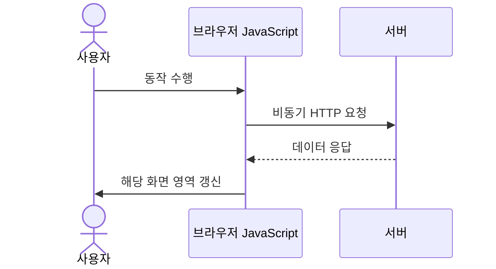
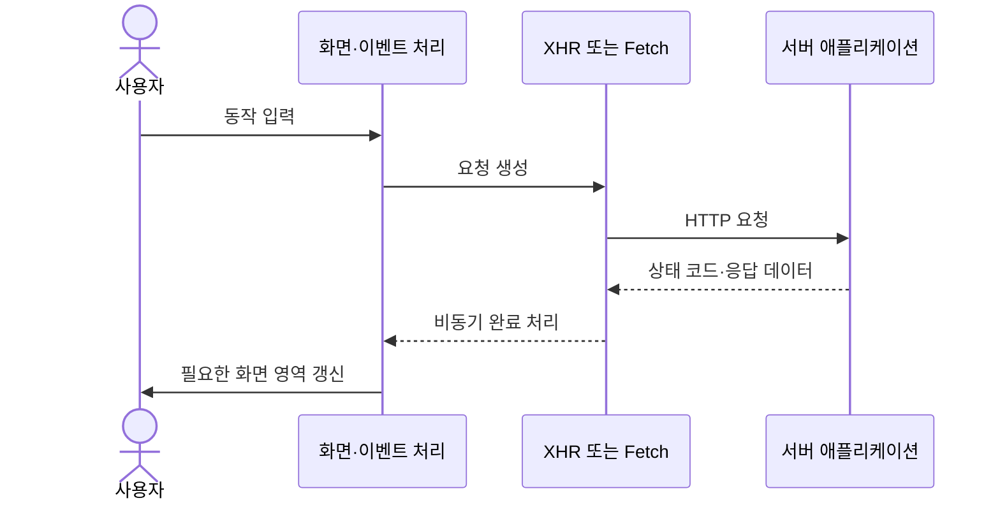
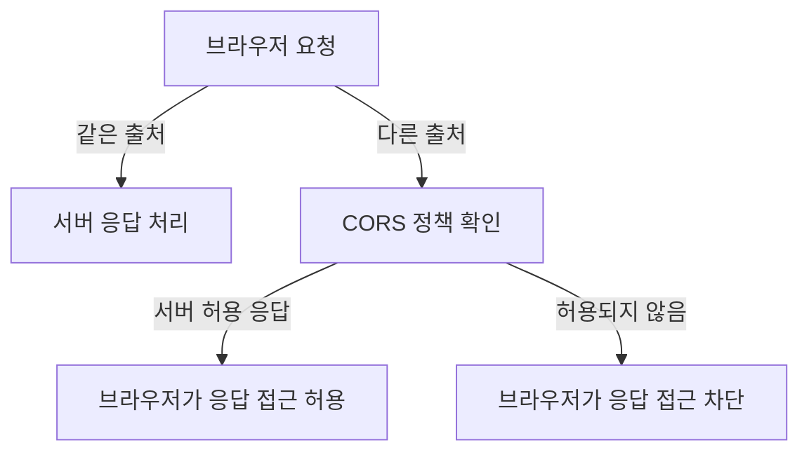

## 학습 위치

소프트웨어공학 → 웹 애플리케이션 → 브라우저 비동기 통신 → **AJAX**

## 30초 인출

- **본질**: AJAX는 브라우저가 서버와 비동기로 데이터를 주고받고 페이지 일부를 갱신하는 웹 개발 방식
- **메커니즘**: 사용자 동작 → 비동기 요청 → 서버 응답 → 필요한 화면 부분 갱신

핵심 용어

- **AJAX(Asynchronous JavaScript and XML)**: 브라우저 비동기 통신으로 전체 페이지 이동 없이 화면 일부를 갱신하는 방식; 실제 데이터 형식은 XML에 한정되지 않음
- **XMLHttpRequest(XHR)**: 브라우저에서 HTTP 요청을 수행하는 API
- **Fetch API**: Promise 기반 브라우저 리소스 요청 API
- **Same-Origin Policy(SOP)**: 출처가 다른 문서·스크립트 간 상호작용을 제한하는 브라우저 보안 정책
- **CORS(Cross-Origin Resource Sharing)**: 서버가 응답 헤더로 교차 출처 접근을 허용하는 방식

---

## 1교시 예상문제 (10점)

> (예상) AJAX의 개념과 동작 방식 및 적용 시 고려사항을 설명하시오.

---

## 1교시 10점 답안

### Ⅰ. 개요

| 구분 | 핵심 |
|---|---|
| 정의 | **AJAX**: 브라우저 비동기 통신으로 페이지 일부를 갱신하는 웹 개발 방식 |
| 목적 | 필요한 데이터와 화면 영역만 갱신해 상호작용을 제공 |

### Ⅱ. 동작 구조

XHR 또는 Fetch로 요청을 수행하며 응답 형식은 JSON, XML, 텍스트 등 서비스 계약에 따라 결정.

### Ⅲ. 고려사항

| 항목 | 고려 내용 |
|---|---|
| 오류 처리 | 네트워크·서버 오류와 시간 초과 처리 |
| 보안 | 인증·인가·입력 검증 및 CSRF 방어를 별도 적용 |
| 교차 출처 | CORS는 서버가 허용한 교차 출처 응답 읽기 제어이며, 인증·CSRF 방어 기능은 아님 |

**제언**: 비동기 성공 경로뿐 아니라 실패·재시도·중복 요청 상태까지 화면과 API 계약에 포함.

---

## 2~4교시 예상문제 (25점)

> (예상) AJAX의 구조와 처리 절차, 보안 및 오류 처리 관점의 적용 방안을 설명하시오.

---

## 2~4교시 25점 답안

## Ⅰ. 개요

| 구분 | 핵심 |
|---|---|
| 정의 | **AJAX**: 브라우저 비동기 통신으로 페이지 일부를 갱신하는 웹 개발 방식 |
| 목적 | 필요한 데이터와 화면 영역만 갱신해 상호작용을 제공 |

## Ⅱ. 구성 요소와 데이터 흐름

AJAX는 특정 데이터 형식이나 단일 API에 한정되지 않는 설계 방식. 클라이언트는 요청을 보내고 완료 시 결과를 반영하며, 전체 문서의 재탐색을 피할 수 있음.

## Ⅲ. 처리와 상태 관리

| 단계 | 처리 |
|---|---|
| 요청 | 메서드·경로·헤더·본문·취소 조건 구성 |
| 응답 | HTTP 상태와 응답 형식 검증 후 데이터 해석 |
| 화면 반영 | 필요한 영역만 갱신하고 진행 상태·오류 표시 |
| 동시성 | 중복 요청, 응답 순서 역전, 화면 이탈 시 취소 처리 고려 |

## Ⅳ. 보안과 교차 출처

교차 출처 리소스 공유(CORS)는 서버의 허용 정책을 브라우저가 검사하도록 하는 통제. 일부 요청은 사전 요청(preflight)이 수행될 수 있음. CORS만으로 CSRF, 인증, 인가가 해결되지 않으므로 각 방어를 별도로 설계.

## Ⅴ. 오류·성능·접근성 고려

| 위험 | 대응 |
|---|---|
| 통신·서버 오류 | 상태 코드별 안내, 재시도 가능 조건과 중복 실행 방지 |
| 느린 응답 | 로딩 상태 표시, 취소·시간 제한 및 사용자 조작 가능성 유지 |
| 응답 역전 | 요청 식별·취소 등으로 오래된 응답의 덮어쓰기 방지 |
| 화면 변화 인지 어려움 | 접근성 있는 상태 알림과 포커스 관리 |

## Ⅵ. 문제와 해결 방안

| 한계 | 해결 방안 |
|---|---|
| 클라이언트가 응답 데이터만 신뢰 | 서버에서 권한·입력 검증을 수행하고 민감 작업 재검증 |
| 실패 응답이 화면에 반영되지 않음 | 네트워크·서버·검증 오류를 구분한 공통 상태 처리 |
| 빠른 연속 조작으로 중복 변경 | 멱등성·중복 제출 방지 및 요청 상태 관리 |

## Ⅶ. 기술적 제언

| 구분 | 내용 |
|---|---|
| 한계 | 화면 컴포넌트마다 통신·오류·보안 처리를 다르게 구현하면 일관된 검증이 어려움 |
| 해결 방안 | 요청·응답 계약과 오류 상태 처리를 공통 모듈로 두고, 화면은 업무별 상태 전이에 집중하도록 설계 |

## 참고 및 연계 학습

- [WHATWG Fetch Standard](https://fetch.spec.whatwg.org/)
- [Web 2.0](./183_web_2_0.md)
- [HTML5 표준 API](./186_html5.md)
- [REST](./015_rest.md)
- [웹 성능 최적화](./164_web_performance_optimization.md)
