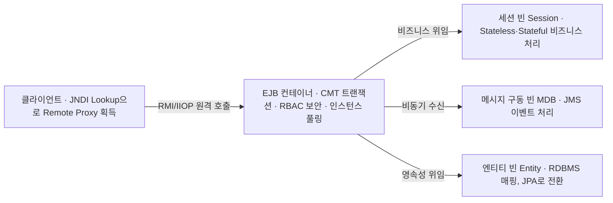

## 지식 로드맵 내 현재 위치

  소프트웨어공학
  애플리케이션 아키텍처·컴포넌트 기술
  <strong>EJB(Enterprise Java Beans)</strong>

## 30초 인출

- 본질: 기업용 대규모 분산 엔터프라이즈 환경에서 트랜잭션, 분산 보안, 스레드 풀링 등 복잡한 시스템 인프라 로직을 전용 런타임 컨테이너(WAS)가 투명하게 전담하고, 개발자는 순수 비즈니스 로직 작성에만 집중할 수 있도록 선언적 인프라 서비스를 제공하는 자바 엔터프라이즈(Java EE) 표준 분산 컴포넌트 스펙
- 메커니즘: 클라이언트 JNDI 룩업 → 원격 인터페이스 프록시 획득 → 컨테이너 인터셉트(선언적 트랜잭션 CMT 및 보안 인가) → 대상 빈(Session/MDB/Entity) 비즈니스 로직 실행 → 결과 반환
- 산출물: EJB 컴포넌트 클래스 · 원격/로컬 인터페이스 명세서 · 배포 서술자(`ejb-jar.xml`) · 엔터프라이즈 아카이브(EAR)

핵심 용어

- **선언적 트랜잭션(CMT, Container-Managed Transaction)**: 개발자가 소스코드에 `commit()`이나 `rollback()`을 직접 코딩하지 않고, XML 설정이나 어노테이션으로 트랜잭션 경계를 컨테이너에 위임하는 기능
- **세션 빈(Session Bean)**: 클라이언트의 요청을 처리하는 비즈니스 로직 컴포넌트로, 상태를 유지하지 않는 Stateless 세션 빈과 상태를 보존하는 Stateful 세션 빈으로 구분
- **메시지 구동 빈(MDB, Message-Driven Bean)**: JMS(Java Message Service) 큐로부터 비동기 메시지를 수신하여 비즈니스 로직을 비동기적으로 처리하는 이벤트 수신 빈
- **POJO(Plain Old Java Object)**: 특정 상용 무거운 프레임워크나 인터페이스를 상속받지 않는 순수한 자바 객체로, 스프링 프레임워크가 EJB의 침투성을 비판하며 내세운 핵심 철학

## 1. 개요 및 필요성

### 분산 엔터프라이즈의 인프라 악몽과 EJB의 등장

대규모 금융이나 전자상거래 시스템을 순수 자바 소켓과 멀티스레드로 구축하려면 분산 트랜잭션(2PC), 스레드 풀 관리, 객체 생명주기 관리, 네트워크 보안 등 막대한 시스템 인프라 코드를 개발자가 직접 작성해야 했다. 배보다 배꼽이 더 커져 비즈니스 로직 개발은 뒷전으로 밀렸다.

선마이크로시스템즈의 EJB는 **"인프라의 복잡성은 WAS 컨테이너가 도맡고, 개발자는 순수 비즈니스 로직만 코딩하라"**는 기치 아래 등장한 엔터프라이즈 표준이었다. 트랜잭션, 보안, 인스턴스 풀링을 컨테이너가 선언적으로 자동 지원하는 혁신을 가져왔다.

### EJB 2.x vs EJB 3.x vs 스프링 프레임워크 비교

| 구분 | EJB 2.x (과거의 실패) | EJB 3.x (개선된 표준) | 스프링 프레임워크 (현대 엔터프라이즈) |
|---|---|---|---|
| **코드 침투성** | **극도로 높음 (Home/Remote 인터페이스 상속)** | 낮음 (어노테이션 기반 POJO 도입) | **완전한 비침투적(Non-invasive) POJO 지향** |
| **실행 환경** | **무거운 상용 WAS 필수 (WebLogic, Jeus)** | Java EE 풀 프로파일 WAS 필수 | **가벼운 톰캣(Tomcat) 또는 내장 WAS 실행** |
| **단위 테스트** | **로컬 단위 테스트 사실상 불가능 (WAS 기동 필수)**| 제한적 단위 테스트 가능 | **Mock 객체와 JUnit으로 완벽한 고속 격리 테스트** |
| **영속성 계층** | 극도로 무겁고 비효율적인 엔티티 빈(Entity Bean) | JPA(Java Persistence API) 표준 채택 | Spring Data JPA / MyBatis 지원 |
| **설계 철학** | 중앙 통제적 무거운 컨테이너 | 자바 엔터프라이즈 표준 정립 | **IoC/DI 및 AOP 기반 경량화와 생산성 극대화** |

## 2. 아키텍처 및 핵심 메커니즘

### EJB 컨테이너 인터셉터 및 3대 컴포넌트 아키텍처

EJB 컨테이너는 클라이언트와 빈 사이에 위치하여 트랜잭션과 보안을 투명하게 가로채어 중재한다.

- **컨테이너 인터셉트 서비스**: 선언적 트랜잭션(CMT, 자동 begin/commit) · 역할 기반 보안(RBAC, 호출 권한 인가) · 인스턴스 풀링(스레드/커넥션 재사용)
- **예외 시 롤백**: 비즈니스 예외 발생 시 `setRollbackOnly()` 호출로 2단계 커밋(2PC) 분산 트랜잭션의 모든 변경분을 원복한다

### 아키텍처 역사적 대전환: 무거운 EJB vs 경량 POJO/스프링

EJB의 과도한 기술 침투성에 반발하여 탄생한 스프링 프레임워크의 POJO 혁명이다.

- **EJB의 귀결**: 느린 빌드/배포 주기로 개발자 생산성이 극단적으로 저하되어, 복잡성의 괴물이 되어 엔터프라이즈에서 퇴출되었다
- **스프링의 귀결**: AOP로 비즈니스와 인프라 관심사를 완벽 분리하여, 현대 글로벌 엔터프라이즈의 사실상 표준(De facto)이 되었다

## 3. 실무 적용 및 고려사항

### 위험 대응 매트릭스

| 위험 | 대책 | 효과 |
|---|---|---|
| EJB의 무거운 상용 WAS 라이선스 비용과 특정 벤더 종속성으로 인한 클라우드 전환 불가 | 비즈니스 로직을 POJO로 추출하고 Spring Boot와 JPA 기반의 마이크로서비스로 마이그레이션 | 인프라 비용 70% 절감 및 컨테이너 기반 K8s 배포 실현 |
| 과거 EJB 2.x 엔티티 빈(Entity Bean) 사용으로 인한 N+1 쿼리 폭증 및 심각한 DB 성능 저하 | 하이버네이트(Hibernate) 기반의 표준 JPA 도입 및 페치 조인(Fetch Join) 최적화 | 데이터베이스 응답 속도 10배 향상 및 자원 고갈 방지 |
| 원격 EJB 호출(RMI) 시 네트워크 지연 및 직렬화(Serialization) 오버헤드로 인한 병목 | 불필요한 원격 인터페이스를 로컬 인터페이스로 전환하거나 경량 REST/gRPC 통신으로 대체 | 원격 호출 레이턴시 80% 감축 |

## 4. 기술사 답안 차별화 포인트

### EJB의 유산: 어노테이션 기반 Java EE 표준(Jakarta EE)과 JPA로의 승화

EJB는 '무겁고 실패한 기술'로 조롱받기도 하지만, 소프트웨어 공학적으로는 **"선언적 트랜잭션, 객체-관계 매핑(ORM), 인터셉터"라는 거대한 공학적 유산**을 남겼다. EJB 3.0은 과거의 과오를 인정하고 POJO와 어노테이션(`@Stateless`, `@TransactionAttribute`)을 전면 도입했으며, EJB의 영속성 계층은 오늘날 전 세계가 사용하는 **JPA(Java Persistence API)의 표준 모체**가 되었다. 기술사 답안에서는 이러한 기술 발전의 계보를 명쾌히 서술하여 역사적 안목을 증명한다.

### 레거시 EJB 시스템의 현대화: 클라우드 네이티브 스프링 마이그레이션

금융권이나 공공기관에는 여전히 2000년대 초반에 구축된 EJB 2.x 기반 레거시 시스템이 다수 운영되고 있다. 기술사 답안에서는 복잡한 EJB 배포 서술자(`ejb-jar.xml`)를 분석하여 **EJB 컴포넌트를 순수 스프링 Service 빈으로 전환하고, 무거운 WAS 환경을 Docker/Kubernetes 기반의 경량 Spring Boot 마이크로서비스로 점진적 분해하는 실무 마이그레이션 로드맵**을 결론으로 제시한다.

### 학습자 통찰 메모 — 답안 밖

- [핵심 통찰]: EJB는 "엔지니어가 비즈니스에만 집중하게 하겠다"는 원대한 꿈을 가졌지만, 프레임워크 자체가 너무 복잡해져서 오히려 엔지니어를 짓눌렀다. 로드 존슨(Rod Johnson)은 이 모순을 꿰뚫어보고 'POJO로의 회귀'를 외치며 스프링을 창시했다. 결국 공학은 '복잡성을 억누르려다 더 큰 복잡성을 낳는 함정'을 경계해야 한다.
- [나라면]: 1교시형 단답 시 EJB 컨테이너 인터셉터와 3대 빈(Session, Entity, MDB)을 구조화하겠다. 2교시형 서술에서는 EJB 2.x의 치명적 한계(코드 침투성, 단위테스트 불가, 무거운 상용 WAS)를 비판하고, 이것이 어떻게 스프링의 POJO 혁명과 JPA 표준화로 이어졌는지 아키텍처 진화의 드라마를 3단락에 펼치겠다.

### 실전 답안용 기술사적 제언

- **판정 기준**: 레거시 EJB 코드 침투도(인터페이스 상속율) 0% 달성 및 로컬 환경 JUnit 단위 테스트 자동화 100% 충족 여부
- **대응 방안**: EJB 2.x/3.x 레거시 컴포넌트를 순수 POJO 서비스로 추출하고, Spring Data JPA와 Spring Boot를 접목한 경량 클라우드 네이티브 아키텍처로 점진적 전환
- **검증 체계**: EJB 인터페이스 의존도 정적 검사 → 비즈니스 로직 단위 테스트(Mock/JUnit) → 트랜잭션 전파 롤백 검증 → 컨테이너 패키징 테스트
- **기대 효과**: 상용 WAS 라이선스 비용 완전 제거, 애플리케이션 기동 속도 10배 단축 및 일일 배포가 가능한 지속적 배포(CD) 파이프라인 안착

## 5. 참고 및 연계 학습

- [스프링 부트(Spring Boot)](./159_spring_boot.md)
- [추상 클래스와 인터페이스](./205_abstract_class_and_interface.md)
- [객체지향 설계 5대 원칙(SOLID)](./047_solid_principles.md)
- [모듈성(결합도·응집도)](./190_modularity.md)
