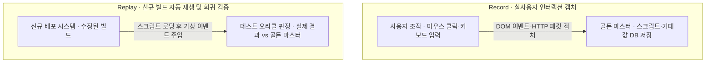
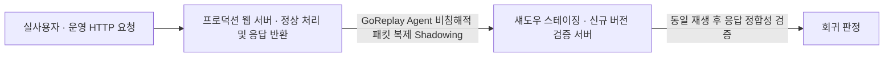

## 지식 로드맵 내 현재 위치

  소프트웨어공학
  소프트웨어 테스팅·테스트 자동화
  <strong>Record and Replay 테스트 기법</strong>

## 30초 인출

- 본질: 사용자의 GUI 마우스/키보드 입력 행위나 실제 운영 환경의 네트워크 패킷을 실시간 가로채어 기록(Record)한 뒤, 소스코드 수정 및 신규 배포 시 동일하게 재생(Replay)하여 이전과 똑같이 정상 동작하는지 검증하고 회귀 결함을 조기 발견하는 테스트 자동화 기법
- 메커니즘: 사용자 인터랙션 캡처 → 테스트 스크립트 및 기대값(Golden Master) 저장 → 신규 빌드 대상 가상 이벤트 주입 재생 → 테스트 오라클(Oracle) 비교 검증 → 회귀 결함 판정
- 산출물: 캡처된 테스트 스크립트 파일 · 기대 결과 데이터셋 · 회귀 시험 성적서 · 트래픽 리플레이 로그

핵심 용어

- **테스트 오라클(Test Oracle)**: 테스트 수행 결과가 참인지 거짓인지를 판단하기 위해 사전에 정의된 참값(기대 결과값)을 제공하는 기준 메커니즘
- **Flaky Test (간헐적 실패 테스트)**: 소스코드에 아무런 변경이 없음에도 타이밍, 네트워크 지연, 비동기 렌더링 속도 차이로 인해 성공과 실패를 무작위로 오가는 불안정한 테스트
- **골든 마스터(Golden Master)**: 레코딩 시점에 정상적으로 생성된 시스템의 스크린샷, 응답 JSON, DB 스냅샷을 기준 원본으로 삼아 변경분을 대조하는 회귀 기법
- **트래픽 섀도잉(Traffic Shadowing)**: 운영 환경의 실제 인입 HTTP 패킷을 백그라운드에서 복제(GoReplay 등)하여 스테이징 신규 버전 서버로 무해하게 실시간 리플레이하는 기법

---

## 1교시 예상문제 (10점)

> Record and Replay 테스트 기법의 정의와 목적, 핵심 메커니즘을 설명하시오. (예상)

---

## 1교시 10점 답안

### 1. 정의·목적

- 정의: 사용자의 GUI 마우스/키보드 입력 행위나 실제 운영 환경의 네트워크 패킷을 실시간 가로채어 기록(Record)한 뒤, 소스코드 수정 및 신규 배포 시 동일하게 재생(Replay)하여 이전과 똑같이 정상 동작하는지 검증하고 회귀 결함을 조기 발견하는 테스트 자동화 기법
- 목적: 기록한 사용자 동작을 재실행해 GUI 회귀 시험을 반복 가능하게 한다.

### 2. 핵심 관계

- 제언: 안정된 식별자와 외부화된 시험 데이터를 사용하고 재생 실패를 제품 결함과 스크립트 취약성으로 구분한다.
---

## 2~4교시 예상문제 (25점)

> Record and Replay 테스트 기법의 개념과 목적을 설명하고, 핵심 메커니즘과 구성요소·절차, 적용 시 문제점과 대응 방안을 제시하시오. (25점, 예상)

---

## 2~4교시 25점 답안

### 1. 개요 및 필요성

### 수작업 회귀 테스트의 한계와 자동화의 진입 장벽

소프트웨어 기능이 추가될 때마다 기존에 잘 돌아가던 기능이 깨지지 않았는지 확인하는 "회귀 테스트(Regression Test)" 공수는 기하급수적으로 폭증한다. 그러나 코딩 기반의 E2E 테스트(Selenium, Playwright)를 일일이 작성하는 것은 높은 숙련도와 많은 시간이 소요된다.

Record and Replay 기법은 **비전문가도 실제 화면을 조작하는 것만으로 신속하게 테스트 스크립트를 생성**할 수 있도록 지원하여, 테스트 자동화의 초기 구축 속도를 극대화하는 실용적 테스팅 기법이다.

### 레코드 & 리플레이 vs 코드 기반 E2E vs 키워드 주도 테스트 비교

| 구분 | 레코드 & 리플레이 (Record & Replay) | 코드 기반 E2E 테스트 (Playwright 등) | 키워드 주도 테스트 (Robot Framework) |
|---|---|---|---|
| **스크립트 생성**| **사용자 조작을 화면 녹화하듯 자동 생성** | **개발자/QA가 직접 프로그래밍 코딩** | 스프레드시트에 정의된 키워드 조합 |
| **작성 난이도** | **매우 낮음 (비개발자도 즉시 가능)** | 높음 (테스트 프레임워크 지식 필요) | 보통 (테이블 정의 수준) |
| **유지보수성** | **취약 (UI 변경 시 스크립트 깨짐 빈번)** | **우수 (Page Object Model 모듈화)** | 우수 (키워드 매핑 테이블만 수정) |
| **실행 신뢰도** | 낮음 (Flaky Test 발생 위험) | **높음 (스마트 대기 및 예외 처리 견고)** | 높음 |
| **대표 도구** | Selenium IDE, Cypress Studio, GoReplay | Playwright, Selenium WebDriver | Robot Framework |

### 2. 아키텍처 및 핵심 메커니즘

### Record and Replay 테스트 시스템 아키텍처

레코드 단계와 리플레이 단계의 유기적 상호작용 아키텍처이다.

- **회귀 판정 게이트**: 재생 결과가 골든 마스터와 일치하면 PASS로 릴리스 승인, 불일치하면 배포 보류 후 UI 변경 여부 확인 → 스크립트 갱신 또는 결함 티켓 발행

### 모던 백엔드 진화: GoReplay 기반 프로덕션 트래픽 섀도잉

GUI 캡처의 취약점을 극복하고 백엔드 서버의 실제 운영 트래픽을 복제하여 검증하는 모던 테스팅 아키텍처이다.

- **운영 DB 보호**: 쓰기(Write) 요청은 Mock 처리하여 실제 운영 DB 오염을 완벽 방지한다
- **실트래픽 검증 가치**: 가짜 데이터가 아닌 실제 유저 트래픽 재생으로 극한의 엣지 케이스를 사전 적발한다

### 3. 실무 적용 및 고려사항

### 위험 대응 매트릭스

| 위험 | 대책 | 효과 |
|---|---|---|
| 프론트엔드 버튼 위치나 HTML id가 바뀌어 재생 시 요소를 못 찾아 스크립트가 깨짐 | 절대 좌표나 자동 생성 id 대신, 비즈니스 의미를 담은 `data-testid` 속성 기반 셀렉터 지정 | UI 변경 시 테스트 스크립트 파손율 80% 감축 |
| 네트워크 비동기 지연으로 요소가 미처 뜨기 전에 클릭하여 테스트가 실패하는 Flaky 현상 | 하드코딩된 `sleep()`을 금지하고, DOM 요소가 나타날 때까지 스마트 대기하는 `waitForSelector` 적용 | 간헐적 Flaky Test 실패율 95% 제거 |
| 운영 트래픽 섀도잉(GoReplay) 중 결제 승인 등 CUD 요청이 실제 외부 결제망으로 재전송 | 결제, 이메일 등 외부 부수효과(Side-Effect)를 유발하는 API 엔드포인트는 리플레이 필터링 또는 가상 Mock 격리 | 운영 데이터베이스 오염 및 금전 사고 원천 차단 |

### 4. 기술사 답안 차별화 포인트

### Page Object Model(POM)과의 결합을 통한 유지보수성 혁신

순수 Record and Replay 도구는 UI가 조금만 바뀌어도 수백 개의 스크립트를 다시 녹화해야 하는 '유지보수의 지옥'을 초래한다. 기술사 답안에서는 녹화된 스크립트를 그대로 쓰지 않고, **화면의 요소를 객체화하여 분리하는 Page Object Model(POM)** 구조로 변환하여 관리하는 실무적 프레임워크를 제시한다. UI가 변경되더라도 Page 클래스의 셀렉터 한 줄만 수정하면 모든 테스트가 유지되는 성숙한 엔지니어링을 강조한다.

### 카나리 배포(Canary)와 트래픽 미러링(Traffic Shadowing)의 결합

최신 클라우드 네이티브 환경에서는 GUI 녹화 대신 **네트워크 수준의 Record & Replay(GoReplay, Istio Traffic Mirroring)**가 대세이다. 실제 사용자에게 영향을 주지 않고 운영 트래픽을 그대로 복제하여 신규 컨테이너로 흘려보냄으로써, 수천 가지의 예측 불가능한 사용자 입력 패턴을 사전에 100% 검증하는 **무결점 카나리 릴리스 파이프라인**을 결론으로 제언한다.

### 학습자 통찰 메모 — 답안 밖

- [핵심 통찰]: Record and Replay는 '양날의 검'이다. 처음 만들 때는 5분 만에 끝나서 감탄하지만, UI가 바뀌는 순간 모든 스크립트가 쓰레기가 된다. 그래서 실무에서는 순수 녹화에만 의존하지 않고 `data-testid` 기반 POM으로 감싸거나, 네트워크 수준의 GoReplay 섀도잉으로 전환하는 것이 정답이다.
- [나라면]: 1교시형 단답 시 Record → Script/Oracle → Replay의 3단계를 도식화하고 Flaky Test 해결 방안을 명시하겠다. 2교시형 출제 시에는 GUI 레코드의 한계(유지보수 취약)를 지적하고, 이를 극복한 POM(Page Object Model) 리팩토링과 백엔드 트래픽 미러링(GoReplay/Istio) 실무 파이프라인을 기술사적 해법으로 제시하겠다.

### 실전 답안용 기술사적 제언

- **판정 기준**: 회귀 테스트 수행 시 스크립트 자가 복원율 90% 이상 및 Flaky Test 발생률 2% 이하 통제 여부
- **대응 방안**: 레코드 도구 도입 시 data-testid 표준 명명 규칙을 적용하고, 백엔드는 GoReplay 트래픽 섀도잉을 CI/CD 품질 게이트로 연동
- **검증 체계**: 신규 배포 빌드 → 가상 이벤트 주입 → 골든 마스터 오라클 대조 → 결함 자동 리포팅
- **기대 효과**: 회귀 테스트 작성 공수 70% 단축, 배포 전 잠재적 런타임 결함 조기 적발 및 무중단 배포 신뢰성 확보

### 5. 참고 및 연계 학습

- [통합 테스트(Integration Test)](./179_integration_test.md)
- [회귀 테스트(Regression Test)](./061_regression_test.md)
- [성능 테스트(Performance Test)](./191_performance_test.md)
- [카오스 테스트(Chaos Engineering)](./176_chaos_test.md)
---
