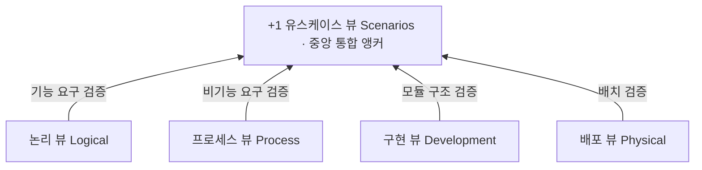

## 지식 로드맵 내 현재 위치

  소프트웨어공학
  소프트웨어 아키텍처·설계 명세
  <strong>SAD(Software Architecture Document)</strong>

## 30초 인출

- 본질: 대규모 소프트웨어 시스템의 거시적 구조, 행위, 핵심 품질 속성(아키텍처 드라이버), 기술적 설계 의사결정을 다양한 이해관계자의 관점(View)에 맞추어 체계적으로 기술함으로써 시스템의 기술적 일관성을 보장하고 소통의 단일 기준점을 제공하는 최상위 아키텍처 청사진 명세서
- 메커니즘: 이해관계자 식별 → 아키텍처 드라이버 도출 → 뷰포인트(Viewpoint) 정의 → 4+1 View 다각도 모델링 → 아키텍처 결정 기록(ADR) 문서화 → 일치성 검증
- 산출물: 소프트웨어 아키텍처 기술서(SAD) · 4+1 View 다이어그램 세트 · 아키텍처 결정 기록서(ADR) · 아키텍처 적합성 평가서

핵심 용어

- **IEEE 42010 (ISO/IEC/IEEE 42010)**: 소프트웨어 및 시스템 아키텍처 기술서(SAD)의 프레임워크를 규정한 국제 표준으로, 이해관계자, 관심사, 뷰, 뷰포인트의 개념적 모델을 정립
- **4+1 View Model**: 필립 크루츠텐(Philippe Kruchten)이 제안한 아키텍처 표현 모델로, 유스케이스 뷰를 중심으로 논리, 개발(구현), 프로세스, 물리(배포)의 4개 뷰로 다각도 기술
- **ADR(Architecture Decision Record)**: 중요한 아키텍처 설계 결정의 맥락(Context), 결정 내용(Decision), 결과(Consequences)를 마크다운 문서로 기록하여 깃(Git)으로 관리하는 경량 기법
- **아키텍처 드리프트(Architecture Drift)**: 시스템 구현 및 유지보수 과정에서 소스코드가 초기 SAD에 정의된 아키텍처 원칙과 계층 규칙을 벗어나 서서히 스파게티화되는 현상

## 1. 개요 및 필요성

### 복잡한 시스템의 소통 단절과 청사진의 필요성

수백 명의 엔지니어가 참여하는 대규모 프로젝트에서 아키텍처 문서가 없으면, 개발자는 자기 모듈만 바라보고, 인프라 엔지니어는 서버 스펙만 따지며, 고객은 비즈니스 기능만 요구하다가 시스템 결합 시점에 거대한 혼란이 발생한다.

SAD(소프트웨어 아키텍처 기술서)는 **"건축물의 종합 청사진"**과 같아서, 다양한 이해관계자의 서로 다른 관심사를 다각도의 뷰(View)로 정리하여 **시스템의 거시적 구조를 정의하고 기술적 의사결정의 일관성을 유지하는 단일 진실 공급원(SSOT)** 역할을 수행한다.

### SAD 핵심 구성 체계 (ISO/IEC/IEEE 42010 기준)

| 구성 요소 | 개념 및 정의 | 주요 작성 내용 |
|---|---|---|
| **이해관계자 (Stakeholder)** | 시스템의 성공에 직접적 이해관계를 가진 개인/집단 | 고객, 최종 사용자, 아키텍트, 개발자, 인프라 운영자, 감리원 |
| **관심사 (Concerns)** | 이해관계자들이 시스템에 대해 가지는 핵심 요구사항 | 기능성, 가용성, 성능, 보안성, 유지보수성, 구축 비용 |
| **뷰포인트 (Viewpoint)** | 특정 관심사를 다루기 위한 뷰의 작성 규칙과 관점 | 표기법(UML/C4), 모델링 규칙, 독자 대상 정의 |
| **뷰 (View)** | 특정 뷰포인트에 따라 시스템 전체를 표현한 아키텍처 산출물 | 논리 뷰, 배포 뷰, 시퀀스 다이어그램, 패키지 구조도 |

## 2. 아키텍처 및 핵심 메커니즘

### Kruchten 4+1 View 아키텍처 모델

유스케이스 뷰(+1)를 중심으로 4개의 독립적 시각을 통합하는 표준 아키텍처 구조이다.

| 뷰 | 주 대상 | 기술 내용 |
|---|---|---|
| **논리 뷰(Logical)** | 최종 사용자, 설계자 | 기능적 요구 명세 — 클래스/패키지/객체 다이어그램, 도메인 계층화 구조 |
| **프로세스 뷰(Process)** | 시스템 통합자 | 성능·동시성·확장 비기능 요구 — 스레드, 프로세스, IPC, 시퀀스/액티비티 |
| **구현 뷰(Development)** | 프로그래머, 빌드 관리자 | 소스 모듈·패키지 계층, 라이브러리 의존성·빌드 — 컴포넌트 다이어그램 |
| **배포 뷰(Physical)** | 시스템 엔지니어, 인프라 | HW 노드·네트워크 토폴로지, K8s 파드·로드밸런서 — 배치 다이어그램 |

- **일치성 게이트**: SAD의 뷰와 결정이 실제 소스코드·인프라 구성과 일치하면 베이스라인 확정 후 상세설계 착수, 드리프트·모순 발견 시 SAD 개정 및 ATAM 재평가를 수행한다

### 모던 아키텍처 문서화: ADR과 C4 Model

수백 페이지의 무거운 워드 문서를 탈피하여 깃(Git)으로 관리하는 현대적 아키텍처 문서화 기법이다.

**C4 Model — 구글 지도식 줌인 계층 모델링**

| 계층 | 기술 범위 |
|---|---|
| **Level 1 Context** | 시스템 전반과 외부 사용자·시스템 연계 |
| **Level 2 Containers** | SPA, 모바일앱, API 서버, DB 구성 |
| **Level 3 Components** | 컨테이너 내부의 컨트롤러, 서비스 |
| **Level 4 Code** | 세부 클래스 다이어그램 및 인터페이스 |

- 복잡한 UML 대신 줌인/줌아웃 방식의 직관적 시각화를 제공한다

**ADR(Architecture Decision Record) — 아키텍처 결정 기록**

> **#001 Kafka 메시지 브로커 도입 결정** (Status: Accepted)
> Context: 대규모 주문 폭증 시 백엔드 DB 부하 분산 필요 · Decision: RabbitMQ 대신 고처리량 분산 Kafka 도입 · Consequences: 처리량 증가, 단 운영 복잡도 상승

- 마크다운(MD) 파일로 소스코드와 함께 Git 형상 관리하여 "왜 이렇게 설계했는가?"의 설계 근거를 영구 보존한다

## 3. 실무 적용 및 고려사항

### 위험 대응 매트릭스

| 위험 | 대책 | 효과 |
|---|---|---|
| 프로젝트 초기에만 수백 장 워드로 작성되고 이후 방치되어 소스코드와 달라지는 아키텍처 드리프트 | 소스코드 변경 시 ArchUnit 및 Dependometer를 CI 파이프라인에 연계하여 아키텍처 규칙 위반 빌드 차단 | 문서와 실제 코드 간 일치성 100% 보장 |
| 특정 벤더의 난해한 표기법 남용으로 개발자나 고객이 문서를 전혀 이해하지 못하고 소통 단절 | 복잡한 UML 대신 구글 지도식으로 줌인/줌아웃되는 C4 Model 표기법 표준화 도입 | 이해관계자 소통 오차 90% 이상 감축 |
| "왜 이 기술 스택을 골랐는지"에 대한 히스토리가 사라져 차후 유지보수 시 아키텍처 붕괴 | Git 리포지토리 내 `/docs/adr/` 디렉터리에 마크다운 형식의 아키텍처 결정 기록(ADR) 작성 강제 | 설계 의사결정 추적성 100% 확보 |

## 4. 기술사 답안 차별화 포인트

### Docs-as-Code: 마크다운과 Git 기반의 살아있는 SAD

전통적 SI 프로젝트의 수백 페이지 워드/한글 문서는 납품 후 캐비닛에 처박히는 '죽은 문서'가 된다. 기술사 답안에서는 **Docs-as-Code 철학**을 제시한다. SAD를 **Markdown 또는 AsciiDoc으로 작성하여 소스코드와 동일한 Git 저장소에서 형상 관리**하고, PlantUML과 Mermaid를 통해 다이어그램을 코드로 자동 렌더링하며, PR(Pull Request) 리뷰 시 아키텍처 변경을 코드 리뷰처럼 검증하는 **살아있는(Living) 아키텍처 문서화 체계**를 답안의 차별화로 강조한다.

### 아키텍처 적합성 검증 도구(ArchUnit)의 파이프라인 통합

SAD에 정의된 "Controller는 Repository를 직접 호출할 수 없다"는 계층 규칙을 개발자가 무시하고 코딩하면 문서는 무용지물이 된다. 답안에서는 **ArchUnit 테스트 코드를 단위 테스트 파이프라인에 탑재**하여, SAD에 명세된 아키텍처 레이어 규칙을 소스코드 빌드 시점에 단위 테스트 형태로 자동 검증하는 **아키텍처 거버넌스 자동화 역량**을 결론으로 제시한다.

### 학습자 통찰 메모 — 답안 밖

- [핵심 통찰]: SAD는 '서류를 위한 서류'가 아니라 개발팀의 헌법이다. 가장 좋은 SAD는 300페이지짜리 두꺼운 바인더가 아니라, Git에 들어있는 명쾌한 C4 다이어그램과 20개의 ADR(Architecture Decision Record)이다.
- [나라면]: 1교시형 단답 시 IEEE 42010의 4대 개념(이해관계자, 관심사, 뷰, 뷰포인트)과 Kruchten의 4+1 View를 1단락과 2단락에 깔끔히 도식화하겠다. 2교시형 출제 시에는 아키텍처 드리프트 문제를 지적하고, 이를 해결하기 위한 Docs-as-Code(ADR)와 ArchUnit 기반 자동 검증 파이프라인을 기술사적 해법으로 제시하겠다.

### 실전 답안용 기술사적 제언

- **판정 기준**: 4+1 View 및 ADR 명세율 100% 달성 및 ArchUnit 아키텍처 계층 규칙 위반율 0% 충족 여부
- **대응 방안**: 시스템 설계 시 C4 Model 기반 계층적 뷰와 ADR을 수립하고, CI 파이프라인에 아키텍처 규칙 검증을 의무화
- **검증 체계**: 이해관계자 뷰 검토 → ATAM 아키텍처 평가 → ArchUnit 정적 규칙 검사 → 감리 승인
- **기대 효과**: 설계 일관성 100% 확보, 개발자 온보딩 시간 50% 단축 및 프로젝트 수명주기 전반의 기술 부채 최소화

## 5. 참고 및 연계 학습

- [모듈성(결합도·응집도)](./190_modularity.md)
- [객체지향 설계 5대 원칙(SOLID)](./047_solid_principles.md)
- [폭포수 개발 방법론(Waterfall)](./181_waterfall_methodology.md)
- [EIP(Enterprise Integration Patterns)](./182_eip.md)
