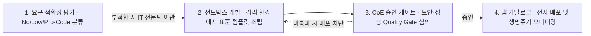

## 지식 로드맵 내 현재 위치

  소프트웨어공학
  개발 자동화·생산성 도구
  <strong>로우코드·노코드(LCNC)</strong>

## 30초 인출

- 본질: 복잡한 텍스트 코딩 대신 시각적 드래그 앤 드롭 UI, 사전 구성 컴포넌트, 표준 API 커넥터를 조합해 소프트웨어를 신속히 조립·배포함으로써 현업(시민 개발자)의 IT 백로그를 해소하고 개발 생산성을 극대화하는 개발 패러다임
- 메커니즘: 업무 요구 가시화 → 시각적 UI·데이터 모델링 → 비즈니스 로직·워크플로우 조립 → 커넥터·API 연계 → 자동 빌드·테스트·배포(ALM) → 거버넌스 통제
- 산출물: 시각적 앱 메타데이터 모델 · 자동 생성 배포 패키지 · 서비스 API 커넥터 명세서 · LCNC 거버넌스 운영 지침(CoE 규정)

핵심 용어

- **시민 개발자(Citizen Developer)**: 공식 IT 전문 부서 소속이 아니지만, 비즈니스 도메인 지식을 바탕으로 노코드/로우코드 도구를 활용해 업무용 애플리케이션을 직접 구축하는 현업 실무자
- **섀도우 IT(Shadow IT)**: 중앙 IT 부서의 공식 승인, 통제, 보안 검토를 거치지 않고 현업 부서나 개인이 자체적으로 도입하여 사용하는 하드웨어, 소프트웨어, 클라우드 서비스
- **CoE(Center of Excellence)**: LCNC 플랫폼의 아키텍처 표준, 보안 가이드라인, 템플릿 자산 관리 및 시민 개발자 교육을 총괄하는 전사 전문 기술 조직
- **ALM(Application Lifecycle Management)**: 기획, 요구관리, 시각적 모델링, 자동 빌드/테스트, 배포, 모니터링, 폐기까지 애플리케이션 전 생명주기를 단일 플랫폼에서 통제하는 체계

---

## 1교시 예상문제 (10점)

> 로우코드·노코드(LCNC)의 정의와 목적, 핵심 메커니즘을 설명하시오. (예상)
---

## 1교시 10점 답안

### 1. 정의·목적

- 정의: 복잡한 텍스트 코딩 대신 시각적 드래그 앤 드롭 UI, 사전 구성 컴포넌트, 표준 API 커넥터를 조합해 소프트웨어를 신속히 조립·배포함으로써 현업(시민 개발자)의 IT 백로그를 해소하고 개발 생산성을 극대화하는 개발 패러다임
- 목적: 시각 도구와 선언형 설정으로 수작업 코딩을 줄여 애플리케이션을 개발하는 방식이다.

### 2. 핵심 관계

- 제언: 적합한 업무 범위와 확장 한계를 먼저 정하고 권한·변경관리·데이터 연계를 통제한다.
---

## 2~4교시 예상문제 (25점)

> 로우코드·노코드(LCNC)의 개념과 목적을 설명하고, 핵심 메커니즘과 구성요소·절차, 적용 시 문제점과 대응 방안을 제시하시오. (25점, 예상)
---

## 2~4교시 25점 답안

### 1. 개요 및 필요성

### 개발 민주화와 소프트웨어 생산성 혁신

디지털 전환(DX)의 가속화로 소프트웨어 개발 수요는 폭증하고 있으나, 전문 개발 인력의 공급 부족으로 인해 수많은 업무 자동화 요구가 IT 부서의 백로그(Backlog)에 장기간 적체되어 있다.

로우코드·노코드(LCNC)는 **소프트웨어 개발의 진입 장벽을 낮춰 현업 실무자가 직접 애플리케이션을 신속히 조립·배포**하도록 지원함으로써 시장 출시 시간(Time-to-Market)을 단축하고 비즈니스 민첩성을 극대화한다.

### 노코드(No-Code) vs 로우코드(Low-Code) vs 프로코드(Pro-Code) 비교

| 구분 | 노코드 (No-Code) | 로우코드 (Low-Code) | 프로코드 (Pro-Code / Traditional) |
|---|---|---|---|
| **타깃 사용자** | **현업 실무자 (시민 개발자)** | **숙련된 개발자 및 파워 유저** | **전문 소프트웨어 엔지니어** |
| **코딩 수준** | **코딩 0% (완전 드래그 앤 드롭)** | **최소 코딩 (스크립트/커스텀 확장)** | **100% 텍스트 소스코드 직접 개발** |
| **개발 대상** | 부서 서식 신청, 단순 데이터 취합, 승인 알림 | 대고객 포털, 핵심 ERP 연계, 결제 워크플로우 | 복잡한 고성능 코어 엔진, 대규모 분산 MSA |
| **유연성/확장성**| 낮음 (사전 정의된 템플릿 종속) | **높음 (표준 REST API 및 코드 삽입)** | **극대화 (완벽한 커스터마이징 가능)** |
| **개발 속도** | **수 시간 ~ 수일 (초고속 배포)** | **수일 ~ 수주** | 수개월 ~ 1년 이상 |

### 2. 아키텍처 및 핵심 메커니즘

### LCNC 플랫폼 핵심 3계층 아키텍처

LCNC 플랫폼은 시각적 개발 환경, 백엔드 연계 계층, 자동화된 ALM 런타임이 유기적으로 결합된 3계층 구조로 동작한다.

| 계층 | 구성 요소 | 역할 |
|---|---|---|
| **1. 시각적 모델링(Visual Modeling)** | WYSIWYG 반응형 UI 빌더 · 시각적 ERD 데이터 모델러 · 드래그 앤 드롭 BPMN 워크플로우 엔진 · 폼 유효성 규칙 | 애플리케이션 메타데이터 스키마(JSON/XML) 산출 |
| **2. 통합·연계(Integration & Connector)** | 표준 RESTful OpenAPI 커넥터 · RDBMS/NoSQL 데이터 소스 매핑 · SAP/Salesforce 엔터프라이즈 어댑터 | 레거시 백엔드 및 클라우드 SaaS와의 무중단 데이터 바인딩 및 프로토콜 변환 |
| **3. 런타임·ALM 통제(Runtime & ALM Governance)** | 원클릭 자동 패키징 및 Docker/K8s 배포 · IAM/RBAC 역할 권한 제어 · 격리 샌드박스 실행 환경 | 전사 공용 앱 카탈로그 등록으로 중복 개발 방지·감사 로그 추적, CoE 가드레일(보안 취약점 사전 스캔·민감 데이터 DLP 통제) |

### LCNC 엔터프라이즈 거버넌스 및 CoE 운영 라이프사이클

무분별한 도입으로 인한 섀도우 IT를 방지하기 위해 CoE 중심의 엄격한 품질 게이트를 운영한다.

- **샌드박스 규칙**: 데이터 민감도·트랜잭션 규모 검토 후 시민개발자를 배정하고, CoE 표준 템플릿과 Mock 데이터로 조립하며 운영 DB 직접 접근을 차단한다
- **게이트 심의 항목**: RBAC 권한 정책, API 호출 트래픽, 소스 취약점 정적 분석으로 Shadow IT를 원천 차단한다
- **카탈로그 운영**: 단일 레지스트리 등록, 사용률 감사 로그 추적, 미사용 앱 자동 폐기로 지속 가능한 ALM을 유지한다

### 3. 실무 적용 및 고려사항

### 위험 대응 매트릭스

| 위험 | 대책 | 효과 |
|---|---|---|
| 현업 실무자가 보안 검토 없이 고객 개인정보 처리 앱을 만들어 외부 유출되는 섀도우 IT | 전사 중앙 CoE를 설립하고, 플랫폼 차원에서 DLP(데이터 유출 방지) 및 RBAC 접근 통제 강제 | 비인가 앱 생성 100% 차단 및 컴플라이언스 준수 |
| 특정 상용 LCNC 벤더(Power Apps, Mendix 등)에 종속되어 향후 라이선스 비용 폭증 시 이탈 불가 | 표준 OpenAPI 규격 준수 플랫폼을 선정하고, 메타데이터 및 소스코드 추출(Exit Strategy) 보장 계약 | 벤더 록인(Lock-in) 위험 완벽 해소 |
| 시민 개발자가 만든 비효율적 데이터 쿼리로 인해 백엔드 메인 ERP 데이터베이스 마비 | API Gateway를 전면에 배치하여 LCNC 앱의 초당 호출률(Rate Limiting) 제한 및 읽기 전용 복제본 연동 | 코어 시스템 가용성 100% 보장 및 과부하 방지 |

### 4. 기술사 답안 차별화 포인트

### 섀도우 IT를 양성화하는 CoE(Center of Excellence) 거버넌스

LCNC의 가장 큰 적은 무분별한 개발로 보안 구멍을 만드는 **섀도우 IT(Shadow IT)**이다. 기술사 답안에서는 LCNC를 무조건 금지하는 것이 아니라 양성화하는 **CoE(Center of Excellence) 운영 프레임워크**를 제시한다. IT 전문팀이 재사용 가능한 표준 API와 보안 샌드박스를 제공하고, 현업은 그 안전한 울타리(가드레일) 안에서만 앱을 만들도록 하는 **"자율성과 통제의 절묘한 균형"**을 답안의 핵심 차별화로 강조한다.

### 퓨전 팀(Fusion Team) 모델과 ALM 파이프라인의 완성

가트너가 강조하는 **퓨전 팀(Fusion Team: 비즈니스 현업 + IT 전문가 융합 조직)**을 제시한다. 현업 시민 개발자는 화면과 프로세스를 빠르게 조립하고, 전문 개발자는 복잡한 커스텀 백엔드 API를 제공하는 협력 모델을 구축한다. 여기에 자동화된 빌드/테스트/배포 ALM 파이프라인을 결합하여 **단순한 토이 프로젝트 수준이 아닌 엔터프라이즈급 소프트웨어 신뢰성을 보장하는 미래 개발 조직 모델**을 결론으로 제언한다.

### 학습자 통찰 메모 — 답안 밖

- [핵심 통찰]: LCNC는 개발자를 없애는 도구가 아니라, 개발자를 '반복적인 서식 코딩'에서 해방시켜 고난도 코어 아키텍처에 집중하게 만드는 도구다. LCNC의 성패는 도구의 기능이 아니라 'CoE 기반의 거버넌스 가드레일'이 얼마나 정교하게 구축되어 있는가에 달려있다.
- [나라면]: 1교시형 단답 시 No-Code vs Low-Code vs Pro-Code의 비교 매트릭스를 작성하고 3계층 아키텍처를 제시하겠다. 2교시형 출제 시에는 섀도우 IT와 벤더 종속성이라는 LCNC의 2대 치명적 리스크를 진단하고, 이를 통제하기 위한 CoE 거버넌스 체계와 가트너 퓨전 팀(Fusion Team) 모델을 기술사적 해법으로 제시하겠다.

### 실전 답안용 기술사적 제언

- **판정 기준**: 전사 앱 카탈로그 미등록 섀도우 IT 발생률 0% 및 CoE 사전 보안 적합성 평가 통과율 100% 충족 여부
- **대응 방안**: CoE 전담 조직을 발족하여 표준 UI 템플릿과 API 게이트웨이 가드레일을 수립하고, 비즈니스-IT 퓨전 팀 모델을 정착
- **검증 체계**: 업무 적합성 사전 평가 → 샌드박스 런타임 테스트 → DLP 개인정보 노출 검사 → CoE 배포 승인
- **기대 효과**: 현업 IT 백로그 대기 시간 80% 단축, 신규 비즈니스 서비스 출시 기간(TTM) 70% 단축 및 보안 무결성 확보

### 5. 참고 및 연계 학습

- [Web 2.0](./183_web_2_0.md)
- [API 게이트웨이(API Gateway)](./075_api_gateway.md)
- [소프트웨어 아키텍처 기술서(SAD)](./202_sad.md)
- [SW 개발 방법론 비교](./139_sw_development_methodologies.md)
---
